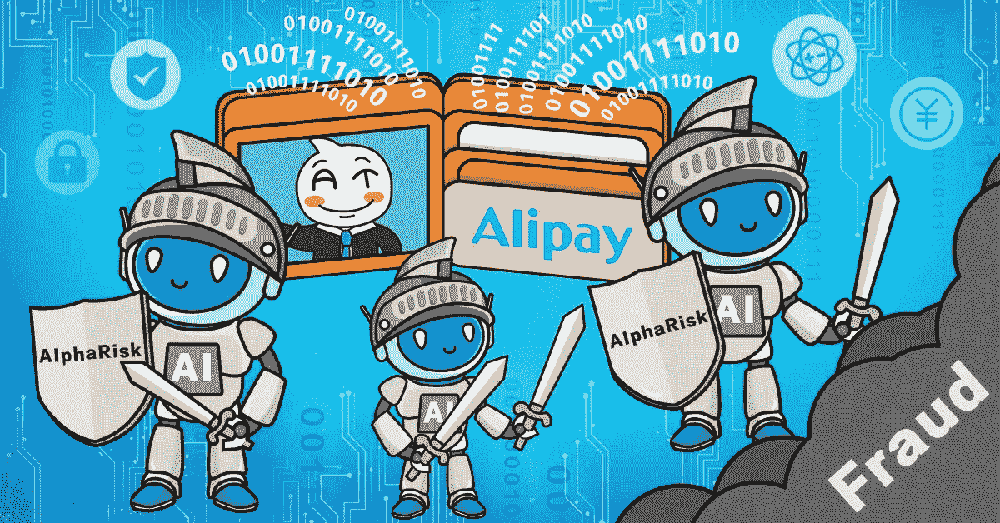
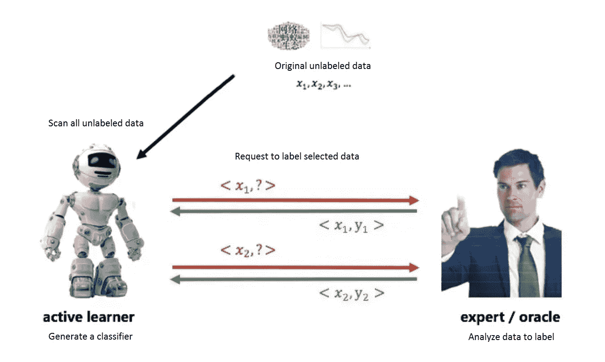
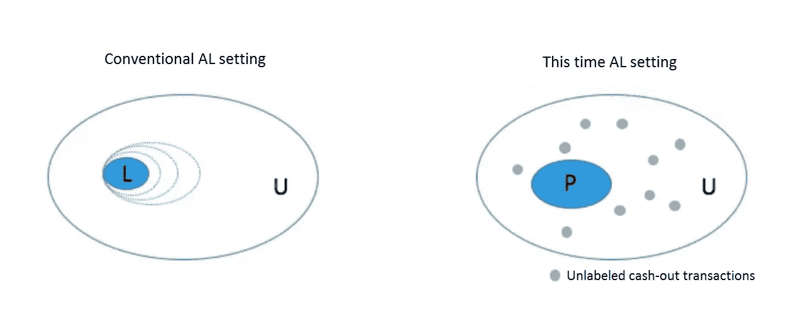
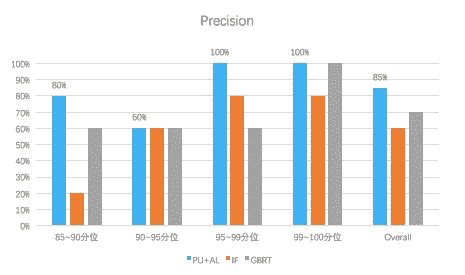

# 使用人工智能防止移动钱包欺诈

> 原文：<https://medium.com/hackernoon/using-ai-for-mobile-wallet-fraud-prevention-6ace63ec6c81>

支付宝的第五代风险控制引擎 AlphaRisk 通过结合主动学习和半监督建模，将套现欺诈的识别率提高了 3 倍

随着金融科技的崛起，移动互联网和智能手机的发展已经让位于当今最具变革性的面向消费者的技术之一——移动支付。尽管移动钱包在美国的应用进展缓慢，但在中国，它已经成为一种生活方式。中国城市的大多数交易现在都是无现金交易，2017 年 1 月至 10 月的交易量达到 12.8 万亿美元，是美国移动支付市场规模的 90 多倍。蚂蚁金服的移动钱包应用程序支付宝[以 54%的移动支付市场份额领先中国市场](https://www.forbes.com/sites/quora/2017/06/20/is-wechat-pay-taking-over-alipay/#77f64d7f3a0b)。

移动支付在中国消费者生活方式中的中心地位，使得确保安全和降低交易风险成为一项关键任务。从扫描仪读取支付宝用户的支付二维码开始，到不到一秒钟后完成支付，支付宝的风险控制系统会执行多次交易扫描，以验证账户没有被劫持或挪用，并且交易是真实的。

支付宝使用最先进的风险控制引擎 AlphaRisk，其核心是 AI Detect。作为一个智能风险识别算法系统，AI Detect 不仅集成了传统的监督学习算法，如梯度推进决策树(GBDT)，还集成了各种基于无监督深度学习的特征生成算法。

# 利用人工智能检测解决非法套现问题

伴随在线交易的一系列风险给建模带来了许多挑战。在监督学习框架下，像被盗手机和身份盗窃这样的常见问题通常更容易建模，而非法套现的风险识别模型的构建通常更困难。套现风险缺乏主动的外部反馈机制，即样本上没有黑白标签。当用户报告账户被盗或欺诈时，他们还会识别并报告此类活动导致的交易，然后使用历史数据标签进一步上报。然而，用户不会向支付宝或银行报告哪些交易是以套现为目的的，更不用说那些非法交易了。

没有标签，普通的监督算法是无效的。因此，大多数套现风险识别系统依赖于无监督的模型，如异常检测和图形算法。尽管无监督模型不需要标签，但它们也不是最容易处理的。异常检测模型(如隔离森林)需要在输入要素上投入更多精力，并且如果要素数量增加，在最高得分方面表现不一致。另一方面，图形算法通常需要强大的计算能力来有效处理支付宝每天数百万的交易，这意味着更高的运营要求和计算成本。

基于操作历史手动标记样本，然后基于标签进行监督学习是另一种选择，但这也面临一些权衡。贴标签的成本很高，平均而言，手动给每个样品贴标签需要具备必要知识的工程师花费 5 到 15 分钟。这使得很难对大量标签进行取样。标记也会导致错误——人就是人，即使是最好的专家也容易在判断样本时出错。一般来说，判断一个样本是黑色的更容易，因为通常，一些类型的证据跟随样本，但对于白色样本，必须取消任何证据，这在实践中相当难以实现。

面对这些问题，阿里巴巴科技团队设计了一种主动 PU 学习方法，该方法结合了主动学习(简称 AL)和两步积极无标记学习(简称 PU)，克服了人工标记带来的问题，同时为信用卡交易的套现风险开发了一个独特的识别模型。即使在相同的精度要求范围内，与使用隔离林的基线模型相比，该模型的识别率也提高了 3 倍。

# 了解主动 PU 学习

## 主动学习

主动学习源于一个简单的想法——如果每个标签的成本很高，那么只有那些对当前算法具有最高改进影响的样本才应该被标记。这样可以事半功倍。该方法假设学习者模块在多轮中主动与专家交互，并基于专家标签返回的结果不断更新分类器。

下图展示了主动学习的基本工作流程。

*Active learning workflow*

# 普学习

AL 本身并不限制在主动学习工作流中生成分类器的具体方式。只有在样本被更新之后，在新样本库上训练新分类器的方法才是最简单和最直接的方法。然而，考虑到样本标签涉及大量工作，并且 *P* 样本集的可靠性很高，团队使用了一种半监督算法，两步 PU 学习，来提高样本的效率。

在给定的数据集中，PU 学习假设一些黑色样本已经被标记形成集合 *P* (正)，剩余的未标记数据将形成集合 *U* (未标记)。如何构建一个可以将未标记的样本分为黑白两类的模型？如果认为集合 U 中的样本标签缺失，那么也可以考虑使用 EM(期望最大化)的思想。EM 可以理解为在存在隐藏变量的情况下 MLE(最大似然估计)方法的改进版本。在这里，团队在步骤 E 填充缺失的值，并在步骤 M 基于最后一次提交的结果迭代算法。这一过程重复了许多轮，直到最终的模型，原来的聚氨酯，是生产。

两步 PU 学习是在原始 PU 学习基础上的发展。如果 *P* 有偏差，那么它不能准确地代表黑色样本的整体，多轮 EM 可能会产生负面影响。两步 PU 学习引入了 spy 机制，更可靠地生成白色样本。(除非另有说明，本文其余部分提到的 PU 学习是指两步 PU 学习。)

# 实施主动的 PU 学习

## 算法工作流程

算法:主动 PU 学习

1.生成样本池:选择任务所需的样本集，并基于从其他领域转移的知识对样本应用正标签

2.如果不满足停止条件，则循环执行步骤 3 至 6，直到满足停止条件

3.取样:根据特定的取样方法，在取样过程中选择需要标记的样本

4.标签:手动标记要标记的样本

5.更新示例:使用特定的方法更新示例库

6.更新模型:使用两步 PU 学习方法更新模型

7.当满足停止条件时，结束循环

与 Stikic、Van Laerhoven 和 Schiele 在论文“探索活动识别的半监督和主动学习”中进行的研究相比，该团队通过用批量采样和两步 PU 学习取代采样和模型更新过程来改进方法。

## 抽样

对于主动学习任务，采样和迭代通常是流式的，其中首先基于当前算法选择一个样本，然后对其进行标记，之后迭代该算法，并基于当前迭代的算法选择另一个样本，依此类推，这使其成为低效的练习。在需要标记一百个样本的情况下，需要一百次迭代。这使得大型训练数据集和复杂模型的时间成本不可接受。

作为一种更省时的替代方法，该团队使用一种小批量方法进行批量采样，一次采样多个记录，只有在采样记录都被标记后才更新算法。

抽样方法基于不确定性和多样性标准，提取最不确定但又多样化的样本集。具体程序如下:

1.使用当前模型获得新数据 *Dnew* 。

2.提取模型不确定性最大的若干个未标记样本，构成*dun certain*；不确定性的度量基于模型的评分。

3.对 *Duncertain* 进行 K-Means 聚类，从每类中提取最不确定的样本，形成最终的标注样本集。

## 标记

由于我们的方法仅依赖于来自集合 *P* 的信息，专家必须只标记他/她有足够信心判断为 1 的样本，以确保集合的准确性。

## 更新样本

专家标记为 0 的样本被分配到集合 *U* 并被视为未标记。在多次上采样之后，标记为 1 的样本被放入集合 *P* 中，以增强它们在下一轮模型更新中的作用。

## 更新模型

下图左侧显示的是常规的主动学习。专家标记几个样本，逐渐扩展集合 *L* (已标记)，而主动学习者通过重复学习该集合来不断提高其性能，内部称为 an LU 集合。

然而，我们的场景实际上更接近于 PU 设置。专家标记样本以扩展集合 *P* (正)，学习者在每次迭代中基于 PU 学习进行学习。

*Regular active learning (left) vs. Alibaba’s implementation (right)*

有两个原因支持 PU 学习。首先，它为新模型在现有知识的基础上成长提供了机会。目前，该团队拥有大量的基础模块信息，可以产生准确率高但召回率低的黑色标签。其次，当样本标注量较小时，可以利用集合 *U* (不确定)中的信息进行模型训练。

该团队实现了基于两步 PU 的模型更新，之所以这样叫是因为它分为两步。第一步包括将集合 *P* 中的一些间谍样本混合到集合 *U* 中，并执行多轮 EM 迭代。第二步检查间谍样本的得分分布，将集合 *U* 中得分小于间谍样本五分位数得分 10%的所有样本标记为 0，生成集合 *N* (负)，并在此基础上进行多轮 EM 迭代。

EM 迭代思想在两步 PU 过程中保持一致。集合 *P* 的样本分数标记为 1。集合 *U* 的样本分数继承前一轮的模型分数，训练新的拟合样本分数，并给出新的模型分数以完成迭代。

该团队使用梯度推进回归树(GBRT)作为主动学习的基础分类器，在学习阶段后产生 GBRT 模型。

# 实验

该团队设计了三个实验来测试两步 PU、主动学习和主动 PU 学习的有效性。为了保持练习的可行性，三个实验采用了不同的设置和检查方法。跨实验的所有训练集的样本大小保持在跨越一百万的数量级，并且所有评估集都经过特殊的非均匀采样以提高计算效率。

## 两步 PU 学习的有效性

检查方法如下:

1.基于相同的训练数据集，训练了三个模型，包括无监督模型 IF(隔离森林)、有监督 GBRT 模型和通过两步 PU 学习迭代生成的 GBRT 模型(称为 PU GBRT)。

2.来自同一时期的信用卡交易被 IF、GBRT 和浦 GBRT 模型使用和评分。

3.从每组得分结果的第 95 至第 100 个五分位数处取样，获得若干样本。

4.评估结果显示，国际单项体育联合会和 GBRT 的准确率为 60%，浦 GBRT 的准确率为 70%。

结果清楚地表明 PU 模型更好。

## 主动学习的有效性

考试过程分为三个部分:

1.性能的改进:当前的无监督模型用于比较，以检查人工智能是否带来模型性能的任何改进。

2.人工智能框架的有效性:不使用人工标记数据的监督 GBRT 模型用于比较，以确定人工智能训练的 GBRT 模型是否是对现有模型的改进。

3.AL 抽样的有效性:使用由相同数量的随机抽样标签训练的监督 GBRT 模型进行比较，以确定由 AL 抽样方法训练的 GBRT 模型是否是一种改进。

检查 1 的方法如下:

1.基于训练数据集 *A* 训练无监督 IF 模型。

2.对数据集 *A* 应用主动学习，通过多次迭代对部分数据附加标记生成 RF(随机森林)(简称 AL RF)。

3.IF 和 AL RF 使用同一时期的信用卡交易并对其评分。

4.通过在每组评分结果的第 99、95 至 99、90 至 95 和 80 至 90 个五分位数以上取样获得样本。

5.评估结果表明，中频的准确率为 91%，高频的准确率为 94%。

结果表明，用人工智能生成的模型确实更好。用于检查 2 和 3 的方法遵循相同的程序，具有相似的阳性结果。

## 主动 PU 学习系统的有效性

检查方法如下:

1.基于相同的训练数据集 *A.* 训练无监督的 IF 模型和有监督的 GBRT 模型

2.主动学习应用于数据集 *A* 通过多次迭代生成 GBRT 模型(称为 APU GBRT)。

3.IF、GBRT 和 APU GBRT 使用同一时期的信用卡交易并进行评分。

4.从每组评分结果的第 85 至第 90、第 90 至第 95、第 95 至第 99 和第 99 至第 100 个五分位数取几个样品进行人工标记。

5.当在相同百分位数下进行横向比较时，就不同型号的标签精度而言，APU GBRT 被认为优于或等于每个五分位数的其他两个型号。

*Comparing the accuracy of PU+AL to IF and GBRT*

# 总结与展望

在各个行业和应用中，通常会发现机器学习技术缺乏标签或标签获取成本高。这促使从业者实现各种方法来为这样的场景建立可靠的模型。主动 PU 学习方法侧重于有效地引入外部信息，并更好地利用给定标签的现有知识来降低成本。

与传统方法相比，主动 PU 学习引入两步 PU 学习来改进主动学习中的模型更新方法，但即使这样也是有代价的。该算法要求高质量的人工标注，并且训练过程也比传统的 GBRT 更长。

当由主动 PU 学习产生的模型应用于兑现场景时，与使用隔离森林相比，在相同的准确度水平下，识别率提高了 3 倍。作为一种已经被证明有效的方法，主动 PU 学习方法有很大的潜力，并且该技术在未来可能会继续改进，并启发其他技术。

(Original article by Lu Yicheng 陆毅成)

# 阿里巴巴科技

关于阿里巴巴最新技术的第一手深度资料→脸书: [**【阿里巴巴科技】**](http://www.facebook.com/AlibabaTechnology)；Twitter:[**“AlibabaTech”**](https://twitter.com/AliTech2017)。