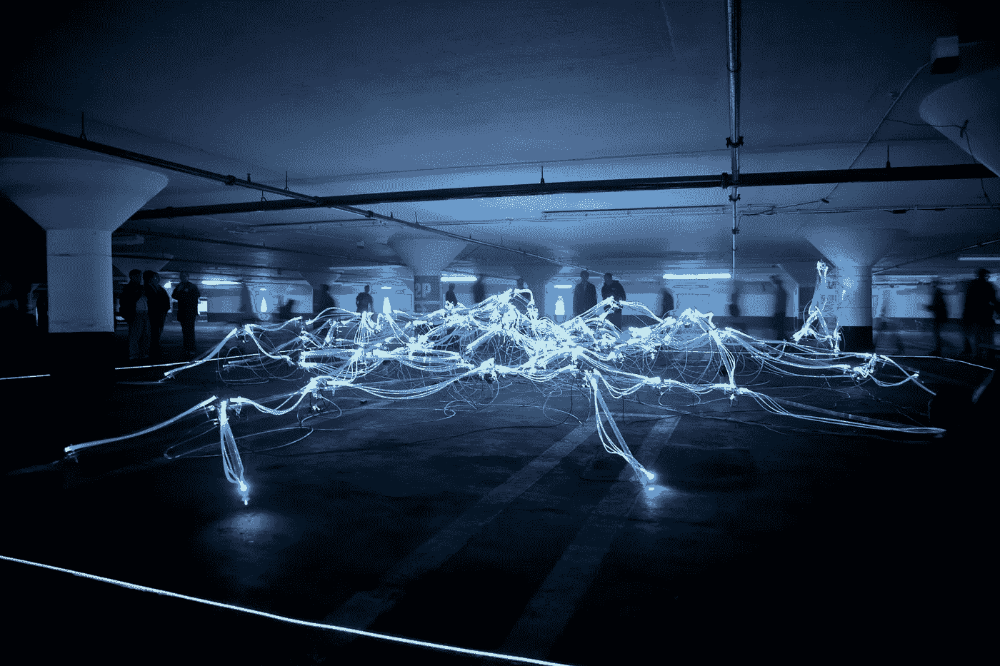

# 利用人工智能改善我们的城市和生活

> 原文：<https://medium.com/hackernoon/using-ai-to-improve-our-cities-and-lives-39b865371c08>

“任何能够产生比人类更聪明的智能的东西——以人工智能、脑机接口或基于神经科学的人类智能增强的形式——都会毫无疑问地成为最能改变世界的东西。其他的甚至都不在一个联盟里。”—人工智能理论家埃利泽·尤德科夫斯基(Eliezer Yudkowsky)。

一度被归入科幻小说的人工智能现在正成为我们日常生活的一部分，有可能极大地改善我们城市和社区的几乎每个方面。

随着全球人口的增加，高效运输变得更加难以实现。然而，人工智能有望彻底改变我们生活的这个重要方面。许多专家认为，到 2020 年，自动驾驶汽车将被广泛采用，这种转变将远远超出汽车，包括无人驾驶送货卡车和自动送货无人机。此外，预计很大比例的个人汽车所有权将被“汽车即服务”模式取代，这可能会消除对公共交通的需求，或者至少会过渡到按需服务。这些变化将减少拥堵并提高效率，从而使通勤时间可以用于放松或工作，而不是成为压力的来源和宝贵时间的浪费。这对城市的影响将是巨大的，在改善居住条件的同时大大减少对停车的需求。

人工智能改善医疗保健的潜力是巨大的。例如，人工智能可以用于通过患者数据和科学研究来自动化大多数诊断工作。我们负担过重的医生和护士可以从他们目前的许多职责中解脱出来，从而使他们能够专注于护理的人类层面和更高级的分析要求。此外，老年患者将受益于智能助行器和轮椅，结合智能家居监控技术，使他们在年老时更加独立。

家庭和服务机器人预计在未来几年将变得更加普遍。也许在不远的将来，有一天你会让一个机器人打扫你的房子，而另一个机器人会给你送包裹。云连接机器人的进步将提高共享数据以加速学习的能力，而感知技术的发展将改善机器人与人类的互动。

我们正处于一个新世界的尖端，人工智能与人类智能相结合，以多种方式改善我们的城市和生活，其中一些在这一点上甚至难以想象，而其他的利用已经使这个世界成为我们所有人更好的生活场所。

*由* [*DataArt*](https://www.dataart.com/industry/iot-and-m2m-solutions?utm_source=medium&utm_medium=social&utm_campaign=i-spring-2018) *物联网负责人伊洛宁撰写。*