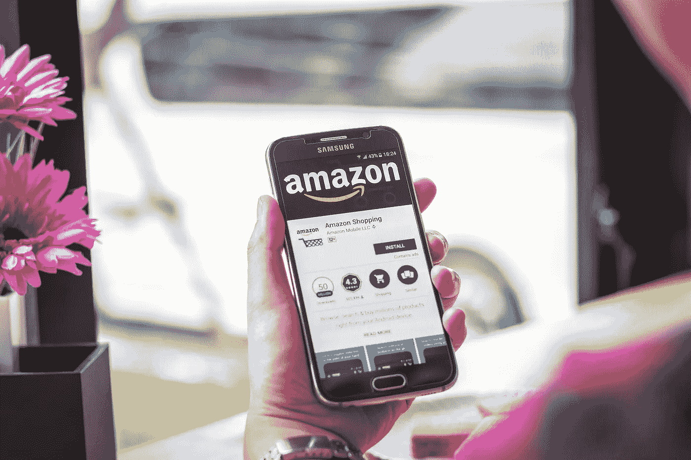

# 使用亚马逊？你的数据很可能已经在外国公司手里了

> 原文：<https://medium.com/hackernoon/using-amazon-your-data-is-probably-already-in-the-hands-of-foreign-companies-3aa8ac7d32ef>

随着大型科技公司通过使用我们的数据稳定而秘密地赚取越来越多的利润，政府终于开始意识到我们的隐私正在被侵蚀。在爱德华·斯诺登泄露了美国国家安全局在全球监视公民的证据后，欧洲议会通过了《一般数据保护条例》(GDPR)，对处理欧盟公民数据的组织提出了广泛的要求。

美国在监管方面动作较慢。然而，从今年 3 月起，美国所有 50 个州都出台了法律，要求数据处理器在数据泄露的情况下通知公民。没有 GDPR 那么深远，但这是一个开始。

# 监管的局限性

保护我们的数据和隐私的法规对那些本来可以自由支配我们数据的公司形成了一种威慑。法规也提高了人们对数据保护的意识，让我们更加注意移交对数据的访问权。

然而，监管不是万能的。它只在自己的管辖范围内起作用。如果违规行为发生在其管辖范围之外，损害是无法挽回的，因为监管机构不能强迫外国公司“归还”已经泄露或被黑客攻击的数据。

这是亚马逊用户数据目前面临的一个问题，这些数据似乎通过这家科技巨头买家和卖家之间的数据流中一个鲜为人知的缺口暴露给了中国第三方公司。

# 亚马逊是如何与中国人上床的

亚马逊最初是一家美国公司，但现在它是一个全球巨型市场，在许多领域严重依赖中国。例如，Kindle 是其最知名的产品之一，由中国工厂的工人组装。亚马逊的数据中心依赖中国的硬件和其他组件，因此在当前的美中贸易战中，它的[股票很容易受到](https://investorplace.com/2018/09/how-vulnerable-is-amazon-stock-amzn-to-a-trade-war/)的攻击。

然而，亚马逊市场揭示了这种依赖关系的真实程度，也是亚马逊消费者冒着个人数据暴露给中国公司的风险的地方。

2015 年，[该公司开始通过简化中国和西方亚马逊仓库之间的货运流程，吸引中国卖家](http://www.forbes.com/sites/wadeshepard/2017/02/14/how-amazons-wooing-of-chinese-sellers-is-hurting-american-innovation/#7f4568ff1df2)进入其平台。结果，[亚马逊市场](http://www.marketplacepulse.com/articles/china-is-a-third-of-amazon-marketplace)三分之一的商品来自中国。2017 年在亚马逊注册的 100 万新卖家中，25%位于中国。

在亚马逊上设置卖家非常容易。该公司运行亚马逊(FBA)履行计划，这意味着卖家甚至不需要处理任何库存。简单来说，卖家可以批发购买产品，将产品运送到亚马逊仓库，然后出售给亚马逊客户，他们只需要在亚马逊上建立一个卖家账户，并拥有一个销售收入的收款账户。

接收账户可以是本地银行账户，或者任何提供服务的支付处理公司。在中国，有几家本地支付处理商，包括连连、乒乓和 iPayLinks。从包括[微信](http://mp.weixin.qq.com/s/ZzzyTt0yO4_PbrKWo8z8yg)、[宸妃](http://www.chenfei.cn/mws/)和[亚马逊自己的卖家中心](http://sellercentral.amazon.com/forums/t/contradictory-advice-regarding-sharing-of-secret-key/73444/8)在内的各种网站上发生的讨论来看，有证据表明其中一些中国国内支付处理商一直在访问卖家账户和敏感的客户数据。

等等，什么？为什么销售人员甚至需要访问客户数据？当然，在 FBA 模式下，如果商品是从亚马逊仓库运出的，亚马逊就没有必要与卖家分享买家数据了。好吧，不管是否存在需求，卖家[确实](http://sellercentral.amazon.com/forums/t/as-an-fba-seller-do-you-get-the-buyers-info-who-buy-our-amazon-products/267850/6)有权访问亚马逊客户数据，包括姓名和地址，在某些情况下，甚至支付信息。

# 利用数据流中的缺口

那么，支付处理器如何访问这些信息呢？嗯，当卖家在亚马逊上建立账户时，他们可以选择允许第三方插入该账户进行支付处理、报告等活动。

第三方的访问级别是可变的。一家信誉良好的支付处理公司会要求亚马逊提供一个市场网络服务(MWS)网络令牌。这个令牌使用 API 将卖家的亚马逊帐户连接到一个支付帐户，允许卖家接收和提取亚马逊支付的款项。

然而，卖家也有他们亚马逊账户的秘钥。任何拥有密钥的人都可以访问卖家账户中的所有数据，包括——你猜对了——所有的客户数据。这可能包括姓名、地址、购买历史甚至信用卡详细信息。

通过阅读前面提到的各种论坛，可以明显看出，一些支付处理公司一直要求卖家向他们发送亚马逊账户的密钥，以便他们可以接收付款。不幸的是，[亚马逊只向卖家提供了](http://developer.amazonservices.com/gp/mws/faq.html/147-4973823-0280567)有限的关于 API 访问和秘钥访问区别的信息，造成了知识鸿沟。许多卖家没有意识到这种差异，这意味着他们无意中允许任何第三方请求任何类型的访问权限。

亚马逊似乎意识到了这个问题，因为讨论提到一些卖家账户被关闭。似乎一些支付提供商现在已经开始采取更道德的做法，但亚马逊没有澄清这个问题，也没有试图纠正这种情况。

# 监管失灵的完美案例研究

这个案例完美地展示了数据保护法规的局限性。虽然欧盟或美国政府如果意识到这种数据泄露，可以对亚马逊处以罚款或其他惩罚措施，但它们对这些目前掌握着它们无法合法获取的数据的外国公司没有管辖权。

令人惊讶的是，这个问题似乎远未引起大多数人的注意，因为它没有被广泛报道。然而，如果它变得更加普遍，它可能会导致公众对亚马逊的强烈抗议，类似于脸书今年在剑桥分析公司(Cambridge Analytica)的滑稽行为后遇到的情况。

虽然监管在一定程度上是善意的，有用的，但它对全球互联的在线服务不起作用。在当前环境下，数据是一种宝贵的全球商品。现在是时候让我们的政府采取更全面、更综合的方法来确保全球范围内合作的公司对其处理我们个人数据的行为承担全部责任了。