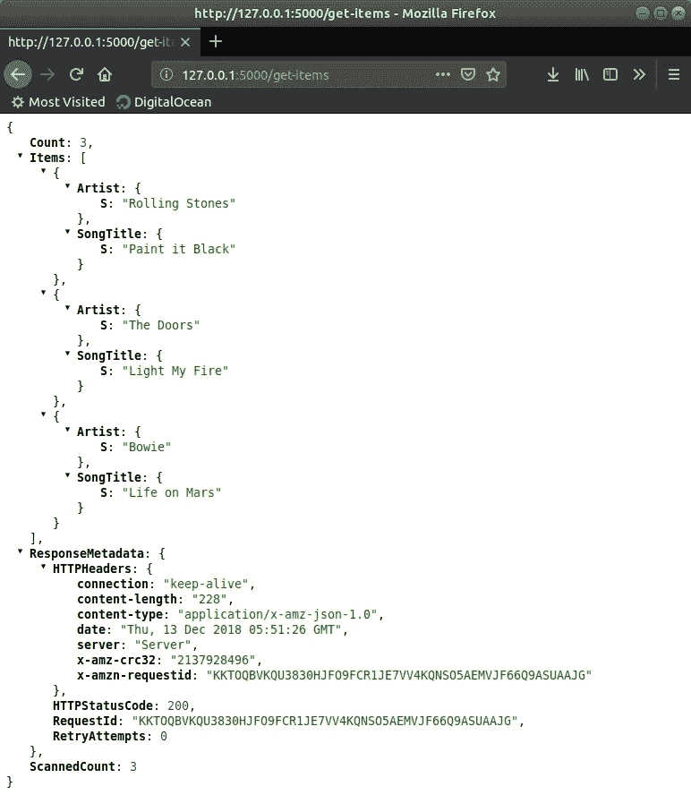

# 使用 AWS DynamoDB 和烧瓶

> 原文：<https://medium.com/hackernoon/using-aws-dynamodb-with-flask-9086c541e001>

在本教程中，我将介绍如何轻松地将 AWS DynamoDB 与 Python 的 web 开发服务器 Flask 集成。您将创建一个简单的 RESTful API，允许您从 DynamoDB 中提取项目。

## DynamoDB

DynamoDB 是 AWS 对 NoSQL 云数据库的回应。与其他 [AWS](https://hackernoon.com/tagged/aws) 服务类似，DynamoDB 允许你为一个应用程序加速运行数据库，而不必担心基础设施、备份和冗余。您可以通过 AWS 控制台或 AWS API 与数据库进行交互。在本教程中，我们将使用 AWS 的命令行包以及 boto 3——一个 [Python](https://hackernoon.com/tagged/python) 包装器——与 AWS 进行交互。这两种方法都利用了 AWS API。

## Boto3

Boto3 是一个 Python 包，充当 AWS CLI 的包装器。这是使用 Python 与 AWS 交互的推荐包。

## 瓶

Flask 是 Python web 框架。在最基本的层面上，它提供了开发服务器和调试器。Flask 是高度可扩展的。允许添加其他应用程序功能，例如:表单验证、上传处理和身份验证。本教程将使用它的 web 服务器功能。

# 先决条件

本教程假设您对以下内容有基本的了解:

*   Linux 命令行界面(bash)
*   Python3 编程
*   点
*   瓶
*   AWS 和 IAM

如果您的本地机器上还没有安装 Python3，请在这里下载最新版本的。

Python 包管理器，应该和 Python 一起安装。如果由于某种原因，它不在您的本地机器上，请到[这里](https://pip.pypa.io/en/stable/installing/)获取如何安装它的说明。

如果没有安装 AWS CLI，请运行以下终端命令:

```
pip install awscli --upgrade --user
```

`awscli`允许您从命令行运行 AWS 命令。使用这个包，我们能够创建 EC2 实例，将对象插入到 S3 实例中，并从 DynamoDB 表中删除条目，这只是几个例子。这也是一个`boto3`依赖，允许它与 AWS 交互。

接下来，您需要配置`awscli`,以便它可以访问和许可您的 AWS 帐户。

```
aws configure
```

这将为您提供以下提示:

```
AWS Access Key ID [None]: ***PASTE ACCESS KEY ID HERE*** AWS Secret Access Key [None]: ***PASTE SECRET ACCESS KEY HERE*** Default region name [None]: ***TYPE YOUR PREFERRED REGION*** Default output format [None]: json
```

您在此输入的访问密钥 ID 和秘密访问密钥将定义`awscli`在与 AWS 交互时将拥有何种权限。您将从 IAM 控制台获得此信息。如果您以前没有 AWS 权限的经验，请点击[此处](https://docs.aws.amazon.com/IAM/latest/UserGuide/introduction.html)了解更多信息。

您还应该指定默认区域。默认情况下，这将是您的`awscli`运行大多数命令的区域。AWS 可用区域列表可在[这里](https://docs.aws.amazon.com/AWSEC2/latest/UserGuide/using-regions-availability-zones.html#concepts-available-regions)找到。

为了便于阅读，这里默认的输出格式设置为 json，但这是可以改变的。

## 创建测试表

因为我们的 API 将公开的唯一操作是一个非常基本的`GET`，所以您需要创建一个新的 DynamoDB 表，并用一些条目填充它。这将使用 AWS CLI 来完成。

首先，创建一个指定表模式的`json`文件。

通过终端创建一个`create-table.json`文件。

```
touch create-table.json
```

并添加以下代码。

```
{
    "TableName": "YourTestTable",
    "KeySchema": [
      { "AttributeName": "Artist", "KeyType": "HASH" },
      { "AttributeName": "SongTitle", "KeyType": "RANGE" }
    ],
    "AttributeDefinitions": [
      { "AttributeName": "Artist", "AttributeType": "S" },
      { "AttributeName": "SongTitle", "AttributeType": "S" }
    ],
    "ProvisionedThroughput": {
      "ReadCapacityUnits": 5,
      "WriteCapacityUnits": 5
    }
}
```

这将告诉 AWS 创建一个名为`YourTestTable`的新表，带有字符串属性`Artist`和`SongTitle`。它还指定了`Artist`和`SongTitle`属性都将被用作主键。

`ProvisinedThroughput`键告诉 DynamoDB 将读写容量设置为多少。更多信息可在[这里](https://docs.aws.amazon.com/amazondynamodb/latest/developerguide/HowItWorks.ReadWriteCapacityMode.html#HowItWorks.ProvisionedThroughput.Manual)找到

接下来，创建一个名为`batch-write.json`的文件。

```
touch batch-write.json
```

并在下面插入 json 代码:

```
{
  "YourTestTable": [
    {
      "PutRequest": {
        "Item":
        {
          "Artist": {
            "S": "Bowie"
          },
          "SongTitle": {
            "S": "Life on Mars"
          }
        }
      }
    },
    {
      "PutRequest": {
        "Item": {
          "Artist": {
            "S": "Rolling Stones"
          },
          "SongTitle": {
            "S": "Paint it Black"
          }
        }
      }
    },
    {
      "PutRequest": {
        "Item" : {
          "Artist": {
            "S": "The Doors"
          },
          "SongTitle": {
            "S": "Light My Fire"
          }
        }
      }
    }
  ]
}
```

当在我们的表上运行批量写命令时，上面的 json 文件将被`awscli`解析。如您所见，我们正在传递一个包含三个`PutRequest`的列表，每个列表包含一个`Item`，它由一个对应于我们的表属性的键/值对的字典组成。

最后，我们运行终端命令来创建和填充我们的表。

```
aws dynamodb create-table --cli-input-json file://create-table.json aws dynamodb batch-write-item --request-items file://batch-write.json
```

如果没有发生错误，您现在应该有一个填充的新表。您可以到 AWS 控制台验证该表是否存在。

**注意:该表将在默认区域中创建，该区域被指定为 AWS 配置的一部分。**

# 项目设置

现在您的本地机器已经安装了所有的依赖项，您现在需要创建根项目目录。

```
mkdir flaskdynamodb 
cd flaskdynamodb
```

因为我们将安装 python 包，所以我们需要创建一个虚拟环境。创建虚拟环境会将 Python 可执行文件复制到包中，这样从命令行对`python`的任何调用都会运行虚拟环境本地 Python 可执行文件。虚拟环境也会将`pip`包安装到这个相同的环境中。防止程序包与系统范围的程序包发生冲突。

**注意:在某些 linux 发行版中，python 虚拟环境模块不是预装的。在 Ubuntu 和 Debian 发行版的情况下，你需要用下面的命令** `**sudo apt-get install python3-venv**` **来安装它。如果下面的命令在你的系统上不起作用，你可能需要安装**T3

使用以下终端命令创建虚拟环境:

```
python3 -m venv env 
source env/bin/activate
```

`-m`选项告诉`python`运行虚拟环境模块，并创建一个名为`env`的新虚拟环境目录。

`source env/bin/activate`命令激活虚拟环境。这意味着您的系统现在将使用安装在虚拟环境文件夹中的 Python 可执行文件和 pip 包。

**注意:在上面的 python 命令中，假设** `**python3**` **指的是 Python3。如果您的系统**上有 `**python**` **链接到 Python3，这个命令可能不起作用**

## 装置

现在项目目录和虚拟环境已经设置好了，是时候安装`flask`和`boto`了

```
pip install flask pip install boto3
```

我将再次提到，这些包将被安装到虚拟环境目录中。如果您查看`env/lib/site_packages`目录，您会看到`boto3`和`flask`的目录。

烧瓶配置

在编写任何代码之前，您需要导出环境变量，该变量告诉`flask`主应用程序文件将会是什么。

```
export FLASK_APP=app.py
```

您可能已经注意到文件`app.py`还没有创建。稍后我们将创建这个文件，它将包含我们的 Flask 应用程序代码。

## 应用代码

现在，您将创建实际代码将要驻留的文件。

```
touch app.py aws_controller.py
```

将以下代码添加到`app.py`:

```
from flask import Flask

app = Flask(__name__)

@app.route('/')
def index():
    return "This is the main page."

@app.route('/get-items')
def get_items():
    return 'TODO: Implement Functionality'

if __name__ == '__main__':
    app.run()
```

上面的代码创建了一个 Flask 应用程序，其中公开了两条路线，`/`和`/get-items`。目前，这些路由将简单地用文本来响应。我们稍后将返回该文件，以便让`/get-items`回复我们对 AWS 的呼叫。

**注意:如果你不确定 Flask 是如何工作的，看看他们的** [**快速入门指南**](http://flask.pocoo.org/docs/1.0/quickstart/#a-minimal-application) **。**

是时候在`aws_controller.py`文件中实现实际与 DynamoDB 交互的代码了。

```
import boto3

dynamo_client = boto3.client('dynamodb')

def get_items():
    return dynamo_client.scan(
        TableName='YourTestTable'
    )
```

那么上面的代码是做什么的？

1.  首先导入`boto3`模块。
2.  `dynamo_client = boto3.client('dynamodb')`创建一个允许我们与 DynamoDB API 交互的客户端。
3.  函数`get_items`对所提供的表名进行扫描。在这种情况下，我们正在扫描`YourTestTable`。在 DynamoDB 中，a `scan`返回整个表。这与`query`操作不同，后者基于主键属性值搜索一个表。在这种情况下，运行`scan`以获取整个表。

是时候回去修改 Flask 代码，以便它运行`get_items`函数了。

将 app.py 文件更改为包含以下代码:

```
from flask import Flask, jsonify
import aws_controller

app = Flask(__name__)

@app.route('/')
def index():
    return "This is the main page."

@app.route('/get-items')
def get_items():
    return jsonify(aws_controller.get_items())

if __name__ == '__main__':
    app.run()
```

在这个文件中，我们更改了两件事

1.  我们进口了`aws_controller.py`。这将使我们能够访问`get_items`功能。
2.  `/get-items` route 现在从`aws_controller.get_items`函数返回结果，但不是在将结果传递给`jsonify()`之前，后者将对象转换成客户端浏览器能够呈现的 json 等价物。

现在一切都设置好了，您可以通过在终端中运行以下命令来启动 Flask web 服务器。

```
flask run
```

如果 Flask 能够绑定到正确的套接字，服务器现在应该正在运行，您应该会看到下面的输出。

```
*(env)* flaskdynamodb$ *flask* run
 *** Serving Flask app "app.py"
 *** Environment: production
   *WARNING:* Do not use the development server in a production environment.
   *Use* a production WSGI server instead.
 *** Debug mode: off
 *** Running on http://127.0.0.1:5000/ (Press *CTRL+C* to quit)
127.0.0.1 *-* - [12/Dec/2018 22:51:21] "GET / HTTP/1.1" 404 -
*127.0.0.1* - - [12/Dec/2018 22:51:21] "GET /favicon.ico HTTP/1.1" 404 -
*127.0.0.1* - - [12/Dec/2018 22:51:26] "GET /get-items HTTP/1.1" 200 -
*127.0.0.1* - - [12/Dec/2018 22:51:26] "GET /favicon.ico HTTP/1.1" 404 -
```

打开浏览器，转到输出中指定的 url。这个默认会是 [http://127.0.0.1:5000/](http://127.0.0.1:5000/) 。

现在输入`/get-items`的网址。[http://127 . 0 . 0 . 1:5000/get-items](http://127.0.0.1:5000/get-items)。

您应该会看到表中所有项目的列表。



就是这样！您现在有了一个简单的 RESTful API，可以与 DynamoDB 交互。

感谢跟随。

[GitHub](https://github.com/albertacuna)

*原载于 2018 年 12 月 13 日*[*blog.albertoacuna.com*](http://blog.albertoacuna.com/using-aws-dynamodb-with-flask/)*。*