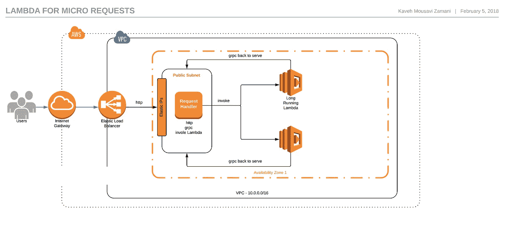

# 对没有启动延迟的微作业使用 AWS Lambda 函数

> 原文：<https://medium.com/hackernoon/using-aws-lambda-functions-for-micro-jobs-1b9ff56c0f2>

# 背景

*   过去:处理僵化的裸机服务器。最小粒度:-
*   最近—使用 Kubernetes 或其他工具建立了一个自动扩展环境。基于传入的请求向上和向下扩展。最小粒度:一台虚拟机
*   今天——使用 Lambda 或 Google 函数，我们可以在几秒钟内扩展到 10，000 个 cpu，然后缩小到零。最小粒度:一个内核，128MB 内存

对于 AWS Lambda 和谷歌云功能，有两个问题。他们有**高启动时间**，接近 10ms，他们有**最小 100ms 时间粒度**。

这意味着如果我想为我的需要 12 毫秒的 http 请求提供服务，首先我将面临近 10 毫秒的延迟，只是为了启动该功能，然后两个平台将向我收取 100 毫秒的时间，即使我只需要 12 毫秒。这使得云功能不适合正常使用。

这里将消除这两个问题。

# 解决办法

我们的想法是调用一个 Lambda 函数，但不是让它做一个请求，我们将**保持它在**附近，以亚微秒延迟服务更多请求。因为它将服务于许多请求，我们可能也不关心 100 秒的时间粒度。

方法很简单。但是您需要了解一点 gRPC 和双向连接。两者都是非常简单的概念。

我们创建了一个 http 服务器和一个 gRPC 服务器。当我们有流量时，我们调用一个或多个 Lambda 函数。

这些 Lambda 函数创建了到 gRPC 服务器的双向连接，gRPC 服务器与 http 服务器一起运行。

现在 http server 通过 grpc 将负载转发给 Lambda 函数，并返回结果。

我们只需要一种机制来调用足够的 Lambda 函数来处理我们的流量。

我写了一个框架来帮助解决这个问题:[https://github.com/kavehmz/jobber](https://github.com/kavehmz/jobber)

解决方案并不依赖于这些，但我选择 gRPC 作为 RPC 框架，protobuf 作为数据交换格式，并着手实现它。



# 数据交换格式

Protobuf 是一种简单的[格式](https://developers.google.com/protocol-buffers/docs/proto3)。

有效载荷定义在`payload/payload.proto`。

如果你要编码/解码你的数据，什么是足够的，否则编辑`payload.proto`并重新生成 go 文件。

# λ调度程序

要调用 Lambda 函数，您需要将调度程序传递给`NewJobber`。

我实现了两个调度程序。

*   戈鲁丁。Goroutine:一个虚拟调度程序，它只是为了测试的目的而存在。
*   awslambda。LambdaScheduler:一个简单的调度程序，它可以调用 lambda 函数来发送任务给它。

```
s := grpc.NewServer()
	taskMachine = jobber.NewJobber(jobber.Scheduler(&goroutine.Goroutine{GrpcHost: "localhost:50051"}))
	taskMachine.RegisterGRPC(s)
```

调度程序需要实现以下接口:

```
interface {
	// Inbound is called before a new task is added.
	Inbound()
	// Done is called when a task is done
	Done()
	// Timedout is called when no response was received on time for a task
	Timedout()
}
```

# 试运转

包括一个虚拟测试案例和一个使用 lamba 调度器的例子。

要了解它是如何工作的，只需简单地做以下事情

在一个终端中运行示例

```
$go run example/goroutine/main.go 
2018/02/11 14:48:57 Start listening gRPC at 50051
2018/02/11 14:49:17 minion: job inbound 0 0
2018/02/11 14:49:17 worker[1]: Hi, I was invoked and I am trying to connect to accept jobs
2018/02/11 14:49:17 worker[1]: I Joined the workforce
2018/02/11 14:49:17 server: A new minion joined to help
2018/02/11 14:49:17 server: got a job
2018/02/11 14:49:17 worker[1]: received a task from server data:"This is the payload I will send to Lambda." 
2018/02/11 14:49:18 worker[1]: task is done
2018/02/11 14:49:18 server: received the response
2018/02/11 14:49:18 server: send the response
2018/02/11 14:49:18 server: send the response back to client
2018/02/11 14:49:18 minion: job done
2018/02/11 14:49:18 Example: received data:"2018-02-11 14:49:18.623911211 +0100 CET m=+21.589500545"  <nil>
```

在另一个终端发送请求

```
$ curl 'http://localhost:8000/'
2018-02-11 14:49:18.623911211 +0100 CET m=+21.589500545
```

在代码中，您的请求发送到 http 服务器。您的处理程序将调用 Do 并等待响应。管理 Lambda 函数以及发送和接收消息由 jobber 完成

```
resp, err := myJobber.Do(&payload.Task{Data: "This is the payload I will send to Lambda."})
if err != nil {
	resp = &payload.Result{Data: "Because of error result was returned as nil"}
}
log.Println("Example: Recevied", resp, err)
fmt.Fprint(w, resp.Data)
```

# 测试λ

如果你熟悉 Lambda 函数，设置一个很容易。

但是请注意，lambda 函数需要连接回批发商所依赖的 grpc 服务器。因此，他们必须在同一个网络(VPC)，或以某种方式，他们需要访问您的 grpc 端口。

在`example/lambda`你可以看到一个例子，在`example/aws_func`你可以看到一个简单的 Lambda 函数。