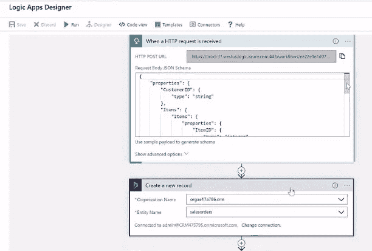

# 使用 Azure 作为集成平台

> 原文：<https://medium.com/hackernoon/using-azure-as-an-integration-platform-24142b35516b>

这篇博客摘自微软 [Azure](https://hackernoon.com/tagged/azure) 网络研讨会“如何使用 Azure 作为集成[平台](https://hackernoon.com/tagged/agilehttps://hackernoon.com/tagged/platform)”，由 Rodrigo De Carvalho(微软高级产品营销经理)、Pete Roden(微软项目管理架构师)和 Matthew Farmer(微软高级项目经理)主讲。

# 介绍

如今，基本上所有的业务都依赖于应用程序。这些应用程序在不断变化，您构建的应用程序种类也越来越多。企业开发出正确的数据和正确的应用程序，将这两者联系起来，以获得真正的价值。数字化转型是当今的流行语，它是关于将正确的数据连接到正确的应用程序。这种转变可能发生在您的企业内部，也可能发生在合作伙伴组织中。也可能是你不认识的人，他们可能会和你一起开发应用程序。组织正在研究如何有效地实现这一点，并通过这样做获得竞争优势。

数字化转型有助于您进行创新，并将新产品和服务快速推向市场。应用程序集成是主干，因为您不必每次都完全构建一个新的应用程序。利用现有资产并能够快速移动、创新和构建集成使得复杂的应用成为现实。Gartner 引用的一段话称，大约 65%的大型企业将在几年内创建一个集成平台。企业将获得竞争优势，而不是像传统那样考虑集成，每次都将应用程序构建为单独的资产。

# 集成场景

人们使用许多不同的集成场景来转换数据。我们用来在应用程序之间移动数据的经典方法是应用程序到应用程序和业务到业务的集成。B2B 集成将信息从您的业务应用程序中提取出来，并将其快速路由到您的业务合作伙伴(客户、供应商、银行、物流提供商)的应用程序中。

SaaS 是另一种情况，许可是基于订阅的，数据是集中托管的。企业部署的软件即服务(SaaS)应用程序的数量呈指数级增长，产生了各种新的集成用例。

最后，物联网极大地改变了我们对技术的看法。在数字化转型的世界中，我们看待应用和数据的方式已经发生了变化，物联网绝对是这种变化的先锋。如今，您从应用程序中获得越来越多的数据，但是，当您获得这些数据时，您会如何处理呢？你希望这些数据能够提供给其他人，你希望他们能够汇总这些数据。因此，您希望能够将它与其他系统集成，以使数据有意义。

# 整合挑战

当您想要构建集成数据并与不同系统对话的应用程序时，这些是您需要考虑的基本事项。

*   你打算使用什么接口和 API？
*   你要达到的标准？
*   您将拥有什么样的数据源，以及它们将要交流的格式？
*   你将如何创建你的应用程序？有许多不同的模式可以用来构建这些应用程序。
*   然后你将在哪里主持和运行这个？

有 4 个关键组件是构建集成平台的核心部分。所以，让我们看看 Azure 集成服务的各个部分以及它们实际上做了什么。

1.  API 管理
2.  Azure 逻辑应用
3.  Azure 服务总线
4.  Azure 事件网格

# Azure API 管理

Azure API 管理允许你安全地发布 API，并连接到任何地方托管的后端系统。世界各地的企业都在寻求扩展其作为数字平台的运营，创造新的渠道，寻找新的客户，并推动与现有客户的更深入接触。你可以使用 Azure API 管理来获取任何后端，并基于它启动一个成熟的 API 程序。

*   适用于任何主机、API 和规模
*   吸引更多开发者
*   保护和优化您的 API
*   通过一系列指标深入了解您的 API，您可以使用这些指标来确定您的 API 的性能

# Azure 逻辑应用

它允许您轻松地自动化工作流和编排业务流程。Logic Apps 简化了您为应用程序集成、数据集成、系统集成、企业应用程序集成(EAI)和企业对企业(B2B)通信设计和构建可扩展解决方案的方式，无论是在云中、内部还是同时在两者中。使用 Azure Logic 应用程序，您可以:

*   开箱即用的连接器，减少集成挑战
*   将数据从云中连接和集成到内部
*   云中的 B2B 和企业消息传递
*   强大的基于 web 的工作流设计器

# Azure 服务总线

Azure Service Bus 是一个可靠且可扩展的企业消息解决方案。使用*消息*在不同的应用和服务之间传输数据。消息是二进制格式的，可以包含 JSON、XML 或者只是文本。

*   Azure 服务总线简化了企业云消息传递
*   构建可靠、可扩展的云解决方案
*   在构建企业消息传递平台时实现复杂的消息传递路由

# Azure 事件网格

Azure Event Grid 只是给了你一个非常简单的基于事件的发布订阅模型。使用事件驱动模式构建应用程序，可以让你只在事情发生时做出反应和做事情，并让其他人在这些事件的基础上编写接口变得容易。

*   一个简单的基于 HTTP 的事件交付
*   通过反应式编程构建更好、更可靠的应用程序——它还允许您启动在逻辑应用程序中构建的一些流程编排
*   专注于产品创新—因为这完全是一个托管解决方案，您可以专注于产品创新，而不必在其他非核心活动上花费大量时间。

因此，在微软 Azure 中，我们有四种体现这些特定服务的技术，它们是 Azure API 管理、逻辑应用、服务总线和事件网格。我们一起将它们打着 Azure 集成服务的旗号。它使跨越国界与合作伙伴、其他企业建立联系、创造新的业务机会以及所有这些在快速上市方面变得更加容易。

# 示例架构

这里有一个例子，说明如何使用所有服务的组合来实现给定的集成目标。让我们考虑一下，您可以拥有一个通过 API 管理连接到本地 API 的移动或 web 应用程序。这将允许您安全地连接到这些系统，并在整个流程编排中执行流程。在这种架构中，API 管理、逻辑应用、本地数据网关等组件允许您连接到在数据中心内运行的系统，以及由满足业务需求的第三方组织提供的 SaaS。

这个想法是为了展示您可以利用这些服务的潜力，并满足任何企业级的集成。微软的客户 Patagonia 一直在利用这些服务来构建创新的解决方案并改善他们的客户体验。通过使用 Azure 作为集成平台，他们能够在向客户确认/交付产品方面获得显著的生产力。

# 演示

让我们考虑一个订单处理场景，Fabricon 使用 Azure API 管理、服务总线、逻辑应用和事件网格等核心组件来完成订单处理系统。该过程从 API 开始，通过 API 管理对逻辑应用程序进行调用。接下来，在 Dynamics 中创建订单，然后用“谢谢”消息向客户确认。同时，逻辑应用程序向服务总线主题触发一条消息。在这个阶段，主题实际上将消息发布到事件网格。让事件网格知道消息已经到达。然后，事件网格对出现的消息做出反应，并触发逻辑应用程序来执行编排对不同系统的调用以完成订单的过程。

Receive Orders 是一个逻辑应用程序，它可以有效地接收订单，并执行所有步骤来实现订单。逻辑应用程序旨在编排需要发生的步骤。

作为第一步，逻辑应用程序解析消息以确保它们来自正确的模式，然后消息被发送到许多不同的系统。张贴此信息，确认信息会连同“谢谢”信息一起发送给客户。

Process Order 是另一个逻辑应用程序，它确认客户订单并将消息放在队列中进行进一步处理。

这个逻辑应用程序有一个 HTTP 触发器和一个响应，它被设置为一个 HTTP API 操作。与其他逻辑应用程序类似，您可以使用模式验证来检查逻辑应用程序中的消息。下一个逻辑是在动态中创建订单记录。

逻辑继续组成进一步的消息传递，您可以在 JSON 消息中添加一个属性。然后，消息被发送到带有订单 ID 的主题。

最后，所有这些操作都在 API 管理中公开，允许将这个逻辑应用程序作为 API 进行保护。应用速率限制、安全策略、转换等设置，并根据需要更改 API 版本。

API 管理开发人员门户自带 API 管理，这有助于开发人员测试应用程序。

# 有趣的问答

为什么 Azure 数据工厂、事件中心、物联网中心等 Azure 服务不是 Azure 集成服务的一部分？

这些服务都是互补的，绝对可以与 Azure 集成服务结合使用。目前，我们希望简化我们看到的客户需要构建企业集成平台的部分。

**你需要服务总线向事件网格发送消息吗？**

不，事件网格支持许多 Azure 服务。您甚至可以从自己的应用程序中创建自定义事件。我们建议将它与 Service Bus 一起使用，以减少队列轮询的需要。

**有没有可能从 Azure 中的一个地方跟踪一个请求经过的所有步骤以及这个解决方案的组件？**

你可以使用 Azure 日志分析跨服务跟踪事件

**邮件有哪种安全选项？**

服务总线消息使用 SAS 令牌来保护。根据解决方案的范围，您可以联系 Microsoft 合作伙伴或代表来讨论您的要求。

**我们能为逻辑应用消费创作自己的私有连接器吗？**

是的，您可以创建自定义连接器，以便在您的组织内重复使用。

**在决定选择流程应用还是逻辑应用时，需要考虑哪些因素？**

Flow 面向个人用户，而 Logic Apps 是为企业工作流场景设计的。例如，每个流程都绑定到一个特定的用户，而不是整个组织。

**如果我开始构建许多可能通过队列或其他方式相互集成的逻辑应用程序，我可以获得什么样的集中概述**

Logic Apps 支持日志分析以获取详细信息。我们也在考虑如何在 Azure 集成服务中提供一个统一的视图。

**为了创建一个连接器，我需要经历什么过程？**

查看本页—【https://docs.microsoft.com/en-us/azure/connectors/apis-list】T4 这可能会有帮助。你也可以写信给 azureipaas@microsoft.com 寻求支持。

**何时选择微软 Flow 和 Logic 应用？它们似乎是非常相似的技术？**

它们基于相同的底层引擎。流是一种为业务用户构建简单自动化的技术。Logic Apps 是一种开发人员/集成专家技术(支持版本、ide、CI/CD 等)。如果你正在构建一个服务/应用程序，你应该使用逻辑应用程序。

*与上面的问题类似，我们 Serverless360 注意到许多人问“什么时候使用 Azure Logic 应用程序和功能？”如果你有同样的问题，请阅读 Steef-Jan Wiggers 的这篇博客，讨论什么时候使用 Azure Logic 应用程序和功能。*

您可以通过在此注册[点播观看本节“如何使用 Azure 作为集成平台”。](https://info.microsoft.com/ww-ondemand-how-to-use-azure-as-an-integration-platform.html?LCID=EN-US)

*Serverless360 是一款操作、管理和监控 Azure 无服务器组件的单一平台工具。它提供了 Azure Portal 中没有且可能没有的高效工具。试用* [*无服务器 360*](https://www.serverless360.com/?utm_source=Serverless360-Blog) *免费 30 天！*

*原载于 2018 年 9 月 19 日*[*www.serverless360.com*](https://www.serverless360.com/blog/using-azure-as-an-integration-platform)*。*