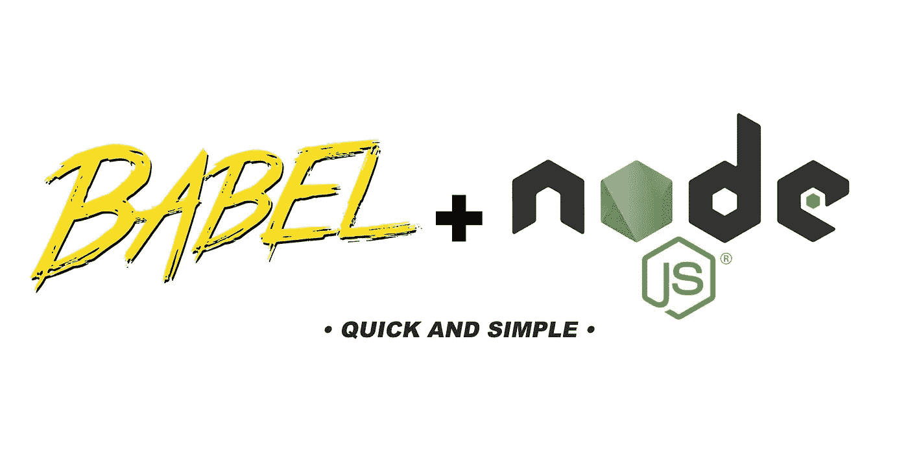

# 使用 babel 7 和 node

> 原文：<https://medium.com/hackernoon/using-babel-7-with-node-7e401bc28b04>

所以你想用 node 的新巴别塔 7？我们这里的目标是建立一个最小的节点应用程序，它能够在本地运行，并且有一个用于远程部署的构建命令。我们开始吧！



Medium kinda forces me to make these… I know…

你可能熟悉的巴别塔和 v7 有一些不同。

1.  **巴别塔软件包现已确定范围**就像许多其他大型组织一样，巴别塔已将其更名为 NPM 软件包。这意味着例如`babel-cli`已经被重命名为`@babel/cli`。
2.  **不要再摆弄预设了。现在你可以使用`@babel/preset-env`并在配置文件中定义你的需求。**
3.  `**babel-node**` **已经从 CLI 中的**移动到它自己的包:`@babel/node`

好了，我们把最重要的事情都记下来了。你可以选择在 babels 网站上阅读更多关于这些变化的信息，但我们接下来需要做的是:

## 设置应用程序结构

我们将尽可能保持简单:

首先，您想运行`npm init`在目录中创建一个`package.json`文件，根据您是否使用 Git，您可能想运行`git init`

我们将建立两个目录，一个用于开发，另一个用于部署我们编译的资产。

```
your-project-directory
|--dist
|--src
|--package.json
```

对于这个例子，我们将在 src 目录中添加一个简单的文件，名为`server.js`

```
your-project-directory
|--dist
|--src
|  |--server.js
|--package.json
```

我们需要用`npm install --save-dev @babel/core @babel/cli @babel/preset-env @babel/node`给我们的项目添加一些 babel 包。这些分别负责 babel 的一般工作，babel 在命令行中的使用，使用最新 JS 特性的能力和 babel 与 node 的使用。

为了便于开发，我们还将使用`npm install --save-dev`添加`nodemon`包，当我们的一个文件被更改时，它会自动为我们重新加载 node。

最后，我们只需要通过在我们的项目根目录下创建一个`.babelrc`文件来告诉 babel 使用`@babel/preset-env`包:

```
// .babelrc
{
  "presets": ["@babel/preset-env"]
}
```

您的项目结构现在应该如下所示:

```
your-project-directory
|--dist
|--node_modules
|--src
|  |--server.js
|--package.json
|--.babelrc
```

## 向`package.json`添加脚本

现在是最后一步，我们将命令添加到`package.json`文件中。

*   添加`nodemon --exec babel-node src/server.js`作为`start`脚本。这告诉 nodemon 包监视文件更改，当它检测到更改时重新加载，并使用 babel-node 运行文件`src/server.js`。我们将在本地开发时使用它。
*   添加`babel src --out-dir dist`作为`build`脚本。这告诉 babel 编译来自`src`目录的文件，并将它们放在`dist`目录中。
*   添加`node dist/server.js`作为`serve`脚本。这使我们能够在服务器上运行我们编译的代码，我们不仅仅使用`nodemon`的原因是它使用了比使用`node`多得多的内存，并增加了一些启动时间，这对一些应用程序来说是好的，但对其他应用程序来说可能会有很大的性能影响。

您的`package.json`现在应该看起来像这样:

```
{
  "name": "my-app",
  "version": "1.0.0",
  "description": "",
  "main": "src/server.js",
  "scripts": {
    "start": "nodemon --exec babel-node src/server.js",
    "build": "babel src --out-dir dist",
    "serve": "node dist/server.js"
  },
  "author": "",
  "license": "ISC",
  "dependencies": {
  },
  "devDependencies": {
    "[@babel/cli](http://twitter.com/babel/cli)": "^7.0.0-rc.1",
    "[@babel/core](http://twitter.com/babel/core)": "^7.0.0-rc.1",
    "[@babel/node](http://twitter.com/babel/node)": "^7.0.0-rc.1",
    "[@babel/preset-env](http://twitter.com/babel/preset-env)": "^7.0.0-rc.1",
    "nodemon": "^1.18.3"
  }
}
```

## 祝发展愉快，好运！

如果你有任何问题或建议，我会在评论中看到你，或者你可以通过 twitter 打电话给我[。](https://twitter.com/will_rut)