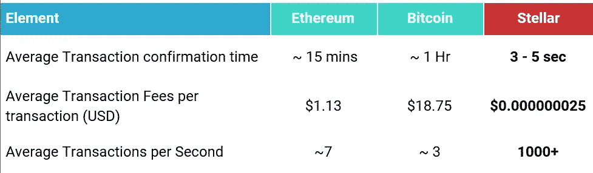

# 使用区块链构建支付应用以供大众采用，不受波动性的影响

> 原文：<https://medium.com/hackernoon/using-blockchain-to-build-payment-applications-for-mass-adoption-free-from-volatility-8ecef711c770>

Photo by [Michał Parzuchowski](https://unsplash.com/@mparzuchowski?utm_source=medium&utm_medium=referral) on [Unsplash](https://unsplash.com?utm_source=medium&utm_medium=referral)

从比特币开始，大多数区块链的愿景一直是不通过金融机构实现点对点支付。从那时起，就出现了一场疯狂的竞赛，每个推出 ICO 的企业都试图让其加密货币成为交易货币，并实现大规模采用。

然而，正如我在我的[上一篇文章](/tillbilly/worlds-1st-blockchain-powered-integrated-point-of-sale-terminal-is-a-bold-claim-afa8a97f098d)中提到的，每个企业都认为他们正在通过发明新的“实用令牌”来推动大众的区块链，为他们的平台、应用或游戏提供动力；或者想出新的方法让著名的代币更容易被花掉。

但在我看来，要构建一个与大众一起工作的区块链应用程序，需要解决以下四个基本问题:

# 波动性

日常购物者既没有时间，也不关心加密货币市场。他们看到、听到或读到的都是主流媒体上诱人的点击诱饵新闻*“比特币价格如何在 3 天内暴跌 30%”*或*“这个人如何用比特币买下他 300 万美元的房子”*

当涉及到使用加密货币进行日常购买时，这造成了普遍的不信任，人们倾向于将这些代币更像资产一样进行 HODL。

> 现在我明白这里的讽刺了。作为一个 ICO，虽然你希望人们使用你的代币作为货币，但你也(私下)希望你的代币(w.r.t fiat)继续升值。

虽然没有唯一的解决办法，但我们在考虑支付平台和 ICO 时也遇到了同样的问题。我们提出了一个利用一流的区块链基础设施的双资产模型。本质上我们所做的是

1.  创建了一个内部“信用”令牌，记录用户在我们这里存款的价值。*(类似于礼品卡或 iTunes 信用卡的工作方式)*。这使得我们能够将法定价值存储在固定价值的加密货币中。
2.  创造了我们的 ICO 令牌。该令牌旨在成为支付网络接受的“协议或实用令牌”。
3.  当要进行支付时，我们管理从信用令牌到 ICO 令牌的“及时转换”。由于转换是从一个密码到另一个密码进行的，所以它是免费的(感谢 Stellar Distributed Exchange ),而且是即时的(例如，你如何用借记卡支付)

> 如果听起来有点混乱，请查看我的详细文章[我们解决加密货币波动问题的方法](/tillbilly/tillbilly-crypto-volatility-solution-aff81c789515)

# 复杂性

可以肯定地说，当今世界 99%的人口不了解区块链。尝试说服一个普通购物者在交易所购买一枚受欢迎的硬币，将其换成一些替代硬币，获得一个加密钱包，保护他们的私钥，将代币发送到钱包，用公钥支付… *这是行不通的*

为了使加密货币易于使用，需要抽象这些复杂性，并提供无缝和熟悉的体验。如果用户发现获取您的令牌很复杂，那么它的采用将会失败。

例如，如果你是一个应用程序，提供应用内购买机制，如果你是一个游戏或平台，用你的代币奖励用户的活动。但是无论你做什么——**为他们管理这个过程***(就像你不关心你的银行如何存储或转移你的钱，只要你能看到你账户上正确的余额)*

# 可用性(或可接受性)

这就把我们带到了经典的电话或传真机问题。要建立一个通信平台，必须有一个系统是可用的，这样发送者可以发送，接收者可以接受这种通信方法。

要建立一个受欢迎的支付平台，每个购物者都应该能够消费，每个商家都应该能够接受你的代币。这只有在系统(方法)是 **a)** 普遍可用，并且 **b)** *像我之前提到的*不复杂的情况下才有可能。就像传真公司一样，您的企业应该为消费者提供方法(和设备，如果需要的话)并在后台管理流程。

# 可量测性

区块链技术要想在支付环境中取得成功，它需要高度可扩展、快速提交、低成本，并且易于与现有的财务和合规系统集成。

然而，我发现令人惊讶的是，几乎每一个为 ico 目的发行的新令牌都是使用以太坊的 ERC20 标准创建的，尽管区块链遭受了大量交易积压和费用大幅波动的事实。比特币区块链上发行的代币也有同样的问题。

因此在 TillBilly，我们选择了 Stellar。Stellar 为 TillBilly 提供了一个分布式支付基础设施，以构建可扩展且价格合理的应用

Comparison of Blockchain Infrastructure Platforms

除了可扩展性和性能，Stellar 还提供了以下优势

*   能够在同一个网络中进行投票、分红或奖励
*   与现有银行和金融系统连接的能力
*   多重签名增加安全性

**我认为，一个区块链应用程序要真正实现大规模采用，它需要无缝到几乎“看不见”。**在 [TillBilly](https://tillbilly.com) ，区块链对我们来说就是基础设施，加密货币就是在其中流动的网络数据包。