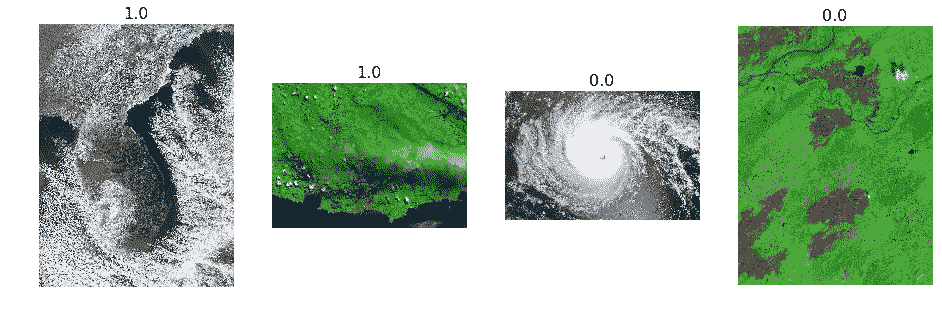
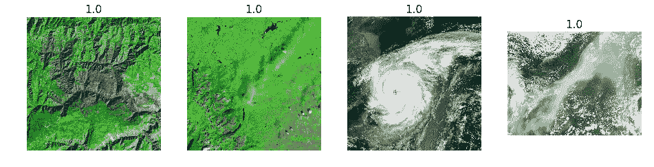

# 第一部分-使用深度学习从卫星图像中识别自然灾害

> 原文：<https://medium.com/hackernoon/using-deep-learning-to-identify-natural-disasters-from-satellite-images-94815a7514f4>

导致这个小型项目的想法是，当有卫星图像时，CNN 在识别自然灾害方面有多有效。一个能够使用接近实时的卫星图像标记灾害类型的精确系统将导致对受灾地区更好的反应和救济。

**使用的数据:**来自 NASA 地球观测站的跨越多种灾害类型的不同分辨率的 RGB 卫星图像被用作训练和验证样本。(参见下图-1)。


Image1-RGB X 2967 X 2967 Satellite image of a wild fire(Source-NASA Earth observatory)

数据提取- 为了从 NASA 地球观测站提取图像，我使用了非常酷的 eonet API([https://eonet.sci.gsfc.nasa.gov/api/v2【t 5.1/events】)。该 API 允许您使用 GET request 获取所需的图像 url。这些图像按照自然灾害类型(例如火灾、干旱、风暴等)进行标记。我个人使用 python 中的请求来提取所需的 URL 及其对应的标签。为了提取图像，我混合使用了 url2、xml.html &请求包。](https://eonet.sci.gsfc.nasa.gov/api/v2)

```
#Below code should be able to download images to your local from a csv of linksimport csv
import urllib
import lxml.html
import requestsconnection = urllib.urlopen(url)with open('/required_url.csv') as csvfile:
    csvrows = csv.reader(csvfile, delimiter=',', quotechar='"')
    for row in csvrows:
      if 'view.php' in row[0]:
        filename = row[1]
        url = row[0]
        locn=row[2]
        print (locn)
```

我想研究的重要一点是，当缺乏数据时，[深度学习](https://hackernoon.com/tagged/deep-learning)模型可以产生的影响。为了确保我的数据样本没有图像丰富，我只用了 80 张图像。为了保持任务简单，我决定不进行多类分类，只将标签限制为两类(风暴野火/其他)。我的模型的最终目标是能够识别图像中是风暴还是野火(每隔一场自然灾害，它都应该被归类为其他灾害)。

[机器学习](https://hackernoon.com/tagged/machine-learning)/数据科学/深度学习社区由一些最聪明的人组成，他们正在开发尖端工具和算法，这些工具和算法将改变我们所知的世界。他们也非常友好地与我们其他人分享这些，这样我们就不需要重新发明轮子了。我使用了由团队@fastai 开发的 fastai 库促进的迁移学习。本实验中使用的大多数方法都是受深度学习第一部分课程的启发。在下面的实验中，我使用了在 1000 个 imagenet 类上进行了预训练的 resnet32

## 接下来的步骤:

1)图像大小调整

2)确定最佳学习速率

3)训练输出层，同时保持初始层的其余权重固定

4)重新训练完整的模型

5)分析结果

1.  **图像大小调整**

正如我之前提到的，大多数图像都有不同的分辨率。我想确保我们有一个统一的图像分辨率，以便 GPU 计算可以达到最佳。以下是调整大小后图像的外观示例:


**2)确定最佳学习速率**

Jeremy 在 DL-1 课程中展示的最神奇的工具之一是学习率查找器。寻找完美的学习率对于各种方法学(RF，梯度推进，DL)的 ML 实践者来说总是一个巨大的痛苦。使用下面的学习率查找工具，图表看起来是这样的。由于训练数据样本对我来说很低，我决定使用 0.001 的学习率来训练模型，以确保模型训练缓慢而不急于下结论。

**3)训练输出层，同时保持初始层的其余权重固定**

这一步将我推向了大约 65%的准确率。与我提到的一篇论文相比，这篇论文看起来很糟糕。


Transfer Learning from Deep Features for Remote Sensing and Poverty Mapping(Michael Xie and Neal Jean and Marshall Burke and David Lobell and Stefano Ermon)

**4)重新训练完整模型**

现在 resnet34 使用 imagenet 的 1000 个类对象进行预训练。在卫星图像的情况下，这 1000 个对象并不完全适合用于迁移学习。因此，我为我们的用例重新培训了 imagenet 的所有层。结果非常令人印象深刻，因为我现在已经达到了大约 75% 的**精度。我观察到的一件事是，跨时期的精度变化不太稳定，这可能是由于低训练样本< 100，由于该样本，模型试图拟合的函数不完全稳定，这可能导致当我移出样本时性能下降。**

**5)分析结果**

让我们看看这个模型是如何预测的:

**随机几张正确的图像**


model correctly predicting storm and wildfires

**随机出现一些不正确的图像**



Model not able to differentiate between other natural disasters and storm and wildfires

模型无法区分其他自然灾害，例如雪和我们预测的风暴和野火(如果你认为这甚至对人眼来说都很棘手，因为这两种灾害都与寻找白色物质有关(雪的情况下是雨夹雪，火的情况下是烟雾)。这可能会使任何人或机器感到困惑。解决方案可能是更多的训练数据，这将为机器提供更多的数据点，以得出正确的结论。

**最正确的风暴和野火**



**最正确的其他人(那不是风暴或野火)**


**最不正确的风暴或野火**


**最不正确的其他(那不是风暴或野火)**


# 结论

尽管我们预测风暴或野火这两种自然灾害的深度学习模型达到了大约 75%的准确率，这看起来不错(与我跟踪的学术文献相比)，但该模型似乎不稳定。由于不同灾害图像的混淆性质(暴风雪看起来可能类似于野火)，甚至人眼也可能被混淆。可能是使用了更多的训练点(我在这个实验中只用了~80 张图片应该更有收获。

# **接下来的步骤**

1.  获取更多自然灾害的卫星图像
2.  尝试在更大的样本量上进行训练
3.  进一步简化问题陈述(可以试着从野火中预测暴风雪),而不是在另一门课上搞个大杂烩

衷心感谢[杰瑞米·霍华德](https://medium.com/u/34ab754f8c5e?source=post_page-----94815a7514f4--------------------------------) & [雷切尔·托马斯](https://medium.com/u/ee56d0bac1b7?source=post_page-----94815a7514f4--------------------------------)和 fastai 的整个团队，感谢他们提供了这个令人惊叹的 MOOC 和 Fastai 工具包。自上而下的学习方法应该会让每个人都喜欢深度学习，因为它的实用性和广泛的应用案例。简直等不及 2018 课程的第二部分在网上发布了。

如果我想在下一次迭代中解决这个问题，请阅读我实验的第二部分