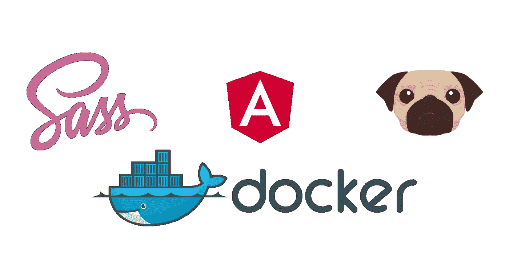
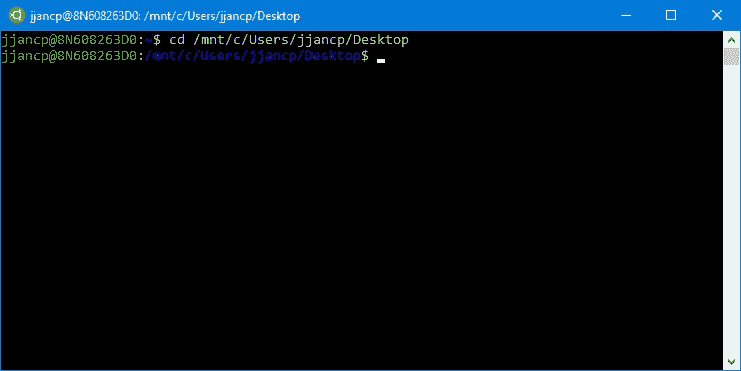
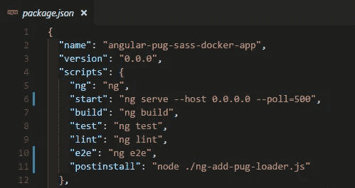
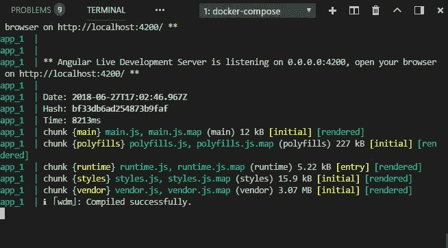
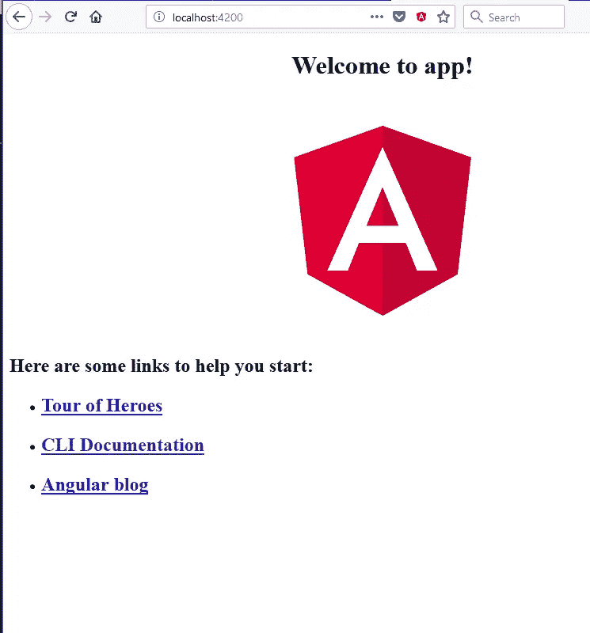
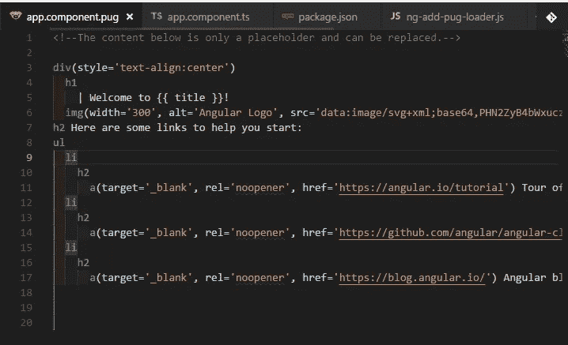

# 使用 Docker、Docker Compose、Angular-CLI 6+、Sass 和 Pug (Jade)

> 原文：<https://medium.com/hackernoon/using-docker-docker-compose-angular-cli-6-sass-and-pug-jade-160896dfd208>



Angular-CLI, Pug, and Sass in Docker

本指南的目的是在使用 Pug 时使用 Angular CLI 对 [Docker](https://hackernoon.com/tagged/docker) 进行有效设置。我在让他们三个一起工作时遇到了一些问题。
我将假设你知道一点点 Docker(虽然不是必须的)来保持它的工作。

下面是最终代码的 GitHub repo 。

**一些注意事项**:

*   本指南适用于现有的和新的[角接触](https://hackernoon.com/tagged/angular-cli)应用。
*   你必须已经安装了 NodeJS 8+，Docker v18+(不一定，你可以把 compose 版本改成更低的数字)。
*   我目前用的是安装了 Ubuntu 的 Windows 10。注意这一点很重要，因为当你试图用 node_modules 运行 node-sass 时，它会给你带来问题(只发生在 Windows 上)
*   pug 图片来自 RedBubble 的用户 Mamugi1492

# 步骤# 1-创建新的角度项目

如果您有一个想要进行 Dockerize 的现有项目，请跳过这一步，转到#3。

如果你运行的是 Windows，你将重新开始，跳到第 2 步。其他(Mac/Linux)，请执行以下操作:

```
npm install -g @angular/cling new angular-pug-sass-docker-app --style=scss
```

*这将全局安装 angular cli，然后使用 Sass 创建一个新的 angular 应用程序。将* `angular-pug-sass` *更改为您的项目名称。*

# 第 2 步—仅限 Windows

在 Windows 上，如果您使用 CLI 创建应用程序，Node-Sass 会根据所述操作系统自动进行设置。当您使用 Docker 时，您将通过 Linux 映像运行它。一旦您挂载了目录(这样我们就可以编辑而不需要重新构建)，它就会引用 node_modules 目录，其中包含了随 Windows 一起安装的 node-sass。

您可以删除 node_modules。或者，强制重建节点-sass。不幸的是，我无法用这些方法让它工作。这就是为什么我建议你遵循选项#1，而把选项#2 作为一个替代方案。

**选项#1 —在 Windows 的 Linux 发行版中创建新的 Angular 项目(推荐)**

你需要在 Windows 10(或任何 Linux 版本)上安装 Ubuntu[https://docs.microsoft.com/en-us/windows/wsl/install-win10](https://docs.microsoft.com/en-us/windows/wsl/install-win10)。你可能有它，因为你必须安装 Docker。

打开 Ubuntu 终端，进入你想要创建新应用的目录。在我的例子中，我将在桌面中指定它:

我们这样做是通过安装 c 盘(`/mnt/c`)并导航到我的桌面位置`C:\Users\jjancp\Desktop.`

结合两者，我们有:

```
cd /mnt/c/Users/jjancp/Desktop
```



全局安装 cli:

```
sudo npm install -g @angular/cli
```

创建新的角度项目:

```
ng new angular-pug-sass-docker-app --style=scss
```

**选项# 2——在 Windows 中创建新的 Angular 项目，然后使用 npm 重建节点——sass**

这个方法对我没用。在这里，您可以直接从 Windows 安装模块，就像任何常见的项目一样:

在 PowerShell 或 CMD 中全局安装 angular-cli:

```
npm install -g @angular/cli
```

然后，创建新的角度项目:

```
ng new angular-pug-sass-docker-app --style=scss
```

# 步骤#3 —添加 ng-cli-pug-loader

阅读[马克·皮耶扎克](/@MarkPieszak/using-pug-or-jade-templates-with-the-angular-cli-9e37334db5bc)(可选)的这篇关于 ng-cli-pug-loader 的文章。*感谢*[*danguilherme*](https://github.com/danguilherme)*为装载机喷油器！*

```
ng add ng-cli-pug-loader
```

该命令将安装 package.json 中的所有包，并在项目的根目录下添加一个名为 `ng-add-pug-loader.js`的文件，它将向 devDependencies 添加 pug-loader、pug 和 apply-loader。最后，它将在 package.json 的 postinstall 中包含一个 run 命令。

正如在上面的链接文章中所解释的，它从 Angular 编辑 Webpack 配置文件，并向其中注入 Pug loader，而不需要弹出 Angular 应用程序！。

**重要的事情**:我们手动完成，不需要指定 docker 映像，因为**我们不需要**再次运行 ng add。当我试图用 Docker 自动化整个过程时，我个人也遇到了问题。

# 步骤 4—[ERR _ INVALID _ CALLBACK]:CALLBACK 必须是 ng-add-pug-loader.js 中的函数

**更新(2018 年 7 月 11 日):**有人注意到我在实现 fs 的同步版本时遇到了问题(没有回调)。我已经在回购和邮寄中修复了它们。

你可能会提出这个问题。我仍然不知道问题的原因是什么。但是将所有的`fs` 方法都改为同步似乎可以修复下面的错误:

```
TypeError [ERR_INVALID_CALLBACK]: Callback must be a function
 at maybeCallback (fs.js:133:9)
 at Object.writeFile (fs.js:1139:14)
 at fs.readFile (/usr/app/ng-add-pug-loader.js:20:6)
 at FSReqWrap.readFileAfterClose [as oncomplete] (internal/fs/read_file_context.js:53:3)
error Command failed with exit code 1.
```

一个快速而肮脏的解决方案是编辑 ng-add-pug-loader.js。所以去打开文件:

这是文件(我在回购中创建了一个[问题):](https://github.com/danguilherme/ng-cli-pug-loader/issues/5)

```
/*** Adds the pug-loader inside Angular CLI's webpack config, if not there yet.
* @see [https://github.com/danguilherme/ng-cli-pug-loader](https://github.com/danguilherme/ng-cli-pug-loader)
*/const fs = require('fs');
const commonCliConfig = 'node_modules/@angular-devkit/build-angular/src/angular-cli-files/models/webpack-configs/common.js';const pugRule = '{ test: /.pug$/, use: [ { loader: "apply-loader" }, { loader: "pug-loader" } ] },';// See these:
// [https://github.com/danguilherme/ng-cli-pug-loader/issues/5](https://github.com/danguilherme/ng-cli-pug-loader/issues/5)
// [https://medium.com/@strakercarryer/oh-man-thank-you-for-posting-your-4-e5e307fe816b](/@strakercarryer/oh-man-thank-you-for-posting-your-4-e5e307fe816b)
// Thanks to danguilherme and Straker Carryer for spotting the issues with my approachtry { // Just in case the file isn't found.
  const data = fs.readFileSync(commonCliConfig);
  const configText = data.toString();
  if (configText.indexOf(pugRule) > -1) { return; } const position = configText.indexOf('rules: [') + 8;
  const output = [configText.slice(0, position), pugRule,     
  configText.slice(position)].join(''); const file = fs.openSync(commonCliConfig, 'r+'); // Insert the pug webpack rule
  fs.writeFileSync(file, output);
  fs.closeSync(file);} catch (e) {
  console.error('There was an error while injecting the pug loader', e);
}
```

# 第 5 步—文档文件

**更新(2018 . 7 . 11):**我在安装纱线之前更改了 angular-cli 的 NPM 安装。其他一切都保持不变。

```
# Installs the current application on a Node Image.
FROM node:10.5# The qq is for silent output in the console
# You are welcome to modify this part as it
RUN apt-get update -qq && apt-get install -y build-essential libpq-dev vim# Sets the path where the app is going to be installed
ENV NODE_ROOT /usr/app/# Creates the directory and all the parents (if they don’t exist)
RUN mkdir -p $NODE_ROOT# Sets the /usr/app as the active directory
WORKDIR $NODE_ROOT# Copies all the contentCOPY . .# Install all the packages
RUN npm install -g @angular/cli
RUN yarn install# Uncomment this if you went with Option #2 in Step #2 (Windows Only)
# RUN npm rebuild node-sass --force# The default port from ng serve (4200)
# and 49153 for Webpack Hot Module Reload
EXPOSE 4200 49153
```

创建一个名为`Dockerfile`的无扩展名文件，并将其添加到项目的根目录中。复制上面的内容。如果你有 Docker 的经验，你可能会看到我们正在复制整个文件夹，然后运行安装。我们可以选择复制`ng-add-pug-loader`、`angular.json`和`package.json`文件并运行 yarn install。我发现一些问题(可能是由于我的设置)让它工作。

如果您决定执行步骤 2 选项 2(仅限 Windows)。很可能你会有`node-sass`问题。试试看重建是否有效。我试过了，没用。

**如果您对图像有问题，请参阅底部的附录。**

**。dockerignore**

```
.dockerignore
./log
./tmp
package.lock.json
.git
*Dockerfile*
*docker-compose*
node_modules
```

创建一个扩展名为`.dockerignore`的无名文件，复制上面的内容。

# 第 6 步—创建 docker-compose.yml 文件

在项目的根目录下创建一个`docker-compose.yml`文件，添加如下内容:

```
version: ‘3.6’
services:
  app:
    build: .
    command: “npm start”
    ports:
      - “4200:4200” 
      - "49153:49153"
    expose:
      - “4200” 
      - "49153"
    volumes:
      - “./:/usr/app/”
```

`volumes`键将把我们当前的目录映射到 Docker 图像的内容。这样，我们不需要重新加载容器来查看更改。

如果你检查 docker-compose 中的`npm start`，你会看到它将要运行`ng serve`。我们需要在 package.json 内部做一点小小的调整

# 第 7 步—更新 package.json

为了让它正确地暴露给外界，我们需要转到启动脚本并修改它。此外，我们需要添加一个[轮询机制](https://stackoverflow.com/a/44196594/1057052)，这样 Angular CLI 就可以拾取容器内的更改:

出发地:

```
“start”: “ng serve”,
```

收件人:

```
“start”: “ng serve --host 0.0.0.0 --poll=500”,
```

该命令将允许您通过`http://localhost:4200`进行导航



Example for the ng start script

轮询机制以毫秒为单位。您可以根据自己的喜好进行调整。

# 第八步——改变。html 到。哈巴狗

不要**而不是**将主**index.html 改为. pug，加载程序不会解析它。**

将 app.component.pug 更新到 app.component.pug 更新其内容:

```
div(style='text-align:center')
  h1
  | Welcome to {{ title }}!
  img(width='300', alt='Angular Logo', src='data:image/svg+xml;base64,PHN2ZyB4bWxucz0iaHR0cDovL3d3dy53My5vcmcvMjAwMC9zdmciIHZpZXdCb3g9IjAgMCAyNTAgMjUwIj4KICAgIDxwYXRoIGZpbGw9IiNERDAwMzEiIGQ9Ik0xMjUgMzBMMzEuOSA2My4ybDE0LjIgMTIzLjFMMTI1IDIzMGw3OC45LTQzLjcgMTQuMi0xMjMuMXoiIC8+CiAgICA8cGF0aCBmaWxsPSIjQzMwMDJGIiBkPSJNMTI1IDMwdjIyLjItLjFWMjMwbDc4LjktNDMuNyAxNC4yLTEyMy4xTDEyNSAzMHoiIC8+CiAgICA8cGF0aCAgZmlsbD0iI0ZGRkZGRiIgZD0iTTEyNSA1Mi4xTDY2LjggMTgyLjZoMjEuN2wxMS43LTI5LjJoNDkuNGwxMS43IDI5LjJIMTgzTDEyNSA1Mi4xem0xNyA4My4zaC0zNGwxNy00MC45IDE3IDQwLjl6IiAvPgogIDwvc3ZnPg==')h2 Here are some links to help you start:
  ul
    li
     h2
       a(target='_blank', rel='noopener', href='https://angular.io/tutorial') Tour of Heroes li
      h2
        a(target='_blank', rel='noopener', href='https://github.com/angular/angular-cli/wiki') CLI Documentation
    li
      h2
        a(target='_blank', rel='noopener', href='https://blog.angular.io/') Angular blog
```

更新`app.component.ts`

改变:

```
templateUrl: ‘./app.component.html’,
```

收件人:

```
templateUrl: ‘./app.component.pug’,
```

这就是它的样子:

```
import { Component } from '@angular/core';@Component({
  selector: 'app-root',
  templateUrl: './app.component.pug',
  styleUrls: ['./app.component.scss']
})
export class AppComponent {
  title = 'app';
}
```

# 第 9 步—运行应用程序

导航到文件夹的项目并运行:

```
docker-compose up
```



准备就绪😁😊🎉🎉🎉🎉🎉🎉🎉🎉

# 附录 A

如果您正在运行 Windows，并且已经有了一个带有 CLI 的 Angular 应用程序，并且您在对应用程序进行 Dockerizing 时遇到了问题，解决方案将是使用步骤 2 中的选项 1。

1.  移除`node_modules`文件夹。
2.  [在 Windows 10 上安装 Ubuntu](https://docs.microsoft.com/en-us/windows/wsl/install-win10)，或者在 Windows 7/8.x 上流浪
3.  打开 Ubuntu 命令，并将其映射到您的安装。在 Windows 10 上使用 Ubuntu 的情况下，可以这样做:

```
cd /mnt/c/Users/MyUser/Path/To/Angular-Project
```

4.在 Ubuntu 中:安装 [NodeJS](https://nodejs.org/en/download/package-manager/#debian-and-ubuntu-based-linux-distributions) 。

5.执行`yarn install`或`npm install`

# 附录 B —其中一个依赖项中的安全漏洞(截至撰写本文时—2018 年 6 月 27 日)。

angular-cli 使用的(和 NodeSass)似乎有一个旧的依赖关系，即 GitHub 正在警告一个安全漏洞。进一步调查这个问题，似乎是来自`Hapi`的旧`Hoek` 版本。我们无法控制这一点，因为它是从依赖项中自动提取的。

这些似乎是解决这些问题的问题:

*   [https://github.com/angular/angular-cli/issues/10480](https://github.com/angular/angular-cli/issues/10480)
*   [https://github.com/sass/node-sass/issues/2355](https://github.com/sass/node-sass/issues/2355)