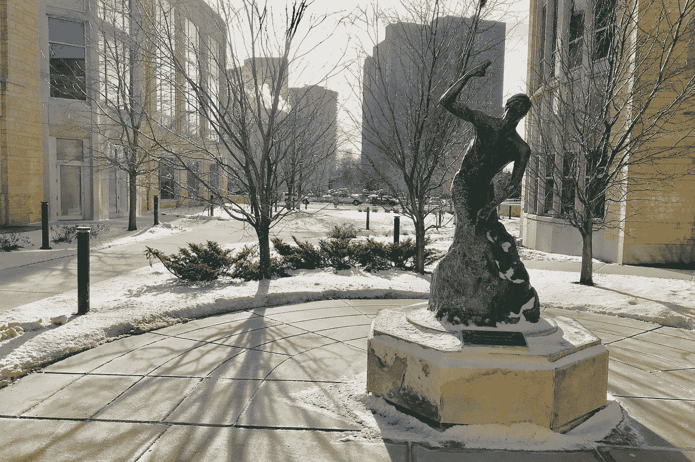

# 利用教育设计未来

> 原文：<https://medium.com/hackernoon/using-education-to-design-the-future-cec76793b6a1>

## 为什么课堂体验在网络世界如此重要

A bronze sculpture, ``The Entrepreneur,’’ created by sculptor Kermit Allison, located on the Minneapolis campus of the University of St. Thomas

在数字时代，教学*与众不同。我确信。*

发现*与*的不同总是令人兴奋的。这是作为一名教育工作者的乐趣之一。

就拿上周来说。

在过去的几年里，我在明尼阿波利斯/圣保罗的圣托马斯大学教授一门强化课程。

今年的课程是关于数字世界如何改变我们生活、工作和做生意的方式。

本课程涵盖四个主题:

*   “平台”经济。
*   正在进行的技术革命(人工智能、物联网和机器人)。
*   区块链和智能合约(包括加密货币和 ico)。
*   数据分析和讲故事。

目标是帮助学生理解数字时代的机遇和挑战。重要的是，下一代要明白，我们的数字世界无法用传统模式来理解。这样做会导致误解、混乱甚至更糟。

关于课程的实际内容还有很多要说的，我会在以后的文章中介绍。但是今年特别有趣的是教学方法的一个简单变化如何帮助阐明**教育如何在创造未来中发挥有价值的作用。**

# 全新的课堂体验

过去，以最新的技术趋势和发展开始我的课程总是有意义的。在第一堂课上，我们深入研究了几种不同的技术。这种教学方式总是与大量的讨论互动。

但是今年，我们尝试了一些不同的东西。

我没有从介绍技术开始，而是从一些“个人故事”开始。我解释了作为一名企业高管，我在日常生活中面临的现实挑战。我解释了新技术对我在一家大公司工作的影响。我举例说明了我们在将技术整合到现有工作方式中所面临的一些问题。

其结果是引发了所有参与者的立即讨论。问题、解决方案、批评和建议的混合体。每个人都参与其中。房间里的能量是巨大的。

> 简而言之:我们在创造一些东西。

我们在寻找当今问题的解决方案，同时也在努力为更美好的未来创造模式。

正是这种分享创造力的感觉让它成为如此难忘的经历。房间里发生了神奇的事情。

这听起来可能有点夸张，但我真的觉得我们在致力于建设一个更美好的世界。我们想的是“打破常规”，分享和学习。我们是作为一个团队一起完成的。

我认为这种方法有效有几个原因

首先，年轻人不想或不需要向他们详细解释这些技术。他们不需要“事实”。

例如，团队已经知道区块链，如果不知道，他们可以很快上手。在一个事实唾手可得的数字时代，传递关于技术(或其他任何东西)的事实不是教育能够增加真正价值的地方。相反，我们需要关注如何部署这项技术，以及这对我们的未来意味着什么。

此外，教室是越来越多样化的地方。具有不同背景(无论是国籍还是之前的经验(例如通信、技术、法律、营销、空中交通管制)的团队的优势在于，每个人都可以带来自己独特的视角，为讨论增添内容。

当然，这种开放式多学科讨论的风险在于，它并不总是容易指导或控制的。虽然我们确实偏离了主题，但它从未变得混乱或不相关。的确，我们提出的一些解决方案，尽管乍一看很棒，但其实已经存在，或者很容易被证明毫无意义。

但对我来说，这只是在一个不确定的世界中共同创造过程的一部分。为了找到最佳解决方案，我们需要这种“试错”的经验。

> 重要的是建立——回顾——批判——迭代的过程。

这必须在一个开放、包容和尊重的安全空间中进行。

整个经历更加坚定了我的信念:课堂解决问题是教育的未来。尤其是在一个以不断的技术破坏为特征的快速变化的网络世界中。

# 为什么课堂体验对设计未来至关重要

这一观察之所以重要，有几个原因。这里有三个。

## #1 —面对面的互动

最近，我们看到了“远程学习”和“在线教学”的趋势，大学内部有很大的压力来发展这些新的教育模式。考虑到网络技术正在创造的教育可能性，这并不奇怪。毫无疑问，这些趋势非常重要，尤其是当它们有助于教育融合时。

尽管如此，课堂“教学”绝不能消失。当然，在许多情况下，它可能需要被破坏。但是，在数字时代，团队合作和开放的思想交流变得比以往任何时候都更加重要，我们必须保留这样的学习环境及其提供的独特体验。

## #2 —自由和灵活性

学校和大学一直是我们可以在更灵活、更宽松的环境下讨论事情的地方。但是这种安全空间在数字时代变得更加重要。个体教育者和教育机构都需要认识到提供人们可以一起工作、学习和创造的场所的价值。

教育需要创造机会让这种互动发生。

毕竟，为了变得更聪明，我们所有人都必须学习新技术。不仅是为了更好地识别、管理和减轻潜在风险，也是为了充分利用新技术在社会生活各个领域带来的巨大机遇。

这听起来很明显。但任何熟悉教育机构的人都会知道，有许多管理压力——例如认证——很容易减少课堂上的自由和灵活性。

## #3 —责任和所有权

我自己的感觉是，特别是最近几十年，大学教育对学生来说已经变得越来越“无关紧要”。潜在的雇主认为，毕业生没有学到什么对当今工作现实有用的东西。许多教授似乎也有这种感觉，他们所做的不再重要。

这里描述的这种课堂问题解决方法可以提供一种方式，使教育体验对所有利益相关者更有成效和相关性。

明尼阿波利斯/圣保罗的学生们无疑在这个过程中投入了很多，并对他们所创造的东西感到拥有所有权。这些解决方案对他们很有意义，不仅对他们的任务有意义，更重要的是对他们的未来有意义。

# 下一步是什么？

我知道这次经历对我来说更有价值。我觉得我也学到了更多，我会在下一次教学中融入我所学到的东西。

也许最重要的是，我也相信这种方法对潜在雇主和整个社会更有意义。

如果你直接从事技术工作，坚持不懈地专注于开发该技术是有意义的。把这当成发明。

但对于我们这些在商业或其他行业工作的人来说，真正的问题是如何将颠覆性技术整合到现有的工作模式中。它是关于理解技术的意义，然后围绕该技术设计或创造一个更好的未来。

这是在一个以深刻的技术变革为特征的世界中工作的日常现实。

> 重新创造*这种*体验是现在教育的真正价值所在。

*感谢您的阅读！请按住*👏*下面，还是留下评论吧。*

每周都有新的故事。因此，如果你关注我，你不会错过我关于数字时代如何改变我们生活和工作方式的最新见解。