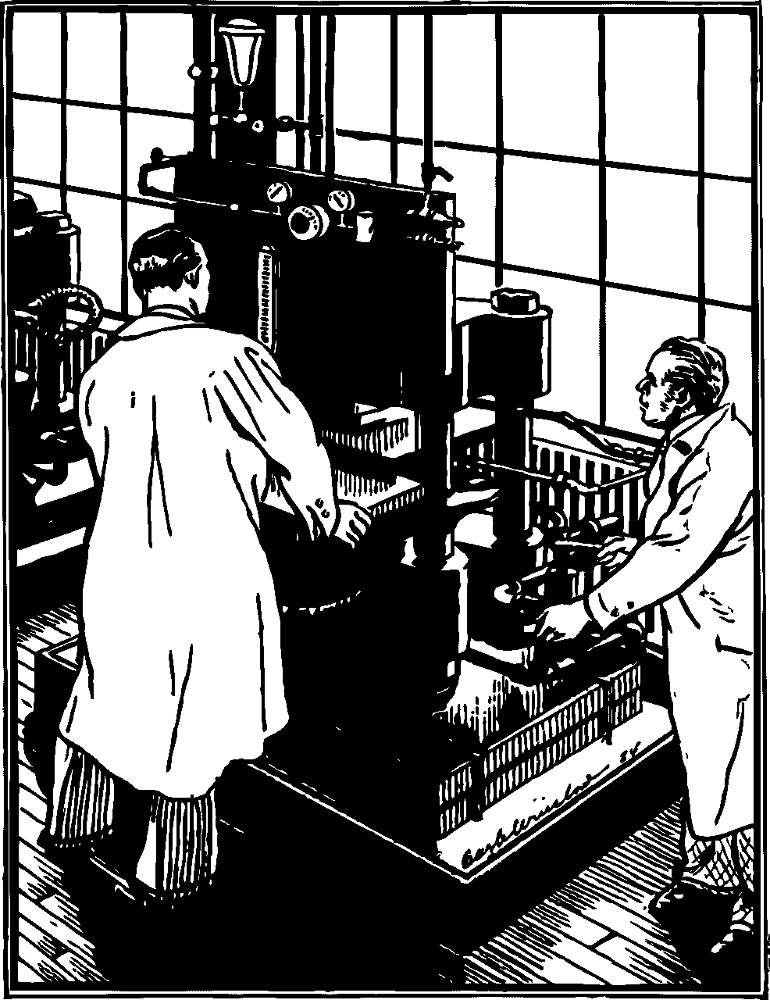

# 使用生成器作为副作用的语法糖

> 原文：<https://medium.com/hackernoon/using-generators-as-monads-do-notation-8600c53648cf>

这个故事展示了生成器作为一种显式的无缝语法，用于具有异步操作、共享可变状态和其他副作用的程序。这种转换是基于所谓的单子。

尽管名字很吓人，单子是一个非常简单的概念。当您更改一些变量值或输出任何内容或抛出/捕捉异常时，您已经在使用它们了。单子首先出现在计算机科学中，以支持命令式语言中关于副作用的数学推理，如 [JavaScript](https://hackernoon.com/tagged/javascript) 。

其他研究人员正在设计只有纯函数的实用语言。只使用纯函数会使程序更加冗长，更难阅读。单子被用作一种实用的[工具](https://hackernoon.com/tagged/tool)，用于将有效果的程序转换成纯粹的程序。这里引用了最好的单子教程之一——Philip Wadler(1995)的《函数式编程单子》:

> 在模块化方面，显式数据流既是福也是祸。一方面，它是模块化的极致。所有输入和输出的数据都是显式的和可访问的，提供了最大的灵活性。另一方面，它是模块化的最低点。算法的本质可能被埋没在将数据从创建点传送到使用点所需的管道中。

听起来是不是很耳熟？例如 React 组件的属性钻取和状态管理解决它的原因之一。

原始抽象 do-notation 是一个将看起来像命令式的程序转换成抽象 API 调用的宏。API 的具体实现可以构造一个可迭代的对象，或者一个承诺或者许多其他东西。这样，相同的语法(和相同的程序)可以在不同的上下文中重用。

JavaScript 有类似于 do 符号的语法扩展。它们是异步和/或生成器函数。与原始的 do 符号不同，它们被 JavaScript 编译器或一些 transpiler(如再生器)转换成具体的 API 调用(`Promise#then`和 Iterable 构造函数)。这些具体函数几乎是抽象 monad API 的实例。

异步和生成器函数基于协同程序单子。可以转化成很多其他单子，但不是全部。JavaScript 社区中有一个众所周知的事实——生成器函数可以代替异步函数。与标准异步函数不同，使用生成器语法编写的异步函数可以被取消。唯一的开销是需要调用一个包装函数，该函数将 Iterable 转换为 Promise。

有很多使用异步代码生成器的例子，所以我将用另一个例子来说明这个想法。这可能不太实际，但是我们可以把一个可变状态的生成器函数变成一个纯函数。

这里函数`incr`和`incrX2`都有副作用。它们改变和读取共享数据。但是由此产生的函数`state(incrX2)`是纯粹的。函数`state`完成 Iterable 到状态 monad 的实际转换。

这是内联框架函数的外观:

该示例跳过了抽象 API 层。有很多选项来选择它的基础，但最简单的是两个功能:`of`和`chain`。它们都返回一元(有效)值。它是一个抽象的东西，可以是任何东西，取决于具体的 API 实现。对于抽象接口，这种类型的值是完全不透明的。

*   `of` —接受任何值并返回有效值，它对参数的具体操作由接口实现定义
*   `chain` —取某个有效值和一个将任何内容映射到另一个有效值的函数，返回某个其他有效值

如果符合所谓的一元定律，函数的具体实现可以做任何事情。事实上，我选择的`chain`名称对于 JavaScript 库来说是典型的，但是有点误导。它建议一些具体的实现，链接的东西。但是，同样，这是一些抽象的东西，唯一的要求是单子定律的一致性。

法律是这样的:

*   `(f, x) => chain(of(x), f)`应该等于`(f, x) => f(x)`
*   `m => chain(m, of)`应该等于`m`
*   `(m, f, g) => chain(chain(m, f), g)`应该等于`(m, f, g) => chain(m, x => chain(f(x), g))`

如果定律成立，我们可以在 do-notation 中使用 API，或者在为任何单子工作的一些抽象函数中使用 API。

让我们将 Iterable 转换成这个抽象接口。除了函数被抽象的调用所取代之外，它几乎与状态一样。

对于状态，有效值是一个函数，它采用某个原始状态并返回一对结果值和一个新的状态值。下面是使用抽象中间层的状态单子定义:

并承诺:

第一单子定律对承诺不起作用，但对实际用途来说很好。

考虑到生成器对于承诺和迭代器来说已经足够了，有人可能想知道为什么我们需要异步生成器。事实上，结合普通生成器的两种效果来转换 monad 是非常容易的。但是，不会有任何替代`for await-of`的说法。这是另一种遍历语法。

协程/Iterables 不能定义转换为任何单子。例如，Observable 是一个单子，但生成器不能用作它们的 do 符号。

另一个有用的例子是非决定论。即返回几个值的计算。这可以用于将逻辑编程嵌入 JavaScript。实现抽象接口很简单:

生成器语法不起作用，因为`fun`可能被调用多次。

有一些库用 JavaScript 定义了一些具体实现的抽象 API，例如[幻想世界](https://github.com/fantasyland/fantasy-land)。也有一些 do notation as generators 实现试图通过重启和重放开始示例的迭代器来模拟多个简历- [burrido](https://github.com/pelotom/burrido) 。这种方法不安全，效率也不高。

我现在正在开发一个基于 babel 插件的 do-syntax 实现，适用于任何 Monad — [EffectfulJS](https://github.com/awto/effectfuljs) 。它提供了许多选项，如持久状态、具体实现内联、隐式并行化。这可能会大大简化 JavaScript 代码。我很快会写更多关于它的内容，敬请关注！