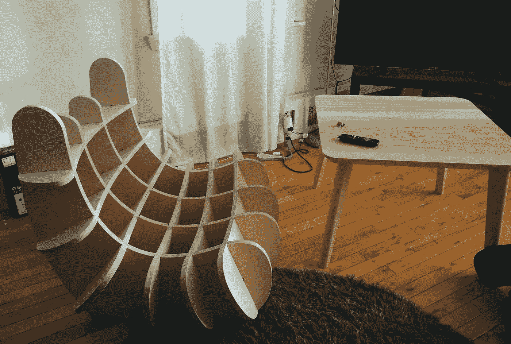
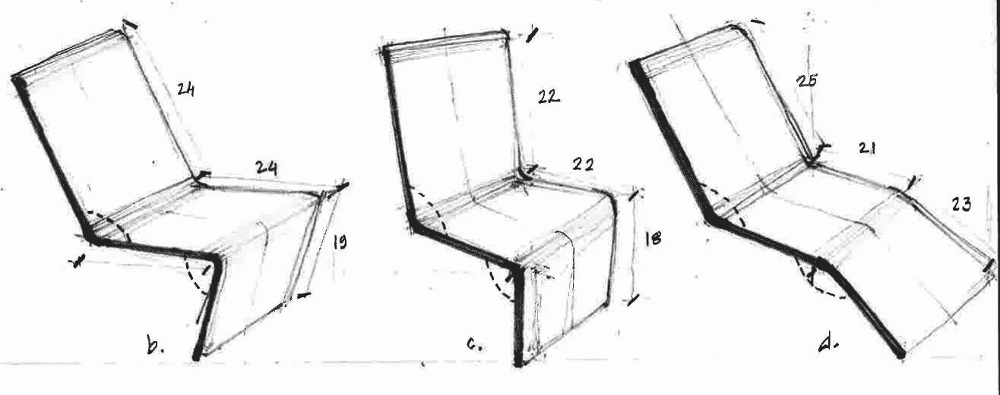
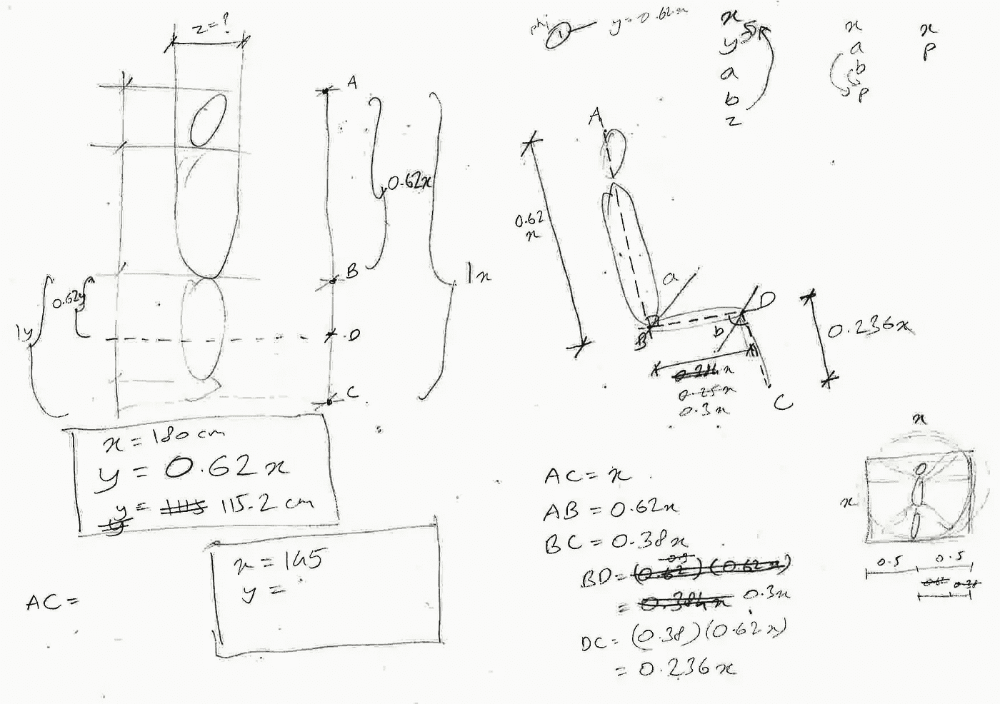
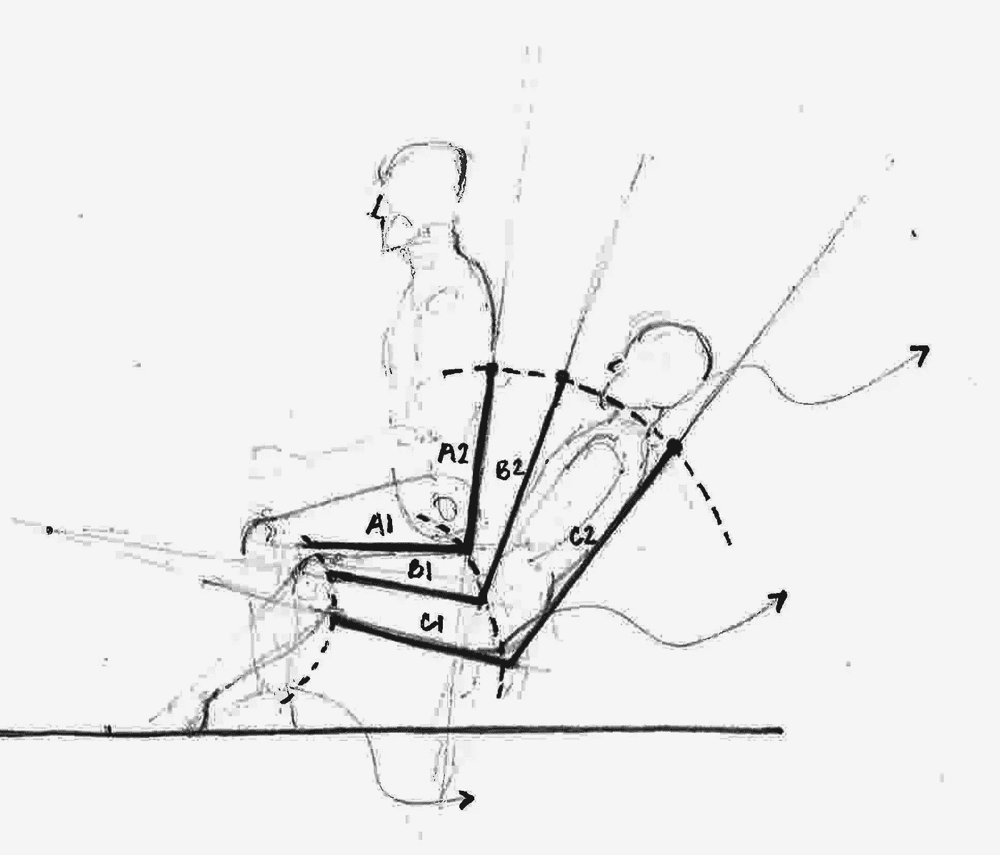
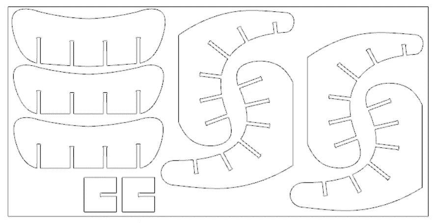

# 利用基因信息设计家具

> 原文：<https://medium.com/hackernoon/using-genetic-information-to-design-furniture-4f7e1105c2f>

这篇文章记录了一个脚本的设计逻辑，这个脚本使用一个人的基因信息来创建为他定制的家具设计。

它是 Genomelink 黑客马拉松的一部分。点击阅读更多关于[的内容。](https://genomelink2.devpost.com/?ref_content=default&ref_feature=challenge&ref_medium=discover)

[演示](https://o-lap.org/app.html?a=amitlzkpa&r=o-lap_mendel)

该设计是一个脚本，接受用户的输入，并使用内部算法来创建矢量图，这些矢量图可用于从胶合板进行设计。装配式零件相互互锁，易于组装。

Sample of other designs made using this technique.

你可以在这里阅读更多关于制造过程的信息[。](https://github.com/O-LAP/home/blob/master/faq.md#what-is-slicing)

设计过程从设定期望输出的粗略框架开始，了解导致期望设计的变量，并根据这些期望变量调整用户的输入。

Identifying the parametric components.

上面的草图显示了一把椅子的侧面比例。每条线代表一个表面，它为坐着的身体提供支撑或缓冲。这些线条的大小对应于人体的各个部位。

确定这些参数后，我们可以尝试根据这些参数来描述椅子的设计。对于这个演示，我们基于对人体解剖学的简单研究。

Relating the human proportions to the above parameters.

上面的草图显示了快速研究及其作为设计参数的解释。

总而言之，它将线条的布局和比例折叠成草图中标记为`x`和`p`的两个变量。`x`对应于设计中人的“身高”，而`p`对应于一个名为“个性”的抽象因素。

对于用户，我们给出了由他们提供的 3 个输入变量— `age`、`comfort`和`genome_id`。这三者都用于计算设计的身高(`x`)和个性(`p`)。`genome_id`用于获取人的基因信息。演示使用由 [geomelink.io](https://www.genomelink.io/) 提供的服务和信息。他们在其网站上提供了额外的基因数据分析。

Additional information provided by [genome.io](https://genome.io)

设计脚本使用该信息以及用户提供的年龄和舒适度来设置 3d 向量空间中的准则。它翻译了上述台词，但根据人的年龄、舒适度偏好和基因信息进行了定制。

年龄参数调节座椅高度和宽度。舒适度影响椅子的直立或放松程度。遗传信息以更好的方式改变设计中的某些比例，根据相关的遗传特征进行调整。考虑以下遗传特征。

*   咖啡因消费
*   白天过度嗜睡
*   工作相关的疲惫
*   身体脂肪量
*   体脂百分比
*   身体质量指数
*   重量
*   高度

调整指导线，然后通过在它们之间创建 [NURBs](https://en.wikipedia.org/wiki/Non-uniform_rational_B-spline) 曲面来相互连接。这是通过操作指南的[控制点](https://en.wikipedia.org/wiki/Control_point_(mathematics))来实现的。

 [## amitlzkpa/孟德尔

### GitHub 是人们构建软件的地方。超过 2800 万人使用 GitHub 来发现、分享和贡献超过…

github.com](https://github.com/amitlzkpa/mendel) 

然后将生成的设计切片，以创建制造图，如下所示。

制造图可以被输入到 CNC 机器中来制造椅子。

*非常感谢 Narhari Banavlikar 的草图。*