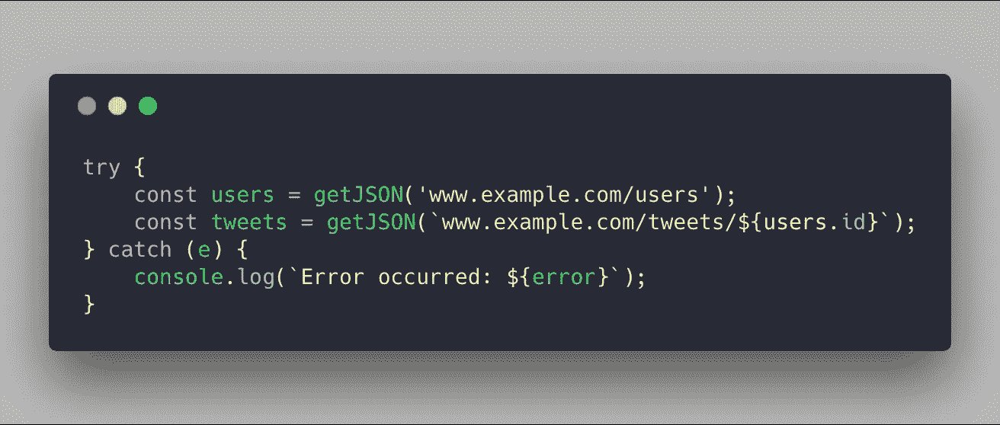

# JavaScript 生成器和承诺的隐藏力量

> 原文：<https://medium.com/hackernoon/using-javascript-generator-and-promises-77d7dc977>

Photo by [Taton Moïse](https://unsplash.com/photos/EhOCnW4wnuQ?utm_source=unsplash&utm_medium=referral&utm_content=creditCopyText) on [Unsplash](https://unsplash.com/search/photos/factory?utm_source=unsplash&utm_medium=referral&utm_content=creditCopyText)

想象一下，你正在你的程序中做一个异步请求，你的任务是在你的服务器中获取一些数据。

您的代码可能如下所示。

这里没有什么特别的，我们使用一个 **getJSON()** 方法在服务器中获取一个[数据](https://hackernoon.com/tagged/data)。

但是我们的代码中有一个大问题。当我们向服务器发送请求时，我们阻塞了 **UI 线程**，我们的页面没有响应，我们不想让我们的用户经历这种情况。

现在 [Javascript](https://hackernoon.com/tagged/javascript) **回调**来救场。

我们重写了代码，看起来像这样，没有阻塞 **UI 线程**。

现在，当我们重写我们的代码时，你会注意到它变得混乱，而且如果我们向这个链接方法添加更多的请求，我们的代码会产生一个 [***回调地狱***](http://callbackhell.com/) 或请求金字塔。

我们如何修复这个代码？使用 ES6 **发生器功能** s 和**承诺**。

根据[*MDN*](https://developer.mozilla.org/en-US/docs/Web/JavaScript/Reference/Statements/function*)*发电机是*

> *“生成器是可以退出并在以后重新进入的功能。它们的上下文(变量绑定)将在重入时被保存。”*

*现在，在开始我们的目标之前，让我们先讨论一下生成器函数是如何工作的。*

*请看这个例子:*

**

*使用**函数**关键字末尾的**星号(*)** 字符定义**生成器函数**。我们使用 **yield** 关键字返回生成器主体内部的一个值，在我们的例子中我们返回两个值" **Hello Generators** 和" **Hello again Generators** "。因此，每当生成器函数在其主体中看到 yield 关键字时，它就会暂停函数的执行。*

*如果我们调用发生器函数**const foo Generator = foo()**；它将创建一个迭代器对象，该对象具有属性 **next()** 和 **throw()。***

*我们使用 **next()** 关键字在生成器主体中执行生成的值。每次我们调用 next 方法时，它都会暂停函数的执行，并返回第一个产生的值(在我们的例子中是**const result = foo generator . next())；**它将返回一个对象文字(例如:**值**和**完成)**。在我们的示例中，我们使用**console . log(` result:$ { result . value } `)**显示第一个生成的值；如果我们检查 **done** 属性，它将设置为 false，因为如果我们再次调用**const result 1 = foo generator . next()，我们的生成器函数将多一个生成值；**相同的执行过程重复了 done 被设置为 false，因为如果我们在第三次**const result 2 = foo generator . next()中再次调用 **next()** 方法，我们的生成器会看到我们在它们的主体中有另一个生成的值；**完成被设置为真，值将显示为未定义，这是因为在我们的生成器主体中没有更多的生成值。*

*现在你看到了生成器函数的基本例子，让我们用 Promise 来使用它，并重构上面的代码，这使得回调变得很糟糕。*

******

*现在你可以看到我们的代码变得比前一个更优雅了。*

*使用 Generator 和 Promises 将带给我们更优雅的代码，并促进关注点的分离。*

*希望有帮助！ˆ_ˆ*

*在推特上关注我[【https://twitter.com/llaudevc】](https://twitter.com/llaudevc)*