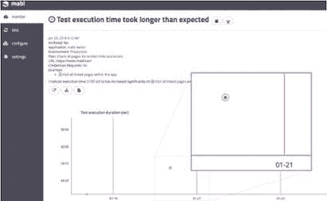
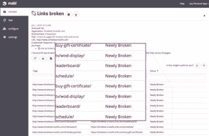
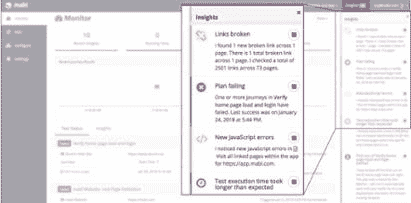
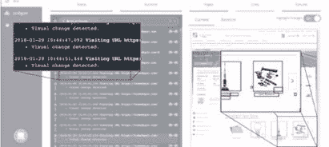

# 使用机器智能获得更清晰的回归测试洞察力

> 原文：<https://medium.com/hackernoon/using-machine-intelligence-for-clearer-regression-testing-insights-b523607fdcb8>

> 这个故事是由 Hacker Noon 的每周赞助商 [mabl](https://goo.gl/cH7C8G) 带给你的。ML 驱动的测试自动化。 [mabl](https://goo.gl/cH7C8G) ，使用机器智能使测试变得容易

[回归测试](http://www.softwaretestinghelp.com/regression-testing-tools-and-methods/)帮助开发团队验证当他们修复错误或添加新功能时，他们产品的现有功能仍然有效。通常，这些测试是作为持续集成(CI)过程的一部分开始的，这样工程师就可以根据他们的新提交很快知道是否有任何问题发生。希望不会，但肯定会发生。

考虑到包括微服务在内的新应用架构，其中单个服务被解耦为小的单个组件，回归测试变得更加重要，因为单元测试很少能捕捉到跨一个或多个微服务运行的新特性的代码依赖关系。

然而，回归测试很难。一些最大的挑战是:

*   通过/失败比较相对简单，但是比较性能特征的回归是困难的
*   跟踪、分析和比较您想要对其运行回归的测试的历史结果可能需要大量的工作
*   一旦回归被识别，寻找原因需要花费大量的时间

这些类型的挑战正是机器学习的目的，也是为什么 [**mabl**](https://goo.gl/cH7C8G) 使用机器学习来帮助工程团队进行回归测试。由于 mabl 正在测试应用程序，她还收集了大量数据，这些数据通常不会由人工测试人员或其他工具记录——测试运行时间、页面加载时间、显示应用程序中视觉变化的屏幕截图等。这些数据反过来训练几种不同类型的机器学习模型，这些模型用于在事情发生变化时通知团队——无论是好的还是坏的。要么是某样东西曾经工作过，但现在不行了，要么是某样东西坏了，现在修好了。让我们来看看。

这是一个例子，mabl 在一个特定的[旅程](https://help.mabl.com/docs/glossary#section-journey)中发现了测试执行时间的回归。具体来说，你可以看到 mabl 强调 1 月 20 日这段旅程的运行明显快于之前的运行。

mabl 可以自动检测的另一种回归类型是当应用程序或网站中引入了断开的链接时。 [**mabl**](https://app.mabl.com) 将识别并突出显示哪个页面和哪个链接被破坏，为您提供洞察力(当 mabl 为您破译测试结果时我们称之为它)，并让您知道它们何时被修复。

这些只是 mabl 检测回归时您将看到的许多细节示例中的两个。对于更高层次的视图，mabl 还在右侧导航上提供了一个 Insights feed，以便您可以跟踪 mabl 检测到的每个新的回归。如果你不在 mabl 应用中闲逛，这些见解也会被发送到 Slack。

mabl 根据我们不断收集的用户反馈，不断增加新的自动回归。最新的回归之一是视觉差异。由于 mabl 会捕捉每个旅程的每一步的截图，机器学习模型可以自动比较这些截图，以检测视觉变化，她会让你知道在页面上的哪个位置检测到了变化。

通过使用机器学习，mabl 试图让软件团队更容易进行回归测试，而不是强迫他们梳理测试历史，分析测试结果，或手动测试他们的应用程序。

[**在你的应用中试试**](https://app.mabl.com)——https://app.mabl.com

> 这是黑客正午的每周赞助商 mabl 为您带来的故事。ML 驱动的测试自动化。mabl 使用机器智能使测试变得容易
> 
> 最初发表于 www.mabl.com。