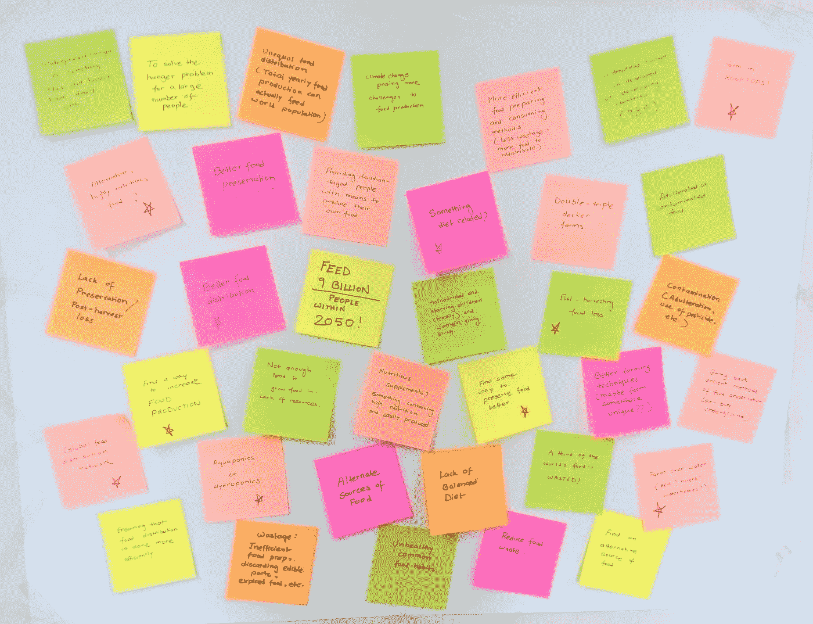
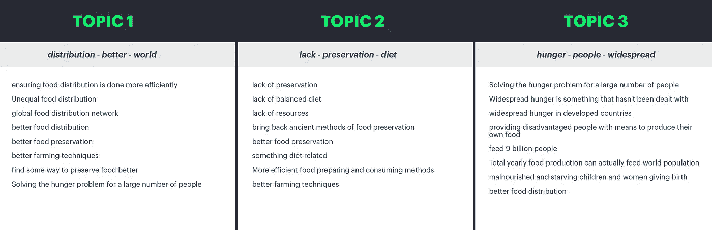
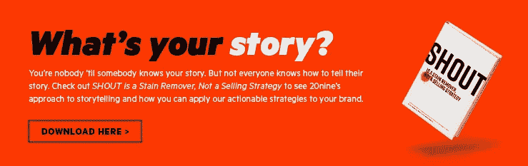

# 在创意过程中使用机器学习

> 原文：<https://medium.com/hackernoon/using-machine-learning-in-the-creative-process-6d71c2d21fe8>

如果你曾经参加过头脑风暴会议，你可能在一个房间里，有一面墙看起来像上面的图片。通常，会话以某种提示或问题陈述开始。团队将在预定的时间框架内写下尽可能多的想法/想法，并最终将它们挂在墙上。退一步说，模式开始出现，便利贴可以开始聚集成主题阵营，从混乱的随机想法中创造秩序。

我最近参加了一个类似这样的构思会议，目标是为一家公司创建一个品牌平台。这个创造性的练习激发了我以程序化的方式思考我们正在做的事情。我的想法是，有计算方法能够组织和解释我们提出的想法。具体来说，聚类是我在研究[机器学习](https://hackernoon.com/tagged/machine-learning)算法时经常遇到的一种分析。也许有一种方法可以利用聚类来找到我们想法中可能已经错过的主题，也许我们可以使用机器学习来发现它们。

# **话题建模**

理解数据是找出最佳解决方案的重要的第一步。有各种各样的算法，在特定的任务中，有些算法比其他算法更好。一些算法甚至可以更好地处理特别小或特别大的数据集。我正在处理的内容类型是单句或简短的想法，类似于一组推文。我还从关于如何对数据进行聚类的零假设开始，让算法在不提供训练数据集的情况下做出自己的结论。

主题建模是一种统计模型，用于发现非结构化文档集合中隐藏的语义模式。这正是我所寻找的，能够解析和理解看似随机的想法。它也是无人监管的，因为它不需要训练数据。我探索了两种主题建模算法:*潜在狄利克雷分配(LDA)* 和*非负矩阵分解(NMF)。*

在不深入这些算法背后的数学的情况下，LDA 是一个概率模型，因为它计算在对主题进行采样时选择单词的概率和在对文档进行采样时选择主题的概率。在这种情况下，“文档”是一个单独的便笺条。对每个便笺条上的所有单词重复这一过程，然后对整个集合重复这一过程。相反，NMF 依赖于线性代数，并且是一种确定性算法，该算法实现了便笺集合的单一表示。

即使这两种算法都是无人监管的，它们仍然需要我们事先确定我们想要分类多少主题。根据我的经验，我已经能够调整这个数字并测试数据以获得最佳结果。此外，LDA 和 NMF 都采用“单词袋”模型作为输入。在这篇文章中，我们将使用 NMF 作为我们的算法，因为我发现它在我们较小的数据集上效果最好。因此，每个便笺被表示为矩阵中的一行，每列包含一个单词对整个集合的重要性的表示。

要为我们的矩阵创建单词包并获得重要性的表示，我们可以使用 TF-IDF 利用 python 的 Scikit Learn 文本提取库。TF-IDF 是一种算法，它对一个术语的频率*(一个术语出现在一个粘滞便笺中的次数除以粘滞便笺中的术语总数)*和它的逆文档频率 *(log(粘滞便笺总数/粘滞便笺中有该术语的数量))*。

> **考虑一张包含 10 个单词的便笺，其中单词“hungry”出现了两次。**
> 
> “饥饿”一词的频率(tf)是 TF = (2 / 10) = 0.2。
> 
> 假设我们有 1000 张便笺，其中 10 张出现了“饥饿”这个词。然后，逆文档频率(idf)被计算为 IDF = log(1000 / 10) = 2。
> 
> Tf-idf 重量是这些量的乘积 TF-IDF = 0.2 * 2 = 0.4。

NMF 采用这个矩阵，并生成代表同现词加权集合的一定数量的主题。这些发现的主题形成了一个基础，它将提供原始便笺的表示。

# 建设它

为了这篇文章的目的，我偶然发现了一个关于结束世界饥饿的头脑风暴会议的便签小集锦。通常会有更多的数据要使用，但我将用它来说明算法是如何工作的。

[http://labs.tffchallenge.com/posts/photo/detail/1337/](http://labs.tffchallenge.com/posts/photo/detail/1337/)

我将所有这些便笺添加到一个 CSV 文件中，并冒昧地分离出一些可能有两个或更多想法的句子。

导入 CSV 并创建一系列想法后，我们需要首先用 TF-IDF 对便笺进行矢量化。使用 Scikit Learn，我们还可以过滤掉停用词*(常用词，如“the”)*，并根据它们出现的多少来挑选出要过滤掉的词。然后，我们可以设置 NMF 来包含我们想要的主题数量。接下来，我们可以生成由 NMF 函数生成的两个低级矩阵。矩阵 W 是关于每个生成的主题的每个便笺的分数的表示，而矩阵 H 是主要术语的列表以及关于它们与每个生成的主题相关程度的分数。

**下面是这个过程的基本代码实现:**

**这是我们生成的 3 个主题的输出:**

# 结论

因为我们使用了如此少量的便笺，所以很难根据上面的输出从这种方法中得出任何结论，但是我已经成功地从公司的头脑风暴会议中产生了主题，其中有超过 150 个带有特定解决方案和想法的便笺。如果你对如何改进我上面提到的方法有任何想法，请随时联系我们！发微博给我@joezeoli 或查看 20 线[**https://www.20nine.com**](https://www.20nine.com)

