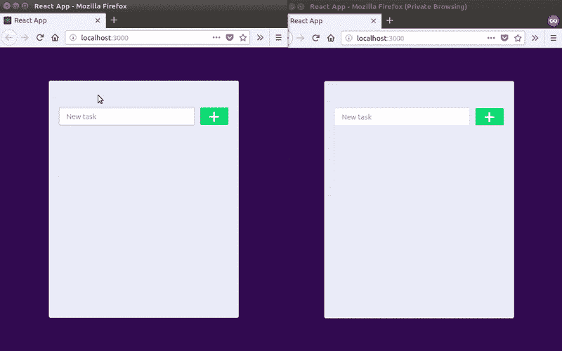
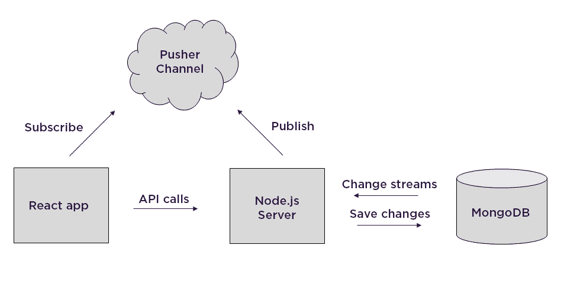
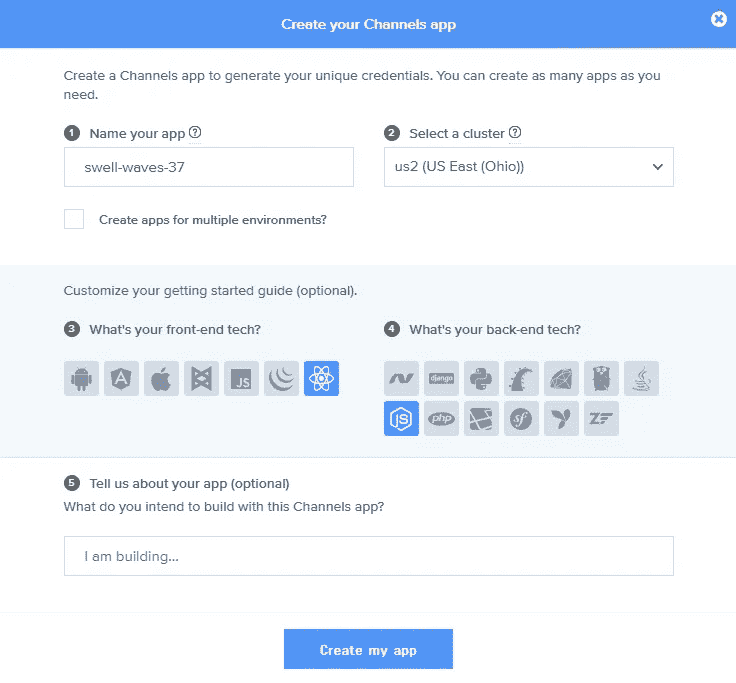
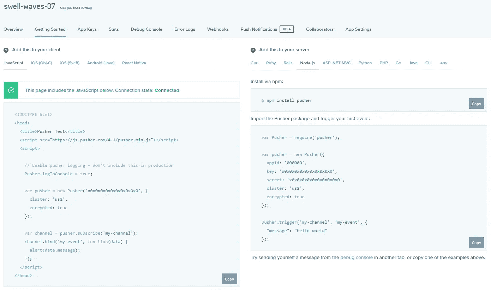
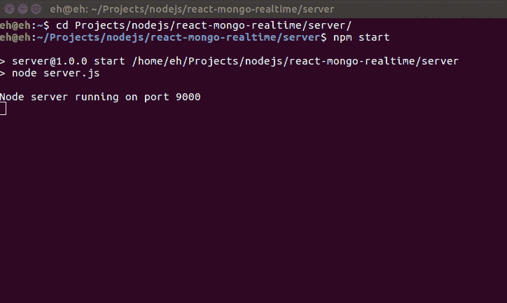
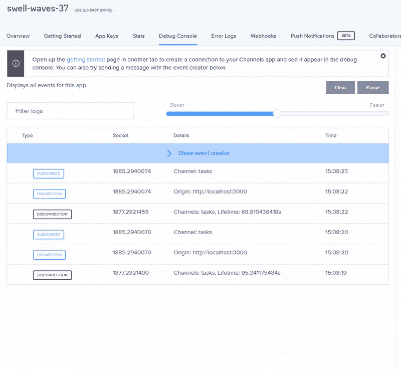

# 使用 MongoDB 作为包含变更流的实时数据库

> 原文：<https://medium.com/hackernoon/using-mongodb-as-a-realtime-database-with-change-streams-213cba1dfc2a>

> 本文原载于 [Pusher 的博客](https://pusher.com/tutorials/mongodb-change-streams)。
> 
> 我们的每周赞助商 [**Pusher**](http://bit.ly/2lCXscm) ，在易于集成的 web、移动和最受欢迎的后端堆栈 SDK 的支持下，开发通信和协作 API，为世界各地的应用提供支持。 [**入门。**](http://bit.ly/2lCXscm)

从数据库中实时获取数据变化并不像您想象的那么简单。

[在之前的教程](https://pusher.com/tutorials/realtime-mysql-java)中，我提到有三种主要方法可以做到这一点:

*   每隔 X 秒轮询一次数据库，并使用时间戳、版本号或状态字段确定是否发生了变化。
*   当发生变化时，使用数据库或应用程序级触发器来执行一段代码。
*   使用数据库事务/复制日志，它记录数据库的每次更改。

然而，在 MongoDB 中， [change streams](https://docs.mongodb.com/manual/changeStreams/) 允许您在没有任何复杂性的情况下监听集合中的变化。

更改流从 MongoDB 3.6 开始可用，它们通过读取[操作日志](https://docs.mongodb.com/manual/reference/glossary/#term-oplog)来工作，这是一个有上限的集合，其中写入了对数据的所有更改，并充当数据库复制日志。

在本教程中，您将学习如何使用 Node.js 服务器将 MongoDB 数据库中的集合更改实时传输到 React 应用程序。

您将要构建的应用程序允许您添加和删除任务。看起来是这样的:



在幕后，它与 Node.js 中实现的 API 进行通信，将更改保存到数据库中。Node.js 脚本也使用更改流接收这些更改，解析它们并将其发布到 Pusher 通道，以便 React 应用程序可以使用它们。

下图描述了上述过程:



当然，多个应用程序写入同一个数据库的场景可能更现实，但是出于学习的目的，我将使用一个简单的应用程序。

此外，您将看到像这样的解决方案如何成为 Firebase 实时数据库功能的良好替代方案。

# 先决条件

按照本教程，您需要安装以下内容:

*   MongoDB(3.6 版或更高版本)
*   [Node.js](https://nodejs.org/en/download/) (6 或以上)
*   可选地，JavaScript 编辑器。

你需要了解:

*   JavaScript(中级)，特别是 Node.js 和 React。
*   基本 MongoDB 管理任务

作为参考，[这里有一个 GitHub 库](https://github.com/eh3rrera/realtime-mongodb-pusher)，包含本教程中显示的所有代码和运行它的指令。

现在让我们从创建一个 Pusher 应用程序开始。

# 创建推送应用程序

如果你还没有，在[按钮](https://pusher.com/)创建一个免费账户。

然后，转到您的[仪表板](https://dashboard.pusher.com/)并创建一个 Channels 应用程序，选择一个名称、离您位置最近的集群，并且可选地，React 作为前端技术，Node.js 作为后端技术:



这将为您提供一些开始使用的示例代码:



保存你的应用 id、密钥、密码和聚类值。我们以后会需要它们。

# 配置 MongoDB

因为变更流使用 MongoDB 的操作日志，并且操作日志用于支持该数据库的复制特性，所以您只能使用带有[副本集](https://docs.mongodb.com/manual/replication/)或[分片集群](https://docs.mongodb.com/manual/sharding/)的变更流。

使用副本集更容易，所以我们走那条路。

副本集是一组维护相同数据集的`mongod`进程。但是，您可以只使用一台服务器创建副本集，只需执行以下命令:

```
mongod --replSet "rs"
```

请记住，如果您不使用默认数据目录(`/data/db`或`c:\data\db`)，请使用`--dbpath`选项指定数据目录的路径:

```
mongod --dbpath <DATA_PATH> --replSet "rs"
```

接下来，在一个单独的终端窗口中，运行 MongoDB 客户端`mongo`。

如果这是您第一次创建副本集，执行`rs.initiate()`:

```
eh@eh:~/Documents/mongodb-linux-x86_64-3.6.4$ bin/mongo
MongoDB shell version v3.6.4
connecting to: mongodb://127.0.0.1:27017
MongoDB server version: 3.6.4
...
> rs.initiate()
{
    "info2" : "no configuration specified. Using a default configuration for the set",
    "me" : "localhost:27017",
    "ok" : 1,
    "operationTime" : Timestamp(1527258648, 1),
    "$clusterTime" : {
        "clusterTime" : Timestamp(1527258648, 1),
        "signature" : {
            "hash" : BinData(0,"AAAAAAAAAAAAAAAAAAAAAAAAAAA="),
            "keyId" : NumberLong(0)
        }
    }
}
rs:OTHER>
```

应用程序将在名为`tasksDb`的数据库中观察集合`tasks`。

通常，数据库和集合是由 MongoDB 驱动程序在应用程序对它们执行第一个操作时创建的，但是对于变更流，它们必须在打开流之前存在。

因此，当您在`mongo`时，使用命令`use`和`db.createCollection`创建数据库和集合，如下所示:

```
rs:OTHER> use tasksDb
switched to db tasksDb
rs:OTHER> db.createCollection('tasks')
{
    "ok" : 1,
    "operationTime" : Timestamp(1527266976, 1),
    "$clusterTime" : {
        "clusterTime" : Timestamp(1527266976, 1),
        "signature" : {
          "hash" : BinData(0,"AAAAAAAAAAAAAAAAAAAAAAAAAAA="),
          "keyId" : NumberLong(0)
        }
    }
}
rs:OTHER>
```

现在您已经准备好开始构建应用程序了。

让我们从 Node.js 服务器开始。

# 构建 Node.js 服务器

创建一个新目录，并在终端窗口中，在该目录中使用以下命令初始化 Node.js 项目:

```
npm init -y
```

接下来，安装应用程序将要使用的依赖项:

```
npm install --save body-parser express mongoose pusher
```

*   [body-parser](https://github.com/expressjs/body-parser) 是一个中间件，用于解析请求的主体。
*   [express](https://github.com/expressjs/express) 为 React 应用将要使用的 REST API 创建 web 服务器。
*   [mongose](http://mongoosejs.com/)是一个基于模式的库，用于使用 MongoDB。
*   [推送器](https://pusher.com/)实时发布数据库变化。

现在，我们要做的第一件事是为任务集合创建一个模式。创建文件`models/task.js`并复制以下代码:

```
const mongoose = require('mongoose');  
const Schema   = mongoose.Schema;

const taskSchema = new Schema({ 
  task: { type: String },
});

module.exports = mongoose.model('Task', taskSchema);
```

如您所见，该集合只将任务存储为文本。

接下来，创建文件`routes/api.js`并需要任务模式和 Express 来创建路由器:

```
const Task  = require('../models/task');
const express = require('express');
const router = express.Router();
```

使用`/new`路径创建一个`POST`端点来保存任务:

```
router.post('/new', (req, res) => {
    Task.create({
        task: req.body.task,
    }, (err, task) => {
        if (err) {
          console.log('CREATE Error: ' + err);
          res.status(500).send('Error');
        } else {
          res.status(200).json(task);
        }
    });
});
```

另一个用来删除任务，使用一个`DELETE`方法传递任务的 ID:

```
router.route('/:id')
    */* DELETE */*
    .delete((req, res) => {
        Task.findById(req.params.id, (err, task) => {
          if (err) { 
            console.log('DELETE Error: ' + err);
            res.status(500).send('Error');
          } else if (task) {
            task.remove( () => {
              res.status(200).json(task);
            });
          } else {
            res.status(404).send('Not found');
          }
        });
    });

module.exports = router;
```

现在，在根目录中，创建文件`server.js`并需要以下模块:

```
const express = require('express');
const bodyParser = require('body-parser');
const mongoose = require('mongoose');
const api = require('./routes/api');
const Pusher = require('pusher');
```

输入您的应用程序信息，配置推送器对象:

```
const pusher = new Pusher({
  appId      : '<INSERT_APP_ID>',
  key        : '<INSERT_APP_KEY>',
  secret     : '<INSERT_APP_SECRET>',
  cluster    : '<INSERT_APP_CLUSTER>',
  encrypted  : true,
});
const channel = 'tasks';
```

用 CORS 头(因为 React 应用程序将在不同的端口发布)、JSON 请求和作为路径的`/api`配置一个 Express 服务器:

```
const app = express();

app.use((req, res, next) => {
  res.header("Access-Control-Allow-Origin", "*");
  res.header("Access-Control-Allow-Headers", "Origin, X-Requested-With, Content-Type, Accept");
  res.header("Access-Control-Allow-Methods", "GET, POST, PUT, DELETE, OPTIONS");
  next();
});

app.use(bodyParser.json());
app.use(bodyParser.urlencoded({ extended: true }));
app.use('/api', api);
```

这样，您就可以通过之前配置的副本集的名称连接到数据库:

```
mongoose.connect('mongodb://localhost/tasksDb?replicaSet=rs');
```

并设置两个回调，一个用于连接错误，另一个用于连接成功时:

```
const db = mongoose.connection;

db.on('error', console.error.bind(console, 'Connection Error:'));

db.once('open', () => {

});
```

如果连接成功，让我们开始监听端口 9000 上的连接，并观察`tasks`集合上的变化:

```
db.once('open', () => {
  app.listen(9000, () => {
    console.log('Node server running on port 9000');
  });

  const taskCollection = db.collection('tasks');
  const changeStream = taskCollection.watch();

  changeStream.on('change', (change) => {

  });
});
```

有趣的部分来了。

当集合中有更改时，会收到一个更改事件。特别是，支持以下更改:

*   插入
*   更新
*   替换
*   删除
*   使无效

下面是一个插入事件的示例:

```
{
  _id: 
  {
    _data: Binary {
      _bsontype: 'Binary',
      sub_type: 0,
      position: 49,
      buffer: <Buffer 82 5b 08 8a 2a 00 00 00 01 46 64 5f 69 64 00 64 5b 08 8a 2a 99 a1 c5 0d 65 f4 c4 4f 00 5a 10 04 13 79 9a 22 35 5b 45 76 ba 45 6a f0 69 81 60 af 04> 
    }
  },
  operationType: 'insert',
  fullDocument: { 
    _id: 5b088a2a99a1c50d65f4c44f, 
    task: 'my task', 
    __v: 0
  },
  ns: { db: 'tasksDb', coll: 'tasks' },
  documentKey: { _id: 5b088a2a99a1c50d65f4c44f } 
}
```

您可以使用`_id`属性来[恢复一个变更流](https://docs.mongodb.com/manual/changeStreams/#resume-a-change-stream)，换句话说，开始从该属性所表示的操作中接收事件。

下面是一个删除事件的示例:

```
{ 
  _id: 
  { 
    _data: Binary {
      _bsontype: 'Binary',
      sub_type: 0,
      position: 49,
      buffer: <Buffer 82 5b 08 8b f6 00 00 00 01 46 64 5f 69 64 00 64 5b 08 8a 2a 99 a1 c5 0d 65 f4 c4 4f 00 5a 10 04 13 79 9a 22 35 5b 45 76 ba 45 6a f0 69 81 60 af 04> 
    }
  },
  operationType: 'delete',
  ns: { db: 'tasksDb', coll: 'tasks' },
  documentKey: { _id: 5b088a2a99a1c50d65f4c44f }
}
```

注意，在这种情况下，被删除的对象没有被返回，只有它在`documentKey`属性中的 ID。

你可以在这里了解更多关于这些[变化事件的信息。](https://docs.mongodb.com/manual/reference/change-events/)

有了这些信息，回到`server.js`，您可以从对象中提取相关数据，并通过以下方式将其发布给 Pusher:

```
changeStream.on('change', (change) => {
    console.log(change); if(change.operationType === 'insert') {
      const task = change.fullDocument;
      pusher.trigger(
        channel,
        'inserted', 
        {
          id: task._id,
          task: task.task,
        }
      ); 
    } else if(change.operationType === 'delete') {
      pusher.trigger(
        channel,
        'deleted', 
        change.documentKey._id
      );
    }
});
```

这是服务器的代码。现在让我们构建 React 应用程序。

# 构建 React 应用程序

让我们使用 [create-react-app](https://github.com/facebook/create-react-app) 来引导一个 react 应用。

在另一个目录中，在终端窗口中执行以下命令来创建新的应用程序:

```
npx create-react-app my-app
```

现在进入 app 目录，用`npm`安装所有 Pusher 依赖项:

```
cd my-app
npm install --save pusher-js
```

打开文件`src/App.css`，用下面的 CSS 样式替换它的内容:

```
*{
  box-sizing: border-box;
}body {
  font-size: 15px;
  font-family: 'Open Sans', sans-serif;
  color: #444;
  background-color: #300d4f;
  padding: 50px 20px;
  margin: 0;
  min-height: 100vh;
  position: relative;
}.todo-wrapper {
  width: 400px;
  max-width: 100%;
  min-height: 500px;
  margin: 20px auto 40px;
  border: 1px solid #eee;
  border-radius: 4px;
  padding: 40px 20px;
  -webkit-box-shadow: 0 0 15px 0 rgba(0,0,0,0.05);
  box-shadow: 0 0 15px 0 rgba(0,0,0,0.05);
  background-color: #e9edf6;
  overflow: hidden;
  position: relative;
}form {
  overflow: overlay;
}.btn, input {
  line-height: 2em;
  border-radius: 3px;
  border: 0;
  display: inline-block;
  margin: 15px 0;
  padding: 0.2em 1em;
  font-size: 1em;
}input[type='text'] {
  border: 1px solid #ddd; 
  min-width: 80%;
}input:focus {
  outline: none;
  border: 1px solid #a3b1ff;
}.btn {
  text-align: center;
  font-weight: bold; 
  cursor: pointer;
  border-width: 1px;
  border-style: solid;
}.btn-add {
  background: #00de72;
  color: #fefefe;
  min-width: 17%;
  font-size: 2.2em;
  line-height: 0.5em;
  padding: 0.3em 0.3em;
  float: right;
}ul {
  list-style: none;
  padding: 0;
}li {
    display: flex;
    justify-content: space-between;
    align-items: center;
    margin-bottom: 5px;
    background-color: #dee2eb;
}.text {
  padding: 0.7em;
}.delete {
  padding: 0.3em 0.7em;
  min-width: 17%;
  background: #f56468;
  color: white;
  font-weight: bold;
  cursor: pointer;
  font-size: 2.2em;
  line-height: 0.5em;
}
```

接下来，打开文件`src/App.js`，在顶部，导入推动器库:

```
import Pusher from 'pusher-js';
```

为 API URL 定义一个常数:

```
const API_URL = 'http://localhost:9000/api/';
```

在类的构造函数中，将任务的数组和任务文本的属性定义为状态，并绑定方法以更新文本以及添加和删除任务:

```
class App extends Component {
    constructor(props) {
    super(props);
    this.state = {
      tasks: [],
      task: ''
    };
    this.updateText = this.updateText.bind(this);
    this.postTask = this.postTask.bind(this);
    this.deleteTask = this.deleteTask.bind(this);
    this.addTask = this.addTask.bind(this);
    this.removeTask = this.removeTask.bind(this);
  }
  ...
}
```

让我们回顾一下每种方法。将它们添加在构造函数之后，在`render()`方法之前。

`updateText`方法将在每次任务的输入文本改变时更新状态:

```
updateText(e) {
    this.setState({ task: e.target.value });
}
```

`postTask`方法将用户输入的任务发布到 API:

```
postTask(e) {
    e.preventDefault();
    if (!this.state.task.length) {
      return;
    }
    const newTask = {
      task: this.state.task
    };
    fetch(API_URL + 'new', {
      method: 'post',
      headers: {
        'Content-Type': 'application/json'
      },
      body: JSON.stringify(newTask)
    }).then(console.log);
}
```

方法`deleteTask`将调用 API 来删除使用其 ID 的任务:

```
deleteTask(id) {
    fetch(API_URL + id, {
      method: 'delete'
    }).then(console.log);
}
```

另一方面，您还需要从状态中添加和删除任务的方法，以便更改可以反映在 UI 中。这就是方法`addTask`和`removeTask`的工作:

```
addTask(newTask) {
    this.setState(prevState => ({
      tasks: prevState.tasks.concat(newTask),
      task: ''
    }));
}removeTask(id) {
    this.setState(prevState => ({
      tasks: prevState.tasks.filter(el => el.id !== id)
    }));
}
```

当收到来自 Pusher 的相应事件时，app 将调用这些方法。

您可以设置 Pusher 并将这些方法绑定到方法`componentDidMount`中的`inserted`和`deleted`事件，输入您的 Pusher app 密钥和集群:

```
componentDidMount() {
 this.pusher = new Pusher('<INSERT_APP_KEY>', {
     cluster: '<INSERT_APP_CLUSTER>',
     encrypted: true,
 });
 this.channel = this.pusher.subscribe('tasks'); this.channel.bind('inserted', this.addTask);
 this.channel.bind('deleted', this.removeTask);
}
```

通过这种方式，`render`方法只是使用一个`Task`组件和一个输入新任务的表单来呈现状态中的任务。

用以下方法替换`render()`方法:

```
render() {
    let tasks = this.state.tasks.map(item =>
        <Task key={item.id} task={item} onTaskClick={this.deleteTask} />
    );     return (
        <div className="todo-wrapper">
            <form>
              <input type="text" className="input-todo" placeholder="New task" onChange={this.updateText} value={this.state.task} />
              <div className="btn btn-add" onClick={this.postTask}>+</div>
            </form> <ul>
              {tasks}
            </ul>
        </div>
    );
}
```

和`Task`组件的代码(可以放在`App`类之后):

```
class Task extends Component {
    constructor(props) {
      super(props);
      this._onClick = this._onClick.bind(this);
    }
    _onClick() {
      this.props.onTaskClick(this.props.task.id);
    }
    render() {
      return (
        <li key={this.props.task.id}>
          <div className="text">{this.props.task.task}</div>
          <div className="delete" onClick={this._onClick}>-</div>
        </li>
      );
    }
}
```

仅此而已。让我们测试完整的应用程序。

# 测试应用程序

确保 MongoDB 数据库在服务器上配置了副本集的情况下运行:

```
mongod --dbpath <DATA_PATH> --replSet "rs"
```

在终端窗口中，转到 Node.js 服务器所在的目录并执行:

```
node server.js
```

对于 React 应用程序，在应用程序目录中，执行:

```
npm start
```

将会打开一个浏览器窗口 [http://localhost:3000/](http://localhost:3000/) ，从这里，您可以开始输入和删除任务:


您还可以在 Node.js 服务器的输出中看到如何从 MongoDB 接收变更事件:



或者在[推进器的仪表板](https://dashboard.pusher.com/)上，选择你的应用，在调试部分，你会看到消息是如何被接收的:



# 结论

在本教程中，您已经学习了如何在 MongoDB 中持久化数据，并使用变更流和推送通道实时传播变更

这相当于 Firebase 及其实时数据库提供的功能。这样做的好处是，像本教程中介绍的这种解决方案更加灵活，并且给您更多的控制。

从这里开始，应用程序可以以多种方式进行扩展，例如:

*   支持更多集合
*   为任务实现更新功能(例如，状态)并复制此事件。
*   在连接失败后，使用 resume 令牌接收来自最后一个注册的事件。

请记住，在[这个 GitHub 库](https://github.com/eh3rrera/realtime-mongodb-pusher)中，您可以找到 Node.js 服务器和 React 应用程序的代码。

有关变更流的更多信息，这里有一些好的资源:

*   [使用更改流来跟上您的数据](https://www.mongodb.com/presentations/using-change-streams-to-keep-up-with-your-data)
*   [更改流简介](https://www.mongodb.com/blog/post/an-introduction-to-change-streams)
*   [MongoDB 3.6 使用 Node.js 更改流示例](/@thakkaryash94/mongodb-3-6-change-streams-example-with-node-js-2b9a85652c50)
*   [MongoDB 数据变更](/riow/mongodb-data-collection-change-85b63d96ff76)
*   [MongoDB 手册:更改流](https://docs.mongodb.com/manual/changeStreams/)

> 我们的每周赞助商 [**Pusher**](http://bit.ly/2lCXscm) 开发通信和协作 API，为世界各地的应用提供支持，并由易于集成的 web、移动和最受欢迎的后端堆栈 SDK 提供支持。 [**入门。**](http://bit.ly/2lCXscm)