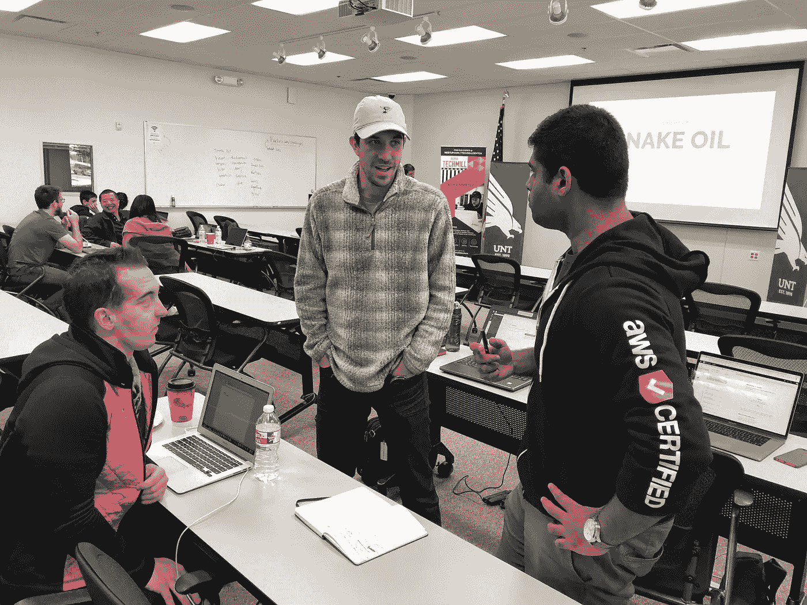

# 使用神经网络实现更安全的道路| HackNTX Recap

> 原文：<https://medium.com/hackernoon/using-neural-networks-for-safer-roads-hackntx-recap-a0279ce64743>

通过社交媒体的小道消息，我听说了德克萨斯州丹顿的一个惊人的事件，叫做 [HackNTX](https://www.hackntx.com/blog) 。我不得不问一些问题来了解什么被黑了。

4 年前，我访问了丹顿，与当地社区就水力压裂的成功进行交流，我总是很谦卑地去那些小社区，那里的人们充满活力，大胆地拥有自己的家园。

我采访了[凯尔·泰勒](https://www.linkedin.com/in/kyletaylored/)，他是 [Techmill](https://techmill.co/) 的社区参与总监，他和我分享了他关于这次活动的故事。

对于那些不想滚动到底部的人来说，王菽一博士是第一个使用 RNN 深度学习模型从 Waze 交通事件报告的开放数据中发现模式的冠军，他的[教程](https://towardsdatascience.com/how-to-predict-severe-traffic-jams-with-python-and-recurrent-neural-networks-e53b6d411e8d)讲述了他从事件中获得的经验和教训。

该模型是为了识别在交通堵塞发生前 30 分钟导致交通堵塞的事件模式而建立的。在用达拉斯沃斯堡 29 天的 Waze 交通数据训练该模型后，结果令人着迷。他们能够以高达 70%的概率根据一种模式预测事故或交通何时发生。

*恭喜王！*

## **你和你的团队是如何了解思域黑客的？**

在丹顿，我们有许多社区成员多年来一直参与或对公民技术和开放数据感兴趣。我们有一些来自当地大学工作人员和市议会的人去参加美国编码会议，了解支持开放政府和数据倡议的新方法。还有像我这样的职业开发人员，他们接触到了开放数据——对我来说，这是达拉斯的另一场开放数据黑客马拉松。

Credit: HackNTX

在志愿组织了那次黑客马拉松，并了解了许多组织参与利用来自一个城市的开放数据来造福达拉斯周围的社区之后，我想把它带回丹顿。我和我的市议员凯文·罗登(Kevin Roden)一起喝了杯酒(他也参加了美国准则会议),讨论了我们现在正在做的事情，以及围绕这一倡议在丹顿开始建立一个社区的好地方。那么，你如何让志同道合的人聚在一起呢？你在委员会成员的家里举办了一次黑客马拉松，并开发了一个帮助人们投票的工具。[这就是我们在 2013 年所做的](https://web.archive.org/web/20160830180255/http://rodenfordenton.com/2013/03/votedenton-org-finding-your-council-district-just-got-easy)。

凯文喜欢把社区聚集在一起，以联谊会的形式为这个城市出主意。作为一个拥有两所主要大学和一所社区大学的大学城，从来不缺少对社区挑战有独特见解的年轻聪明的人。我 2012 年刚从北德克萨斯大学毕业，所以在 2013 年末的 Kevin's mixer 上，我为一个名为 Open Denton 的社区工作组提出了一个想法，该工作组的任务是在 Denton 市倡导和利用公开数据。事实证明，我们的社区中有许多聪明的技术人员已经聊了一段时间，所以在 2014 年，我们成立了一个名为 TechMill 的非营利组织。每个董事会成员都有他们想要关注的独特计划，我的计划是学生参与和开放数据。

还记得我提到的那些大学职员吗？他们中的两个人，杰西和帕特里克，想从[在 UNT](http://www.library.unt.edu/events/open-data-hackathon-unt-0) 举办我们自己的开放数据日活动开始。虽然第一次活动更多的是教育公众关于开放数据的知识，但从那以后我们每年都举办这个活动——每次举办都会增加一点。OpenGov 很有风度地[写了一篇关于我们这些年的系列的小博文](https://opengov.com/article/denton-tx-open-data-day)。Jesse Hamner 和 Abdulrahman Habib(简称 Habib)在过去几年中一直是开放数据日的领导者。

> 我不知道有多少公开可用的数据，等待着有人来理解它。事实上，我们可以将原始数据转化为知识，这有点像魔术。看到其他团队想出的东西，我学到了很多，我很高兴能做得更多。
> 
> - Dan Minshew，HackNTX 参与者

从那时起，我们在开放数据中支持丹顿市的部分工作导致丹顿成为一个由彭博慈善机构和 GovEx 运营的项目。我们帮助收集了关于系统中的数据类型、导出和可访问性的社区，TechMill 因我们的支持被丹顿技术服务部授予[奖项。我们还有一个播客系列，与我提到的一些人一起录制，谈论](https://twitter.com/KevinRoden/status/768805893718708224/photo/1)[开放丹顿和基于开放数据建设智能城市](https://techmill.co/podcast/ep-13-open-denton-building-smart-cities-on-open-data/)。

> 我真的很喜欢黑客马拉松，因为它给了我向有经验的人学习的机会，它向我展示了黑客世界中的无数可能性。
> 
> -赛义夫，HackNTX 参与者，13 岁！

## **你什么时候有举办公民黑客马拉松的想法？**

因此，虽然我们对开放数据或公民技术并不陌生，但开放数据日更像是一个使命驱动的活动，所以我们的下一步是将竞争优势应用于它，并将它变成一场黑客马拉松。我们如何与这样的城市合作:a)这些城市面临的挑战可以通过软件解决，b)可以使用他们自己的开放数据集解决？最初，我们打算将范围限制在丹顿，但希望扩大到更多地区，这就是 HackNTX 的想法。

## 未来的下一步是什么？

对我们来说，下一个直接的活动是 2019 年开放数据日，将于 3 月 2 日举行。自 2015 年以来，我们一直在丹顿举办这项活动，但明年我们还想扩大这项活动。去年在德克萨斯州，我们是两个奇怪事件之一，另一个是在奥斯汀(3 小时路程)。如果我们能够利用过去几年组织这一活动的经验，并将其应用于更大的活动，最终使我们整个地区受益，我会称之为成功。

> 作为一名信息科学学生，参加黑客马拉松帮助我解决了课堂项目。在某些情况下，我更新了我构建的 hackathon 解决方案，并将其提交给我的班级项目。在每一次活动中，我都学到了新的工具，遇到了很多帮助我理解问题并利用我在学校学到的知识参与制定有用的实用解决方案的人。此外，黑客马拉松帮助引导了我的研究兴趣，我发表了第一篇基于我在黑客马拉松活动中开始的工作的 peered reviewed 期刊文章。
> - Abdulrahman Habib，HackNTX 组织者，UNT ASIS & T

## 其他赢家是谁？

第三名是一个名为“喀拉喀托”的项目来自丹顿的 web 开发人员和数据爱好者 Adam Krawiec 采用了一种简单的方法来分析 Waze 流量数据。他将 937，482 条记录导入到 MongoDB 中，并做了一些快速统计，可以为任何城市官员提供洞察力。为了丰富数据，Adam 实现了一些简单的计算，给出了一段走廊的大致距离，按类型显示了交通事故的密度。例如，在 35 W 号州际公路南行约 11 英里的路段上，发生了 237 起轻微交通事故。

第二名是团队默认开放政府(TDOG)。当涉及到打开数据和打开记录请求时，通常会有大量开销用于响应、获取和返回文档。默认情况下，大多数政府记录都是私人存储的，并且在收到请求之前，并不总是按时发布或根本不发布。通过实施更好的工作流程，可以减少或消除这些请求。

TDOG 试图通过在 Amazon Web Services (AWS)上创建一个平台来解决这个问题，该平台利用 DynamoDB、S3 和其他工具来创建一个自动发布时间表，该时间表带有用于发布公共文档的安全令牌。该团队还考虑将这种方法与区块链技术相结合，利用智能合同来发布这些文档。

Credit: HackNTX

## 你还有什么想分享的吗？你感觉如何？

作为一名常规的活动组织者，花时间计划活动后看到活动的结果总是值得的。能够提供一个空间和机会，将经验丰富的技术专业人士(或学者)的经验集中起来，创造出解决实际问题的真正解决方案，这是令人难以置信的。居民希望改善他们自己的社区和生活，我们只需要给他们正确的工具和动力，使一些惊人的！