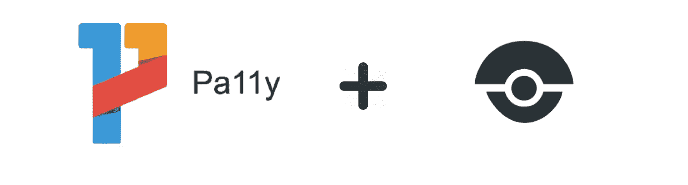
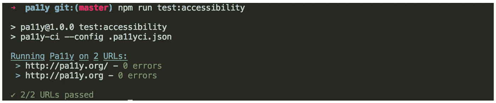
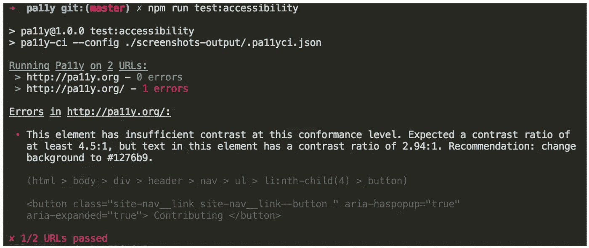

# 使用 Pa11y CI 和 Drone 作为可访问性测试的把关者

> 原文：<https://medium.com/hackernoon/using-pa11y-ci-and-drone-as-accessibility-testing-gatekeepers-a8b5a3415227>



Pa11y and Drone working together

*本文作为设置 Pa11y CI 以运行任何网页的“操作方法”指南，以及如何将其集成到一个* [*无人机*](https://hackernoon.com/tagged/drone) *持续集成管道中，并带有一个* [*示例回购*](https://github.com/dominicfraser/Pa11yCIExamples) *。*

你认为易接近性很重要。你甚至可以遵循诸如[包容性设计](https://www.microsoft.com/design/inclusive/)之类的方法。你知道 WCAG 2.0 或 WAI-ARIA 的指导方针。您已经尝试了手工测试工具(参考资料中列出了示例)。你甚至要确保用真实的用户来测试你的产品，以获得反馈。但是仍然有一些问题在每一次新的迭代中出现，尽管投入了所有的时间，用户仍然有时标记出简单的疏忽，在如此快节奏的环境中工作时被忽略，这让你感到沮丧。

或者，也许在我说了第一句话后，你开始迷失了，但是你知道你需要一些帮助来开始。

这就是 Pa11y 的用武之地，它建立在这样的信念之上:

> 在 Pa11y，我们认为让网络变得更容易访问对每个人都有好处。

Pa11y 提供了一系列自动化工具，可以帮助发现 HTML 中常见的可访问性问题。设置一次，它就可以随意运行，有助于确定产品的当前状态，并确保在进一步开发时不会出现问题。它提供了一个很好的基线，并通过描述性错误消息帮助快速修复问题，否则这些问题会随着时间的推移而积累。

[Pa11y CI](https://github.com/pa11y/pa11y-ci) 是提供的工具之一，描述为:

> 一个以 CI 为中心的可访问性测试运行程序，使用 [Pa11y](https://github.com/pa11y/pa11y) 构建。

它通过一个描述性的 JSON 配置文件工作，其中可以指定多个要测试的 URL，并且完全支持 Pa11y 的[动作](https://github.com/pa11y/pa11y#actions)来模拟用户与页面的交互。它被设计成可以在持续集成管道中使用，并且可以非常快速地启动和运行。

# 设置 Pa11y 配置项

让我们通过一个例子来安装 Pa11y CI，设置一个配置文件，并在本地和在 [Drone](http://drone.io/) 中运行一些测试。假设您已经有一个`package.json`，如果没有，运行`npm init`并按照提示操作。

这里显示的所有代码都在 GitHub 上的一个[示例 repo 中，以便于您自己运行。](https://github.com/dominicfraser/Pa11yCIExamples)

## 安装 Pa11y CI

首先，我们需要安装 Pa11y CI，将其添加到我们的 devDependencies 中，因为我们不会在生产中使用它。我们通过以下方式实现这一点:

`npm install -D pa11y-ci`

我们现在应该在我们的`package.json`中看到这一点，下一步是添加一个脚本来运行 Pa11y 检查。在我们的[例子](https://github.com/dominicfraser/Pa11yCIExamples/blob/master/package.json#L6)中`[package.json](https://github.com/dominicfraser/Pa11yCIExamples/blob/master/package.json#L6)`我们用:

`"test:accessibilty": "pa11y-ci --config .pa11yci.json"`

这指定了当我们在控制台中运行`npm run test:accessibility`时，它将针对根目录名称`.pa11yci.json`中的配置运行 Pa11y CI。如果您希望将配置文件存储在其他地方，只需将命令修改为相对于`package.json`的`--config ./path-to/.pa11yci.json`。

## 设置测试配置

`.pa11yci.json`指定 Pa11y CI 如何运行的完整配置，包括要测试的 URL、要测试的标准、要忽略的规则和要模仿的用户操作。

因为它是基于 Pa11y 之上的，所以它遵循相同的配置模式，重要的是增加了针对多个 URL 的测试，并且有一个可以应用于所有被测试对象的默认配置[。](https://github.com/pa11y/pa11y-ci#default-configuration)

它的语法一目了然，让我们看看一些重要的部分。

```
*"standard"*: "WCAG2AAA",
*"level"*: "error",
*"defaults"*: {
  *"timeout"*: 20000,
  *"wait"*: 2000,
  *"ignore"*: []
},
```

***标准***

不同的机构设置可访问性标准，这里我们使用三个 W3C [WCAG 标准](https://www.w3.org/TR/WCAG/)中最高的，但是 [Pa11y 也允许使用 508](https://github.com/pa11y/pa11y#standard-string) 部分。`WCAG2AA`是默认值。

***级别***

`level`被设置为`error`，这意味着`warning`或`notice`不会被视为失败。

***默认，超时，等待***

`defaults`对象可以包含你想要应用到所有被测试的 URL 的任何配置。在这里，我们将整个测试`timeout`设置为 20 秒，将`wait`设置为 2 秒。这给了测试中的 URL 在运行 Pa11y 之前加载的时间，并且由于`timeout`适用于整个测试运行(包括所有要完成的操作),它被设置得更高。对于像 pa11y.org 这样的轻量级站点来说，这并不是真正必要的，这里只是用来说明更复杂的应用程序可能需要它。

***忽略***

`ignore`在这里留空，但它是一个数组，可以包含所选标准中的任何规则，命名约定由 Pa11y 使用的 [HTML 代码嗅探器](https://squizlabs.github.io/HTML_CodeSniffer/)指定。

需要注意的是，在 Pa11y 中，当出现错误时，这些规则名称会逐字输出到控制台，但是在 Pa11y CI 中，只显示错误消息。这可能会使事情稍微复杂一些，因为开发人员必须[查找描述](https://squizlabs.github.io/HTML_CodeSniffer/Standards/WCAG2/)来确定错误代码。

这个`ignore`数组可能看起来像这样:

```
"ignore": [
“WCAG2AA.Principle2.Guideline2_4.2_4_2.H25.1.NoTitleEl”,
“WCAG2AA.Principle3.Guideline3_1.3_1_1.H57.2”,
“WCAG2AA.Principle1.Guideline1_4.1_4_3.G18.Fail”
]
```

注意第三条规则，它附加了`.Fail`。这在文档中没有显示，这也是 Pa11y CI 在出现错误时记录规则名称的原因。然而，大多数其他人只是简单地使用指定的[名称](https://squizlabs.github.io/HTML_CodeSniffer/Standards/WCAG2/)。

***网址、视口和动作***

```
*"urls"*: [
  {
    *"url"*: "http://pa11y.org/",
    *"viewport"*: { *"width"*: 320, *"height"*: 480 },
    *"actions"*: [
      "wait for element .site-brand to be visible",
      "screen capture screenshots-output/mobile-main-view.png",
      "click element .site-nav__item button",
      "screen capture screenshots-output/mobile-expand-menu.png"
    ]
  }
],
```

`urls`数组为每个要测试的 URL 获取一个对象。这些都继承了`defaults`的配置，默认`concurrency`为 2，这样测试可以并行运行。

在[示例配置](https://github.com/dominicfraser/Pa11yCIExamples/blob/master/.pa11yci.json)中，目标是用在`viewport`对象中指定的移动和桌面视窗尺寸进行测试。

`[actions](https://github.com/pa11y/pa11y#actions)`是 Pa11y 的一个非常强大的部分，允许模拟用户交互，使用自然语言语法，并允许拍摄多个截图，帮助开发人员了解如果测试没有按预期进行会发生什么。

这里的一个提示是，一些页面可能需要设置`header`对象，以便截图工作，例如:

```
*"headers"*: {
  *"Accept"*: "text/html"
}
```

## 输出

如果没有错误，您可以预期如下结果:



Both URLs passing successfully

如果有错误，输出将如下所示:



The error displayed in detail on a failed test

然后，您可以选择修复导致错误的问题(错误消息非常有助于建议如何修复)，或者将规则添加到配置中的`ignore`,如果它与不需要修复的东西相关的话。例如，如果测试一个透明组件，在这种情况下，与默认的白色相比，背景对比度可能会失败。直到组件被使用时，才应检查背景对比度，因此在单独测试组件时，可以安全地忽略任何错误。

## 在持续集成管道中使用 Pa11y CI

Pa11y CI 的设计考虑了持续集成。我们将看看它与 Drone 一起使用，但也有与 [Travis CI](http://cruft.io/posts/automated-accessibility-testing-node-travis-ci-pa11y/) 一起使用的例子。

[Drone](https://drone.io/) 是一个开源的[连续交付](https://stackify.com/continuous-delivery-vs-continuous-deployment-vs-continuous-integration/)平台，它在基于容器的管道中执行构建和测试步骤。如果您的应用程序不使用容器，您可以忽略对 Docker 映像的引用，因为这些映像的内容可能会在不同的配置系统中指定。

Pa11y CI 就是为在这样的管道中工作而设计的。如果它在针对 URL 运行时产生错误响应，它将使正在执行的管道步骤失败，从而阻塞部署管道，直到问题得到解决。

[无人机管线](http://docs.drone.io/pipelines/)写在`drone.yml`文件中。该语法是流行的 docker-compose yaml 规范的超集。每个步骤都有一个 Docker 映像，指定在其中执行该步骤中的命令。

Pa11y CI 步骤的一个示例包括:

给我们的`.pa11yci.json` `"defaults":`对象添加一个 chromeLaunchConfig，否则 Pa11y 不会在容器中运行。

```
"chromeLaunchConfig": {
  "args": ["--no-sandbox"]
},
```

运行应用程序/组件并等待其准备就绪(因为一些应用程序可能需要几秒钟才能启动)。为此我们可以`npm install -D wait-on`。我们将假设已经存在运行应用程序/组件的命令。

然后，我们可以向我们的`package.json`添加如下命令:

```
"wait-on": "wait-on http-get://localhost:3000",
"component:ci": "npm run component --hotReloading=false --watch=false"
```

然后，我们需要指定我们的管道步骤:

```
accessibility_test:
  image: // a Docker image that contains chrome headless is required
  group: tests
  commands:
    - npm run component:ci &
    - npm run wait-on
    - npm run test:accessibility
```

这将有助于在代码*投入使用之前发现可访问性问题。这就是将 Pa11y CI 比作看门人的原因，它有助于标记您可能遗漏的东西。*

如上所述，Pa11y CI 在 chrome headless 中运行，因此它必须在指定的映像中可用。如果您的应用程序中不存在这种情况，Drone 的特性意味着只需一个步骤，就可以基于您的应用程序 Dockerfile 编写一个自定义 Dockerfile，并添加 chrome headless。这不需要部署，只用于测试目的。

# 最后的想法

Pa11y CI 是一个强大的开源工具，它被积极维护和更新，有助于使产品对所有用户更具包容性。

使用 Pa11y CI 当然不能保证一个完全可访问的站点，这需要更深入的手工测试和[设计](https://hackernoon.com/tagged/design)考虑，但是它有助于捕捉常见问题。它应该和用户测试一起使用，而不是取代用户测试。

感谢您的阅读，我希望这有助于说明在早期集成一定程度的自动化可访问性测试是多么容易😀

如果您对测试感兴趣，您可能也会对这些感兴趣:

*   [如何对你的端到端验收测试进行分类](https://medium.freecodecamp.org/how-to-dockerize-your-end-to-end-acceptance-tests-dbb593acb8e0)
*   [用 Nock 模仿 HTTP 请求](https://codeburst.io/testing-mocking-http-requests-with-nock-480e3f164851?sk=80b7cebebb5e9e63dbe6752dc49c2b6a&source=friends_link)

# 资源

*   [Pa11y 网站](http://pa11y.org/)和 GitHub 上的[Pa11y CI](https://github.com/pa11y/pa11y-ci/)/[Pa11y](https://github.com/pa11y/pa11y)
*   [GitHub 上的 Pa11y CI 示例，包括无人机](https://github.com/dominicfraser/Pa11yCIExamples)
*   [Pa11y 教程](http://pa11y.org/tutorials/)
*   [微软包容性设计工具包](https://www.microsoft.com/design/inclusive/)
*   [为什么我们的网站应该更容易访问](https://www.iweb.co.uk/2016/10/inclusive-design-why-our-websites-should-more-accessible/)
*   手动测试工具如 [aXe chrome 扩展](https://chrome.google.com/webstore/detail/axe/lhdoppojpmngadmnindnejefpokejbdd)、 [tota11y 浏览器扩展](https://khan.github.io/tota11y/)、WebAIM [对比度检查器](http://webaim.org/resources/contrastchecker/)和 [Color Oracle](http://colororacle.org/) 色盲模拟。