# 为带有口袋妖怪数据的假人使用数据透视表—第 1 部分

> 原文：<https://medium.com/hackernoon/using-pivot-table-for-dummies-with-pokemon-data-part-1-8ff4cd6a3478>

作为商业智能公司 Holistics 的一名产品经理，我吃饭睡觉都和数据在一起，不管是象征性的还是真实的🤣

由于数据透视表是最流行的可视化工具之一，它在我的日常分析工作中扮演着重要的角色。然而，我花了一段时间才第一次熟悉这个概念，因为大多数例子都是与金融或销售相关的，使用了随机的虚拟数据集。但是，当使用您已经理解的数据集时，最容易发展您的数据知识。

这就是我如何想出通过更常见的数据点(如口袋妖怪、足球、漫威英雄等)来了解数据透视表的想法。

# 什么是数据透视表，为什么要关注它？

基本上，数据透视表可以帮助您使用拖放操作将原始表格中的数据快速转换成可读且有意义的见解，我们将在下面的更多示例中看到这一点。

由于它非常强大，该功能在大多数电子表格编辑器中都可用，如 Excel、谷歌电子表格、【CloudPivot.co】T2……在本教程中，我将使用 CloudPivot，因为它易于在线共享。

我们将使用下表中的所有例子，让我们看看
T5👉**口袋妖怪数据集**

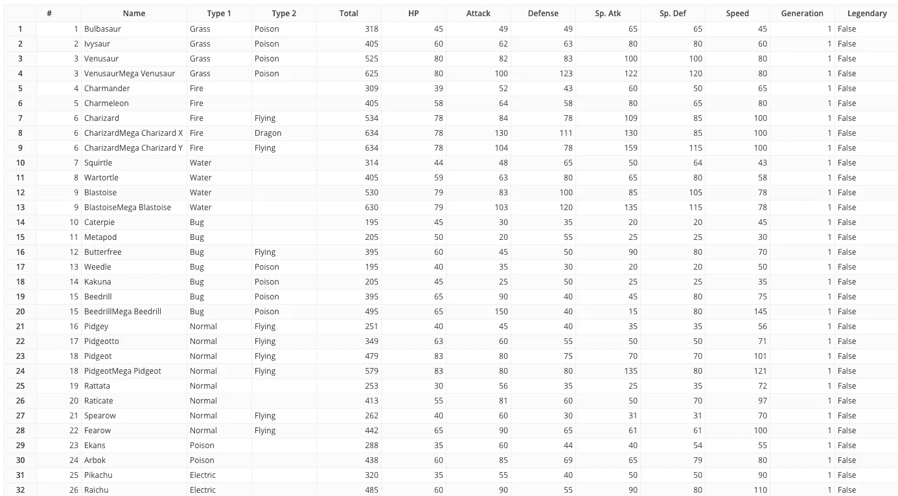

你的脑海中可能会蹦出一些探索性的问题，比如*“普通口袋妖怪和传奇口袋妖怪有多少？*”。而你希望有一个类似下表的答案？

这就是我们所说的数据透视表✌️，我们如何做到这一点？

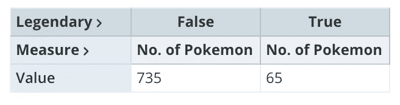

And, it’s called pivot table ✌️

# 数据透视表概念

数据透视表是通过以下 4 个属性对原始表进行汇总和分组的结果:

## **数值**

聚合字段，可用于不同类型计算的数值。对于文本字段，它们需要被转换成

可能值:口袋妖怪计数、平均力量、最大重量、攻击总和等。

示例[👉将**名称计数**拖到**数值区**来计数**有多少个口袋妖怪**？](https://cloudpivot.co/cp/pokemon/2)

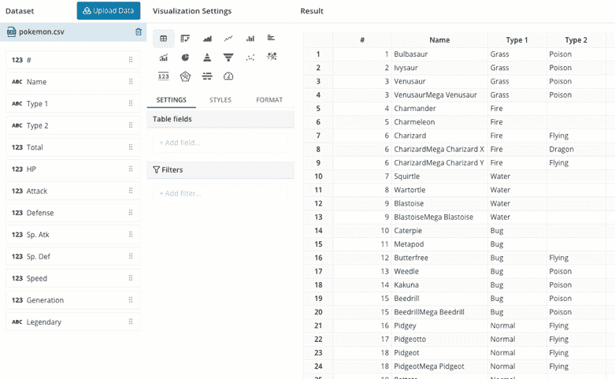

There are 800 Pokemon in total

## **列**

将相同的值和计算分组到列中。

例
[👉保持**清点名字**并将**传奇**拖到**栏区域**来清点**有多少个传奇和非传奇口袋妖怪**？](https://cloudpivot.co/cp/pokemon/3)

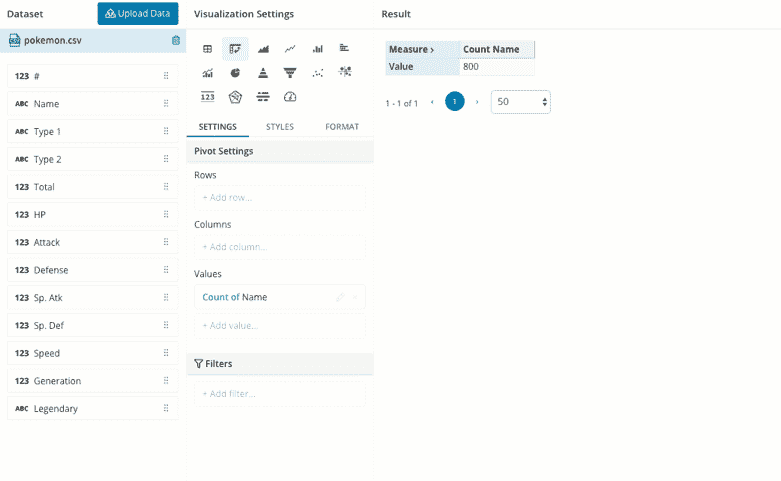

There 735 Non-Legendary and 65 Legendary Pokemon

## **行**

将相同的值和计算分组到一行或多行中。

示例[👉保持**清点名字**并将**传奇**拖入**行区域**清点**有多少个传奇和非传奇口袋妖怪**？](https://cloudpivot.co/cp/pokemon/4)

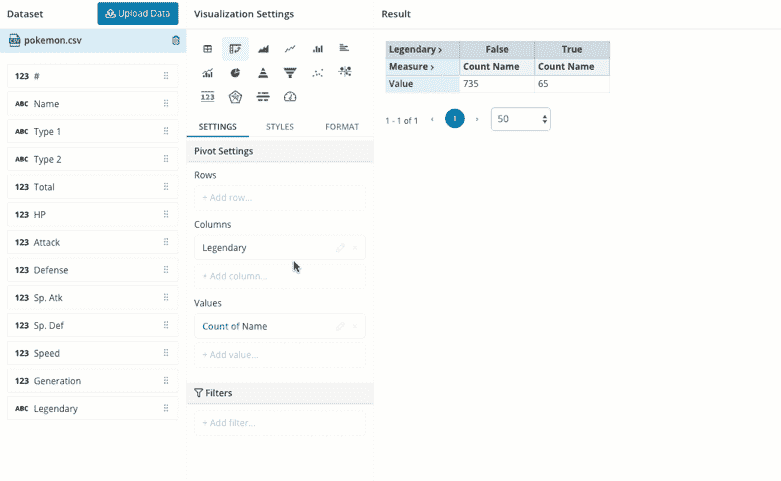

Same answer, different display

## **过滤器**

将筛选器应用于整个表格。

例子[👉在数值区保留名字的**计数，在**行区保留**传奇**计数，然后我们添加一个过滤器只得到传奇口袋妖怪****](https://cloudpivot.co/cp/pokemon/5)

Only Legendary Pokemon

# 高级示例

上面的例子只是开始，使用数据透视表，您可以通过混合行、列、过滤器和值区域来获得更有意义的见解。

## [一代有多少传奇/非传奇的口袋妖怪？](https://cloudpivot.co/cp/pokemon/18)

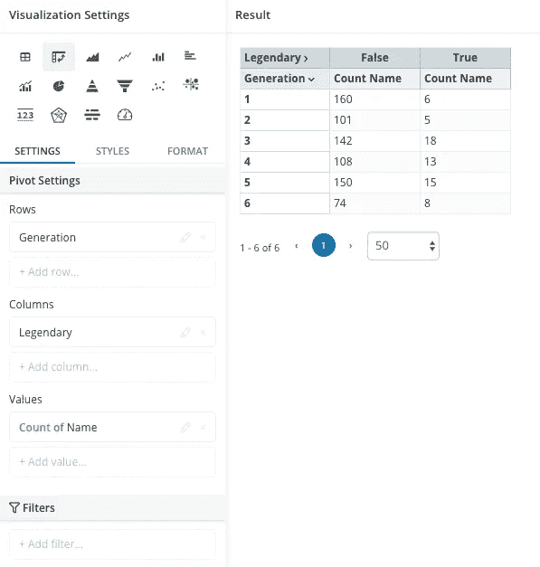

Generation in Rows, Legendary in Columns

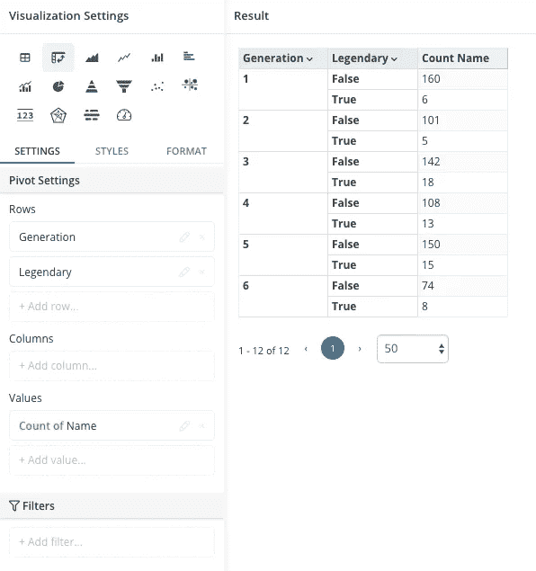

Generation and Legendary in Rows

## [1 型有多少传奇/非传奇口袋妖怪？](https://cloudpivot.co/cp/pokemon/15)

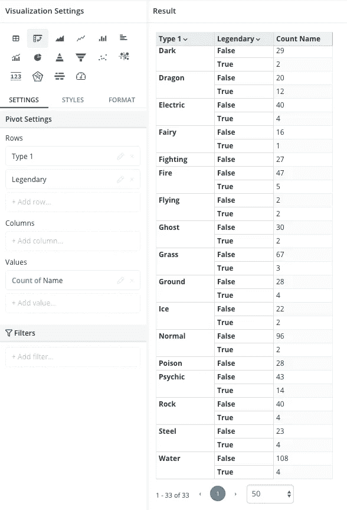

## [传奇/非传奇口袋妖怪](https://cloudpivot.co/cp/pokemon/35)的平均 HP、攻击、防御、速度、特殊 Atk & Def

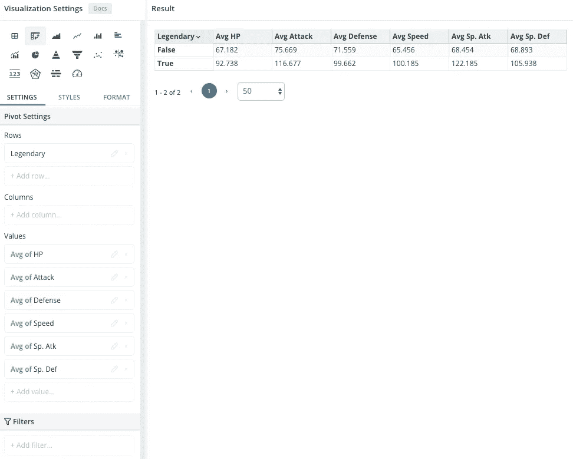

# 从数据透视表到图表

数据透视表的另一个好处是，它可以让你的数据为图表做好准备。以上面的传奇/非传奇口袋妖怪为例，你可以很容易地将你的数据透视表变成一个饼状图，如下图所示

[Pivot Table to Pie Chart](https://cloudpivot.co/cp/pokemon/38)

数据透视表是数据分析中一个非常强大的概念，这第一部分可能很短，但我希望它对你开始概述有用。

在下一部分，我们将讨论更复杂的问题和数据集。

如果你喜欢，请关注我，获取本系列的最新更新，有任何问题，请随时问我！

**免责声明** : [CloudPivot](https://cloudpivot.co) 是由 [Holistics.io](https://holistics.io) 构建的用于数据社区可视化数据的免费网络应用。您可以上传或连接您的数据，以便快速可视化并与其他人共享。

# 供您试用的样本数据集

## [带有 Gif 图片的口袋妖怪](https://cloudpivot.co/cp/pokemon-image/2)

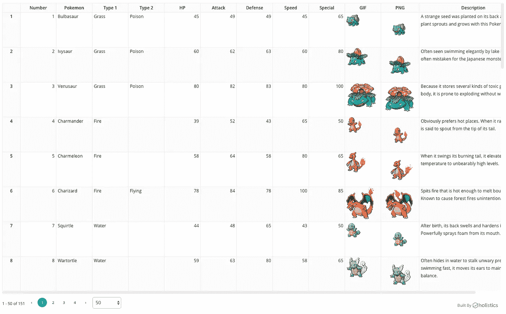

## [国际足联 19](https://cloudpivot.co/cp/fifa/10)

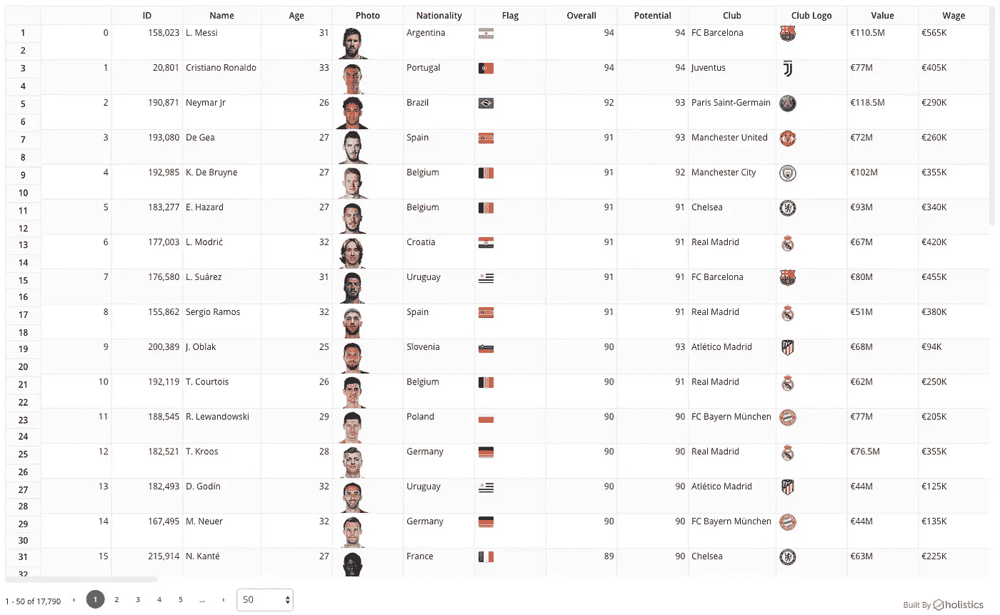

## [**样本电子商务**](https://cloudpivot.co/cp/sample/0)

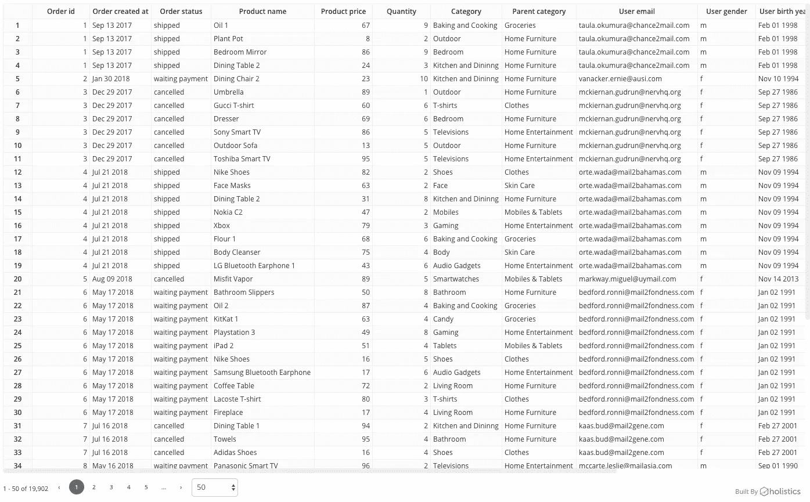