# 用 Python 评估 Lil John 的“拒绝什么”

> 原文：<https://medium.com/hackernoon/using-python-to-evaluate-lil-johns-turn-down-for-what-4a2b6fbe3aa7>

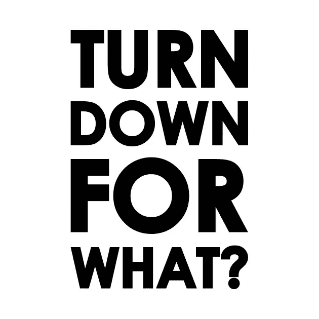

turn down for what?

我最近听了莉莉·约翰和 DJ·斯内克的经典歌曲《拒绝什么》。在这部杰作中，他们问了一个问题，我打算用 Python 编程来解决这个问题。问题是“拒绝什么？”。在解决这个难题的过程中，我还将介绍如何利用 Python 中的以下概念:

1.  **While 循环**

**3。Do While 循环(在 Python 中模拟)**

**4。条件语句**

**5。变量**

**6。JSON 数据**

**7。数据建模和模拟**

在我们进入代码之前，让我们看一下歌词，看看我们可能如何处理这个问题:

```
Fire up that loud
Another round of shotsTurn down for what?
Turn down for what?
Turn down for what?
Turn down for what?
Turn down for what?
```

这里第一个明显的问题是，“为了什么而拒绝”是什么意思？。据 Quora.com 报道:

```
"Turn up" means to drink, party, dance and possibly do drugs. The opposite (stop partying and sober up) is to "turn down." When Lil Jon says the phrase in the song, he is telling listeners there is no reason to stop partying.
```

所以，我们在这里要解决的是:有拒绝的理由吗？如果是这样的话，什么时候可以满足这个条件？

# While 循环与 Do While 循环

如果我们分析歌词的第一行，似乎 Lil John 和 DJ Snake 在告诉我们，当派对开始时，所有的派对顾客都将被要求再喝一轮。此外，大声将被炒了起来。本质上，他们是在执行一些动作，后面跟着一个条件语句，“为了什么而拒绝？”。这是在许多基于 C 的语言中常见的 Do While 循环的基本流程。Do While 循环的一般语法如下:

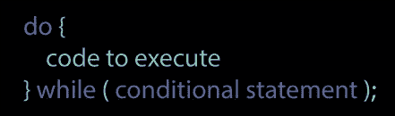

基本上，Do While 循环与其他常见循环的不同之处在于，它在检查条件之前执行代码。这意味着要执行的代码将总是至少执行一次。让我们将其与典型的 While 循环进行比较:

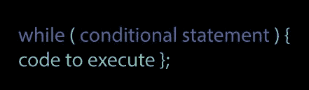

这里，首先是条件，然后是要执行的代码。如果在代码第一次运行时满足条件，那么代码将永远不会被执行。让我们再来看一下，这可能会导致什么结果:

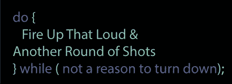

Lil John 的初始语句似乎是一个 Do While 循环，因为要执行的代码在条件语句之前，这里转换为伪代码。假设拒绝的条件或理由是还不到晚上 9 点。如果这段代码在晚上 9:01 运行，那么至少每个人都会有一轮镜头，每个人都会有一个短暂的聚会。然而，在同样的情况下，如果 Lil John 在要执行的代码之前编写了条件:

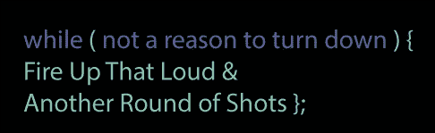

那就不会有人拍照，派对也不会开始。在这种情况下，Lil John 很聪明地用这样的方式来写它，这样无论发生什么，即使条件评估为真，每个人仍然至少可以参加一次聚会。

# 在 Python 中创建 Do While 循环

虽然许多基于 C 的语言都有自己的方式来编写 Do While 循环，但 Python 却没有。为了达到相同的结果，我们需要使用与上面的伪代码稍有不同的语法来模拟 Python 中的 Do While 循环。

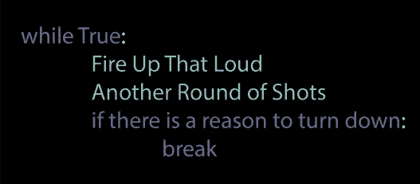

这里，我们模拟了 Python 中的 Do While 循环。简单地让循环永远继续下去。如果在此之后我们没有条件，循环将无限期运行。然而，我们在循环中包含了一个条件语句，如果满足该条件，我们就`break`循环，使其短路。最后，代码将总是至少执行一次，然后可能在条件语句中终止。

# 定义变量

Python 是动态类型的，这意味着您不必声明每个变量是什么类型。在 Python 中，变量是文本和数字的存储占位符。它必须有一个名称，以便您能够再次找到它。变量总是被赋予等号，后跟变量值。

## 布尔运算

```
Boolean values are the two constant objects False and True. 

They are used to represent truth values (other values can also be considered
false or true). 

In numeric contexts (for example, when used as the argument to an
arithmetic operator), they behave like the integers 0 and 1, respectively.

The built-in function bool() can be used to cast any value to a Boolean,
if the value can be interpreted as a truth value

They are written as False and True, respectively.
```

## 数字

```
Numeric variables in Python are used to store numbers. Numbers are usually stored as integers, floating-point values, or complex numbers, depending on the requirements of the program.
```

在 Lil John 的歌词中，他没有明确定义变量，但这是隐含的。我们不能确定`Loud`的起始值是多少，只知道会是`fired up`。我们也不知道“`fired up`”`increments``Loud`的值是多少，或者它是否是一个非开即关的`boolean`(`True`或`False`)。

## 递增数值变量

如果`variable` `Loud`是一个`numerical`值，那么它可能看起来像这样:

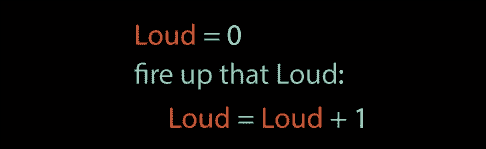

## 设置布尔变量

然而，如果`variable` `Loud`是一个`boolean`，它可以这样写:

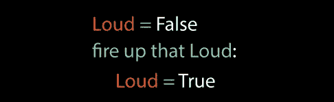

在我们决定如何处理变量 Loud 之前，理解 Loud 到底是什么很重要。根据城市词典:

```
1\. (Adjective) used to describe marijuana of very [**high quality**](https://www.urbandictionary.com/define.php?term=high%20quality); very strong weed.

2\. (Adjective) used to describe something (or someone) that is of high quality; [**very good**](https://www.urbandictionary.com/define.php?term=very%20good); awesome; sick (slang); cool; [**dope**](https://www.urbandictionary.com/define.php?term=dope)(slang); amazing.
```

基于此，看起来 Lil John 打算在前一个上下文中使用 Loud。考虑到这一点，将其视为递增的数值而不是布尔值可能更有意义。如果我们把它作为一个布尔值来处理，并把它的值设置为 False，这将表明当前没有启动任何扬声器。相反，如果我们将该值作为一个数字，我们可以增加它，表明更多的声音不断被激发。

我们也可以大概假设另一轮射击也是如此。射击次数需要是一个数值，用来存储射击次数。这种格式看起来与我们之前的示例非常相似:

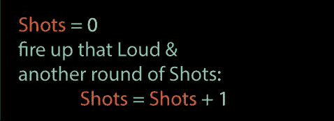

既然我们对如何通过 Python 来表示这个场景有了一个粗略的想法，那么让我们比较一下目前为止我们所拥有的:

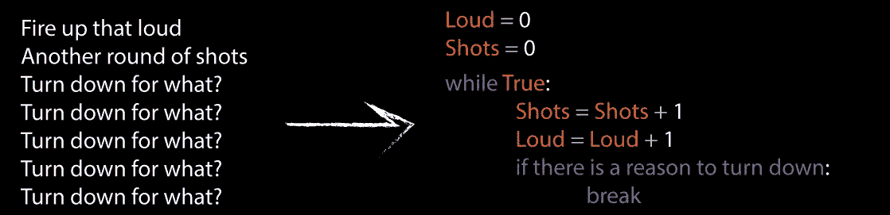

在这一点上，它看起来很不错。我们已经成功地将这个场景的大部分转换成了一个可测试的 Python 代码块。然而，仍然有一些问题我们还没有解决。

1.  结束这个循环的`condition`会是什么？“拒绝什么”这句话似乎表明没有拒绝的理由，也许永远也不会有。在编程中，这可能会导致一个问题，因为如果没有满足终止条件，我们的 while 循环就会无限期地运行。
2.  同样令人困惑的是，在这个场景中，“拒绝什么”，或者我们的条件语句，被重复了 5 次。通常，条件语句只需要执行一次。为了使事情变得更简单，最简单的方法可能是只调用这一行一次，而不是多次重复一个条件而不执行任何代码。

在决定第一个问题的答案时，似乎至少有一个条件会终止 while 循环。在循环的每一次迭代中，每个派对客人将被要求进行另一轮拍摄。这意味着随着聚会的继续，客人们将开始喝醉。在某些时候，如果这种模式继续下去，所有的客人都会变得太醉而无法参加聚会，聚会将被要求“拒绝”，从而结束 while 循环。考虑到这一点，让我们考虑以下情况:

美国人的平均体重是 180.62 磅。白酒(蒸馏酒)最常被饮用在 1.5 盎司的混合饮料中。精神。有时烈酒(伏特加、杜松子酒、苏格兰威士忌、波旁威士忌等。)与水、苏打水或果汁混合，或者“不掺水”或“加冰”不管酒精是如何消耗的，一份标准的(1.5 盎司。80 度(40%酒精含量)的蒸馏酒的酒精含量与标准的啤酒和葡萄酒相同。所以 1.5 盎司。体积百分比为 40%的酒精= 0.6 盎司酒精/服务。

“BAC”是“血液酒精浓度”的缩写——衡量一个人血液中酒精含量的指标。一般来说，血液酒精浓度会随着饮酒量的增加而升高。

高于 0.14 的血液酒精浓度通常意味着一个人将开始感到不那么愉快，并且可能更加不愉快。到 0.25 时，大多数人将受到严重损害。

对于美国平均体重(180.62 磅)的人来说，达到血液酒精浓度 0.14 所需的饮酒量可能是 8-10 杯(每杯 1.5 盎司)。参见图 1a。

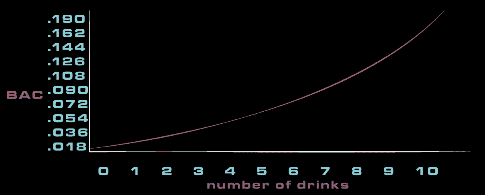

figure 1a

因此，我们可以假设，如果在 while 循环的每次迭代中`Shots`都是`incremented`，那么到第 9 次迭代时，聚会将开始必然地“拒绝”。也许将这一点纳入我们的代码的最佳方式是设置一个名为`Party`的变量，初始值为`10`，当我们增加饮料数量时，我们减少聚会 party `variable`。然后，如果`party` `variable`达到 0 `,`，那么`condition`将被满足并且`party`将关闭。然而，这给我们带来了一个问题。考虑一下，如果我们用图表表示 party 变量，它会是什么样子。参见图 1b。

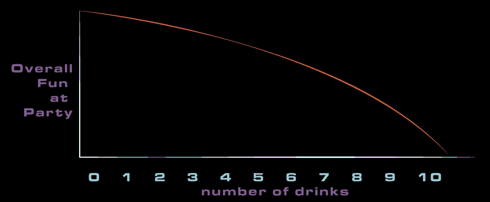

figure 1b

基本上，聚会开始时会很有趣，然后递减一个值，这个值等于喝掉的酒的数量。我不认为这是 Lil John 在描述这个场景时预想的那种派对。这给我们提出了一个难题。Lil John 似乎设想了一个无限增加喧闹和欢乐的聚会，但显然，如果喝的饮料数量也无限增加，那么欢乐的数量将是有限的。

此外，通过以这种方式思考问题，我们没有考虑其他变量。例如，我们假设这是一个封闭的聚会。换句话说，如果这个活动有 20 位客人，while 循环开始并递增，直到聚会结束，所有 20 位客人的血液酒精浓度都达到大于或等于. 25。我们假设聚会上不会有新客人到来。在现实中，新的客人可能会比其他人晚到达，这意味着不是整个群体不会在同一时间达到相同的血液酒精浓度。

我们可能要考虑的另一个因素是，当聚会越来越多，越来越响时，它可能会吸引更多的潜在客人参加聚会。

让我们看看这些数据是如何可视化表示的。参见图 1c。

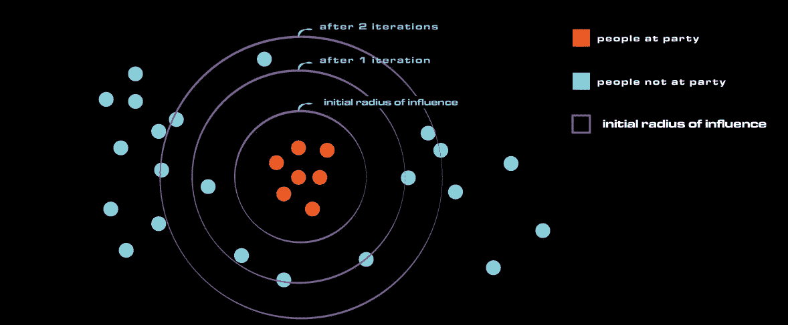

figure 1c

在这个粗略的例子中，当 Lil John 的聚会开始时(或者我们的 while 循环开始时)，有 7 个人在那里。相反，有 22 个人目前不在聚会上，但是在聚会附近。在 while 循环的每一次迭代中，loud 和 shots 的值都增加，并且作为其副作用，更多当前没有出席的人更有可能意识到聚会。那些参加聚会的人将被扫入我们的 while 循环，在那里他们将被迫在每次迭代中享受另一轮镜头。让我们看看另一个可视化的例子，看看这在我们的代码中是如何实现的。参见图 1d。

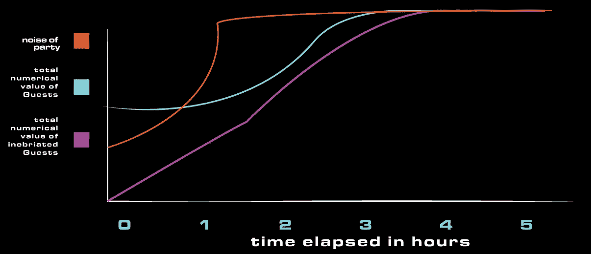

figure 1d

这有助于我们了解派对上的噪音水平、派对上的客人数量以及派对上喝醉的客人数量之间的关系。在聚会开始时，噪音可能不会从 0 开始，而是在 50 左右。聚会开始时，所有参加聚会的客人都不会喝醉。当客人开始变得醉醺醺的时候，与此同时，还没有喝醉的新客人加入了聚会。但我们可以看到，最终这些数据点都会达到一个稳定水平。以这种方式思考数据，在我们继续前进之前，我们可能会做出 3 个安全的假设:

1.  噪音水平有一个最大值(立体声只能调到 100%)。此外，噪音水平可能会在所有客人到达派对之前达到最大值，也可能会在第一批客人完全喝醉之前达到最大值(这主要是因为噪音水平可能会以较高的水平开始，并且迟早会达到最大值)。
2.  第二个可能趋于稳定的数据点是派对上的客人数量。该数据点可以基于最大人口和/或人口密度。这并不一定意味着所有的人都会参加聚会。而是有有限数量的人口最终会参加。
3.  达到最大值的最后一个数据点是派对上喝醉的客人数量。一旦最大数量的可能的聚会顾客到达聚会，并且所有的客人都完全喝醉了，那么聚会将可能结束(并且拒绝什么的条件将返回真)。

# JSON 数据

因为我们计算 BAC 的方法会根据派对顾客的性别而有所不同，而且因为每个派对顾客的体重会有所不同，所以最好是单独处理每个客人的醉酒情况。一个很好的方法是使用 JSON 数据。JSON 代表 JavaScript 对象表示法，是一种存储数据的常用方法。标准的 JSON 对象由键/值对组成。让我们看看如何使用 JSON 数据来跟踪我们的客人。每个 guests JSON 对象可能如下所示:

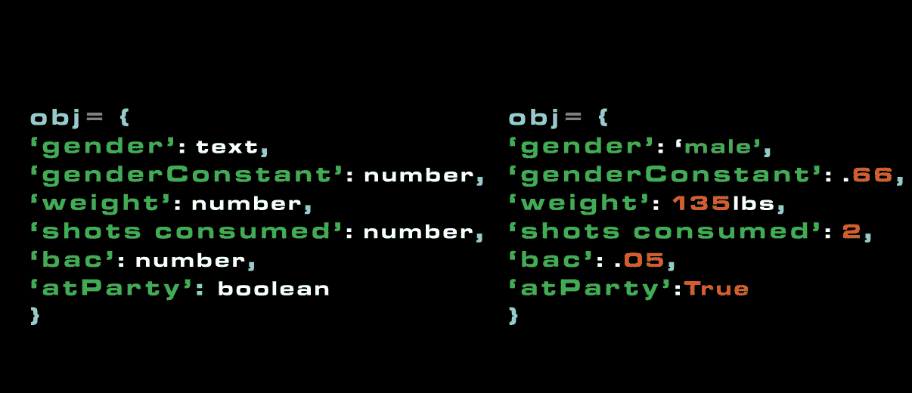

figure 2a

在我们之前的图表中，我们看到了一个潜在的场景，最初在 Lil John 的聚会上有 7 位客人，还有 22 位客人没有出席。如果我们用 JSON 数据来表示，如图 2a 所示，那么每个来宾都有一个数据配置文件。这些钥匙将为我们提供关于每个客人的有意义的数据。“性别”、“性别常数”、“体重”和“饮酒量”这些关键词都有助于我们计算每位客人当前的血液酒精含量。“atParty”键可以让我们知道在每次迭代过程中，游客是否参与了“一轮拍摄”。

在循环的每次迭代中，如果游客的“atParty”值被设置为真，并且当前游客的血液酒精含量也低于比如说. 2，则该游客的“饮酒量”值将增加 1，并且相同游客的“bac”键将使用新的“饮酒量”值重新计算。

如果在任何时候，客人血液中的酒精含量高于 0.2，我们可以认为客人醉得不能继续喝酒了。一旦所有将参加聚会的客人都已经到达聚会，并且每个客人的血液酒精含量也是 0.2，那么条件将返回 True，并且 while 循环将终止。为此，我们可能希望使用以下代码结构:

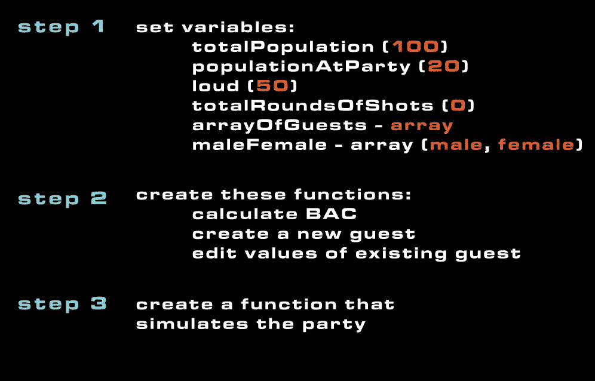

figure 2b

在上面的例子中，我们这个练习的基本框架是首先定义我们的变量。以上是这些变量的一些可能的初始值。我们创建新客人的函数需要确定新客人是男性还是女性。为了确定这一点，我们将随机选择我们的雌雄阵列。一旦创建了新来宾，我们就可以将这个新来宾添加到我们的 arrayOfGuests 中。我们的另一个函数 calculate BAC 将使用每个当前客人的值，并计算他们当前的血液酒精含量。最后，我们的“编辑现有客人的值”将添加每个客人消费的总杯数，然后调用计算 BAC 函数来重新计算客人的 BAC。

让我们分别看一下这些功能，看看它们是如何工作的:

## 计算 BAC:

```
def calculateBAC(shotsConsumed, weight, genderConstant):
    newBAC = shotsConsumed/(weight*genderConstant)*50
    return newBAC
```

该函数将接受三个参数:

1.  消耗的镜头
2.  重量
3.  性别不变。

该函数将计算新的血液酒精含量，并返回该值。

## 创建新人:

```
def createNewPerson():
    genderConstant = 0
    choice = random.choice(maleFemale)
    sConsumed = 0
    weight = random.randint(115, 260)
    if choice == 'male':
        genderConstant = 0.68
    elif choice == 'female':
        genderConstant = 0.55
    person = {
        'gender': choice,
        'genderConstant': genderConstant,
        'weight': weight,
        'shotsConsumed': sConsumed,
        'bac': 0,
        'atParty': bool(random.getrandbits(1))
    }
    return person
```

在这里，创建一个新人不需要任何参数。它会随机生成一个新人。我们的 maleFemale 变量可能看起来像这样:

```
maleFemale = ['male', 'female']
```

该函数从随机选择数组中的一个值开始。根据选择的值，它将确定性别常数为. 68 或. 55。那么它将从 115 到 260 的范围内选择一个权重。由于美国人的平均体重约为 180，这些数值代表了每个人可能的体重范围。最后，该函数将构建一个 dict，它基本上是一个 JSON 对象。这个 JSON 对象将由我们前面讨论过的相同的键/值对组成。那么该函数将只返回它构建的 JSON 对象。

## 编辑现有人员:

```
def editExisting(x):
    isAtPartyNow = bool(random.getrandbits(1))
    if x['atParty'] == True:
        newShots = x['shotsConsumed']+1
        x['shotsConsumed'] = newShots
        x['bac'] = calculateBAC(newShots, x['weight'], x['genderConstant'])
    if isAtPartyNow == True:
            x['atParty'] = True
        if loud > 50 and isAtPartyNow == False:
            isAtPartyNow = bool(random.getrandbits(1))
            if isAtPartyNow == True:
                x['atParty'] = True
        if loud > 60 and isAtPartyNow == False:
            isAtPartyNow = bool(random.getrandbits(1))
            if isAtPartyNow == True:
                x['atParty'] = True
        if loud > 70 and isAtPartyNow == False:
            isAtPartyNow = bool(random.getrandbits(1))
            if isAtPartyNow == True:
                x['atParty'] = True
        if loud > 80 and isAtPartyNow == False:
            isAtPartyNow = bool(random.getrandbits(1))
            if isAtPartyNow == True:
                x['atParty'] = True
        if loud > 90 and isAtPartyNow == False:
            isAtPartyNow = bool(random.getrandbits(1))
            if isAtPartyNow == True:
                x['atParty'] = True
    return x
```

这个函数将只接受一个参数(现有的人)。然后，它将使用人员的键(以 JSON 格式)来访问与这些键相关联的值。我们在这里也有一个条件语句，因为我们将根据客人当前是否在聚会上来不同地编辑他们。

如果客人已经在聚会上了(atParty == True)，我们将当前人的饮酒量增加 1，并重新计算当前人的血液酒精含量。

如果客人目前不在派对上，我们会多做一点工作。我们将从随机获取另一个布尔值开始，如果它为真，我们将把 guest 的 atParty 值重置为真。但是，如果 guest 的 atParty 值仍然为 false，我们将在每次 loud 增加时再次运行该代码(获得一个新的布尔值)。这与我们的图 1c 非常吻合，图 1c 表明，随着噪音水平的增加，客人更有可能参与到聚会中。

## 创建所有来宾:

```
for i in xrange(0, 20):
    person = createNewPerson()
    people.append(person)
```

这个函数将是一个简单的 for 循环。在 for 循环中，我们将迭代一个范围。这个范围代表我们想要的客人总数。在这个例子中，我们的测试用例中总共只有 20 个人。每个人都是由我们之前看到的函数创建的，然后附加到我们的人员数组中。

## 模拟聚会的功能:

```
while True:if loud < 90:
        loud = loud + 10
    for p in people:
        if p['bac'] < .2 and p['atParty'] = True:
            editExisting(p)
    roundsOfShots = roundsOfShots + 1
    if roundsOfShots >= 10:
        break
```

这是我们之前看到的基本轮廓，有一些修改。这里的变化是:

1.  仅当当前值小于 90 时，Loud 的值才会增加。此外，在每次迭代中，我们将 Loud 的值增加 10，而不是增加 1。
2.  我们包含了一个嵌套在 while 循环中的 for 循环。每次 while 循环运行时，它都会遍历参加聚会的所有人。如果嵌套循环中的当前人低于 0 . 2，并且当前人也在聚会上，那么我们运行我们前面看到的 editExisting 函数，该函数将增加拍摄次数，并重新计算血液酒精含量。
3.  最后，我们还将递增 roundsOfShots 变量。
4.  在这种情况下，当 roundsOfShots 变量达到 10 时，我们将使 while 循环短路。显然这不是我们最终想要发生的，但是这样我们至少可以测试代码以确保它的部分工作，然后在以后调整短路条件语句。

让我们看看所有代码是如何组合在一起的。我还对我们的起始变量做了一些调整，并调整了我们的条件语句以缩短 while 循环:

```
import random
loud = 50
roundsOfShots = 0
totalPeople = 300
peopleAtParty = 0
peopleNotAtParty = 0
peopleInebriated = 0
timeElapsed = 0
people = []
maleFemale = ['male', 'female']def calculateBAC(shotsConsumed, weight, genderConstant):
    newBAC = shotsConsumed/(weight*genderConstant)
    return newBACdef createNewPerson():
    genderConstant = 0
    choice = random.choice(maleFemale)
    sConsumed = 0
    weight = random.randint(115, 260)
    if choice == 'male':
        genderConstant = 0.68
    elif choice == 'female':
        genderConstant = 0.55
    person = {
        'gender': choice,
        'genderConstant': genderConstant,
        'weight': weight,
        'shotsConsumed': sConsumed,
        'bac': 0,
        'atParty': bool(random.getrandbits(1))
    }
    return persondef editExisting(x):
    isAtPartyNow = bool(random.getrandbits(1))
    if x['atParty'] == True:
        newShots = x['shotsConsumed']+1
        x['shotsConsumed'] = newShots
        x['bac'] = calculateBAC(newShots, x['weight'], x['genderConstant'])
    if x['atParty'] == False:
        if isAtPartyNow == True:
            x['atParty'] = True
        if loud > 50 and isAtPartyNow == False:
            isAtPartyNow = bool(random.getrandbits(1))
            if isAtPartyNow == True:
                x['atParty'] = True
        elif loud > 60 and isAtPartyNow == False:
            isAtPartyNow = bool(random.getrandbits(1))
            if isAtPartyNow == True:
                x['atParty'] = True
        elif loud > 70 and isAtPartyNow == False:
            isAtPartyNow = bool(random.getrandbits(1))
            if isAtPartyNow == True:
                x['atParty'] = True
        elif loud > 80 and isAtPartyNow == False:
            isAtPartyNow = bool(random.getrandbits(1))
            if isAtPartyNow == True:
                x['atParty'] = True
        elif loud > 90 and isAtPartyNow == False:
            isAtPartyNow = bool(random.getrandbits(1))
            if isAtPartyNow == True:
                x['atParty'] = True
    return xfor i in xrange(0, totalPeople):
    person = createNewPerson()
    people.append(person)while True:
    timeElapsed += 10
    if loud <= 100:
        loud = loud + 10
    for p in people:
        if p['bac'] < .2 and p['atParty'] == True:
            editExisting(p)
        if p['bac'] >= .2 and p['atParty'] == True and peopleInebriated < totalPeople:
            peopleInebriated += 1
        if p['atParty'] == False:
            editExisting(p)
    roundsOfShots = roundsOfShots + 1
    print peopleInebriated
    if peopleInebriated >= totalPeople:
        breakfor p in people:
    if p['atParty'] == False:
        peopleNotAtParty += 1
    else:
        peopleAtParty += 1
    print p
totalConsumed = 1.5 * (peopleInebriated*roundsOfShots)
print "Total Consumed: ", totalConsumed
print "Time Elapsed is: ", timeElapsed, " minutes"
print "Total People: ", totalPeople
print "People Inebriated: ", peopleInebriated
print "People at the party: ", peopleAtParty
print "People Not at the party: ", peopleNotAtParty
print ("loud is: ", loud)
print ("total rounds of shots: ", roundsOfShots)
```

在这里，聚会赞助人的总数被设置为一个更现实的数字 300。BAC 的计算也已经被修改，允许人们更长时间地狂欢。此外，还增加了一个 timeElapased 的变量，理论上讲，会发出响亮的声音，大约每 10 分钟就会增加几发子弹。通过这些计算，这个聚会将持续大约 3 小时 20 分钟。在这一点上，所有可能在吵闹声范围内的聚会客人也会醉得无法继续聚会。这样一来，拒绝的条件就满足了，聚会也就结束了。这里值得注意的还有 totalConsumed 变量，它记录了饮酒的总量。因为这是基于我们之前得出的 1.5 盎司的数据，所以总消耗量通常在 9000 盎司左右，或者大约 72 加仑。

综上所述，拒绝为了什么？

答案似乎是在聚会顾客喝了 72 加仑酒之后，如果聚会顾客的总数在 300 人左右。

希望这是一次有趣的训练。欢迎分享任何反馈。谢谢！