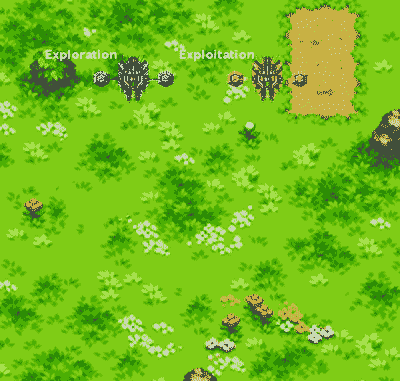

# 使用 Q-Learning 来教机器人如何走路——人工智能奥德赛部分。3

> 原文：<https://medium.com/hackernoon/using-q-learning-to-teach-a-robot-how-to-walk-a-i-odyssey-part-3-5285237cc3b1>

这一集:Q 值，强化学习，等等。
*确保检查出* [***部分。1***](/@juliendespois/finding-the-genre-of-a-song-with-deep-learning-da8f59a61194#.r28dkpg2e)**和**[***部分。2***](https://hackernoon.com/talk-to-you-computer-with-you-eyes-and-deep-learning-a-i-odyssey-part-2-7d3405ab8be1#.6esc69gby)**太！****

****

# **介绍**

**今天，我们将学习如何创建一个虚拟代理，它能发现如何与世界互动。我们将要使用的技术叫做 **Q-Learning，**它是*超级* *酷*。**

## **主体、状态和目标**

**让我们看看我们的代理人！**

****

**Henry, the robot**

**这是 ***亨利*** ，他是一个年轻的虚拟机器人，他有一个梦想:**环游世界。问题是他不太了解这个世界。事实上，他根本不知道如何用*移动*！他只知道他的 **GPS 位置**，它的脚的**位置，如果它们在地面上**的话**和**。****

****

**What Henry perceives of the world**

**这些元素可以分为两个部分:状态*和目标 ***。*** 我们代理人的*状态*是与他身体相关的信息的集合，而*目标*是代理人想要增加的。在我们的例子中，代理人想用它的脚来改变它的位置。***

> *****状态*** :【右脚伸展，右脚着地，左脚伸展，左脚着地】
> ***目标*** :【位置】**

## **行动**

**幸运的是，亨利有能力表演动作。即使他看不到太多的世界，他也知道自己能做什么，这取决于他的状态。*举个例子，*当他双脚着地的时候，他可以*举起*一只。当一只脚在空中时，他可以向前*移动*或向后*移动*。**

****

**The actions available to our robot, depending on his state. **NB:** In reality, the diagram is a bit more complex, as the robot takes into account the extension of the foot.**

****

**Here’s Henry performing random actions**

# **政策**

**为了达到他的目标，代理遵循一组称为 ***策略*** 的指令。这些指令可以由代理学习或由人类手动写下。**

## **遵循硬编码的策略**

**让我们写一个简单的政策让我们的代理人遵守。**

****

**A simple, hard-coded policy**

****

**The agent following the simple policy. Look at him go!**

**这看起来很有希望，尽管机器人失去了很多抬起和放下脚的时间。这不是真正的**高效**。**

**事实上，我们*很少*手动写出好的政策。这要么是因为我们**不知道任何** *(例如，复杂任务)*，要么是因为它们通常**不健壮** *(如果代理以某种方式开始左脚向上，上面的策略将立即失败，因为代理不能执行期望的动作)。***

## **q 学习**

**为了帮助我们的代理人完成他的梦想，我们将使用一种被称为 [**的**](http://www.gatsby.ucl.ac.uk/~dayan/papers/cjch.pdf) **[**强化学习**](https://www.youtube.com/watch?v=RtxI449ZjSc&feature=relmfu) 技巧——学习** 到帮助机器人*学习*健壮的和**高效的**策略。该技术在于当代理处于某个状态时，将一个数字或 **Q 值**分配给执行某个动作**的事件。该值代表该动作的**进度**。****

****

**Some State-Action pairs associated with their Q-Value**

**该值由一个 ***奖励函数*** *，*决定，指示该行动对达成目标是否有**正面**或**负面**影响。*在我们的例子*中，如果亨利将**从他所在的地方移开**，这是*好*，如果他将**退回**，这是*坏*。**

****

**Our agent’s basic reward function**

> **这里的关键点是，具有**值**的不是**动作**本身**，而是当代理处于**特定状态**时**执行** **动作**的事实。****

**知道了**所有的 Q 值**，代理*可以*，在每一步，根据他的状态选择*行动*，这将带来最好的回报。这将是他的政策。**

**这里的问题是亨利不知道 Q 值是多少！这意味着他**无法**选择一个能让他**更接近**目标的行动！**

**幸运的是，我们有办法让他自己发现 Q 值。**

# **用ε-贪婪算法学习 Q 值**

## **培训代理**

**为了了解其状态-动作对的 Q 值，亨利必须亲自尝试这些动作。问题是可能有数十亿种可能的组合，而程序不可能全部尝试。我们希望亨利**尝试尽可能多的**组合作为**可能的**，但是**关注**最好的**。****

**为了实现这一点，我们将使用[**ε-贪婪**](http://tokic.com/www/tokicm/publikationen/papers/AdaptiveEpsilonGreedyExploration.pdf) 算法来训练机器人。它是这样工作的:在*每个* *步骤*，机器人有一个**概率ε**执行一个**随机**可用动作，否则它根据它知道的 Q 值选择最佳动作。动作的结果用于**更新**Q 值。**

## **更新 Q 值和远距离奖励的问题**

**更新 Q 值的一个简单方法是用机器人刚刚通过动作体验到的值代替机器人在存储器中的值。然而，这带来了一个真正有问题的问题:机器人无法看到未来的一步。这使得机器人对任何**未来**的奖励视而不见。**

> **抬起一只脚是行走所必需的，但是当它没有带来任何直接的回报时，亨利**怎么能发现**这是一个好的行动呢？**

**这个问题的解决方案由[贝尔曼方程](https://en.wikipedia.org/wiki/Bellman_equation)给出，它提出了一种计算**未来**奖励的方法。**

****

**Bellman equation**

****首先**，不是用新值替换旧值，而是旧值以**一定速率**(*α，学习速率*)逐渐消失。这使得机器人能够考虑噪音。有些行动可能有时有效，有时无效。随着 Q 值的这种*渐进的*演变，一个错误的奖励**不会搞乱整个系统。****

****也就是**，新值的计算不仅使用即时奖励，还使用**预期最大值**。这个价值由我们期望从可获得的行动中得到的**最佳回报**组成。这对学习过程的效率有着巨大的影响。这样，奖励 [**及时传播回来**。](http://www.cs.upc.edu/~mmartin/Ag4-4x.pdf)**

> **随着这种变化，抬起一只脚的 Q 值变成了正的，因为它受益于向前迈出一步的未来最佳期望值。**

****

**Q-Values updated with Bellman equation. Note how *putting a foot down* now is seen as **positive** instead of **neutral**, as is benefits from the reward of taking the **next** step.**

## **探索与开发的困境**

**通过利用价值 epsilon，我们面临着探索与开发的两难境地。一个拥有**高ε**的代理人会**多半**尝试**随机**行动(*探索*)，而一个拥有**低ε**的代理人会**很少**尝试**新**行动(*剥削*)。我们需要找到一个甜蜜点，使我们的机器人能够尝试许多新的东西，而不会在没有希望的领先优势上浪费太多时间。**

********

**Two agents, trained with different epsilons, following their best policy.**

**在这里，更专注于**探索的代理**发现了一种非常有效的移动技术。相反，*黄色*机器人没有充分利用他的脚的伸展，因为它没有花足够的时间尝试随机动作。**注意**必须找到一个**平衡**，因为花费太多时间在探索上会阻止代理学习**复杂的策略。****

# **结论**

**看那个！亨利正以惊人的速度环游世界！他设法自己找到了一个比我们给他的简单策略更好的移动方式，加上他可以从小错误中恢复，因为在任何状态下他只需要跟随他信任的 Q 值来引导他！**

**您可以在这里玩代码:**

** [## GitHub-despisj/qlearningwalkingbot:一个简单的 Q 学习示例，带有一个可爱的步行机器人

### 一个简单的 Q-学习的例子，有一个可爱的步行机器人。

github.com](https://github.com/despoisj/QLearningWalkingRobot) 

🎉你已经到达终点了！我希望你喜欢这篇文章。如果你做了，请喜欢它，分享它，订阅时事通讯，给我发送比萨饼，在媒体上跟随我，或者做任何你想做的事情！🎉

> **如果你喜欢人工智能，** [**订阅时事通讯**](http://eepurl.com/cATXvT) **接收文章更新和更多内容！****