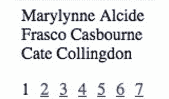

# 使用“React 渲染道具”创建分页列表。

> 原文：<https://medium.com/hackernoon/using-react-render-props-to-create-a-paginated-lists-b618d839b369>


想知道如何使用渲染道具？

太好了！这件物品会适合你。我将向你展示如何用 [React](https://hackernoon.com/tagged/react) 渲染道具创建一个分页列表。

> React render props 允许我们封装想要与其他组件共享的数据。通过这种设计，它将在您的应用程序中促进高度可重用的组件。

```
class PaginatedLists extends React.Component {
  constructor(props) {
    super(props);

    // By default let's start the page by 0...
    this.state = { currentPage: 0 }; 

    this.onClickPageNumber = this.onClickPageNumber.bind(this);
  }

  getNumberOfPages(lists, itemsPerPage) {

    // Calculate the number pages to be displayed...
    const numberOfPages = Math.ceil(lists.length / itemsPerPage);
    return Array.from(Array(numberOfPages).keys());
  }

  paginatedLists(lists, itemsPerPage) {
    const { currentPage } = this.state;

    if (!Array.isArray(lists)) new Error('Invalid supplied Lists.');// Use array slice to create Paginated lists...
    return lists.slice(
      currentPage * parseInt(itemsPerPage, 0),
      (currentPage + 1) * parseInt(itemsPerPage, 0)
    );
  }

  onClickPageNumber(page) {
    this.setState({ currentPage: page });
  }

  render() {
    const { currentPage } = this.state;
    const { lists, itemsPerPage } = this.props;

    return(
      <div>
        {this.props.render(this.paginatedLists(lists,          itemsPerPage))}

        <PageNumbers 
          items={this.getNumberOfPages(lists, itemsPerPage)} 
          currentPage={currentPage}
          onClickPageNumber={this.onClickPageNumber}
          />
      </div>
    ); 
  }
}const PageNumbers = ({ 
  items, 
  currentPage, 
  onClickPageNumber 
}) => {
  return(
   <ul>
    {items.map((item,index) => {
       return (
         <Item
            key={index}
            item={item}
            currentPage={currentPage}
            onClickPageNumber={onClickPageNumber}
          />
         );
       })}
    </ul>
  );
}// Page number...
const Item = ({ 
  item, 
  currentPage, 
  onClickPageNumber 
}) => {
  return (
    <li
      onClick={() => onClickPageNumber(item)}>
      {item === currentPage ? 
      (<p>{item + 1}</p>) : 
      (<a href="#">{item + 1}</a>)}
    </li>
  );
};const UsersLists = ({ lists }) => {
  return (
    <PaginatedLists 
      lists={lists}
      itemsPerPage={3}
      render={(paginatedLists) => (
        <ul>
         {paginatedLists.map((item, id) => {
            return <li key={item.id}>{item.first_name} {item.last_name}</li>;
         })}
        </ul>
      )}
     />);
}ReactDOM.render(
  <UsersLists lists={users}/>, 
  document.getElementById('root')
);
```

这是我们完成的 PaginatedList 组件，我将在这里解释我是如何实现这些代码的。

```
const UsersLists = ({ lists }) => {
  return (
    <PaginatedLists 
      lists={lists}
      itemsPerPage={3}
      **render={(paginatedLists) => (
        <ul>
         {paginatedLists.map((item, id) => {
            return <li key={item.id}>{item.first_name}      {item.last_name}</li>;
         })}
        </ul>
      )}**
     />);
}
```

在我们的 **PaginatedLists** 组件中，我们有三个道具。第一个道具是用于**列表**的项目，这些项目稍后将被分页。第二个支柱是 **itemsPerPage** ，它将决定每页显示多少项。第三个道具就是我们所说的**渲染道具，**在这个道具中你接受一个函数返回另一个组件。后来*每次我们点击页码，这个道具就会被触发并接收一个回调函数，这个函数传递了新更新的分页列表并在其中呈现组件。*

**渲染道具**可以用你想要的名字命名。我们将其命名为 **render** ，因为这是 ReactJS 中的一个约定。

```
paginatedLists(lists, itemsPerPage) {
  const { currentPage } = this.state;

  if (!Array.isArray(lists)) new Error('Invalid supplied Lists.'); // Use array slice to create Paginated lists...
  **return lists.slice(
    currentPage * parseInt(itemsPerPage, 0),
    (currentPage + 1) * parseInt(itemsPerPage, 0)
  );**
}
```

在我们的 PaginatedLists 组件中，我们有一个函数***paginated lists***，它将通过使用 [JavaScript](https://hackernoon.com/tagged/javascript) 内置 **slice** 函数使我们的列表分页。

```
**onClickPageNumber(page) {** this.setState({ currentPage: page }); **}**
```

每次我们点击页码时， **onClickPageNumber** 更新我们的**当前页面**状态和我们的列表。

```
render() {
    const { currentPage } = this.state;
    const { lists, itemsPerPage } = this.props;

    return(
      <div>
        {
          **this.props.render(
           this.paginatedLists(lists, itemsPerPage)
          )**
        }

        <PageNumbers 
          items={this.getNumberOfPages(lists, itemsPerPage)} 
          currentPage={currentPage}
          onClickPageItem={this.onClickPageItem}
          />
      </div>
    ); 
}
```

在 return 函数内的 render 方法中，您可能会注意到**this . props . render(this . paginatedLists(lists，itemsPerPage))** 并调用 paginated lists 函数对列表进行分页**。**这段代码将调用**呈现属性**，我们之前在调用组件 **<分页列表/ >** 时看到过，每次我们更新当前页面状态时，这一行代码都会触发，呈现属性方法也会调用并重新呈现其中的组件。



Output of our PaginatedLists Component.

现在，您可以在应用程序中使用这个 PaginatedLists 组件来使项目列表分页。

如果你喜欢读这篇文章，给我一个掌声…

希望对^_^有帮助

谢了。

# “不要做一个 JavaScript 庸才。”

在推特上关注我[**【https://twitter.com/llaudevc/】T2**](https://twitter.com/llaudevc/followers)