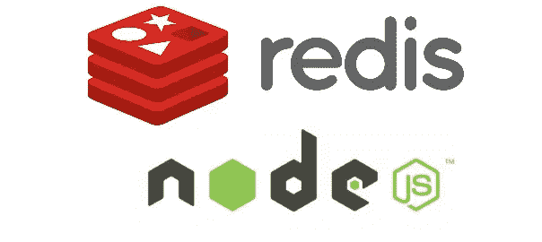

# 对节点 JS 使用 Redis

> 原文：<https://medium.com/hackernoon/using-redis-with-node-js-8d87a48c5dd7>



## 什么是 Redis

[Redis](https://redis.io/) 是一个内存中的数据结构存储，可以用作数据库、缓存和消息代理。Redis 支持不同的数据结构，如字符串、列表、集合、散列、位图等。。简单地说，Redis 使用你的 RAM 来存储数据，速度非常快，但是如果你重启你的服务器，这些值就会消失，除非你启用 R [edis 持久性](https://redis.io/topics/persistence)。好消息默认情况下 Redis 为您启用了持久性机制(您可以根据需要禁用或配置持久性。)

## 安装 Redis (Linux)

参考:[https://redis.io/download](https://redis.io/download)

*用*下载、解压并编译 Redis

```
$ wget http://download.redis.io/releases/redis-4.0.9.tar.gz
$ tar xzf redis-4.0.9.tar.gz
$ cd redis-4.0.9
$ make
```

*现在编译的二进制文件在* `*src*` *目录下。使用*运行 Redis

```
$ src/redis-server
```

您可以使用内置客户端与 Redis 进行交互:

```
$ src/redis-cli
redis> set foo bar
OK
redis> get foo
"bar"
```

好了，现在我们已经成功地在本地机器上安装了 Redis。[在这里](https://redis.io/commands)你可以看到我们可以和 Redis 一起使用的有用的[命令](https://redis.io/commands)。它们超级简单和有用。花些时间使用这些命令。

## 在 NodeJS 应用程序中使用 Redis

首先，您需要通过 [npm](https://www.npmjs.com/package/redis) 为 NodeJS 安装 Redis 客户端。

```
npm install redis
```

现在，在 NodeJS 项目中创建一个名为 redisDemo.js 的文件。

```
// redisDemo.js
var redis = require('redis');
var client = redis.createClient(); // this creates a new client
```

默认情况下，redis.createClient()将使用 127.0.0.1 和 6379 端口。如果您有自定义的 ip 和端口，请使用

```
var client = redis.createClient(port, host);
```

现在，我们想监听 *connect* 事件，看看我们是否成功连接到 redis-server。我们可以像这样检查成功的连接。

```
client.on('connect', **function**() {
    console.log('Redis client connected');
});
```

同样，我们想检查我们是否未能连接到 redis 服务器。我们可以监听*错误*事件。

```
client.on('error', **function** (err) {
    console.log('Something went wrong ' + err);
});
```

当您忘记在应用程序运行前启动 *redis-server* 时，这可能会触发。因此，在测试这段代码之前，请确保运行 redis 服务器。

注意:您可以使用以下命令启动、停止 redis 服务器。

```
/etc/init.d/redis-server stop
/etc/init.d/redis-server start
```

让我们看看我们的代码现在是什么样子。

```
**var** redis = require('redis');
**var** client = redis.createClient();

client.on('connect', **function**() {
    console.log('Redis client connected');
});

client.on('error', **function** (err) {
    console.log('Something went wrong ' + err);
});
```

现在，让我们看看如何在 redis 中的一个键下设置一些简单的值。为此，您可以使用 set()和 get()方法。

```
client.set('my test key', 'my test value', redis.print);
client.get('my test key', **function** (error, result) {
    **if** (error) {
        console.log(error);
        **throw** error;
    }
    console.log('GET result ->' + result);
});
```

在 client.set()中，我们首先给出键，然后给出值。记住 Redis 是一个键值存储。Redis 将创建一个名为*‘我的测试键’*的键，并为该键分配值*‘我的测试值’*。

你可以看到我在 set()方法上使用了那个 *redis.print* 。它向控制台输出“Reply: OK ”,表示 redis 保存了这个值。如果你愿意，你可以省略这个论点。

现在，在 get()方法中，我们只需通过指定确切的键名来检索刚刚保存的值。然后，它将在控制台中打印保存的值。

现在让我们看看完整的代码。

```
**var** redis = require('redis');
**var** client = redis.createClient();

client.on('connect', **function**() {
    console.log('Redis client connected');
});

client.on('error', **function** (err) {
    console.log('Something went wrong ' + err);
});

client.set('my test key', 'my test value', redis.print);
client.get('my test key', **function** (error, result) {
    **if** (error) {
        console.log(error);
        **throw** error;
    }
    console.log('GET result ->' + result);
});
```

输出将如下所示

```
Redis client connected
Reply: OK
GET result ->my test value
```

## 结论

Redis 是非常强大的内存数据存储，我们可以在我们的应用程序中使用。保存和获取数据非常简单，不需要太多开销。更多用例请参考 https://www.npmjs.com/package/redis 的[，更多 redis 命令请参考 https://redis.io/commands](https://www.npmjs.com/package/redis)的[。](https://redis.io/commands)