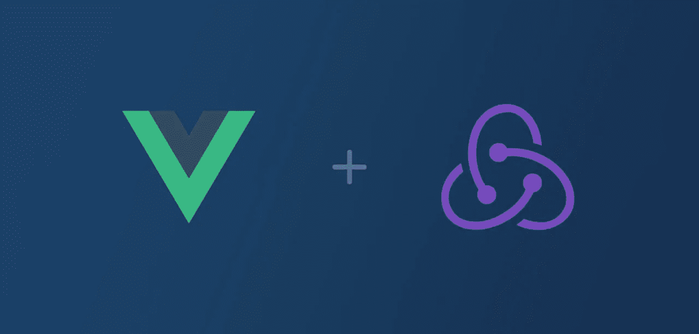

# 通过 Vue.js 使用 Redux + Redux-Observable

> 原文：<https://medium.com/hackernoon/using-redux-redux-observable-with-vue-js-c10faca4b77b>

Photo by [Filios Sazeides](https://unsplash.com/photos/FS3rUiCjJjY?utm_source=unsplash&utm_medium=referral&utm_content=creditCopyText) on [Unsplash](https://unsplash.com/search/photos/binoculars?utm_source=unsplash&utm_medium=referral&utm_content=creditCopyText)

当涉及到重构一个技术栈时，我们经常声称要谨慎。

但是总有一天*需要*来完成任务。

当这种情况发生时，您需要选择正确的工具:

除非你有大量的风投资金，否则你负担不起每个季度进行一次完整的重构。

对于我们自己的购物车 3.0 重写，我们选择了 [Vue.js](https://snipcart.com/blog/progressive-migration-backbone-vuejs-refactoring) 和 Redux。

你说奇怪的组合？不完全是！在这篇文章中，我将向你展示我们如何以及为什么将 Vue.js 捆绑在 [Redux](https://redux.js.org/) 之上。

更具体地说，我将介绍:

*   什么是冗余和冗余可观察
*   为什么我们选择 Redux(而不是 Vuex)
*   我们如何利用 redux-observable
*   我们如何将 Vue.js 插入反应商店

我很高兴终于可以和你们分享我们在最新版本 Snipcart 上的一些工作了！

让我们从一点背景开始。

## 你说的那个购物车 3.0 版是什么？

在过去的几个月里，Snipcart 的整个团队一直在努力为开发人员打造新版本的购物车。

> [阅读我们的文档](https://docs.snipcart.com/getting-started/installation) 以了解我们的 HTLM/JS 驱动的购物车是如何工作的。

我们必须确定的第一件事是改进后的购物车必须实现的目标:

*   提供下一级结帐和购物车模板定制。
*   让开发者使用任何堆栈——这是 Snipcart 从一开始就承诺的。
*   打造市场上最牛逼的电子商务开发 UX。

这些促使我们仔细选择我们的新技术堆栈。

当然，它必须支持简单的定制。然而更重要的是:**它必须授权有经验的和初级的开发人员在不妨碍他们的情况下完成任务。**

我们选择 Vue.js 作为 UI。主要是因为团队*爱*这个 JS 框架。还因为它包含了向购物车添加模板定制所需的所有构件。

> 本文是我们的联合创始人 Charles 在多伦多 vue conf*的* [*演讲的姊妹篇。我们将在即将发布的 3.0 版帖子中更深入地介绍我们的 Vue.js 体验。*](https://vuetoronto.com/)

您可能会认为国家管理层的下一个明显选择是 Vuex。

然而，我们的目标迫使我们跳出框框思考，在那里我们找到了 Redux。这对我们来说是最合理的选择——我们很快就会告诉你为什么。

首先，让我们确保我们在 Redux 是什么的问题上意见一致。

## 什么是 Redux & redux-observable？

简单来说， **Redux 是一个集中式的状态管理库。**

> *如果接下来的内容对你来说听起来像是胡言乱语，我建议在这里* *阅读 Redux 的基础知识* [*。*](https://medium.freecodecamp.org/understanding-redux-the-worlds-easiest-guide-to-beginning-redux-c695f45546f6)

它公开了一个`store`，你的应用程序的状态在这个地方保持安全，可以用这个接口来表示:

*状态*是由`reducers`更新的不可变对象。当一个变化必须影响状态时，我们`dispatch`一个`action`到商店，由 reducers 处理。然后，它的使用者会收到更新状态的新实例。

正是这个简单的契约让我们几乎可以在任何事情上使用 Redux。出于显示的目的，实际上只需要`getState`和`subscribe`，这使得它与视图库的集成非常简单。

Reducers 是接收当前状态和动作，然后返回新状态的函数。它们是同步的，不会有任何副作用:

状态变化的棘手部分完全隔离在减速器和一个额外的机制`middlewares`中，使得用其他功能增加存储变得更加容易。简单来说，我们可以将中间件视为商店的插件。

**这就是 redux-observable 适合谜题**中的 **的地方:它是一个 redux 中间件，利用 [RxJS](http://reactivex.io/rxjs) 允许对商店进行异步操作。**

它在某种程度上类似于 [redux-thunk](https://github.com/reduxjs/redux-thunk) 或 [redux-saga](https://redux-saga.js.org/) ，但是具有观察者模式的所有[能力。](http://reactivex.io/)

稍后会有更多关于 redux-observable 的内容！

## 为什么用 Redux 而不用 Vuex？

你脑海中可能还会有一个问题:“Vuex 不就是用 Vue 来做所有这些事情的吗？”

是的，它是。

但是我们 3.0 版的指导方针很严格——简单的定制和**开发自由**高于一切。所以我们决定把购物车分成两部分:

1.  一个 JavaScript SDK，托管所有的状态管理和购物车逻辑。
2.  一个纤细的 UI 层。我们将首先提供一个具有很好的 UX 和容易定制的默认模型。然后，**开发者应该能够使用任何栈**构建他们自己的栈。

在这一特定背景下:

→ **Vuex 成为一个禁忌，因为它与 Vue.js** 紧密耦合。这会迫使我们的用户使用 Vue。Redux 与众不同，拥有我们需要的一切。

→ **Redux 有一个非常简单的接口，可以和大多数框架一起使用。**与 Vuex 不同，它与框架无关，是作为独立的库构建的。它给了我们通用 SDK 所需的状态管理库。

→ **它周围有一个成熟的社区。我们尝试使用许多利用 Redux 的库。这就给我们带来了最后一项内容:redux-observable。**

## 如何利用 redux-observable？

在 redux-observables 中，**异步 API 调用或副作用可以借助本库的核心概念‘Epics’来实现。**

这是一个动作流，从中我们可以处理我们感兴趣的特定动作，并为 reducers 发出新的动作。我们已经简化了我们的史诗来隐藏简单情况下 RxJS 的复杂性。

这里有一个史诗的基本例子:

RxJS 的`observable`部分和它的流对于去抖动很方便——当用户快速进行多个操作时。例如，用户点击增加购物车中商品的数量。

触发这么多 API 请求是没有意义的，所以使用 ReactiveX 的操作符，我们可以批量处理这些操作并提交一次。

> *Rx 是一种强大但复杂的野兽；你可以在这里* *了解更多* [*。*](http://reactivex.io/)

熟悉 Node.js Express 或其他具有中间件系统的服务器端框架的开发人员不应该迷失在 Redux 中。完全一样——代码可以在调用 reducers 之后的**和**之前运行。

Epics 在减速器之后运行，这允许对减速器和 epics 中的单个动作做出反应:

1.  首先将新项目标记为尚未保存。
2.  然后，创建一个 epic 来调用保存它，并分派一个新的动作来将该项目标记为已保存。

我们还添加了自己的中间件，与商店中的动作流进行交互，以公开更传统的 API。尽管使用反应式商店是正确的方法，但我们有许多客户是 JavaScript 编程的初学者:我们不能要求他们全部使用商店并分派同步操作。

因此，我们构建了简单的中间件来公开一个返回`Promises`并可用于 async/await 的 API，以及另一个发出可订阅事件的 API。

## 我们如何将 Vue.js 插入反应商店

Redux 和 Vue 背后都有庞大的社区，所以交叉是必然会发生的。

不过，截至目前，可供选择的库仅限于:

*   [vuejs-redux](https://github.com/titouancreach/vuejs-redux)
*   [redux-vuex](https://github.com/alexander-heimbuch/redux-vuex)
*   一些没人维护的

我们选择`redux-vuex`是因为它与`vuex`相似:

如你所见，在 Redux 上插 Vue 毫不费力。

我们希望新车的基本 Vue 主题是 Redux store 上的一个薄层。一个充满逻辑的地方。

这样，任何人都可以用他们喜欢的技术制作自己的定制主题。

# 我们将何去何从？

我希望这澄清了我们对购物车重写的堆栈选择。老实说，当我们开始工作的时候，我们很想拥有这样的资源。；)

这只是 snip cart 3.0 版的基础。我们将在博客上发布更多关于构建过程的文章。模板覆盖、SDK 的打包和分发，以及围绕一个反应式核心公开一个基于 promise 的 API，这些都是我们未来几周想在博客上讨论的主题。

所以留下来吧！

现在，如果你需要这篇文章任何部分的更多信息，请在下面的评论中告诉我们。

如果你喜欢这篇文章，请花点时间👏+在 Twitter 上分享。有意见或问题吗？点击下面的部分！

最初发表在 [Snipcart 博客](https://snipcart.com/blog/redux-vue)上，并在我们的[时事通讯](http://snipcart.us5.list-manage2.com/subscribe?u=c019ca88eb8179b7ffc41b12c&id=3e16e05ea2)中分享。