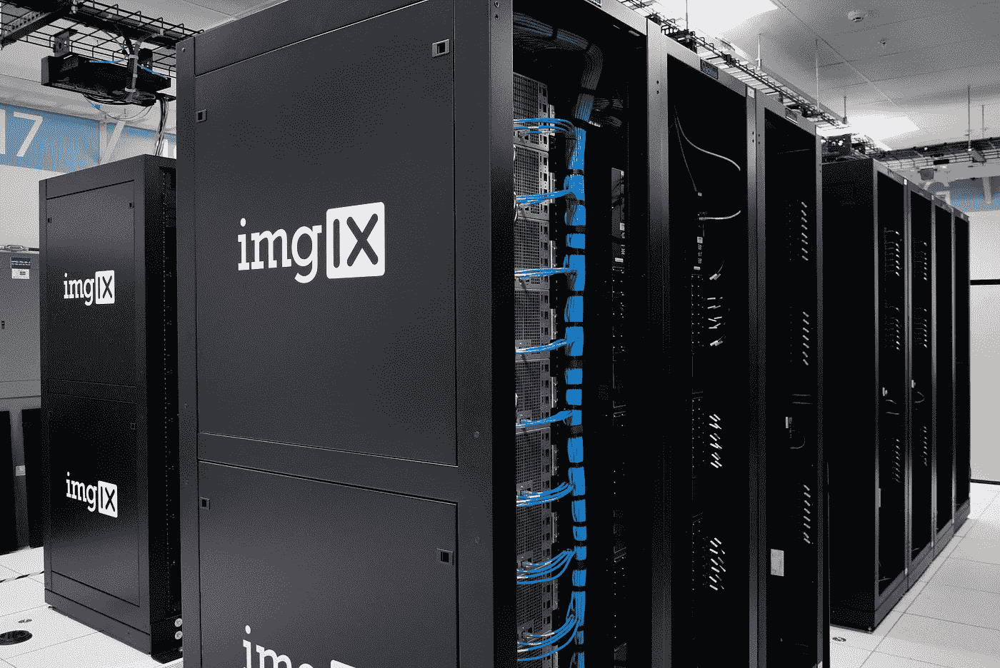

# 使用无服务器体系结构—不是全有或全无。

> 原文：<https://medium.com/hackernoon/using-serverless-archiecture-is-not-all-or-nothing-7697af85286>

Photo by [imgix](https://unsplash.com/photos/pgdaAwf6IJg?utm_source=unsplash&utm_medium=referral&utm_content=creditCopyText) on [Unsplash](https://unsplash.com/search/photos/server?utm_source=unsplash&utm_medium=referral&utm_content=creditCopyText)

去年，无服务器是一个特别热门的话题，引发了大量的炒作。四大云托管公司各自提供自己的解决方案: [Azure Function](https://azure.microsoft.com/en-us/services/functions/) 、 [AWS Lambda](https://aws.amazon.com/lambda/features/) 、[阿里云 Function Compute](https://www.alibabacloud.com/product/function-compute) 和 [Google Functions](https://cloud.google.com/functions/) 。有许多[会议](https://www.youtube.com/watch?v=LAWjdZYrUgI)开始比较和讨论使用无服务器相对于传统[架构的优势](https://hackernoon.com/tagged/architecture)。

通过使用无服务器，我们可以执行事件触发的明确定义的功能，而无需管理和扩展任何基础架构。

自从我开始在我的一些兼职项目中采用无服务器架构以来，我发现我们可以从中获得很多好处。

> 我们不必在无服务器上孤注一掷。

# 利益

**降低运营成本—** 我们不再雇人管理服务器，而是将它“外包”给专家。开发人员可以专注于编写代码，并使用许多其他人已经在使用的预定义服务。其次，我们只为运行该功能所花费的时间付费，而不是为全天候运行的服务器付费。

**更低的扩展成本—** 我们可以选择扩展重要的部分，而不是扩展所有东西或投入更多硬件。大多数时候，峰值出现在应用程序的某个部分，通常会持续一段时间。例如，在电子商务网站的销售期间。如果我们使用无服务器架构与 Stripe 进行支付集成，我们只需在高峰期支付额外的计算容量。

**降低开发成本—** 实际上，其他服务提供商已经提供了许多现成的组件，而不是总是另起炉灶。比如像 [Firebase](https://firebase.google.com/docs/auth/) 、 [Auth0](https://auth0.com) 这样的认证服务，像 [Stripe](https://stripe.com/) 和 [Braintree](https://www.braintreepayments.com) 这样的支付服务。与我们自己开发一切相比，这些现成的组件将为我们节省大量的时间和开发成本。

# 现有项目的可能用例

Photo by [Helloquence](https://unsplash.com/photos/5fNmWej4tAA?utm_source=unsplash&utm_medium=referral&utm_content=creditCopyText) on [Unsplash](https://unsplash.com/search/photos/computer?utm_source=unsplash&utm_medium=referral&utm_content=creditCopyText)

我们可以通过迁移应用程序中特别适合无服务器的部分来利用这一切。如上所述，我认为认证和支付集成将是一个良好开端。它是应用程序的一部分，只是执行一些事件。很少有业务逻辑需要状态。

**认证/注册—** 我们甚至不必迁移整个认证或注册流程。如果你的团队希望增加其他形式的身份验证，如短信验证或改进密码重置功能，我肯定会考虑无服务器。

**图像处理—** 大多数拥有用户帐户的应用程序还为每个用户处理某种形式的头像图像。如果你处理某种形式的照片编辑/调整大小和保存到类似于`S3`的存储器中，那么将这部分更新为无服务器肯定很有意义。这样，您可以减少正在运行的线程或额外的工作线程，并且只为特定函数所用的计算时间付费。

**事件驱动特性—** 如果您的应用程序在每月的特定时间生成某种形式的发票，并向特定用户发送电子邮件，这也是一个很好的无服务器用例。当发票保存到`S3`时，您可以触发`Lambda`运行并使用`SNS`发送电子邮件。我更新了我自己的应用程序的一部分，当一个新的`APP_VERSION.zip`被保存到`S3`时，它会向应用程序的用户推送一个特定的通知，请求允许更新。

# 提高开发速度的框架

随着无服务器架构的成熟，许多伟大的工程师开始创建框架来帮助简化他们的工作。以下是我在开始无服务器架构之旅时比较的一些库。

[Chalice by AWS](https://github.com/aws/chalice) —这是一个 python 框架，允许我们使用 AWS Lambda、API Gateway 和 CloudWatch 快速创建和部署应用程序。

[Zappa](https://github.com/Miserlou/Zappa) — Python 框架，允许我们使用 AWS 部署任何 WSGI 兼容的应用程序。基于 Flask、Bottle 或 Django 构建的应用程序可以很容易地用 Zappa 进行配置。

[Claudia.js](https://github.com/claudiajs/claudia) —轻松将任何 Node.js 项目部署到 AWS Lambda 和 API Gateway。专注于 Node.js 应用程序，自动安装模板，将参数和结果转换为 Javascript 可以轻松使用的对象。

[Apex](https://github.com/apex/apex) —主要在 Go 上构建，但通过使用注入到构建中的 Node.js 填充程序，支持 AWS Lambda 本身不支持的许多其他语言。目前支持 Node.js，Golang，Python，Java，Rust 和，Clojure。

# 结论

简而言之，无服务器在执行**单一目的无状态功能**时效果最佳。我们不必总是选择一种服务器架构而不是另一种。有时，混合架构允许我们利用**不同的优势。**

我希望我做的足以说服你。如果您正在构建一个新功能或试图改进现有功能，请考虑使用无服务器架构。如果它符合上面的场景，那就试试无服务器吧。你可能会发现一些东西，并在此过程中学习新的东西。

# 感谢阅读！如果你喜欢，请点击👏👏👏

我喜欢阅读和写作关于技术和产品的文章，尤其是与提高开发人员的生产力相关的文章。你可以在我的[推特](https://twitter.com/Zaccc123)或者我的[博客](https://zackwan.app)上向我问好。