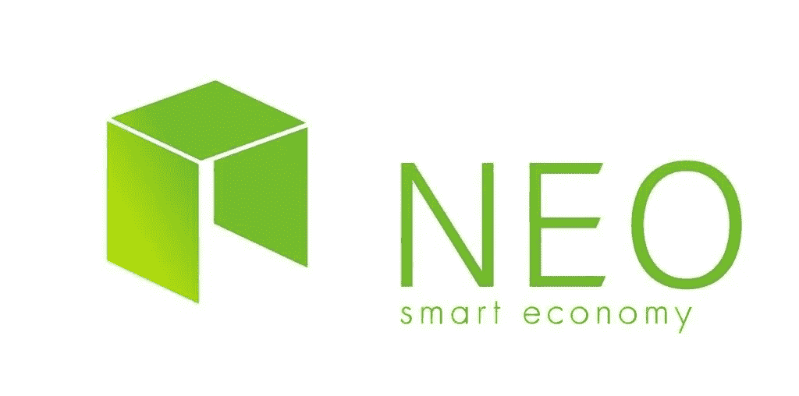

# 用“类固醇”和“新秩序”来设计一个更好的以太坊

> 原文：<https://medium.com/hackernoon/using-steroids-and-the-new-order-to-engineer-a-better-ethereum-ea723198a842>

让我们从工程的角度来谈谈可伸缩性和互操作性。区块链试图解决的主要问题是扩大交易规模以及与其他应用的互操作。以太坊网络是最合适的，因为我们已经知道在 ICO 的使用 ERC20 令牌。图灵完全智能合约是以太坊最广为人知的应用。唯一阻碍以太坊发展的是交易量和网络速度。Cryptokitties 显示了以太坊网络在处理大量交易时是多么低效。以太坊还对交易过程中使用网络收取费用，即“汽油费”，这确实让一些用户望而却步。另一个问题是开发者，以太坊网络使用自己的编程语言 Solidity。它不是你可以用任何你喜欢的编程语言编码的东西，尽管以太坊确实支持其他语言，直到你开发出智能契约。在以太坊开发智能合约，学习扎实还是关键。糟糕的是，这阻碍了一些企业使用智能合同。对于大多数程序员来说，更熟悉的智能合约开发工具更有意义。Steemit、Bitshares 和 EOS 的创始人丹·拉里默提出了一个很好的观点。

EOS, scalable decentralized platform for distributed applications.

这就是为什么有 NEO，我称之为来自中国的“新以太坊秩序”,而 EOS 又被称为“类固醇以太坊”。NEO 也被称为“中国以太坊”，从工程的角度来看，它的一个优点是能够在他们的平台上使用流行的编程语言(如 Java、C#、JavaScript、Go、Kotlin 和 Python)开发智能合约。这对大多数开发人员来说是受欢迎的，因为他们不需要学习新的编程语言和 IDE。EOS 也不需要新的编程语言，因为它基于 C++，这是大多数开发人员已经熟悉的。这两个加密货币项目都在构建基于以太坊的平台。它们都比以太坊更先进，并且具有满足交易需求和网络速度的可伸缩性。我们谈论的是最适合互操作性和大规模交易的工业级系统，以太坊甚至比特币都缺乏这种系统。EOS 和 NEO 都基于以太坊区块链，但旨在改进它。

NEO, a smart economy platform for digital assets that utilizes smart contracts

EOS 正在区块链建造一个平台，允许 DApps 运行。因此，EOS 类似于“以太坊操作系统”,但它只是基于以太坊，因为它使用自己的令牌，也称为 EOS。EOS 就像分布式应用程序的窗口，在一个分散的平台上执行智能合同。NEO 也模仿以太坊创建了一个网络来改进它的缺点。NEO 提供了一个比以太坊更具可扩展性和安全性的智能合约，具有更友好的用户界面。现在有另一个类似的项目叫做 Cardano，我在这里没有包括它，因为它是 ADA 或者只是“另一个分布式应用”。

因此，“类固醇”和“新秩序”将提供可扩展到每秒数百万次交易的技术，消除用户费用，并允许更快速、更简单地部署分散应用程序。就像制造一个更好的以太坊，那不是以太坊。NEO 和 EOS 都非常兴奋。现在是时候看看它们作为 GPT(通用技术)的潜在效用了。

延伸阅读:

NEO—[https://en . Wikipedia . org/wiki/NEO _(加密货币)](https://en.wikipedia.org/wiki/NEO_(cryptocurrency))

https://eos.io/[EOS](https://eos.io/)