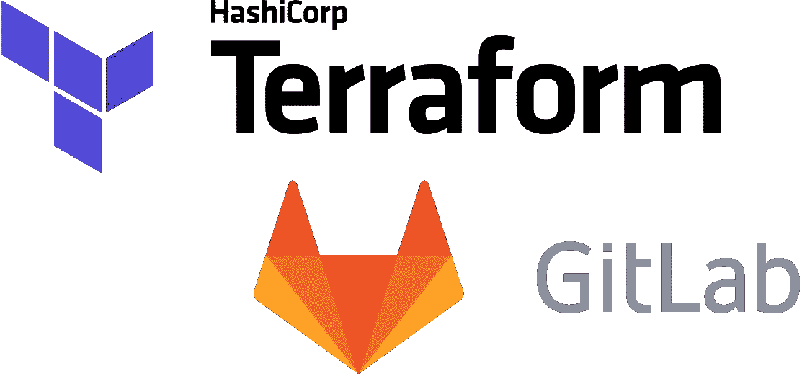

# 使用 Terraform 部署 GitLab Review 应用

> 原文：<https://medium.com/hackernoon/using-terraform-for-gitlab-review-apps-acf05920a264>



GitLab Review Apps 是一种管理动态环境的便捷方式，用于在合并到您的主分支之前审查变更。GitLab 拥有强大的 Kubernetes 支持，可以轻松地部署到您的集群中，但是如果您的应用程序没有很好地容器化，或者您的团队没有准备好接受 Kubernetes，您该怎么办？你这个地球人！

# 将（行星）地球化（以适合人类居住）

Terraform 是一款优秀的云无关工具，用于将基础设施开发为代码。通过结合 Terraform 的几个特性，我们可以很容易地构建一个部署评论应用的系统。

## 1.工作区

[工作区](https://www.terraform.io/docs/state/workspaces.html)提供了一种配置和管理多套相同基础设施的方法，无需复制 Terraform 配置文件。如果您熟悉 Terraform 及其`.tfstate`文件，您可以将工作区视为创建和管理新的任意命名的`.tfstate`文件。

例如，`terraform workspace new $BRANCH`创建了一个新的工作空间，用环境变量`$BRANCH`的值来命名。这创建了一个新的空白`.tfstate`，意味着`terraform apply`将提供一组新的资源，这些资源独立于任何其他工作区管理的任何资源。

## 2.远程状态

[远程状态](https://www.terraform.io/docs/state/remote.html)是一种跨多台机器持久化地形状态的方法，通过将`.tfstate`文件存储在几个受支持的远程存储机制之一，如亚马逊 S3。虽然这最常用于允许人们在基础设施上协作工作，但它可以很容易地在 GitLab 作业中使用，以提供和跟踪由 Terraform 管理的基础设施。

这里的关键是远程状态持久化工作区，允许 GitLab CI/CD 跨不同的作业引用为每个分支创建的工作区，这些作业将在不同的时间从不同的机器上运行。

# GitLab CI/CD

这个的`.gitlab-ci.yml`配置非常简单，但是有几个关键点。

这里有三个重要的配置，都在`environment`模块中。

1.  `name`是环境本身的动态构建名称。在这种情况下，它基于`CI_COMMIT_REF_SLUG`变量，该变量是分支名称的 URL 友好表示。
2.  `url`是 GitLab 关联到环境的 URL。请注意，GitLab 不会为此创建 DNS 记录，而是由您自己来创建。
3.  `on_stop`告诉 GitLab 当分支被关闭或环境被手动停止时应该触发哪个作业，从而完成了使这成为一个*评审应用*而不仅仅是一个动态命名的环境。

配置的`script`部分是 Terraform 的用武之地。

我们需要将 Terraform 配置存储在这个存储库之外，因为我们需要配置文件在分支关闭后可用。

在克隆这个存储库时引用一个特定的 Git 标记是必要的，这样可以确保用于提供这些应用程序的基础设施不会在您不知道的情况下发生变化。

如前所述，Terraform Workspaces 是一个重要的功能，它使使用 Terraform 查看应用程序成为可能。我们可以定义运行应用程序所需的基础设施，然后使用*工作区*来管理该基础设施的独立副本。

```
terraform workspace select $CI_COMMIT_REF_SLUG || terraform workspace new $CI_COMMIT_REF_SLUG
```

在这里，我们选择以值`$CI_COMMIT_REF_SLUG`命名的工作区，如果它不存在，我们就创建它。这确保了我们可以从单个分支多次运行`StartReview`作业，而不会出现问题。

脚本的其余部分是一个标准的`terraform apply`，后面是一些特定于 CodeDeploy 的内容。我不打算在本文中讨论部署细节，因为有许多工具可以用来做这件事，但是如果你对设置 CodeDeploy [感兴趣，我在过去曾经写过相关的文章](https://hackernoon.com/deploy-to-ec2-with-aws-codedeploy-from-bitbucket-pipelines-4f403e96d50c)。

`StopReview`的工作与`StartReview`非常相似。

设置为`none`的`GIT_STRATEGY`环境变量确保 GitLab 在运行该作业时不会试图克隆分支。这是必要的，因为此作业可能在分支关闭后运行，因此没有任何内容可克隆。

`action: stop`和`name`属性的组合告诉 GitLab 这个作业应该在哪个环境中停止。这里的`name`需要与`StartReview`中设置的`name`相匹配。

回到脚本，我们再次用前面使用的相同标签克隆 Terraform 存储库。

我们选择与该分支机构对应的 Terraform 工作区(如果我们正在运行该作业，则已经创建了该工作区),并运行`terraform destroy -auto-approve`来取消为该分支机构的审核应用程序创建的基础架构。

为了清理一切，我们然后切换`default`工作区并删除我们为这个分支创建的工作区。Terraform 不允许你删除当前选中的工作空间，这也是我们需要切换回`default`的原因。

此时，您应该拥有可以根据分支机构名称随意动态调配的基础架构，然后在分支机构关闭时随意销毁或自动销毁。在此基础上集成您选择的部署工具将为您提供具有自己的基础设施的全功能评审应用程序，即使您的应用程序尚未为 Kubernetes 做好准备。

跟随 [Jared Ready](https://medium.com/u/bc152e4dcd63?source=post_page-----acf05920a264--------------------------------) 获得更多 DevOps 好处！

👏如果你喜欢这本书！