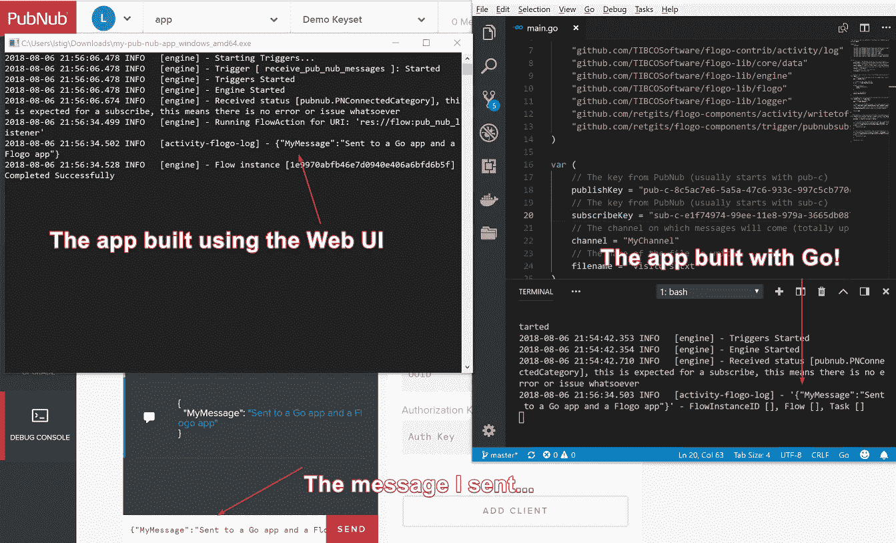

# 在弗洛戈使用 Go

> 原文：<https://medium.com/hackernoon/using-the-go-in-flogo-6a99089dc94>


Flynn has a new friend… a proper gopher :)

不久前 [Flogo](http://bit.ly/2B3dRRT) 推出了新的 [go API](https://godoc.org/github.com/TIBCOSoftware/flogo-lib/flogo) ，它允许你通过简单地在你现有的 Go 代码中嵌入 [Flogo](https://hackernoon.com/tagged/flogo) 引擎来构建事件驱动的应用。现在，您可以使用 Flogo 的事件驱动引擎来构建 go 应用程序，同时使用已经存在的活动和触发器，并将其与“常规”Go 代码相结合。[在我的另一篇文章](http://bit.ly/2PfmAmi)中，我构建了一个可以从 PubNub 接收消息的应用，在这篇文章中，我将使用 Go [API](https://hackernoon.com/tagged/api) 来构建一个完全相同的应用。

*注意:我意识到代码的某些部分没有尽可能地优化，但是我想保持类似于我在 Web UI 上所做的流程*

要运行这个示例，您需要安装 Go，并从您创建带有源代码的文件的地方执行这些命令(源代码必须在您的`$GOPATH`中)

**获取所有依赖关系**

```
#If you already have Flogo or the Flogo CLI, you can skip these
go get -u github.com/TIBCOSoftware/flogo-contrib/activity/log
go get -u github.com/TIBCOSoftware/flogo-lib/core/data
go get -u github.com/TIBCOSoftware/flogo-lib/engine
go get -u github.com/TIBCOSoftware/flogo-lib/flogo
go get -u github.com/TIBCOSoftware/flogo-lib/logger# You will need to go get these :)
go get -u github.com/retgits/flogo-components/activity/writetofile
go get -u github.com/retgits/flogo-components/trigger/pubnubsubscriber
```

**生成元数据**

Flogo 引擎需要一些元数据，为了生成这些元数据，需要执行文件顶部的那一行。为此，只需运行下面的命令:

```
go generate
```

**构建并运行**

既然“困难”部分已经完成，您就可以像构建任何 Go 应用程序一样构建应用程序了:

```
go build
./pubnub-app
```

# 测试它

如果你用和我上一篇文章一样的方法测试它，你会看到同样的状态消息，就像在 Web UI 的例子中一样，当你用完全一样的方法测试应用程序时，你会看到两个应用程序都会收到同样的消息！



无论你是 Go 开发人员还是可视化地构建微服务的人(通过一个非常酷的 Web UI)，你都可以使用 [Flogo](http://bit.ly/2B3dRRT) 来完成！如果你正在试用 Flogo，并且有任何问题，请随时加入我们的 [Gitter 频道](https://gitter.im/project-flogo/Lobby)，在 [GitHub](https://github.com/TIBCOSoftware/flogo) 上发表一个问题，或者甚至在 [Twitter](http://bit.ly/2B3LsuW) 上给我留言。如果你认为这有帮助(或没有帮助)，我也很乐意得到你的反馈。