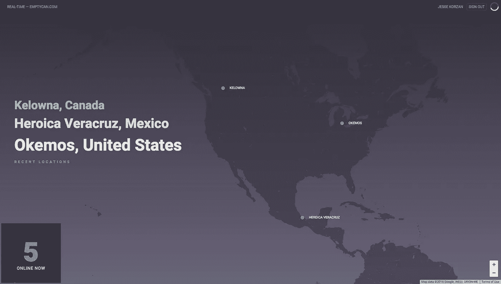
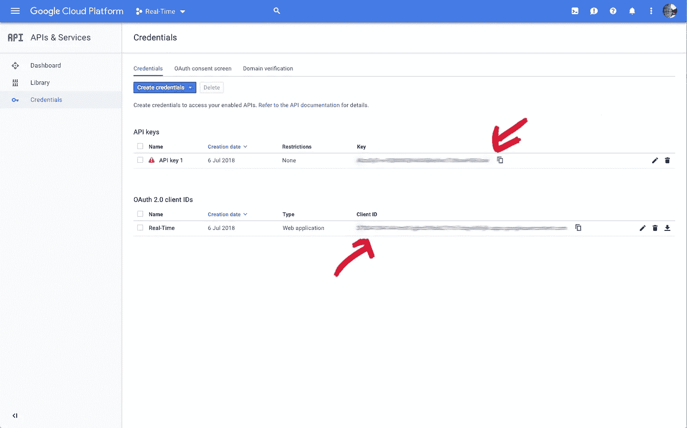
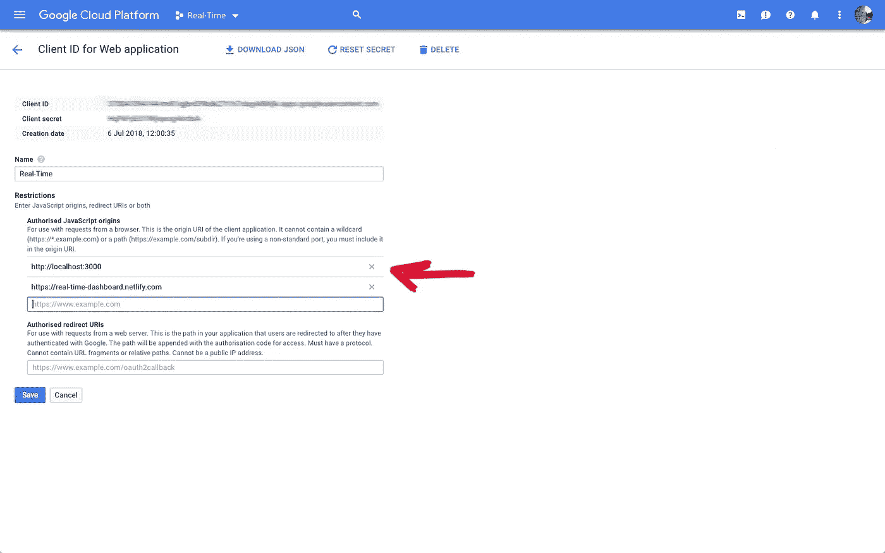
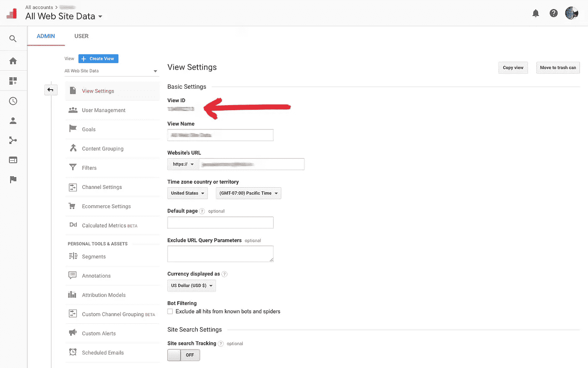

# 使用谷歌实时报告 API

> 原文：<https://medium.com/hackernoon/using-the-google-real-time-reporting-api-71ce3f6ceee4>

为您的办公室制作一个实时仪表板

Don’t want to code? Try it here — [https://real-time-dashboard.netlify.com/](https://real-time-dashboard.netlify.com/)

我喜欢看着世界各地的人们在一天中走进克鲁。这是对使用我们软件的人们的有力提醒。它还能在工作日制造一点兴奋感。看到来自各种国家的访问或使用量的大幅增长是很有趣的。

我想和我的团队分享这种兴奋感，所以我建了一个基于网络的仪表盘，在我们的办公室里播放。

# 此处代码:[https://github.com/jessekorzan/real-time-dashboard](https://github.com/jessekorzan/real-time-dashboard)

# 不想编码？演示:【https://real-time-dashboard.netlify.com/ 

## 说明

使用 Google 实时报告 API 实际上非常简单。任何拥有 HTML/CSS 和 JS 技能的人都可以为自己构建一个可爱的仪表板。

在网上很难找到这方面的信息。我在这里详细介绍了关键部分，并提供了一个到我的 Github repo 的代码示例链接。希望这能为其他人节省几个小时的拔头发时间。

## 在编写任何有效的代码之前，您需要在配置中包含三条关键信息:

*   *谷歌分析 viewID*
*   *一个 API 密钥*
*   *一个 ClientID*

**首先…** 我假设你有一个谷歌帐户(电子邮件),并且可以访问你的网站或项目的谷歌分析。

**其次…** 我假设你对谷歌开发者控制台有所了解。*现在就去那里登录:*[*https://console.cloud.google.com/*](https://console.cloud.google.com/)

# 配置(在编写任何代码之前)

**第一步——创建一个新项目(*试试左上角下拉菜单*)** [***https://console.cloud.google.com/***](https://console.cloud.google.com/)

**步骤 2 —为这个新项目创建凭证:**[***https://console.cloud.google.com/apis/***](https://console.cloud.google.com/apis/)

首先…您需要一个 API 密匙，因此点击蓝色的“**创建凭证**”按钮并选择 API 密匙

其次…你需要一个 OAuth 2.0 客户端 ID，所以点击蓝色的“c **创建凭证**按钮，为“ **web 应用程序**创建一个凭证

最后，我们需要确保您的开发和现场域可以访问这个项目。在“**授权的 JavaScript 源**”下，让我们添加您的本地开发和活动域(例如:http://localhost、、http://emptycan.com、等[)。](http://localhost,)

API key & clientID

Authorised JavaScript origins

**步骤 3——为该项目启用合适的 API。**

从项目的主 API 仪表板中…单击“启用 API 和服务”。

**您需要“启用”两个 API“Javascript Map API”和“Analytics API”(不是 Google Analytics API……令人困惑，是的，但忽略那个)。**

**步骤 4——因为 Google 实时报告 API 是有限发布的，所以您需要注册您的项目才能访问。**

**完成此表格:**[https://docs . Google . com/forms/d/e/1 faipqlsc 9 opodgb 3 TBD 7 oy 1 og 9 fyum 8 kbixs-2 hpcshp 13 wtnm-SSQ/view form](https://docs.google.com/forms/d/e/1FAIpQLSc9OpoDGB3tBD7oy1OG9fyum8KBIxs-2ihPCsHp13WTnM-SSQ/viewform)

*注:请特别注意查找您的项目 ID 的说明*

**第 5 步——谷歌分析视图 ID**

这个很简单…登录你的谷歌分析账户，进入管理区。找到您对实时数据流感兴趣的酒店(中间一列)。在随后的最右边一栏中，标题为“查看”…单击“查看设置”。在顶部，您将看到视图 ID。将它复制到某个地方，以便稍后包含在您的代码中。

Get the View ID

# 代码示例

我在 React 中写了我的矿，但是你可以从其他 JS 项目中吸取很多东西。

此处代码:[https://github.com/jessekorzan/real-time-dashboard](https://github.com/jessekorzan/real-time-dashboard)

## 摘要

该应用程序可以通过三个基本步骤来工作。

*   使用 Google Auth 登录(没有身份验证，API 请求不起作用)
*   使用上一步中的访问令牌访问 API 端点
*   处理结果并呈现您的实时视图

为了获得更新的结果，你必须经常使用一种技术来轮询 API。我使用 requestAnimationFrame(每 30 秒一次)。分析 API 的速率限制是每天 50K。

无论你用什么方法进行谷歌认证，你都必须提供正确的“https://www . Google APIs . com/Auth/analytics”范围。否则，什么都不会发生。

我使用了优秀的 React 组件“React-Google-oauth”[https://github.com/CyrilSiman/react-google-oauth](https://github.com/CyrilSiman/react-google-oauth)

很容易添加范围并让身份验证按照我的意图工作。

完成以上所有工作后，你可以自由地使用 Fetch 或 Ajax(或任何你喜欢的风格)来 ping API 并获得一些实时结果。在我的例子中，你可以看到我放入了谷歌地图，但这不是必须的。

## 了解 Google 实时报告 API 能做什么！

摆弄不同的维度和度量标准很有趣。

***一个好的起点就是这里:***[***https://developers . Google . com/APIs-explorer/# p/analytics/v3/analytics . data . real time . get***](https://developers.google.com/apis-explorer/#p/analytics/v3/analytics.data.realtime.get)

之后…我的代码会更有意义。

*如果您有问题或需要帮助，请主动联系我们。*

*代码示例:*[*https://github.com/jessekorzan/real-time-dashboard*](https://github.com/jessekorzan/real-time-dashboard) *演示:*[*https://real-time-dashboard.netlify.com/*](https://real-time-dashboard.netlify.com/)