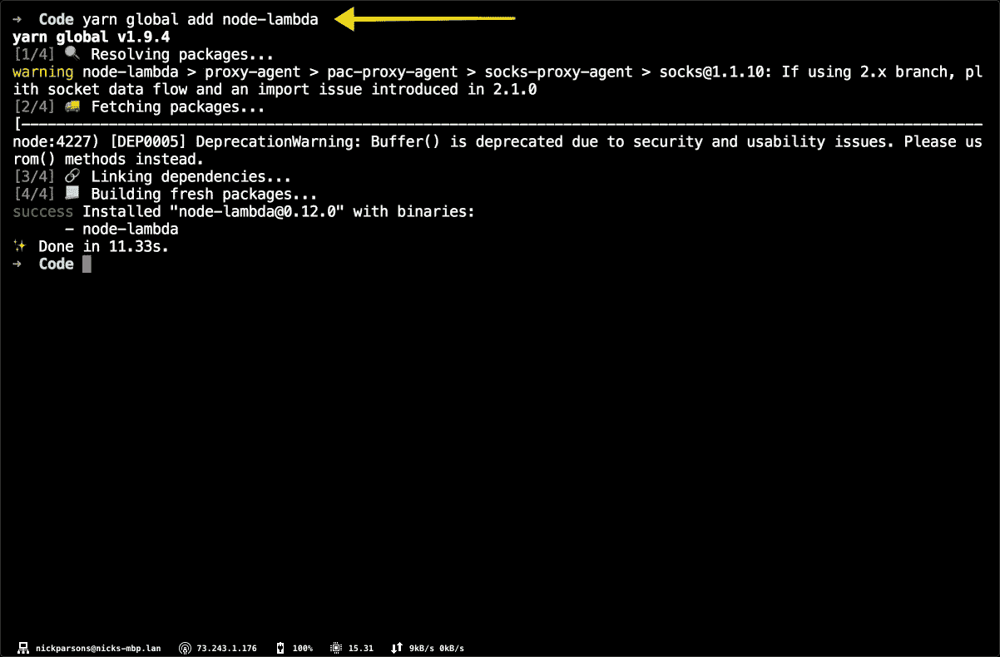

# 将流实时消防软管与自动气象站 SQS、拉姆达和 SNS 一起使用

> 原文：<https://medium.com/hackernoon/using-the-stream-real-time-firehose-with-aws-sqs-lambda-and-sns-25bbefef198a>

https://getstream.io/try-the-api

流式传输使您能够使用 SQS、webhooks 或 websockets 近乎实时地收听费用变化。在本教程中，我们将讨论如何使用 AWS[SQS](https://aws.amazon.com/sqs/)&[λ](https://aws.amazon.com/lambda/)来响应提要更新。

虽然 websockets 是监听变化的首选方法，但是 SQS 通知在提要基础设施中有着特殊的地位。Stream 在提供实时性的能力方面大放异彩，因为您可以与收到的结果进行交互。例如，您可以监听订阅源的变化，并通过向用户发送电子邮件来吸引他们购买，根据应用程序中采取的操作发送 SMS 消息，等等。

这篇文章的目标是让你带着对 AWS SQS、Lambda，当然还有 Stream 的深刻理解离开。

> *注意:为了确保你能从头到尾跟进，请创建一个帐户或确保你有使用上述服务的必要权限——我们不会在 AWS 内讨论权限。*

# 建立 SQS

设置 AWS SQS 相当简单。登录后，前往 SQS 页面。从那里，我们可以选择创建一个新队列。单击“立即开始”按钮。

接下来，您将看到新队列的设置页面。对于名称，请将其设置为“STREAM”。然后，选择左边的选项(“标准队列”)。

创建之后，我们需要为新创建的流队列指定权限。在本教程中，我们将向全世界开放它。

> *注意:千万不要这样做——我这样做只是为了举例。始终锁定您的服务，只让需要访问的应用程序和用户进入。😜*

点击“添加权限”，你应该设置！

# 设置用于 SQS 的流

在开始之前，我们需要为 Stream 创建一个用户。我更喜欢创建一个单独的用户，这样我就可以更改权限；但是，如果您愿意，您可以自由使用现有的密钥和秘密(如果是这种情况，请跳过本节的第一部分)。

# 创建新的 IAM 用户和角色

该流程的第一步是前往 AWS 的 [IAM 部分](https://console.aws.amazon.com/iam)。一旦你在那里，点击“用户”，然后“添加用户”。

对于“用户名”，输入“流”，对于“访问类型”，选择“编程访问”。单击“下一步”按钮继续下一步。

在上图中，您会注意到我们选择了 **AmazonSQSFullAccess** 作为策略名称。这将确保您正在创建的用户能够访问 SQS。除了将“组名”设置为“流”之外，您还需要做同样的事情。

> *注意:您需要搜索该保单。为此，只需在搜索框中输入 SQS。*

创建“流”角色后，继续进入评审阶段。

最后，继续创建一个用户！

复制“访问密钥 ID”和“秘密访问密钥”——您将在下一步中需要它们。

# 把它接到溪流上

现在，让我们继续将我们的 API 密钥和秘密放入流仪表板，以便流后端知道将出站消息路由到哪里。

**步骤**:

1.  转到[流仪表盘](https://getstream.io/dashboard)
2.  创建一个名为“user”的平面提要(确保启用通知)
3.  点击“用户”订阅源
4.  通过单击标有“活动”的按钮启用 SQS 通知
5.  填写 SQS 网址、AWS 密钥和 AWS 密码
6.  点击右上角的保存按钮

> *注意:对于流 SQS 特性的完整解释，您可以在这里* *查看文档* [*。*](https://getstream.io/docs/#realtime-sqs)

# 配置 Lambda

AWS Lambda lets 将允许我们在不提供或管理服务器的情况下运行代码。这个服务对于解码作为有效载荷发送到 SQS 的 base64 编码的字符串来说很方便。一旦信息被解码，你可以做任何事情——发送短信、电子邮件等。

让我们从设置 Lambda 开始。首先，你会想去 AWS 的 Lambda 部分(通过搜索栏很容易找到)。如果你是一个新用户，请完成这个简短的 2 分钟教程。如果你以前做过，那就直接加入吧。

第一步是创建一个新的 Lambda 函数，如下图所示。要复制我的配置，您需要执行以下操作:

*   选择“从头开始创作”框
*   将您的函数命名为“流”
*   将 Node.js 运行时更新到 Node.js v8.10(已过时，但这是 Lambda 上可用的最新版本)
*   将您的“角色”名称指定为“流”
*   包括“SQS 轮询器”权限

完成后，点击屏幕右下角的“创建功能”。

一切就绪！让我们继续下一步。如果成功，您应该会看到一个与此几乎相同的屏幕:

为了允许 Lambda 函数访问 SQS，需要进行一些小的配置。幸运的是，这一步只需要几次点击。

1.  在“设计者”部分下，点击可滚动部分中的“SQS”
2.  在“配置触发器”部分，搜索您的 SQS 队列(在我们的例子中，它将被命名为“流”)
3.  将批量保持在 10
4.  选中“启用触发器”
5.  最后，点击“添加”

# 向 Lambda 发送 SQS 消息

为了将 SQS 连接到 Lambda，我们将使用 Lambda 函数的 ARN。最简单的方法是进入 SQS 页面，点击“队列操作”，然后点击“触发一个 Lambda 函数”。这样做会打开一个对话框。

从下拉菜单中选择“流”, Lambda 函数 ARN 将自动填充。完成后点击“保存”。*连接完全启动并运行大约需要 30 秒到 1 分钟*。您可以在“Lambda Triggers”部分看到状态，如下图所示。

# 测试 Lambda 功能🐑

现在我们已经连接了 SQS、Lambda 和 Stream，让我们运行一个端到端测试来确保消息到达 Lambda 函数。

在 Lambda 页面上，指定函数的内容如下:

然后点击右上角的“保存”按钮。

一旦你成功保存了你的 Lambda 代码，你将需要点击“Monitoring ”,这将带你到另一个页面。重定向后，单击“在 CloudWatch 中查看日志”。

回到您之前配置 SQS 设置的 Stream dashboard。将会有一个标有“测试 SQS”的便捷按钮。点击这个会发送一个测试载荷到 SQS，*应该*然后转发到 Lambda，在那里它会被登录到 CloudWatch。咻！😅

您应该在有效负载中看到的是一个 tweet 活动的示例活动(如上所示)。如果 CloudWatch 中没有显示任何内容，请尝试重新加载。如果这不起作用，再次运行上面概述的步骤，以确保您已经检查了每个框。

# 将有效载荷输送到 AWS SNS

让我们对示例负载做一些事情。我打算建议我们使用 AWS SNS 将有效负载作为文本消息转发。要启用 SNS，我们需要将**amazonsfullaccess**添加到流用户。为此，请回到 AWS 的 IAM 部分([这里是](https://console.aws.amazon.com/iam))。从那里，单击**组>流>添加权限>附加策略**并从下拉菜单中选择**amazonsfullaccess**和 **AWSLambdaFullAccess** 。选择后，单击右下角的“附加策略”。

您的权限现在应该是这样的:

流用户现在拥有 SNS 的权限，所以让我们继续设置它。前往 AWS 的 [SNS 部分，点击“开始”。下面列出了后续步骤:](https://console.aws.amazon.com/sns/)

**步骤:**

1.  点击“创建主题”
2.  将您的“主题名称”和“显示名称”设置为流，然后单击“创建主题”
3.  复制你的“话题 ARN ”,因为你会需要它

接下来，我们需要修改我们的 Lambda。正如你可能注意到的，在编辑器中修改 Lambda 代码是相当困难的——或者至少是在更大的范围内。相反，我建议在您的计算机上创建一个新的 Node.js 项目，并安装 [node-lambda](https://www.npmjs.com/package/node-lambda) 。这个非常棒的小模块能够毫不费力地将 Lambda 设置、试运行、打包并部署到 AWS。

在您的本地机器上创建一个名为“stream”的目录，并移动到该目录中。一旦进入，运行命令“node-lambda setup ”, node-Lambda 包将为您引导一个 Lambda。运行安装程序后，最好忽略生成的 **event.json** 和**。env** 文件，以及**.λ**

# 复制并粘贴以下命令

> *注意:对于那些不熟悉命令行的人，上面的命令会创建一个新文件(index.js)并安装我们需要的所有节点模块。*

按照终端中的提示完成。

# 修改您的 package.json 文件

打开 package.json 并将脚本部分更改为:

# 打开。包络并修改您的关键点

在您生成的目录中，应该有一个**。env** 文件并粘贴您的 AWS 凭证、角色 ARN(您之前已经复制过了),并填充其余的参数以匹配您在 AWS 中的配置。我建议您指定以下设置:

# 更新 index.js 文件

使用以下代码更新 index.js 文件:

> *注意:作为一个例子，我们仍然在记录 Stream 发送的内容。*

最重要的是，部署您的代码！

# 修复 SQS 连接

当我们这一次部署时，它创建了一个称为“流开发”的 Lambda，或者应该有，假设你按照指示去做。如果您没有将 Lambda 命名为“STREAM ”,请遵循您的命名约定。

假设这是一个新的 Lambda，我们将需要添加一个新的“触发器”。这和我们之前在帖子里做的一样，所以这里没有什么新东西。只需点击 AWS Lambda 页面左侧抽屉中的 SQS(对于您的新 Lambda)，并在必要时指定配置。

# 将 Lambda 与 SNS 主题相关联

还记得我们创造的主题中的 ARN 吗？现在是使用它的时候了。打开你的。env 文件，创建一个名为 **AWS_SNS_TOPIC_ARN** 的新环境变量，并将值设置为您生成的 SNS 主题 ARN。

# 创建您的产品升级和技术支持服务订阅

在我们总结和测试之前，我们需要为您的电话号码生成一个套餐。这可以在 AWS 控制面板的 SNS 部分完成。要创建订阅，请点击**主题** > **选择您现有的主题**并点击“创建订阅”。将协议指定为 SMS，并且端点应该是有效的 E.164 格式的电话号码(例如 1–555–555–5555)。

# 上传最终代码

这个 SNS 设置的倒数第二部分是上传一些更新的代码到你的 Lambda 函数。只需用下面的代码更新您的 **index.js** 文件，并使用 **yarn deploy** 命令将其推送到 AWS。

# 全部完成！

恭喜你！您已经使用 Stream、AWS SQS、Lambda 和 SNS 设置了一个端到端测试，以便在提要发生事件时发送 SMS 消息(即使您是按下“测试 SQS”按钮的人😉)

我已经在 GitHub 上托管了回购，所以如果你遇到问题，请随意克隆它:[https://github.com/nparsons08/stream-sqs-lambda-sns](https://github.com/nparsons08/stream-sqs-lambda-sns)

我也可以回答下面评论中的任何问题。

编码快乐！👋