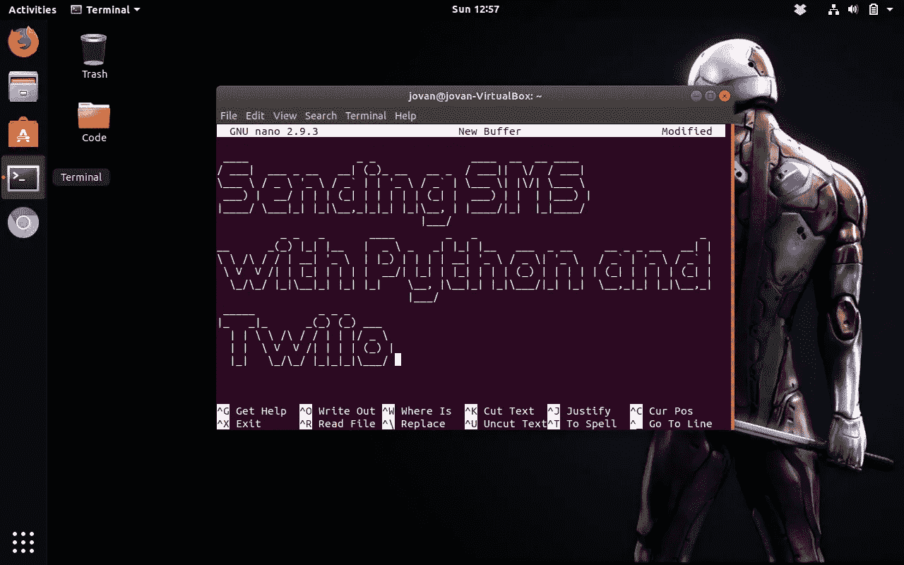

# 使用 Twilio 通过 Python、Flask 和 Ngrok 发送 SMS 文本

> 原文：<https://medium.com/hackernoon/using-twilio-to-send-sms-texts-via-python-flask-and-ngrok-9874b54a0d3>

Python 在很多方面都很棒。特别是，有一件事是编写代码来开发和部署简单的 web 应用程序，以实现您业务中可能需要的特定功能或实用程序。在本教程中，我将讲述如何使用通信 REST API 、 [Python 的 Flask 微框架](http://flask.pocoo.org)和云服务 [ngrok](https://ngrok.com) 来集成 [Twilio 的可编程短信系统](https://www.twilio.com/docs/api?filter-product=sms)