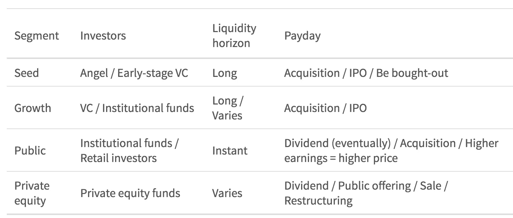
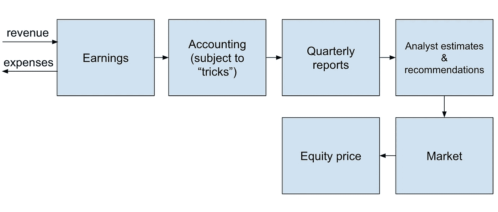
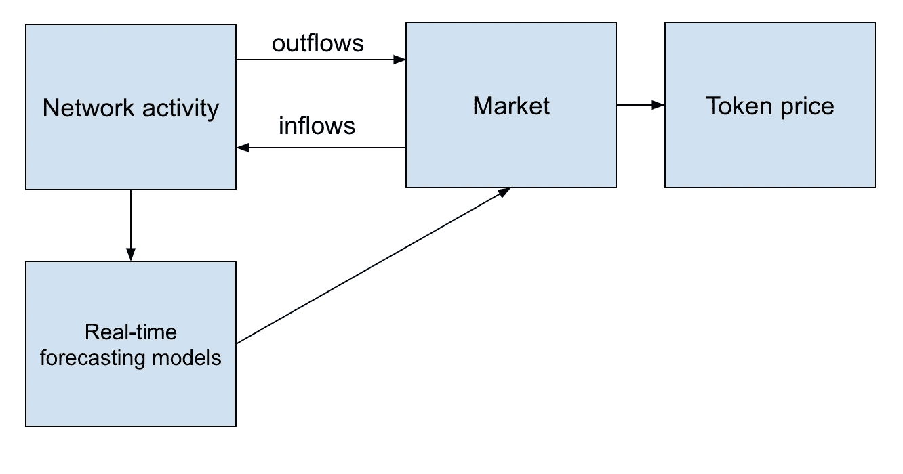

# 效用令牌:一种新的价值获取机制

> 原文：<https://medium.com/hackernoon/utility-token-a-new-value-capture-mechanism-495caef81839>

汇集公共资本为雄心勃勃的项目提供资金的概念并不新鲜。早在 17 世纪，荷兰股票市场就已经相当发达。另一方面，实用令牌是一个全新且未经测试的现象。本文的目的是比较股权和公用事业代币，并探讨以下问题:

> 股权是不是代表了官僚主义的象征化，而效用象征是试图在更接近创造价值的地方获取价值？

让我们先从高层次快速审视一下股票市场是如何运作的。

# 股票

从经济学的角度来看，股权所有权使一个人有权分享未来的利润，如果公司被收购，还有投票权。因此，股权可以被估价和出售，以获得现金为项目融资。换句话说，未来的价值可以被“捕捉”并出售给投资者。

作为一种可交易资产，股权的一个独特属性是其价格往往是公司预期利润以及资产负债表上项目价值的函数。我们稍后将研究这个过程是如何工作的。

股权市场可以粗略地描述为一个管道，根据企业的成熟度和公司股权是否有公开市场来划分不同的部分。

Equity pipeline

让我们暂时关注一下公共股票。通常如果一家公司做得很好，它的股价就会上涨，反之亦然。让我们来看看这个链接是如何工作的。

用于评估金融工具(包括股票)价值的最常用技术是贴现现金流(DCF)分析。作为对未来收益的要求，权益价值是所有未来收益的净现值。如果人们可以预测收入和费用来估计未来每个季度的收益，他们可以将收益贴现回今天，以得出“公平”公司的市值。

每个季度，公司都会发布一份收益报告，同时还会召开一次电话会议，会上有演示和问答环节。分析师们不断更新他们的模型，以反映所有可用的信息。他们将最新报告的数字和预测代入模型。模型给出了新的目标价格，促使交易者相应地调整他们的头寸，推动市场，直到达到新的均衡价格。这一过程确保长期来看，股票价格跟踪公司的经营业绩，使投资者能够抓住上升的机会。

我认为称这一过程为官僚主义的象征化是公平的。未来公司的收益被令牌化，令牌的价值(即股票)通过高度人工化的官僚程序与企业业绩挂钩

Equity value capture

很容易看出，这种机制远非完美:

*   信息差距。公司每季度发布收益。在这两个季度之间，投机活动猖獗。市场操纵和内幕交易时有发生。
*   虽然有会计准则，如 GAAP，但公司仍有办法调整数字，使其更有利。一个极端的例子是安然公司。最近， [Valeant](http://fortune.com/2015/10/31/valeant-scandal/) 提出了许多问题。
*   会计和监管负担。上市公司花费数百万美元来制作监管机构要求的文档，如 forms 10-Q、10-K 和审计。偶尔，会有需要纠正的错报，引发更多的支出和信息失真。

私营公司不必处理上述许多项目。然而，从投资者的角度来看，私募股权是一种缺乏流动性的资产，基本面不明朗，因为没有报告要求。这导致风险溢价上升，进而大幅降低估值。再加上缺乏流动性，这导致用于推动创新和增长的资本减少。

# 新的方式

越来越多的公司开始使用点对点网络模式:优步、Airbnb、Upwork、亚马逊卖家中心和许多其他公司。事实上，任何企业，连同其价值链和客户，都可以表示为一个参与者网络。

传统上，在这样的网络中，货币化是通过插入参与者之间的公司进行的。该公司提供有价值的服务，并对网络内部的活动收取费用。投资者通过购买该公司的股票来获取价值，其回报与未来收取的费用挂钩。例如，当优步上市时，许多人会大捞一笔。

现在，如果有一种方法可以创造一种价值与网络基本面直接实时关联的资产，而不是通过官僚主义，那会怎么样？有可能区块链已经给了我们一个——公用事业代币。

但是首先，为了本文的目的，让我们定义一下实用程序令牌:

**公用事业权标是一种稀缺资产，是进出网络的现金流的网关。**

换句话说，只要网络要求所有或某些内部交易在其本地令牌中进行，令牌就可以被设计成将其价值与网络的增长联系起来。我强烈推荐 Vitalik Buterin ( [关于交易媒介代币估值](https://vitalik.ca/general/2017/10/17/moe.html))和 Kyle Samani ( [了解代币速度](https://multicoin.capital/2017/12/08/understanding-token-velocity/)和[实用代币新模型](https://multicoin.capital/2018/02/13/new-models-utility-tokens/))关于这个主题的研究。

Utility token value capture

在这样的网络中，如果令牌影响用户体验，它可以被完全混淆，除非与它交互有一些好处。例如，持有代币可以允许用户为网络执行工作，并为各种行为或服务赚取报酬。令牌设计是一个高度创造性和复杂的过程，尤其是在它与用户体验的交集。这个过程包括 UX、博弈论和经济学的元素。我们期待看到将成为令牌组学原语的解决方案，如[令牌管理的注册中心](/@ilovebagels/token-curated-registries-1-0-61a232f8dac7)。

全面的令牌设计实现了两个目标。首先，它创建了一个博弈论系统，在这个系统中，参与者自然地被激励去执行平均来说对整个网络有价值的行动。第二，它客观地将令牌价格与网络的总交易价值联系起来。这不仅有效地解决了当前的货币化问题，还解决了未来的价值获取问题(更多信息请见下文)。

值得注意的是，要让这样的网络提供不逊于传统集中式竞争对手的用户体验，首先需要解决许多复杂的问题，例如:

*   区块链扩展问题——速度/成本。
*   许可的、低成本的服务提供商，允许无缝的、代币到法币的转换和做市。这包括[连锁做市商](https://vitalik.ca/general/2017/06/22/marketmakers.html)，如 Bancor。
*   理想情况下，区块链驱动的法定货币，这样所有转换都是完全自动化的，并在链上结算(如原子互换)。

# 前瞻性的影响

我们从未讨论过投影对效用令牌的影响。毕竟，股票价格不仅基于当前收益，还基于未来收益——这是股票价格为正的主要原因，即使对于目前亏损的公司也是如此。在效用令牌的情况下，未来的预测可以用两种方式建模。

首先，令牌设计本身可以使令牌成为未来现金流的函数(例如，允许持有者为网络工作的“工作”令牌，因此充当未来现金流的网关)。第二，公用事业令牌的投资者基于对未来增长的预测做出投资决策，隐含地将其计入当前市场价格。然而，与预测更新很少发生的股票不同，公用事业令牌模型可以通过观察实时网络动态来立即“学习”。

考虑到历史交易数据存储在区块链，每个人都可以获得，训练模型变得可能，这与股票领域的任何模型都不一样，在股票领域，公司的内部运作是看不见的，只是有时会通过财务报告溜走。通过观察历史令牌活动以及令牌设计，可以构建更准确的实时预测模型。

# 总结优势

与传统股权模式相比，这种新模式具有一些优势:

*   令牌的价格直接与网络活动实时挂钩。
*   网络活动本身就在区块链上，任何人都可以看到。这降低了信息失真、误解和市场操纵的风险，并消除了信息延迟。
*   数据的粒度允许我们建立并不断训练更复杂和准确的预测模型。
*   缺乏一个普遍的集中实体将导致参与者费用的总体减少。新进入者对网络的访问可以由民主的、基于市场的方法来管理，而不是由中央机构任意决定。尽管我确实相信一个网络要想在早期取得成功，需要清晰的领导和快速创新的能力。

# 成本呢？

反对使用单独的公用事业代币进行支付(相对于使用更具流动性的硬币，如 ETH)的一个常见论点是，代币到法币转换的买卖差价代表了巨大的成本。这是真的，尤其是在网络的早期，那时流动性低，为了使做市商有利可图，买卖差价作为代币价格的百分比必须相当高。

然而，如果我们假设流动性随着交易量的增长而增加(规模经济)，这一成本在百分比上是交易量的递减函数。⁴说到底，这归结为运营公用事业令牌与股权的总成本和收益。

# 结论

人们很容易将数字化转型视为一个线性过程，它使事物变得更快、更便宜、更高效、更易用等。，同时保持核心机制不变:邮件= >传真、银行= >网上银行、股权= >安全令牌。然而，现实是，技术进步经常带来范式转变，实现以前不可能实现的全新机制:电视网=> YouTube、出租车= >优步、PayPal = >比特币。

Equity => Utility Token 可以是其中之一吗？

脚注:

[1]真实模型通常使用比收益更好的现金流代理，如“自由现金流”或其他指标。此类指标旨在抵消人为夸大收益的会计伎俩。

[2]值得注意的是贴现率不是常数。它取决于总体利率(机会成本)和投资者的风险偏好。因此，我们可以看到，在不确定时期，投资者的风险偏好下降，他们要求更高的投资回报率，这增加了贴现率，从而降低了价格，即使基本面没有变化。

[3]我敢打赌，华尔街的一些人认为这是一个特点，而不是一个缺陷。整个商业模式都是围绕着用预测、评级和建议来填补信息空白而构建的。这个[例子](/foursquare-direct/right-on-target-foursquare-accurately-predicts-iphone-sales-4140c450a396)很酷。

[4]我敢假定它也是技术和商业进步的递减函数。