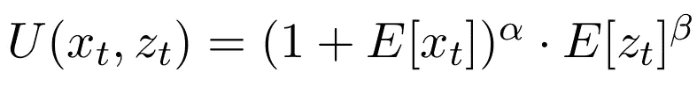

# 效用令牌:R 中的讨论、经济模型和模拟

> 原文：<https://medium.com/hackernoon/utility-tokens-discussion-economic-model-and-simulation-in-r-798c0ff3d26c>

去年秋天，作为我在 T2 咨询工作的一部分，我受雇为令牌管理的注册中心建立一个经济模型。从那以后，我遇到了许多对这个模型感兴趣的人，所以我决定分享一下基本理论和实现。

# 内容

1.哲学导论
2。车型总结
3。动因和动机
4。系统静力学
5。系统动力学:R
6 中的模拟。结论

# 1.哲学导论

关于*令牌* [*经济*](https://hackernoon.com/tagged/economy) 的伟大阐述性总结可以在[维基百科](https://en.wikipedia.org/wiki/Token_economy)上找到，所以我将直截了当地切入我的要点。

在我看来，代币经济是一种量化生活并给每样东西定价的尝试。这与经典经济学思想完全一致，在经典经济学思想中，即使是外部性，如空气污染，也可以通过足够的税收来补偿。

维基百科称代币已经在学校和精神病院成功使用，但是最近随着加密货币热潮的兴起，人们的兴趣开始复苏。由于之前普遍接受的令牌的创建是有问题的，所以没有人试图将所有服务绑定到某个价格。然而，开源的区块链算法让这个过程变得非常简单，突然之间，许多人认为将*符号化*(理解为*货币化*)字面上的一切是个好主意。

作为一名经济学家，我认为这种想法是非常错误的。我知道这是从哪里来的——每个人都在某个时候上过经济学 101 课程，并受到了优雅的“看不见的手”模型的启发。但我也知道自由市场不是唯一的机制。*集中配对机制*、*社会规划师的问题*、*彩票*都是有原因存在的。不是每个均衡都是有效的。可悲的是，不是每个人都学习高级经济学课程，而几乎每个人都想从高级经济学课程中获益。

> 不是每个均衡都是有效的

当然，在适当的情况下，代币是可以被证明是正当的。实际上，代币最大的工作领域是在线游戏，在这里每个水晶都有一个价格，对玩家来说有明显的价值。总的来说，无论什么时候，只要涉及到劳动，赚钱的过程就是好的。否则，就是某种*寻租*。

*梅萨里* [的瑞安·塞尔基斯(Ryan Selkis)很好地总结了](/tbis-weekly-bits/skin-in-the-game-coins-da0afdfdc650)*泡沫*和*公用事业代币*的区别，并解释了为什么他认为前者从长远来看将一文不值。我甚至会更进一步，声称大多数所谓的效用令牌也是泡沫，不会给出任何额外的效用。

# 例子

下面我回顾了几个例子，当你搜索*工具令牌*时，它们会出现在第一个结果页面。

[Datum](https://datum.org/assets/Datum-WhitePaper.pdf) 声称帮助用户阻止社交网络“免费”收集他们的数据，并将其出售赚钱，*即**控制他们的信息。这听起来肯定很有趣，但它完全忽略了一个事实，即脸书或 Youtube 已经免费提供了一项伟大的服务，以换取收集用户的数据，此外，他们为所有用户提供各种隐私设置。这是公平交易。Datum 想要的是将这些服务视为理所当然，并试图从中获利，而不提供任何效用。*

*[Talenthon](https://www.talenthon.io/docs/whitepaper_talenthon.pdf) 想做另一个 LinkedIn，但是用代币结构代替声誉结构，给真实推荐人代币。这在很多层面上都是错误的，包括:*

*   *无法量化引用*
*   *工人可能会改变，使参考过时*
*   *认为商人更关心代币，而不是他们的声誉*

*这正是我在上面所说的，当我说货币关系并不总是有效率的时候。最后，这些人虚伪地鼓励开放和去中心化，同时使用专有算法。*

> *正确的决策是只分散那些真正支持分散化的服务。*

*象征性支持的分权的另一个问题是，历史上每一次分权都与混乱、嬉皮士哲学、无政府状态(T21)紧密相关。所有成功分权的例子过去都是利他的，不涉及金钱目标。我关心的分散式应用程序有 *BitTorrent、维基百科、Linux、GNU Project、OpenStreetMap* 等。*

*分散式项目曾经是基于信任的系统的定义，像苹果这样的公司会因为没有向 BSD 贡献代码而受到社区的羞辱，但是仍然没有受到惩罚，没有人会试图从经济上激励他们这样做。*

> *我们大多数人仍然记得的这些旧时光，应该会引起每个人对不可信结构寿命的担忧。*

*然而，令牌有适当的用例，一些开发人员了解这一点。*

*AdChain 针对一个特殊的领域——排名广告服务——做得很好。这与令牌系统兼容，并且不是已经大规模完成的事情。*

*[Filecoin](https://filecoin.io/filecoin.pdf) 做得更好，它提供租赁存储空间的服务，同时通过*存储证明*作为采矿工具。他们在建模激励方面有问题，但最终他们提供了合法的效用，因此不是泡沫。*

*在本文中，我将试着为那些*效用令牌*建立一个经济模型。*

# *2.模型摘要*

*代币的这个经济模型是非常通用的，因此它可以作为未来代币创造者的蓝图和应用经济学家的合理抽象。*

> *理想情况下，这个模型也可以作为撰写白皮书的指南。*

*如果你跳过了上一节，让我提醒你*效用令牌*是为消费者提供合法服务的任何令牌，而不是主要为中间商或投机者提供的*工具(尽管在我们的模型中确实存在这样的代理)。**

*由于令牌针对的是*不可信的*结构，我们将需要某种证明来证明每个*节点*对应于一个人，而不是某个*僵尸网络*。由于我是一个巨大的 [*工作证明*](https://en.wikipedia.org/wiki/Proof-of-work_system) 反对者，并且由于大多数令牌都是在以太坊平台上构建的，也就是说[正在向*利益证明*](https://cointelegraph.com/news/first-version-of-ethereums-casper-update-has-been-released) 发展，我将在模型中使用后者。*

> *这项服务是用固定数量的代币支付的，而不是现金。*

*以固定的代币价格为服务定价将正确地捕捉需求和价格之间的比例关系——对服务的需求越大，购买代币的人就越多，代币的价格就会增加，服务的现金等价物也会增加；反之亦然。*

*在我们的模型中有消费者、投资者、诚实的和恶意的矿工，每个人都有不同的*动机*和*类型*。消费者和恶意矿商希望象征性价格贬值，而诚实的矿商和投资者希望象征性价格升值。*

*激励应该以这样一种方式建模，即只要存在诚实的多数，就没有人愿意偏离诚实的可持续系统(*条件均衡*)。我们将假设 [*以太坊 Casper*](https://arxiv.org/abs/1710.09437) 的*检查点树*投票模型，因为只要 *2/3* 的投票是诚实的，它就满足*可问责安全*和*可信活性*。我们将对由此产生的经济进行建模，但不会深究技术细节，也不会重温维塔利克·布特林和维吉尔·格里菲斯已经花了一些时间建模的内容。*

# *3.代理人和动机*

*在一般的*效用令牌经济中*有四种类型的代理:*

# *诚实的矿工*

*诚实的矿工是具有领域专业知识的人，他们实际上做了工作并创造了效用。只要他们占活跃代币持有者的 51 %( T21 ),系统就会激励他们尽最大努力赚取更多代币。*

*他们不玩任何*策略*、*也就是说*他们天真地在每个法定人数中投票给正确的版本。他们只要恶意矿工不接手就赚(矿)赏，同时给客户提供一个效用。因此，诚实矿工的主要数量特征是他们在所有矿工中的比例。*

> *诚实矿工的主要数量特征是他们的数量。*

*相应的问题是，不可能确切地说出哪些矿工是诚实的，哪些不是。因此，客户和投资者基于预期选择他们的策略。在这个模型中，形成这些期望的先验概率是外生的，但也可以是内生的。如果你是一个对扩展这一领域的模型感兴趣的研究者，请[联系我](http://ravshansk.com/#contact)，这样我们就可以讨论和分享关于该主题的想法。*

# *客户*

*顾客是使用诚实矿工创造的服务并从中受益的人，他们用现金购买代币来支付。*

*正如在简介中提到的，实用令牌只适用于特殊的服务，如工作参考或广告排名。因此，客户不仅关心服务质量，还关心其受欢迎程度/公众接受程度。这可以使用以下版本的*柯布-道格拉斯效用函数*进行建模:*

**

*Customer’s utility function*

*其中 *E[x]* 是预期需求，而 *E[z]* 是系统中专家(诚实矿工)的预期数量。*

*注意，即使当需求为零但专家数量不为零时(*E[x]= 0；E[z] > 0* )客户仍然从服务接收非零效用。反之，当服务非常普及，需求很高但专家知识为零(*E[x]>0；E[z]=0* )服务的效用为零，尽管它很受欢迎。*

> *对令牌的需求等于预期的客户总数*

*尽管客户并不一致——有*早期采用者*、*后期多数者*和*落后者*。它们在预订效用级别上有所不同——只有当效用 *U(x，z)* 分别超过 *Uearly，Ulate，Ulag* 时，每种类型的客户才会预订服务，其中 *Uearly ≤ Ulate ≤ Ulag* 。*

*根据 [*产品采用生命周期*](https://en.wikipedia.org/wiki/Technology_adoption_life_cycle) ，消费者类型分布为 *16%* 早期采用者、 *68%* 晚期多数和 *16%* 落后者:*

**

*Simplified Roger’s curve*

*你可以看到我简化了实际的罗杰曲线。如果您有兴趣扩展模型以使用实际的技术采用生命周期，您可以[联系我](http://ravshansk.com/#contact)，我会分享我的想法。*

# *投资者*

*投资者是以市场价值购买代币并持有它们以期待价值增值的人。我们将假设有 *N* 个财富水平 *w* 相同的投资者，他们正在使用*马科维茨均值-方差公式*的一个版本在投资股票和我们的代币之间进行选择。*

**

*Modified Markowitz’ mean-variance formula*

*其中 *μc* 和 *μs* 分别为硬币和股票收益率， *γ* 和 *σc* 为风险厌恶系数和硬币波动率。*

*注意，我们简化并考虑股票回报*确定性*，因此模型可以在这里扩展。你也可以用更复杂、更真实的模型代替马科维茨，比如*默顿*、*芒克*、*博迪*、*萨缪尔森*或*坎贝尔*或者在决策中加入其他加密硬币。因为我们的模型旨在尽可能通用，所以我们省略了这些选项。如果你对金融经济学感兴趣，并想在这一领域扩展模型，请[联系我](http://ravshansk.com/#contact)，这样我们可以分享想法和/或合作。*

*我们还将假设所有的投资者都是风险中性的。*

*为了进一步简化，我们将从我们的模型中省略掉*赌徒*——投资者将战略性地预测法定人数结果，并朝那个方向投票以挖掘额外的代币。那些对此感兴趣的人可以自己改进这个模型和/或[联系我](http://ravshansk.com/#contact)寻求想法和建议。*

> *一个系统的投资者越多，系统中的现金就越多。*

# *恶意的矿工*

*恶意矿工是那些以市场价值购买代币并在法定人数投票来强制推行他们的区块链版本的人。*

*在这个模型中，我们不考虑假设的*玩笑者* ( *即*为了诚实的区块链而想要破坏它的系统巨魔)，所以所有恶意的矿工都有一个理性的议程——它几乎总是系统外的利润最大化。*

**

*Malicious miner’s profit*

*其中第一项是公司通过以价格 *f* 向其初始消费者出售其商品或服务而获得的初始利润，加上来自具有赢得投票概率 *α* 的象征性投票的总需求份额。第二项是*干扰项*，其完成了从令牌到 *1* 的需求概率，代价是以每个令牌 *pc* 的价格购买赢得多数投票所需的令牌。第二项在无干扰的情况下等于零，*，即*没有恶意令牌活动。*

> *一个系统的恶意矿工越多，他们就越容易影响投票。*

*只有当在代币上花费现金并赢得选票会增加他们的外部利润时，恶意的矿工才会参与代币经济。否则，他们不会有任何动机去干涉区块链。*

*在这个模型中，我们假设所有恶意的矿工都想游说区块链的单一版本，并且他们之间不会发生冲突。而且，恶意矿工可以趁代币便宜先发制人购买代币，以增加未来的利润，即使这个决定并没有增加短期利润。如果您有兴趣在这方面扩展模型，请随时[联系我](http://ravshansk.com/#contact)讨论此事并交流想法。*

*在下一节中，我们将快速了解这些代理如何在固定的时间点进行交互。*

# *4.系统静力学*

*在任何时间点，代理都可以解决前面章节中相应的效用最大化问题。广义的静态交互可以如下所示:*

**

*System statics in a utility token economy*

*注意，我们区分了*主动*和*被动*令牌，前者参与投票，后者不参与投票。*

*为了对代币的价格形成进行建模，我们使用简化版本的*货币数量理论*，在 [*“比特币价格形成经济学”*](https://arxiv.org/pdf/1405.4498.pdf) (Ciaian 等人(2014))中对货币市场均衡进行建模。*

**

*Price formula for token*

*其中 *PY* 是代币经济的美元价值， *r* 是机会利率(在我们的例子中， *μs* ), *T* 是代币供给的规模， *η* 是外生稳定参数。*

*注意，在一个利益相关的经济中，令牌供给 *T* 是固定的，所以令牌是*通货紧缩*。*

*为了计算名义 GDP，我们将消费者和投资者注入代币经济的所有现金相加。*

*如果你对更复杂的定价公式感兴趣，请阅读上面提到的 Ciaian 的论文，和/或[联系我](http://ravshansk.com/#contact)交流思想。*

# *4.系统动力学:R 中的模拟*

*前两节总结了任何固定时间点的经济状况。为了了解这个系统如何随着时间的推移而运行，我们需要进行动态分析。系统动态可以被建模为遵循如下所述的时序:*

1.  *当开发人员创建协议并生成所有令牌时，经济就开始了(参见第 2 节)。在不失一般性的情况下，我们假设只有一个创造者。*
2.  *创造者将所有代币的一定份额分配给同意为代币而不是现金工作的早期专家，并且至少在一定时期内不出售代币。我们假设所有这些早期专家都是诚实的矿工。她在一家 ICO 商店出售其他代币。决定保留多少，出售多少，分发多少，这本身就涉及到一个完整的优化过程，但为了简单起见，我们将其外化。一如既往，欢迎任何[扩展](http://ravshansk.com/#contact)。*
3.  *消费者决定是通过购买代币来订阅服务，还是选择其他服务提供商。投资者决定是购买代币还是股票。恶意矿工决定购买代币和加入投票是否会增加他们的短期利润。*
4.  *在投票中确定所有市场参与者并对有效代币进行投标。*
5.  *多数人投票获胜，输家的赌注被削减——在赢家之间平均分配。*
6.  *消费者和投资者的现金注入被计算并加入价格公式。令牌的价格已更新。当前令牌收益率计算为*(1+δpt/pt)。*令牌的吸引力参数 *η* 更新。观察当前的股票回报率。*
7.  *循环步骤 3 到 6。*

# *r 模拟*

*我们准备看看经济将如何在模拟中运行。首先，我们将定义默认参数。*

**

*然后我们初始化主结果矩阵:*

**

*假设 160 个早期采用者每个人在第一期购买了 5 个代币用于汇率 *1 个代币= 1 $* 并且 200 个投资者每个人也购买了 10 个代币，我们在第一期的代币经济规模等于 2800。将此代入价格方程，得到的实际代币价值为 *0.14* ，但我们以一种不寻常的方式使用此信息，并将其指定为第一阶段的升值:*

**

*我刚才所做的，实际上没有任何意义——我只是必须以某种方式找到一个可行的 Markowitz 解决方案。因此，如果有人想提出一个好的价格增值机制，[请联系我](http://ravshansk.com/#contact)，我会纠正这一点。*

*最后，我们对 *N* 个周期进行模拟。*

**

*这个基本实现给出了初步的结果，比如价格和需求动态等。*

****

# *6.结论*

*在这篇文章中，我讨论了我对加密令牌的现状的看法，并建立了一个通用的效用令牌经济模型。由于该模型非常通用， ***只有根据您的具体用例*** 进行裁剪，才能获得逼真的效果。然而，这个框架和相应的 R 脚本是建模任何实用令牌经济的良好开端。*

*无论你是研究人员还是代币开发者，我相信这个框架对你分析代币经济都是有用的。我欢迎所有关于模型扩展和/或改进的讨论。*

*我坚信开放知识是进步的唯一途径。您可以自由使用文章的任何组件，但是我恳请您引用来源并让其他人阅读这篇文章并参与讨论。这篇论文的可出版版本还没有准备好，但是我可以根据需要给你发一个草稿版本。*