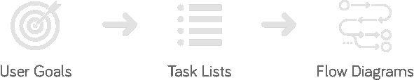
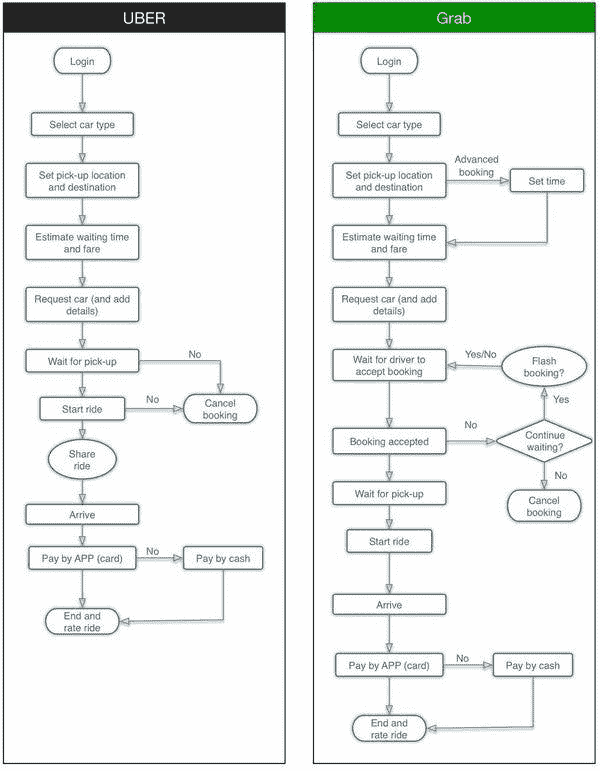
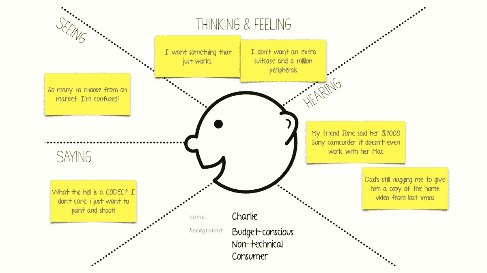
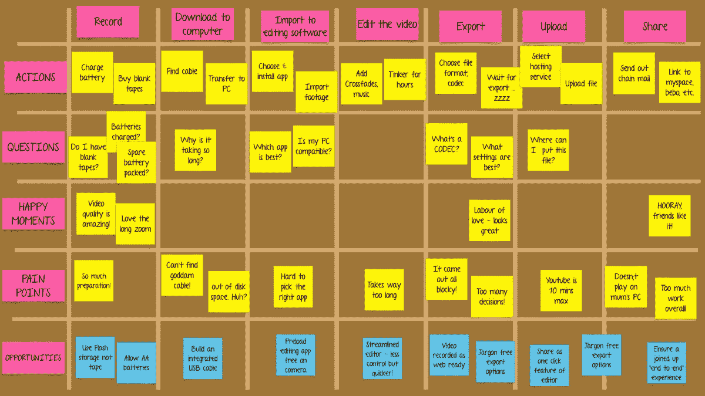
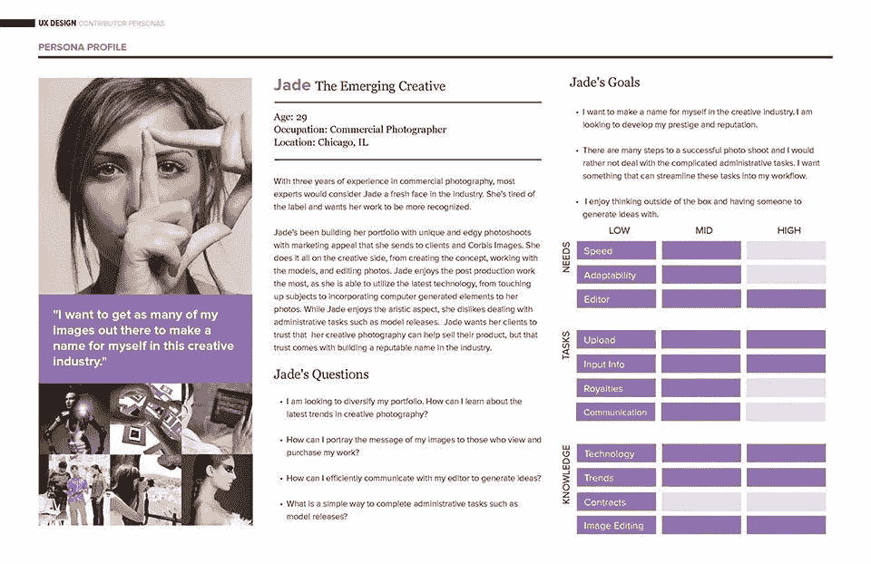

# 面向开发者的 UX 设计

> 原文：<https://medium.com/hackernoon/ux-design-for-developers-d3429200a1da>

## 什么是用户目标、任务列表、用户流、同理心地图和旅程地图？你如何使用这些来创建用户角色？你如何利用这些来制造更有用、更令人愉快的产品呢？在这个短短的 8 分钟指南中了解所有这些。

Photo by [Headway](https://unsplash.com/@headwayio?utm_source=medium&utm_medium=referral) on [Unsplash](https://unsplash.com?utm_source=medium&utm_medium=referral)

作为一名网络或移动开发者，你可能经常想知道 UX 的设计师到底是做什么的？你是如何接触到这种让一些公司的产品使用起来明显更容易、更有趣的*魔法粉*的？当你没有预算为你的个人副业项目雇佣一名 UX 设计师时，你是如何构建出具有高度可用性的产品的？

我写这篇指南是为了解释 UX 设计师在设计产品原型时脑子里在想些什么——这样你也可以像他们一样思考！让我们开始吧。

# 用户目标

用户目标是用户试图达到的目标。对于 freeCodeCamp 来说，用户的目标是学习 web 编程，这样他们就可以开始制作 web 应用了。对于优步的用户来说，目标是找到一辆出租车到达目的地。对于 Fandango 的用户来说，目标是预订一张电影票。诸如此类。

在我们开始设计任何东西之前，确定用户的目标是很重要的。我们要解决的用户问题是什么？用户想在这里做什么？用户雇佣你的产品的主要目的是什么？

在一个应用程序中通常有多个用户目标:我们将把每个目标分解成一个任务列表，用户必须完成这些任务才能实现他们的目标。

# 任务列表

一旦你确定了一个用户目标，你就可以开始把它分解成一个任务列表，用户必须完成这些任务才能成功完成目标。要查找优步，任务列表如下所示:

1.  打开优步应用程序。
2.  在*中输入目的地“去哪里？”*箱子在上面。
3.  挑选你想要的优步类型(泳池、uberX、SELECT、黑色、uberXL、SUV 等。)
4.  确保付款方式是你想要的。
5.  按下确认按钮。
6.  确认接应地点。
7.  等车，搭顺风车，在目的地下车。
8.  复习和提示。

任务列表表面上看起来非常简单，但最终会变得复杂和令人困惑。例如，优步有意识地决定增加一个确认上车地点的步骤(步骤 6)，即使他们有理由相信 GPS 会准确地选择你的位置。此外，一些任务可以以任何顺序完成，一些任务可能需要其他任务在它们之前完成(步骤 7)，或者一些任务甚至可以是可选的(步骤 8)。

# 用户流程图

给定一个任务列表，你可以将它转换成用户流程图，以显示用户将如何浏览你的应用程序。用户流程图有助于您在开始任何原型设计/构建之前推断应用程序将如何工作。它与任务列表相同，只是它是一个流程图，使用符号和箭头更直观地传达任务列表。

这里有两个用户流程图，比较了优步和 Grab:

([Source](http://zoe4meii.com/project/ride-hailing-app))

# 共情地图

移情图向你展示个人用户如何感受、思考和谈论使用你的产品的体验。这是创建用户角色的开始，我们将在本指南的末尾讨论。

移情图用于收集和组织关于个人用户的数据。稍后，我们可以回到他们那里去寻找行为模式，并最终将他们聚集成用户角色。

以下是你制作移情图的方法:

1.  将一张纸分成四个象限。
2.  给他们贴上看到的、思考和感受的、听到的和说的标签。
3.  采访你的用户，在采访过程中，当你观察他们与原型/产品的互动时，或者当他们在真实环境中遇到问题时，填写这些象限。

Empathy map for a user who is trying to record and upload a video in 2004\. ([Source](/@harrybr/how-to-run-an-empathy-user-journey-mapping-workshop-813f3737067))

一旦你为单个用户收集了足够多的移情图(我推荐至少 3 到 5 个)，你就会开始看到模式——这些模式为你以后创建的用户角色提供信息。

## 用户旅程地图

用户旅程图在概念上与移情图非常相似，只是它显示了用户在使用你的产品时不同时间点的感受和想法。

本质上，它是用户在你的产品的用户流程中前进时，时间线上的一系列移情图。例如:

User Journey map for a user who is trying to record and upload a video in 2004\. ([Source](/@harrybr/how-to-run-an-empathy-user-journey-mapping-workshop-813f3737067))

在上面的用户旅程图中，你会注意到体验的不同阶段在 X 轴上，我们试图在 Y 轴上识别用户体验的各个方面。

有两种类型的用户旅程地图:

1.  回顾图:根据研究结果，你可以绘制出用户当前是如何做事的(如上图)
2.  **前景地图:**在这里，你绘制你预期用户对你的新产品想法或你在现有产品中重新设计的流程的行为。

# 用户角色

在创建了移情图和用户旅程图之后，下一步是在你的观察中寻找模式，并为你的项目创建一些人物角色。

## 创建用户角色

首先，让我们明确哪些人物角色或简介是**而不是**:

*   人格类型
*   人口统计数据
*   你的“品牌故事”中的人物
*   基于你经验的刻板印象
*   浅层或一维
*   概念
*   预言

那么，什么是用户角色或简档呢？

用户角色描述了真实人物的目标、期望、动机和行为。他们为什么来你的网站？他们在找什么？是什么让他们紧张？诸如此类。

你需要的所有信息都应该在你的研究和数据中。如果你不能用研究来支持它，这不是一个好的迹象，你应该和你的用户多谈谈。

## 坏角色的例子

> 角色 A 是一名女性，年龄在 35-45 岁之间，收入和教育水平高于平均水平。他们至少有一个孩子，拥有至少一辆新车。他们外向，以事业为导向，倾向于右脑思考。

不好的原因:如果你是做广告的，这可能很好，但就 UX 而言，这种形象是没有用的。为什么？因为它不允许你对任何功能创意说“不”。35-45 岁的女性需要什么样的特征？什么都有可能！

## 有用角色的示例:

> 角色 B 是一位经验丰富的经理，主要对一两个专业领域感兴趣。他们经常访问，但时间紧迫，所以他们专注于“收集”内容，以便在周末阅读。他们往往是多产的社交媒体分享者，主要是 Twitter 和 LinkedIn。他们认为自己是思想领袖，所以公众形象很重要。

**为什么有用:**现在你有很多信息可以利用了！你知道蓬松的内容不会受欢迎，自我策展将是一件大事，你有一个建立内容类别的基础。他们需要方便地分享，只有特定类型的社交分享才是相关的。你也可以对脸书的广告说“不”,因为这些用户不会在那里花时间，而且摘要邮件会比频繁的通知更好，因为这些人已经时间紧迫。

## 最后几个提示

*   想想“理想的”用户。好几个！
*   当你考虑特性时，想想你在现实生活中看到的最有价值的用户。你没有试图支持当前的行为；你试图*推动*这些用户走向他们自己的“理想”版本。
*   请记住，所有用户都不一样！你可能会有几个不同的行为群体，他们都值得一个好的档案。

下面是一个真实人物的例子:

([Source](http://www.christinanghiem.com/images/persona-01.jpg))

# 下一步是什么？

这是橡胶接触路面的地方。有了你的用户角色，你会对你的用户有更好的理解。你现在可以开始[原型化](https://medium.freecodecamp.org/a-beginners-guide-to-rapid-prototyping-71e8722c17df)用户流，你会比以前做得更好，因为你现在对你的用户有了更多的同理心。这是 UX 设计的核心，通过上面的练习，你会有一种代码和特性所没有的感觉。

下一次，当你看到你可以添加到你的产品中的功能列表时，首先想想你创建的人物角色，想想哪些功能可以增强他们的体验，让他们感到愉快。拥有一个人物角色将使你不会被实现的挑战、使用闪亮的新技术的机会、你的个人偏见或者任何不可避免地进入我们作为开发人员的决策中的事情所分心。

> 在每一步都考虑你的用户，就像你的产品的成功依赖于他们一样。

因为确实如此。

感谢您阅读本快速指南。这最初是作为 [UX 设计课程](https://www.commonlounge.com/discussion/d8c1c96e92024adf9f496fe41dcaad1a)的一部分发表的(它有关于这些概念的真实项目！)在 [Commonlounge](https://www.commonlounge.com/) 上，这是一个平台，有类似这样的小型课程，主题从 [Django](https://www.commonlounge.com/discussion/8053bde657804a6b9135c0d781c9d2c7) 到[机器学习](https://www.commonlounge.com/discussion/35ccdb70826e434a876d612504297232)，为你投入的时间提供最大价值。

你通过参与真实世界的项目并从行业导师那里获得反馈来学习。

