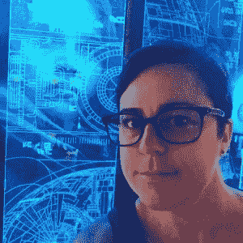

# 来自 4 位科技界女性的 UX 设计见解

> 原文：<https://medium.com/hackernoon/ux-design-insights-from-4-women-in-tech-c8b5181b2c26>

想知道在 UX 设计需要什么吗？最近，我们采访了 UX 的四位杰出女性，询问她们在这一激动人心的领域开创事业的经历。他们提供了一个令人耳目一新的诚实和深刻的 UX 世界，每个人都采取了独特的旅程，以达到他们现在的位置。

UX 设计，或者说用户体验设计，就是带领客户踏上一段通过给定媒介的旅程——无论是视听、与人工智能的互动，还是浏览网页。这是关于唤起用户的感觉，并为品牌创造有针对性的故事。这是关于释放你的创造力，实现有形的，可衡量的结果。

是什么让莎妮·艾伦、路易莎·伦巴多、贝蒂娜·马森和汉娜·赫弗南在 UX 开始了职业生涯？一路上他们的个人障碍是什么？对于在 UX 设计领域寻找未来的女孩(*和男孩*)来说，他们有什么建议？

# 让我们来看看 UX 设计界的女性领袖是怎么说的。

# sharni Allen——UX 设计师和服务设计师，自由职业者

[*沙尼艾伦*](https://www.linkedin.com/in/sharni-allen-7313b137/) *是前* [*学院 Xi*](https://academyxi.com/?utm_source=Martec&utm_medium=Martec&utm_campaign=Academy%20Xi&utm_term=Women%20in%20UX&utm_content=Women%20in%20UX) *讲师，现任自由职业者 UX 和服务设计师。*

*她将自己描述为“UX 多面手”,乐于主持客户研讨会以及创建用户旅程和线框。沙尔尼曾在* [*白灰色*](https://www.whitegrey.com.au/) *和* [*韦伯林互动*](http://www.webling.com.au/) *等机构担任 UX 领导。*

## 你的背景是什么，你是如何进入 UX 设计的？

我在数字制作部门工作了 10 多年，最终成为执行制片人，负责监督大规模的数字转换项目。

大约六年前，我开始看到市场的转变——企业要求代理机构在以用户为中心的设计方面提供更多专业知识。他们不仅希望看到我们解决方案背后的研究成果，还希望参与其中。

来自传统的瀑布背景，以更精益和敏捷的方式与多学科团队一起工作的机会太好了，不能错过，这些团队正在产生由实际研究和测试支持的结果。我运用了自己作为制片人已经提炼出来的技能，比如人物角色、情感地图和线框，把自己作为一名 UX 建筑师推向市场。剩下的就是历史了。

## 为了进入 UX，你学了什么？

当我们还在刻录 CD 和用 256 色调色板设计网站的时候，我已经获得了多媒体学士学位。以用户为中心的设计的基础没有改变；尼尔森诺曼集团(Nielsen Norman Group)是当时的行业领导者，现在仍然是全世界每个 UX 从业者的首选读物。

我在数字制作领域的多年经历让我在研究和开发问题定义和解决方案所需的人工制品方面积累了很多经验。我成功所需的其他软技能自然而然就来了；在公开演讲中的自信，在受到挑战时支持我的决定，协作和同理心。

## 你发现适应 UX 设计世界的最大障碍是什么？

获得客户对流程的认可，并投入必要的时间进行协作。在项目发现的开始阶段，热情总是很高。但是，继续完成一个项目的研究、移情和构思阶段可能需要客户利益相关者投入大量时间，他们可能会变得更加放手和“信任我们”——我们是专家，不是吗？

决策不能在筒仓中做出。需要对整个项目中不断做出的决策达成共识。确保您的决策者(产品所有者、中小企业等)。)是项目成功的关键。

## 你希望你在开始的时候知道什么？如果你再有一次机会，你会做什么不同的事？

我会买更多的比特币！但是说真的，从可用的数字工具中退一步，把东西挂在墙上是开始每一天的最好方式。拥有一个项目看板(敏捷工具)和每天与团队站在一起，可以尽早地、经常地提出问题。它培养团队精神和对项目整体的理解，而不是每个团队成员可能在做的小部分工作。

## 有兴趣从事 UX 设计职业的人有什么建议吗？

硬技能可以教，软技能必须学。

UX 的生意不适合害羞或胆小的人。这一切都与用户有关——走出去与观众交谈，理解他们的需求和愿望，然后向他们展示你的发现，这是工作的一大部分。你可能会被那些要求答案的人质疑，被那些不相信你的发现的人挑战，被证明你的假设完全错误。UX 本身就是一个学习的过程，没有这些经验教训，我们就无法从过去的错误中吸取教训，提供有用的产品和服务。

# Luisa Lombardo——hipages 产品设计师

[*路易莎·伦巴多*](https://www.linkedin.com/in/luisalombardo/) *目前在澳大利亚革命性的家装市场* [*hipages*](https://hipagesgroup.com.au/careers/?utm_source=Martec&utm_medium=Martec&utm_campaign=hipages&utm_term=Women%20in%20UX&utm_content=Women%20in%20UX) *担任产品设计师。*

*Luisa 在悉尼开始做平面设计师，然后在英国享受冒险和职业发展，最后回国成为一名高级设计师。接下来转到了 UX 设计公司，因为它提供了一个新的专业挑战，同时重新激发了她对设计的热情。*

## 你的背景是什么，你是如何进入 UX 设计的？

我的背景是平面设计，专注于品牌、广告和印刷。虽然我喜欢这个领域，但我觉得我的职业生涯需要一个新的挑战，并看到了提高技能和进入 UX 设计的机会。

## 为了进入 UX，你学了什么？

我在 UX 的大部分学习都是在有实践经验的工作中进行的。我很幸运能和一些伟大的 UX 设计师一起工作，他们是我的良师益友。我还在拖拉机设计学校(现已关闭)完成了一个数字设计项目，以帮助我实现转型。

## 你发现适应 UX 设计世界的最大障碍是什么？

有信心早点进入 UX！在转行和从头开始的过程中，迈出第一大步总是令人畏惧的。

## 你希望你在开始的时候知道什么？如果你再有一次机会，你会做什么不同的事？

我希望我知道我作为一名平面设计师的技能会给我在 UX 世界打下坚实的基础。这使得改变比我想象的要容易。

## 有兴趣从事 UX 设计职业的人有什么建议吗？

永远不要停止学习。从像 [Medium](/) 和 [Muzli](https://muz.li/) 这样的网站上阅读 UX 的文章。我喜欢通过阅读最新的博客文章来开始我的一天，并从其他人正在做的工作中获得灵感。也要走出去，认识 UX 社区的人。在业内拥有人脉是打造你职业生涯的好方法。

# bettina Marson——澳大利亚电信公司 UX 专家

[*贝蒂娜·马森*](https://www.linkedin.com/in/bettina-marson-a2b40774/) *是一个多学科的创意。作为一名屡获殊荣的艺术家和作家，她最近将自己的才华用于 UX 领域。*

*Bettina 目前是*[*Telstra*](https://careers.telstra.com/home?utm_source=Martec&utm_medium=Martec&utm_campaign=Telstra&utm_term=Women%20in%20UX&utm_content=Women%20in%20UX)*数码产品&服务部的 UX & UI 设计师，在快速交付自动化团队从事客户成功管理工作。*

## 你的背景是什么，你是如何进入 UX 设计的？

我总是被创造性的追求和技术所吸引。最初，我学习了一个游戏设计学士学位，这让我开始了概念艺术家和环境设计师的职业生涯。在那段时间里，我培养了一种兴趣，即与技术更紧密地合作，以改善其他人的生活——既创造引人入胜的体验，又解决现实世界的问题。

这导致我报名攻读硕士学位，以微调我的重点，并将用户体验和交互设计作为职业生涯。

## 为了进入 UX，你学了什么？

我在莫纳什大学攻读了一个交互设计硕士学位。在我的研究期间，我创建了交互式原型和用户体验，用于健康、教育、通信和生活方式行业，我发现这非常有益。

## 你发现适应 UX 设计世界的最大障碍是什么？

随着技术被开发和采用的速度，我发现的最大挑战之一是，你不仅需要了解 UX 的实践，还需要了解最新的技术及其局限性。

## 你希望你在开始的时候知道什么？如果你再有一次机会，你会做什么不同的事？

当你想到用户体验设计时，你会立刻想到界面和优秀的客户服务。用户体验设计比那更多样化；我们生活在一个拥有许多不同技术的世界，这些技术允许许多不同类型的用户体验，例如虚拟现实和基于语音的交互，如亚马逊的 Alexa 和谷歌 Home 等产品。

用户体验不是纯粹的视觉，我们必须记住，人们以不同的方式与技术互动。重要的是，不仅要跟上快速变化的技术世界，而且要确保你创造的体验是包容的、直观的和愉快的。

## 有兴趣从事 UX 设计职业的人有什么建议吗？

如果你对这个既有回报又有挑战的领域感兴趣，我强烈建议你参加一个研讨会或见面会，亲自了解一下作为一名 UX 专家是什么感觉。如果你想把以用户为中心的实践融入到你现有的工作中，那么在 UX 设计中也有很多很棒的在线资源可以提升技能。

# 汉娜·赫弗南——Canva 的产品设计师

[*汉娜·赫弗南*](https://www.linkedin.com/in/hannah-heffernan-creative/) *热爱创造，并凭借这种激情成功地做出了一番事业。*

在柏林的一段时间里，她也尝到了创业的滋味。还有什么地方比澳大利亚十亿美元的初创企业宝贝 [*Canva*](https://www.canva.com/careers/?utm_source=Martec&utm_medium=Martec&utm_campaign=canva&utm_term=Women%20in%20UX&utm_content=Women%20in%20UX) *更适合做一个热爱创意的初创企业呢？*

## 你的背景是什么，你是如何进入 UX 设计的？

我最初在广告公司工作，首先是插画师和设计师，然后是艺术总监。五年前我住在柏林时来到了 UX。我有限的德语并没有让我在传统机构走得很远，但技术和创业场景真的很强。这就是需求所在，加上技术往往会进一步寻找人才，因此团队自然非常国际化，英语成为每个人的默认语言。我的第一个角色是在一家小初创公司做一名真正的多面手。这就是我对产品设计感兴趣的地方。

## 为了进入 UX，你学了什么？

像我们很多人一样，我没有。我学的是[传播设计](https://www.rmit.edu.au/study-with-us/levels-of-study/undergraduate-study/bachelor-degrees/bachelor-of-design-communication-design-bp115)专业是插画。我的插画背景绝对对我设计产品有帮助。

## 你发现适应 UX 设计世界的最大障碍是什么？

休完产假后，我去了 UX，在一家新公司找到了一份新工作。这本身就是一个障碍！

我发现最大的挑战是从凭直觉设计转变为必须用数据来告知我的决定。设计对我来说一直是情绪化的，我想我的决定也是凭直觉做出的。训练自己做出更客观的决定，并验证自己的直觉，这需要实践。这仍然是我必须练习的东西！

## 你希望你在开始的时候知道什么？如果你再有一次机会，你会做什么不同的事？

我希望我知道我已经掌握了所有的技能，我只需要以不同的方式运用它们！艺术指导和广告设计是将一个想法提炼到最简单的形式，与消费者产生共鸣，抓住他们在生活中想要达到的目标的核心，以及你的产品如何帮助他们。对我来说，这就是 UX。只是输出不一样。

作为女人，我们通常不擅长推销自己有多棒！如果我能回到第一次可怕的 UX 角色面试之前，我会练习成为一名更好的销售人员！这就像是一个我一无所知的可怕的新行业，但我实际上有 10 年的相关经验。我的想法是，我必须找到一家愿意让我休息一下的公司，但他们真的很幸运能拥有我！

## 有兴趣从事 UX 设计职业的人有什么建议吗？

如果你已经在一个创造性的领域工作，或者对你现在做的事情有任何解决问题的元素，你可能已经在做一些 UX 了！寻找机会将久经考验的 UX 方法和流程应用到你正在进行的项目中。然后，当你跳到 UX 的角色时，你就已经有了开始行动的工具。

是时候像这些 UX 的先锋女性一样，在用户体验设计的世界里开始你的人生了吗？查看 Martec 的其他 UX 文章[UX 职业的未来](https://www.themartec.com/insidelook/future-career-ux)或[UX 设计师训练营的利与弊](https://www.themartec.com/insidelook/pros-cons-bootcamps-ux-designers)了解更多信息。