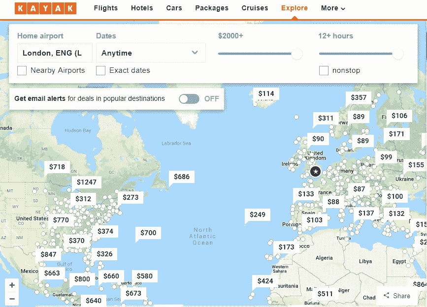
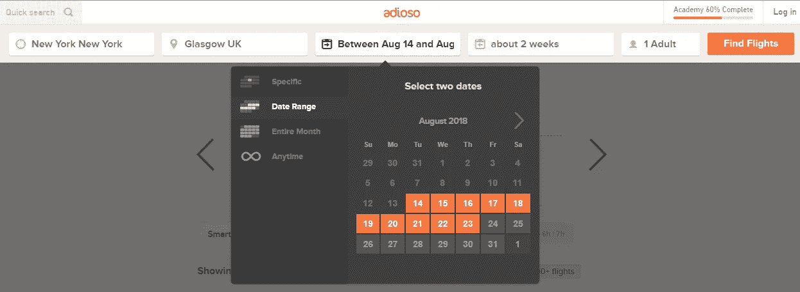
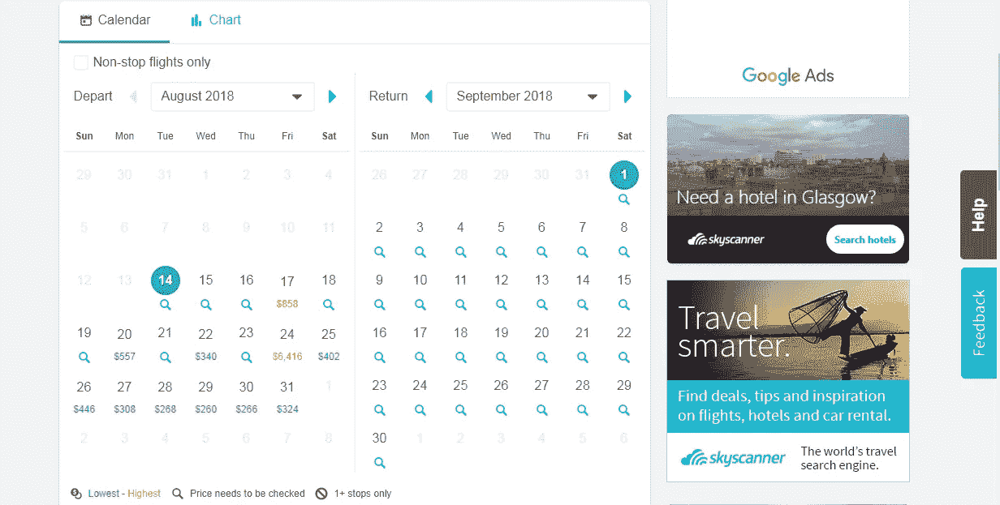
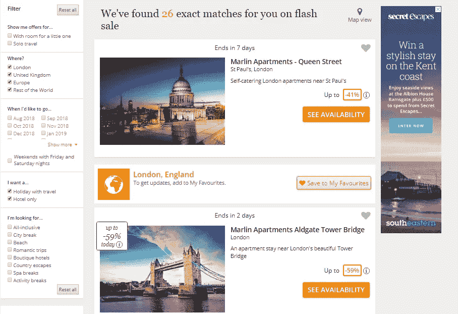
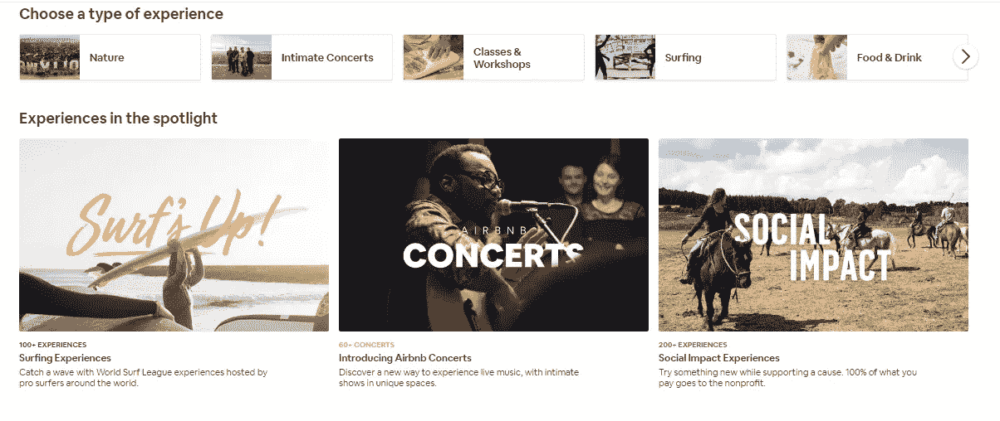
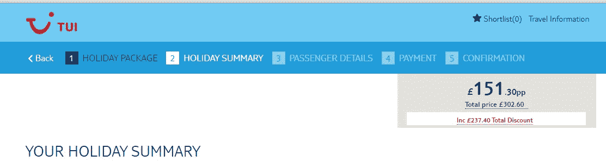

# 最佳旅游网站的 UX 实践:功能性和可用性

> 原文：<https://medium.com/hackernoon/ux-practices-from-best-travel-sites-functionality-and-usability-6c73823cc387>

无论你是想推出一个新的旅游网站还是改善现有的，用户体验(UX)是首先要考虑的。有吸引力且易于使用的网站可以获得更好的用户行为指标，从而提高转化率。这就是为什么成功的旅行社非常重视 UX 的做法。我们已经分析了它们，并与您分享最重要的内容。

# 本地化和个性化

本地化和个性化是你的客户在网站上遇到的第一个 UX 问题。如果运用得当，它们可以赢得用户的参与和忠诚。根据艾司隆的研究，近 80%的客户更喜欢提供个性化体验的公司。

**语言和货币**。人们喜欢别人用他们的母语称呼他们，这是司空见惯的事。最好的旅游网站建议客户在至少几种语言和货币选项中进行选择。基于用户的地理位置，可以自动选择语言和货币。Booking.com 很好地说明了这种做法。其他网站，如猫途鹰，推荐本地网站版本(如 Tripadvisor.de 或 Tripadvisor.com.tr)。

**最近的旅游**。使用地理定位的另一种方法是根据客户当前的位置向他们推荐最佳的旅行选择。对于愿意离家不远的地方度周末的冲动旅行者或已经在旅途中的人来说，这尤其有用。一个有趣的例子是 Kayak 的交互式地图，上面有从离你最近的机场计算出的航班选项和价格。

**新用户 VS 回头客**。对新访客和回头客采用不同的方式。展示推荐和热门目的地，激励新人。并使用 cookies 和跟踪脚本根据回头客的搜索历史和偏好为他们提供内容。这是 Airbnb 向注册用户提供个性化推荐的做法。Expedia 更进一步，根据访问者进入网站的渠道，提出了完全不同的用户-网站交互[。](https://econsultancy.com/blog/68330-an-in-depth-analysis-of-how-expedia-converts-visitors-into-customers-part-one)

# 直观搜索和简单导航

用户友好的搜索和导航是 UX 旅游网站的另一个优先选择。整个网站的搜索和发现过程应该是直观、顺畅和敏捷的。在这里，要考虑的最重要的事情是方便的日历、精心制作的过滤器和提示。

**日历**。如今，智能日历是任何旅游网站的必备之物。一个重要的 UX 点是包括前一个月和后一个月的日子。灵活的日期工具也是有用的，特别是当客户寻找廉价的假期选择，而不局限于特定的日期。人们喜欢比较他们前一天去度假或后一天回来的价格。看看这个选项在 [Adioso](https://adioso.com/) 网站上实现得多好:

不过，就 UX 而言，flex search 并不是最容易实现的功能。Skyscanner 用一种更简单的方式解决了这个问题。对于灵活的日期，他们使用“选择月份”选项。查看所有价格范围并快速选择最适合您的选项非常方便:

**滤镜**。当有过滤器时，搜索过程更容易。这里，我们要提到两种方法，各有各的优点。第一个可以用 Airbnb 来说明。一开始，网站鼓励用户输入最少的信息。随着搜索过程的进行，会出现更多的过滤选项。因此，用户不断地从较宽的选项集转移到较窄的选项集。另一种方法被用在 Booking.com 和[秘密逃脱](https://www.secretescapes.com/)这样的网站上。在这里，用户可以同时看到所有可能的过滤器。过滤器垂直放置在页面的左侧，容易引起注意。目的地结果根据您勾选的框实时更新:

**搜索选项**。在主页上向客户推荐的一组选项也可以在搜索过程中帮助他们，甚至可以让他们产生一些想法。旅游网站最广泛的选项包括热门目的地、特价商品和访问量最大的页面。考虑到[最近的研究](https://www.tripadvisor.com/blog/travel-industry-tourism-trends-attractions-activities-experiences-2018/)，强调经验而不是物质上的员工是有用的。这是 Airbnb 和其他一些领先网站推出 choice options 体验的主要原因之一。通过体验，旅行者可以报名参加独家定制的旅游，更近距离地向他们介绍当地人的生活，包括活动、食物、自然探索等。：

# 轻松退房

放弃旅游网站的主要原因之一是结账过程缺乏简单性和清晰性。确保信息逻辑有序，所有说明清晰，进度明显。对于用户来说，处理旅游网站的这个阶段是最有压力的，因为他们需要集中精力正确地填写所有的字段。所以，尽量避免任何分散注意力或引起紧张的事情。

**签到**。顾客讨厌签到。我们建议将其设为可选，这样就不会妨碍预订。尽早询问客户签到事宜，不要中途中断预订流程。提供清楚的理由说明为什么登录是有益的。

**预订表格**。由于各个国家对于这个或那个术语的含义(例如“标题”)或日期的书写顺序有不同的标准，预订表格常常令人困惑。为了避免误解，请尽量精确。尽可能提及可供选择的变体。使用简短但清晰的说明，避免任何会分散注意力的东西。

**时间轴**。使用可视化时间线可以轻松跟踪用户的预订进度，这是一种位于页面顶部的进度条，显示已经完成的工作以及完成交易还需要多少步骤:

# 移动友好性

对于旅行社来说，移动电话越来越重要，可以保持这种力量。[全球 45%至 87%的智能手机用户](https://www.thinkwithgoogle.com/consumer-insights/consumer-travel-smartphone-usage/)越来越喜欢在整个旅行体验中使用手机:从浏览和预订到度假时搜索必要的信息。这里，我们建议考虑两种选择:网站的移动版本和移动应用程序。

**手机版网站**。确保您的网站在移动设备上响应迅速，同时提供与桌面网站版本相同的功能。这肯定会让那些在搜索旅行选项时更喜欢使用手机的顾客感到高兴。但是它也会取悦谷歌，并且帮助你的网站获得一个手机友好的标签。

**手机 App** 。应用程序有很多商业优势:从更好的个性化到离线模式选项和简化的交易。人们发现旅游应用程序很有用，企业也试图利用它们。几乎所有领先的旅行社都有自己的品牌应用。用户喜欢它们是因为方便和额外的选项，如希尔顿荣誉应用程序中的数字登记和无钥匙进入，或 Hostelworld 应用程序中用于查找附近最近酒店的地理围栏:

# 一锤定音

旅游业是最有前途和最繁荣的，也是最具竞争力的。相关的客户体验有助于将你的品牌与市场上的其他品牌区分开来。行业领导者为旅行社网站 UX 的设计设定了高标准。向他们学习——让你的网站在最佳旅游网站列表中占据一席之地！

**很高兴为您开发高效、人性化的旅游网站或旅游手机应用。我们很自豪被 Clutch.co 评为*[*15 家生活方式和旅游应用开发公司*](https://clutch.co/app-developers/travel-lifestyle/leaders-matrix) *第二名。**

**原载于*[*stfalcon.com*](https://stfalcon.com/en/blog/post/travel-sites-UX)*。**