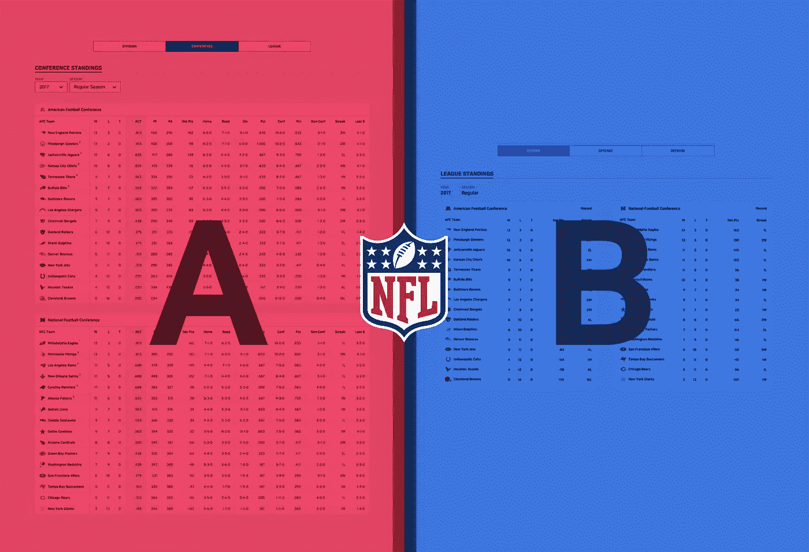
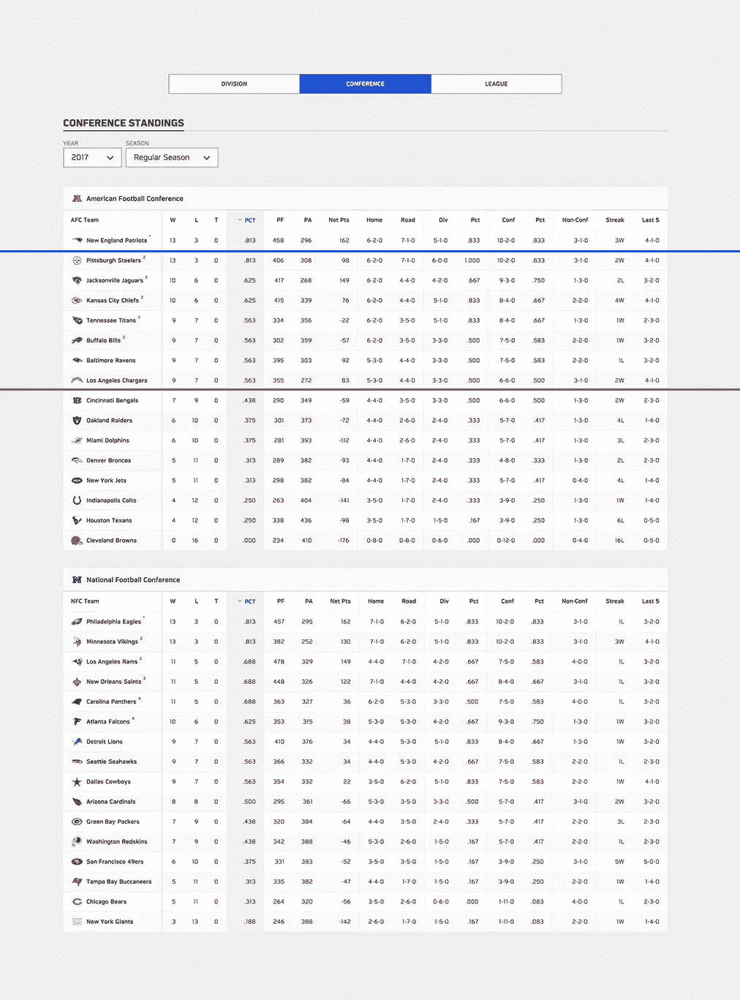
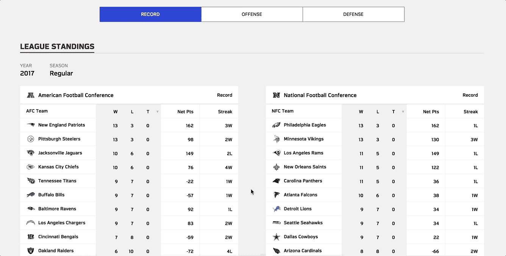

# UX 原型:NFL 积分榜

> 原文：<https://medium.com/hackernoon/ux-prototype-nfl-standings-table-2d5eec68f52b>

估计有 49% 到 70% 的美国人认为自己是 NFL 的球迷，我是其中之一。我相信他们正忙着为即将到来的 2018 赛季做准备。吸引 2 亿美国粉丝可不容易。

所以我想我应该花些时间来帮助探索 NFL.com 排行榜屏幕上[的用户体验。这是他们当前界面的截图，没有广告。](https://www.nfl.com/standings)

蓝线代表你可以在我的 Macbook Pro 的当前导航中看到的折叠上方的内容。如果我删除导航，红线代表新的文件夹。

这不是一个详尽的列表，但是我想用这个接口解决 3 个主要问题:

1.  **很难比较团队**
    使用如此多的垂直空间来表示这些数据意味着用户一次只能查看表格的一小部分。这迫使你上下滚动寻找一个团队。然后你记住 1-2 个相关的数据点。然后你寻找另一个团队，将你的记忆与屏幕上的内容进行比较。这是一个缓慢的过程，当你试图同时比较两个以上的团队时，这个过程就会中断。
2.  桌子太吵了，我真的不认为普通的球迷会关心一支球队在他们联盟中的胜率。我认为自己是一个相当认真的球迷，我关心这里一半专栏的唯一原因是在季后赛打破平局的情况下。在大多数情况下，这些额外的数据只是增加了认知开销。
3.  **不必要的选项卡** 顶部的 3 个选项卡通过将团队分组到不同的桶中，在显示完全相同的信息之间切换。我确实很高兴看到球队按部门分组，但应该有更好的解决方案。

考虑到以上情况，我创建了一个功能性的原型[来探索一种不同的方法。不要笼统地认为这是更好的*或更坏的*或*的*，试着认为它有*的优点*和*的缺点*。如果优点使普通用户的需求更容易实现，而缺点使不普通的用户需求更难实现，那么这种权衡可能是值得的。](https://hackernoon.com/tagged/prototype)

这个版本解决了我上面强调的一些问题。并排展示每场会议确实让比较变得容易多了。但是，总会有取舍。这里有一些潜在的 [UX](https://hackernoon.com/tagged/ux) 问题和我用这种方法做出的妥协:

1.  **比较部门更加困难**
    我考虑引入一个新功能，如果你点击一个团队，它会突出显示部门中的团队行以便比较。最终，我认为互动是不直观的。如果你点击一个团队，期望看到更多关于这个团队的信息。另一种选择是在您选择年份的同一部分引入过滤器。默认可以是`All Teams`，后面是`North`、`South`、`East`和`West`。
2.  **对比进攻/防守与胜利/失败**
    如果你想知道进攻或防守的成功是否会转化为更多的胜利，你仍然需要记住统计数据，点击一个按钮来改变表格，并将你的记忆与当前状态进行比较。我的假设是这个屏幕更多的是用来比较不同的团队。如果你想对一个团队进行更深入的分析，团队界面应该可以解决这个问题。
3.  **进攻与防守在视觉上过于相似**
    我最初的方法是在进攻和防守上添加完全相同的表格列。这种方法有一定的道理，但是视觉上的相似增加了混淆。这导致我在表格的右上角为`Record`、`Offense`和`Defense`引入了一个标签。我对那个解决方案一点也不满意。应该花更多的心思来弄清楚人们在决定进攻和防守产出时在寻找什么，表格应该更适合这些期望。
4.  **同步表格动画有点不协调**
    当你与应用程序的一部分交互时，它的反应和预期的一样，棒极了。当应用程序的另一部分也对这种交互做出反应时，你的大脑会想“哇，这是怎么回事”。这可能只是一个小麻烦，整体体验更好，所以用户克服了摩擦。也可能不是。这绝对是测试时要考虑的事情。

v1Labs.com

谢谢你检查我的最新原型。🏈

你可以在这里随意摆弄它，并让我知道你的想法。此外，检查出 [v1Labs](https://v1labs.com) 和跟随我更多的 UX 原型！