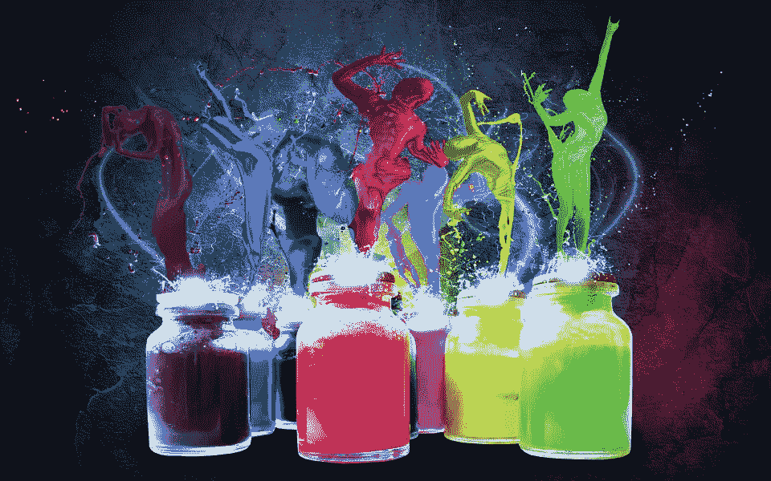

# UX/用户界面设计师要求——5 种与众不同的方法

> 原文：<https://medium.com/hackernoon/ux-ui-designer-requirements-5-ways-to-make-a-difference-c48b8c66b757>

让你成为更好的 UX/UI 设计师的 5 个实用要求。不仅仅是设计工具或资源，它们会让你更符合设计师的工作要求。

当我开始写这篇文章的时候，我仔细考虑了一下公告板，试图找到一个更合适的条目来开始——我应该列一个 UI UX 设计者需求的列表吗？如“你应该读哪些关于设计的书？”或者“你必须关注哪些设计博客”。或者我可以简单地关注细节而不是形成一个边界视角来谈论。因为已经有很多优秀的文章从宏观上讨论了 UI UX 设计师的要求，我想建议一些实用的技巧和原则，可能会使一个 UI UX 设计师更合格。

# 显然，掌握一个高效的原型工具是必须的

我不会告诉你应该选择哪种原型工具，是 [Mockplus](https://www.mockplus.com/?utm_source=promote&utm_medium=click&utm_campaign=trista) 还是 [Axure](https://www.axure.com/download) 。但是你需要找到最适合你的。时间和实践会让你找到更快、更简单、更聪明的方法。同时，你良好的设计能力和丰富的专业知识是你在寻找过程中所需要和提高的。

给你一个严肃的提示，在你做决定之前尝试每一个原型工具。只要给他们都一个镜头，然后你就不会错过，然后坚持你最喜欢的一个，并掌握它。所以 UI UX 设计师的要求是练习更多的原型工具，即使你已经有了一个，它可能会出乎你的意料。

设计师的工具包:[最佳模型&线框设计工具&UI/UX 设计师的应用](https://www.mockplus.com/blog/post/the-best-mockup-wireframing-design-tools-apps-for-uiux-designers/?r=trista)

# 假设你是一个真正的用户，而不仅仅是一个 UI / UX 设计师，这是一个很大的帮助

我说的“假设”是指把你的思想转变成一个真正的用户。这种角色互换可能会建立一条改进你的设计的捷径。每一个 UI / UX 设计师都应该坚持这样一个原则:在知道意图的情况下进行设计。产品源于需求，这一黄金法则仍然有效。如果可能的话，试着和你的用户建立持久友好的联系。考虑得很周到，因为他们在申请期间可能会遇到很多问题。

此外，如果你在与用户交流时总是友好和有技巧的，你的用户会更加感激。反过来，他们会坚持你的产品，并给你及时和有价值的反馈。你最终是胜利者。切记[以用户为中心的设计的注意事项](https://www.mockplus.com/blog/post/the-dos-and-donts-of-usercentered-design/?r=trista)。所以这里的用户界面 UX 设计师的要求是对你的用户友好，并作为一个整体。

# 稍微改变一下你的学习方式可能会非常有效

首先，一个问题——你最近读的书是什么？如果你的答案是一本关于设计的书或者只是一本设计杂志。我想提供一份你可能感兴趣的书单。

他们在那里:

[阿兰·德波顿的艺术疗法](http://ca.phaidon.com/store/art/art-as-therapy-9780714865911/)

[Twyla Tharp 的创作习惯](https://www.amazon.com/Creative-Habit-Learn-Use-Life/dp/B00BTELWYO)

[约瑟夫·艾伯斯的色彩互动](https://itunes.apple.com/us/app/interaction-of-color-by-josef-albers/id664296461?mt=8)

[保罗·贾维斯的好创意](http://kineticbear.com/the-good-creative/)

奥斯汀·克莱恩的《像艺术家一样偷窃》

[艾德·卡姆尔和艾米·华莱士的创意公司](https://www.amazon.com/Creativity-Inc-Overcoming-Unseen-Inspiration/dp/0812993012)

[马克·巴斯金格和威廉·巴德尔的绘画创意](https://www.amazon.com/Drawing-Ideas-Hand-Drawn-Approach-Better/dp/0385344627)

是的，它们更多的是关于艺术和哲学，而不是设计本身。我的建议并不意味着你应该放弃你的设计书籍，比如*设计设计*或者*交互设计*。事实是，设计需要美学，不仅从视觉方面，而且从内涵方面。你只需要学习更多。所以 UI UX 设计师这里的要求是去图书馆买几本书。然后安静的坐着开始看书。

设计师书籍:[2017 年 10 本令人兴奋的最佳用户体验书籍](https://www.mockplus.com/blog/post/best-user-experience-books/?r=trista)

# 不要只和你的设计师朋友在一起，这会激发你的灵感

“确认偏差”这一术语不仅存在于心理学和认知科学领域。它实际上在我们的日常生活中是压倒性的。我们都倾向于同意与我们意见一致的人。我们喜欢和有相似世界观的人在一起。然而，当你限制你的领域时，你的视野就变窄了。会见不同观点的人会描绘出一幅更加完整和平衡的画面。

开放性是灵感的无尽源泉，是伟大设计师的重要特质。比如你[设计一个美食 app](http://doc.mockplus.com/?p=1365/?utm_source=promote&utm_medium=click&utm_campaign=trista) 的时候，就和你最好的吃货朋友聚一聚。他或她一定会给你提供有价值的建议，从而促进你的工作。因此，这里的 UI UX 设计师要求是与非设计师或任何持有不同信仰、挑战你并带来新观点的人交往。

# 向最优秀的人学习会有所不同

人类是群居动物，那就像群居动物一样。不要违背你的本性，做一只孤独的狼，试图“成群结队”地做事。你一定经历过这个时期，不管你已经是一个著名的 UI UX 设计师，还是这个领域的[新人](https://www.mockplus.com/blog/post/what-is-an-ux-designer/?utm_source=promote&utm_medium=click&utm_campaign=trista-zjj)，你都一定向最优秀的人学习，并且你会这样做。这就像爬山，你看着顶峰不停的爬，最后你成了别人的“顶峰”。向最优秀的人学习是一个很好的方法，可以帮助你吸收智慧并将其转化为你的智慧。所以 UI UX 设计师在这里的要求就是要谦虚，要学会学习。

我希望你喜欢这本书，即使你从我的文章中获益匪浅，也会鼓励我继续写下去。我们都可能发现自己有时会感到不安全。然而，我不会轻易放弃。我没有义务一定要赢，但我有义务不断尝试。这个要求对你我都是。

注释:书籍的链接。如果您感兴趣，请检查以下内容:

[阿兰·德波顿的艺术疗法](http://ca.phaidon.com/store/art/art-as-therapy-9780714865911/)

[Twyla Tharp 的创作习惯](https://www.amazon.com/Creative-Habit-Learn-Use-Life/dp/B00BTELWYO)

[约瑟夫·艾伯斯《色彩的相互作用》](https://itunes.apple.com/us/app/interaction-of-color-by-josef-albers/id664296461?mt=8)

[保罗·贾维斯的好创意](http://kineticbear.com/the-good-creative/)

奥斯汀·克莱恩的《像艺术家一样偷窃》

[艾德·卡姆尔和艾米·华莱士的创意公司](https://www.amazon.com/Creativity-Inc-Overcoming-Unseen-Inspiration/dp/0812993012)

[马克·巴斯金格和威廉·巴德尔的绘画创意](https://www.amazon.com/Drawing-Ideas-Hand-Drawn-Approach-Better/dp/0385344627)

*原载于*[*www.mockplus.com*](https://www.mockplus.com/blog/post/ui-ux-designer-requirements)*。*