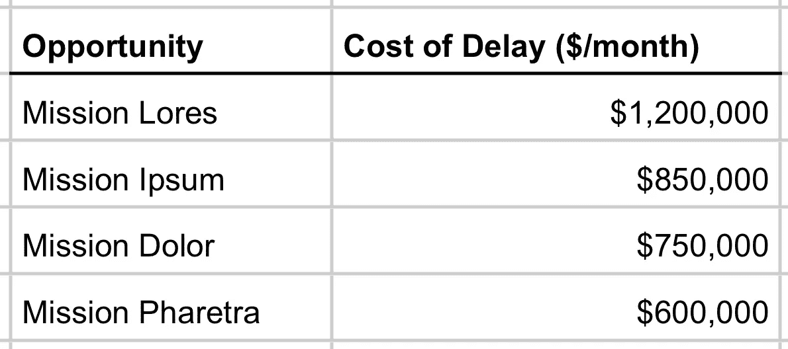
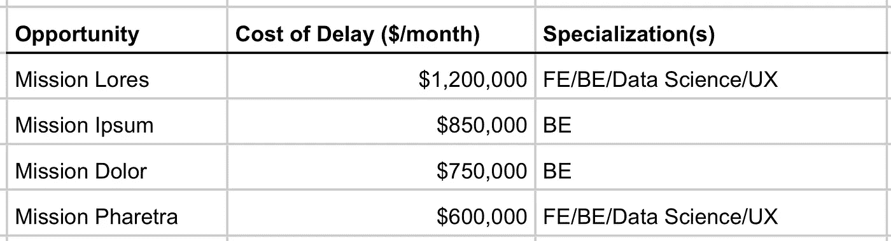

# 价值和排序

> 原文：<https://medium.com/hackernoon/value-and-sequencing-9754b95cac13>

我们来列举一些机会。对于每个机会，我将描述每月的机会成本(延迟成本)。

该列表按照延迟成本降序排列。

现在，任何有自尊的产品经理都会看着这份清单说:

> 这很好，但是如果 Pharetra 任务可以在 1 个月内完成，而任务知识需要 5 个月…我们不应该先做 Pharetra 任务吗？

这是明智的想法。但是让我在这里上升一个层次。

假设我们是一个 50 人的产品开发组织，我们正在考虑如何构建我们的组织来优化价值产出。我们看到上面的列表。我们注意到任务知识是*最有价值的*机会(仅从延迟成本的角度来看，不考虑持续时间)。考虑到这一点，我们决定聚集任务知识，也专门为任务知识这样的工作准备工具。我们也注意到可能有一个 80/20 规则在起作用。三周后，应该可以提取 80%的任务知识值。

现在，任务传说可能是更好的选择！

所以，让我们试着把我们在这里讨论的东西分出来:

*   创造价值的机会
*   最大化价值吞吐量

换句话说，当我们对努力的持续时间/水平及其对“价值”的影响做出假设时，很容易只见树木不见森林。产品经理(和“企业”)不断地询问“努力的程度”……**如此之多，以至于他们经常忘记提及除了他们对努力的假设之外，什么是真正有价值的。**

让我们在我们的清单上增加一些东西。

举个例子，作为 CTO 或 CPO，你可能会用不同的方式组织你的组织，因为你知道这是“清单”。如果这个列表是强加在你的组织上的，并且你的组织没有为这个排序进行优化，你可能不能按价值顺序拉进来。

这就是我要去的地方。

通过用未加权的术语陈述机会(未通过努力加权)，我们非常清楚地表明了机会的价值。这些是当务之急。优先级不同于工作排序或最大化价值产出。产品开发组织/部门——给定高级业务优先级——负责最大化价值产出，包括 1)从机会中提取价值，以及 2)机会的持续时间。当那些高层次的优先级改变时，它们必须适应优化列表的新“组成”……**但是如果我们忘记了什么是重要的，而只看到立即可行的，我们就有(再次)看不到真正有价值的风险。**

CD3(加权延迟成本)和 WSJF(加权最短作业优先)对于确定排序非常有价值。但是尽量保留一个纯粹按价值排序的列表作为提醒。

让我以一条推特来结束: