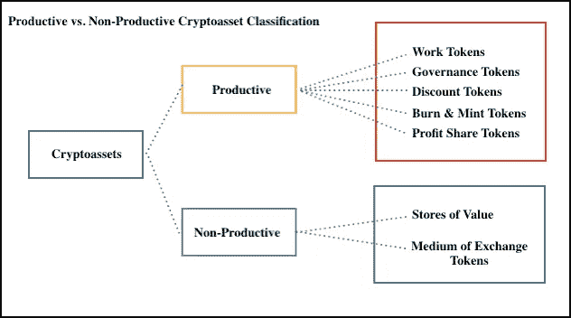
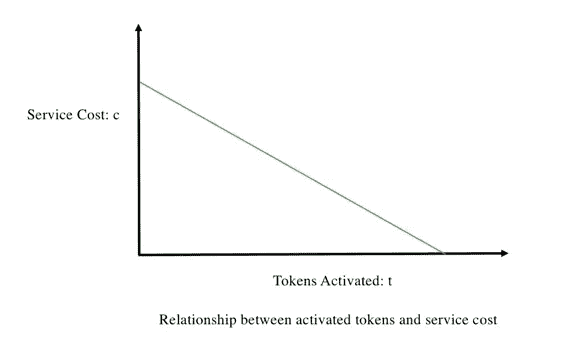

# 评估生产性加密资产

> 原文：<https://medium.com/hackernoon/valuing-productive-cryptoassets-89cedad444e6>

这篇文章主要关注*生产性加密资产*及其各自的估值框架。这些资产可以类似于房地产、股票和债券来建模。它们不同于*非生产性加密资产*，如交换媒介代币和价值储存候选物。

此上下文中的生产性加密资产包括折扣令牌、本地利润共享令牌、工作令牌、燃烧和铸造令牌以及治理令牌。

Productive vs. Non-Productive Cryptoassets

如果没有广泛投机的影响，上述模型中的代币价值*应该*相对于网络上产生的现金流线性增长。一般来说，令牌设计的目标是实现一些机制，这些机制可以创建财务上富有成效的数字资产，从而调整利益相关者的激励。这种生产性资产(在本文中有更详细的介绍)可以为其持有者产生现金流。

[交换方程](https://en.wikipedia.org/wiki/Equation_of_exchange)，MV=PQ，是一种半有用的启发式方法，用于识别构造不良的加密资产(那些易受无限速度和有限经济增长影响的资产)。然而，在评估生产性资产时，这个等式经常被误用。与其将所有数字资产都视为货币，不如将一些数字资产作为企业进行评估。将未来现金流折现为其净现值是充分估价方法的一个例子。事物越是变化，就越是一成不变。

**原生利润分享代币**

本地利润分享令牌是那些无法通过豪威测试的令牌。这些令牌是它们各自的应用程序所固有的。与传统证券类似，分红权的所有权以编程方式提供了对定期分红的访问权。

一个很好的例子就是 [Siafund](https://siafunds.tech/) 。Sia 区块链允许用户通过分散的市场与存储主机连接。矿工通过 Siacoin (Sia 的支付货币)获得奖励，然后可以用来买卖存储空间。Siacoin 是网络的支付货币。Siafunds 就是股权。Siafund 持有人从网络用户支付的交易费中获得一定比例的收入。

这种模式的其他例子包括 [COSS](/@danzuller/a-comprehensive-fundamental-analysis-on-coss-7dbf88ad01fc) 和 [Basis](/basis-blog/introducing-basis-a-stable-cryptocurrency-with-an-algorithmic-central-bank-7a795393a525) 。

一些人认为，这种模式从根本上来说是寻租——网络不需要收费就能生存。相反，利润分享标志恰当地调整了激励机制——这对于打造一个伟大的产品和培养一个强大的社区是必不可少的。然而，如果一个网络的利润过大，那么理性的参与者会选择创造更低成本的选择。开源固有的这种选择性是收费和寻租之间的关键区别。

通过代币分享利润很容易理解；这是大多数企业激励绩效的方式。因此，计算一个网络的公平市场价值可以通过简单地应用一个 NPV 模型来完成，该模型使用在一个定义的时间范围内赚取的费用。见附图[型号](https://docs.google.com/spreadsheets/d/11TyxD9RPJ0cZDQKELRFyAUdjn7lUAQf4jwcOVz45L7w/edit#gid=1978341396)。

**工作代币**

工作令牌为网络服务提供商提供了通过锁定或锁定机制执行工作的权利。这确保了服务提供者的奖励或惩罚与下注的代币数量成比例。所执行的工作应该是商品形式的，由此提供者之间的唯一区别特征是每个提供者持有的令牌的数量。

通过工作代币模型，代币持有者被给予未来现金奖励的可能性。与折扣代币和利润分享代币类似，工作代币模型创建了生产性数字资产，持有人可以借此期待一定的投资回报。资产的价值理论上也应该随着网络的使用而线性增长。这种模式最突出的例子是占卜。

工作令牌子集，令牌管理注册中心(TCR ),旨在与工作令牌类似地工作，因为验证者和管理者可以基于他们为了为网络工作而持有的股份的数量来接收一定比例的合同收入。在这种模式下，一个人拥有的代币越多，获得的潜在收入就越多。

因为参与者赚取的收入与下注的代币成比例，所以直接将[净现值计算](https://docs.google.com/spreadsheets/d/11TyxD9RPJ0cZDQKELRFyAUdjn7lUAQf4jwcOVz45L7w/edit#gid=958078651)应用于代币。

**折扣代币型号**

折扣代币授予其持有者从发行网络获得服务折扣的权利。这些令牌通常与特定于项目的 stablecoin 成对使用，使用双令牌模型。然而，使用折扣令牌的网络可以为其服务使用任何交换媒介。请参见随附的[模型](https://docs.google.com/spreadsheets/d/11TyxD9RPJ0cZDQKELRFyAUdjn7lUAQf4jwcOVz45L7w/edit#gid=1045449269)评估折扣代币 Sweetcoin。

如果代币的价格超过了折扣的价值，用户会在逻辑上避免购买。使用这个模型，人们可以根据折扣的价值来确定价格弹性。

例如，Alice 从“区块链银行”借款 100 美元，打算在一年内偿还贷款。她每年被收取 0.5%的利息。如果她购买并激活足够的 DiscountToken (DT)，她可以消除 0.5%的年息。在这种情况下，她愿意支付高达 0.50 美元(100 美元的 0.5%)的 DT，以消除一年期的利息费用。请注意，这并没有给出每 DT 的价格，因为我们不知道总的未完成供应量。这只告诉我们 Alice 愿意在一年内为一定数量的 DiscountToken 支付的最高价格。

在这个例子中，令牌的值理论上应该随着网络的使用而线性增加。随着用户希望获得折扣，更多的 DTs 被激活。网络价值应等于给定时间间隔内费用的预期总减少量。

**烧薄荷**

在 burn and mint 模式中，代币被用作网络的支付货币，但用户不直接向服务提供商付款。相反，用户*以他们特定服务提供商的名义烧掉*代币。然后按照预定的时间表铸造令牌，并分发给服务提供商。服务提供商根据以其名义燃烧的代币数量获得相应的奖励。

重要的是，铸造的代币的数量是*而不是*是燃烧的代币数量的函数。这将造成循环并消除价值累积。

服务费必须与外部价值单位如美元挂钩。如果烧钱率(需求)超过预定的铸币率(例如，“净烧钱”)，代币价格应根据供需动态而增长。

发明了积累价值的烧钱和造币机制。基本的利润分享模式将适当地调整激励措施，并促进代币的价值累积。

**治理令牌**

治理令牌是间接生产性资产，因为它们不会为持有者产生现金流，但可以为未来的现金流提供保护。他们允许持有者投票改变他们所属的网络。通常，一个人持有的代币数量与他拥有的票数成正比。在一个可以复制的系统中，治理令牌的价值是什么？

治理令牌的网络价值受到派生或创建网络新副本的净成本的限制。以去中心化的社交网络为例，代码可以被复制，但是由于点对点通信而产生的网络效应可能会丢失。在这种情况下，围绕网络会产生大量成本或护城河。用户和企业有参与决策的动机。

使用 0x 作为示例，网络参与者(例如，中继者)将为 51%的治理令牌支付的最高价格受到与网络分叉相关联的估计成本的约束。成本等于分叉前和分叉后业务的净现值之间的差额。这是确定网络公允价值的起点。详见附件[型号](https://docs.google.com/spreadsheets/d/11TyxD9RPJ0cZDQKELRFyAUdjn7lUAQf4jwcOVz45L7w/edit#gid=1319697077)和[前帖](https://hackernoon.com/a-framework-for-valuing-governance-tokens-0x-49d2cf2ef5bc)。

值得注意的是，*治理令牌*的价值不等于治理的价值。它等于紧耦合治理的价值和松耦合治理的价值之间的差值。这个增量不一定是正的。

**外卖**

MV=PQ 一般不适合对生产性资产进行估值。相反，它展示了一种半有用的方式来理解交换媒介代币相对于它所产生的经济活动如何表现。

利润分享模式是一种易于理解的机制，用于调整网络内的激励措施。分红的承诺允许参与者估计代币的现值。随着监管越来越清晰，预计会出现更多的利润分享令牌。

Burn 和 mint 有效地协调了激励措施，但却是一种避免安全状态的人为机制。一般来说，利润分成模式可以取代 burn 和 mint。

工作令牌是其各自网络的安全性和功能性的组成部分。他们的设计试图协调所有利益相关者的动机。工作令牌的所有者可以根据令牌所有权带来的未来现金流合理地估计其令牌的价值。

折扣令牌提供了一种机制，通过这种机制，用户可以根据特定时间段内的潜在节省来估计令牌的现值。

紧密耦合的治理令牌是一个有趣的协调实验。治理的价值由分叉网络的成本驱动。

令人惊讶的是，大多数“好的”令牌模型的操作是如此相似。它们基本上是生产性资产，其中一些类似于证券。折扣代币、利润分享代币、工作代币以及燃烧和铸造代币建立在分配给服务提供商或代币持有者的假定利润或费用上。有了这些增值代币，简单的净现值公式可以用来合理地估计代币价格。

*感谢* [*丹·祖勒*](https://twitter.com/danzuller) *和* [*罗科*](https://twitter.com/Obstropolos) *的反馈。如有任何意见，可在* [*推特*](https://twitter.com/PhilJBonello) *上联系我！*