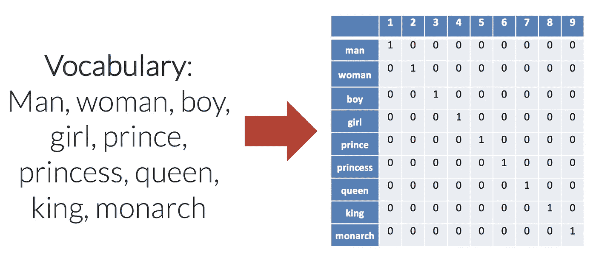
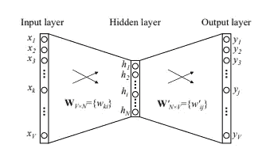
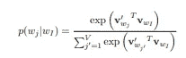
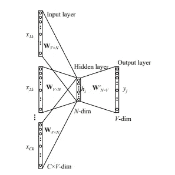
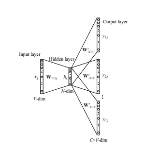
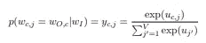
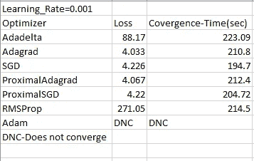
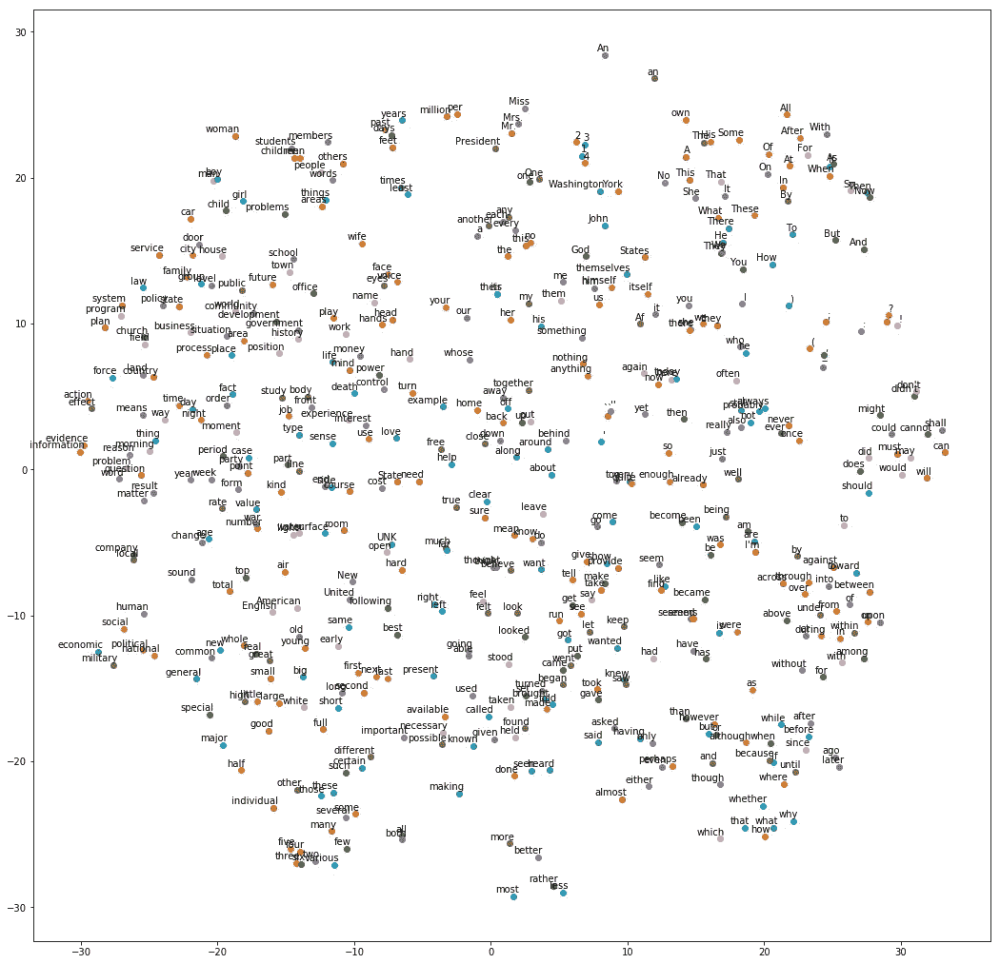
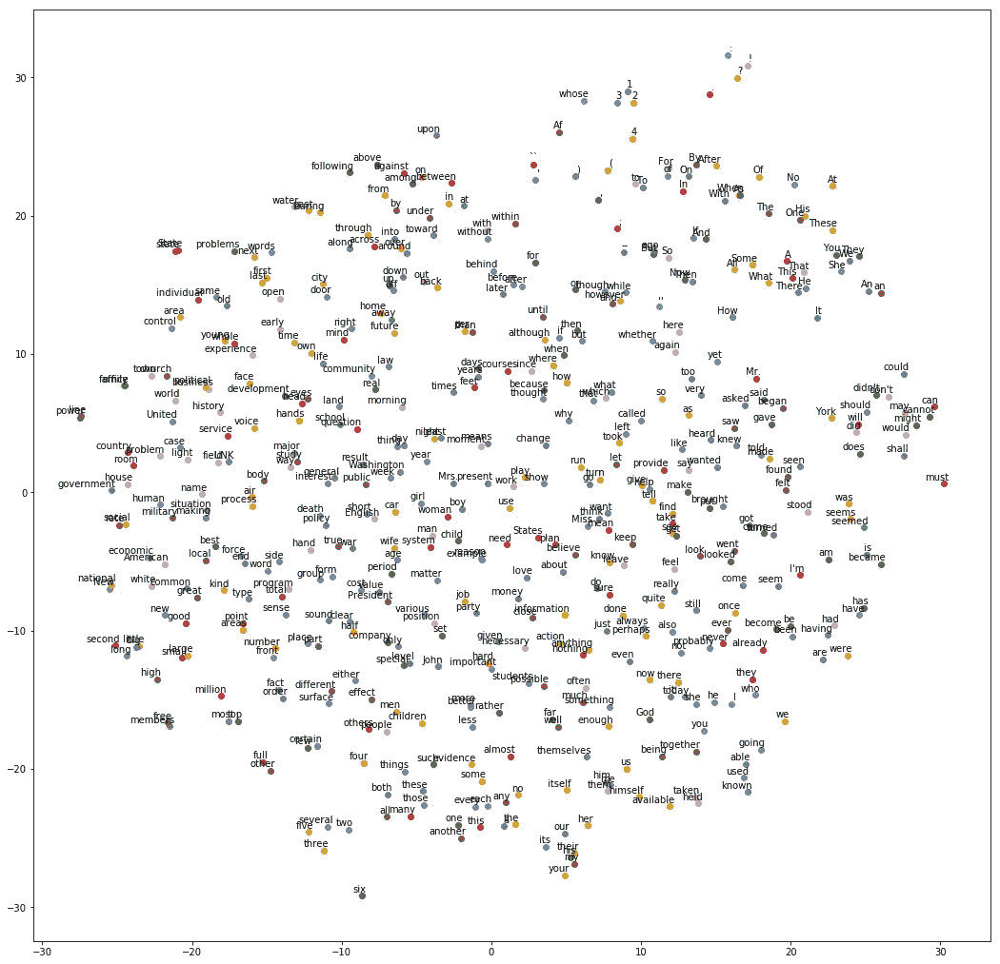

# 各种优化技术及其对单词嵌入生成的影响

> 原文：<https://medium.com/hackernoon/various-optimisation-techniques-and-their-impact-on-generation-of-word-embeddings-3480bd7ed54f>

*无耻插件:我们是一个* [*机器学习数据标注平台*](https://dataturks.com) *让你超级轻松的* [*构建 ML 数据集*](https://dataturks.com) *。只需上传数据，邀请您的团队，快速构建数据集。*

欢迎来到关于机器学习及其应用的五个系列教程的第三部分。来看看[***data Turks***](http://dataturks.com)，一个让你的 ML 生活更简单更顺畅的数据标注工具。

**单词嵌入**是分配给单词的**矢量表示**，它们具有相似的上下文用法。你可能会说单词嵌入有什么用？嗯，如果我在谈论梅西，并立即知道上下文是足球…这是怎么发生的？我们的大脑有联想记忆，我们把梅西和足球联系在一起…

为了达到同样的目的，也就是把相似的词组合起来，我们使用嵌入。嵌入最初是从一种热编码方法开始的，在这种方法中，文本中的每个单词都用一个长度等于词汇表中唯一单词数量的数组来表示。

> 例句:句子 1:芒果是黄色的。苹果是红色的。

独特的单词是{The，mangoes，are，yellow，apples，red}。因此，句子 1 将表示为[1，1，1，1，0，0] &句子 2 将表示为[1，0，1，0，1，1]。

这种方法适用于小数据集，但不适用于非常大的数据集。因此，为此实现了几个 n 元模型。在本教程中，我们将不探讨这个领域。感兴趣的主题是用于生成单词嵌入的 word2vec 模型。这涵盖了机器学习的很多概念。我们将学习单隐层神经网络、嵌入和各种优化技术。

任何机器学习算法都需要三个领域携手合作。它们是分类器的**表示**、假设的**评估**和模型的**优化**以获得更高的精确度。

在 **word2vec 模型**中，我们有一个大小为 N 的单一隐藏分层神经网络，用于获得维度 N 中的单词嵌入。可视化嵌入的方法如下…

## **让我们了解一下各种术语…**

**连续词袋模型(Continuous Bag of Words Model)——CBOW:**由托马斯·米科洛夫(Tomas Mikolov)在其论文中提出，该模型假设每个语境只考虑一个词。因此，给定一个上下文单词，该模型将预测一个目标单词。设词汇量为 V

CBOW model with only one word in context

输入层和输出层之间的权重矩阵可以由 V*N 矩阵表示。矩阵的每一行代表每个单词的嵌入向量。注意，这种情况下的激活函数是一个 l **线性函数**。目标函数是在给定输入上下文单词的情况下观察实际输出单词的条件概率。我们需要最大化目标函数，也就是最大化给定上下文的单词预测…简单对！

CBOW 也有一个多单词上下文，其中不是在上下文中有一个单词，而是取某个窗口大小的单词长度的平均值，然后将其作为输入发送到神经网络。

**跳克模型**

Mikolov 等人引入的 skip gram 模型与 CBOW 模型相反。目标单词现在在输入层，上下文单词在输出层。

目标函数是给定上下文单词的目标单词组中输出单词的概率。W_O，c 是第 c 组输出字中的实际输出字。

Objective function

Word2vec 模型实现了 skip-gram，现在…我们来看看代码。Gensim 还提供了 word2vec 更快的实现…我们将查看 Word2Vec 的源代码。让我们导入所有需要的库和 nltk.corpus 中可用的数据集。

让我们对数据集进行预处理，去掉不常用的单词，并将它们标记为 UNK 记号。

实现 skip gram 模型是下一部分。

训练跳格模型导致模型理解语言结构。

让我们想象一下嵌入。

优化用于改进所获得的嵌入。让我们回顾一下我们知道并使用的各种技术。由于在介质上输入数学的限制，我建议你通过[这个](http://ruder.io/optimizing-gradient-descent/)。

Results for comparison of various optimisers

因此，我们可以得出结论，RMSProp 和 Adam 这两个最先进的工具并不能很好地在这些模型上工作。另一方面，近端 Adagrad 和 SGD 的效果非常好。让我们看看近端 Adagrad 和 SGD 的结果。

Proximal Adaptive Gradient Descent Optimizer

检查那些经常出现在一起的单词，它们在图片上的位置是否足够近。此外…比较数字的位置…在两个图像中…相应地决定哪一个是更好的！

Stochastic Gradient Descent Optimizer

这是五部分系列中的第三部分……对接下来的两部分感到兴奋……在*lalith@dataturks.com 分享你的想法和反馈。*