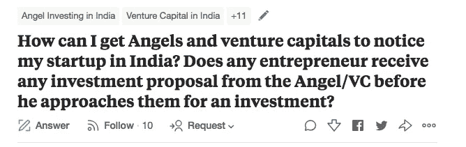

# 风投不追创业者！

> 原文：<https://medium.com/hackernoon/vcs-dont-chase-entrepreneurs-6377e26a8341>

## 或者，他们有吗？


我在 Quora 上遇到一个问题，我相信每个第一次创业的人都会在人生的某个阶段问过他这个问题。



[Quora question](https://www.quora.com/How-can-I-get-Angels-and-venture-capitals-to-notice-my-startup-in-India-Does-any-entrepreneur-receive-any-investment-proposal-from-the-Angel-VC-before-he-approaches-them-for-an-investment)

这个问题有两个部分:

1.  你如何让投资者注意到你的创业公司？
2.  创业者收到投资人的投资建议，自己不伸手吗？

让我们先回答 Q2。

# 企业家可以收到投资者的兴趣邮件

老实说，这并不罕见；这背后有多种原因。

## 原因一。投资者从事投资业务

我总是说— *商业就是赚钱的生意*。投资者的业务(*机构或非*)没有什么不同。他们从事的是赚钱的生意，他们在投资生意中赚钱的唯一方法是挑选他们认为会赢得比赛的马。作为一名企业家，你总是在寻找下一个赢得*的销售或营销策略，或者思考下一个让你的产品大受欢迎的伟大产品功能。你不会把时间浪费在无所事事地坐在椅子上，等待销售凭空出现。同样，投资者总是在寻找下一个要投资的创业公司。创业公司会一直接近他们吗？是的，很明显。但这并不意味着他们不会睁大眼睛寻找一家他们可能在混乱中错过的创业公司。*

## 原因之二。对于机构投资者而言，他们的投资过程与销售领域的运作方式没有太大区别

比如说，你管理过 B2B SaaS 产品的业务吗？确切地说，销售职能是我感兴趣的。如果你还没有，那么也许你可以在你的关系网中找到一个这样的人。去问问他们流程。他们的团队由多个部分组成。

*   有人在不断寻找商机。这个人/团队会双管齐下。看看那些向他们伸出援手的创业公司，以及在他们感兴趣的领域向他们伸出援手的创业公司。(*现在，他们可以通过不同的方式了解这些创业公司。他们投资的公司的创始人可以告诉他们，他们遇到的或者他们的朋友正在做的有前途的创业公司。他们从他们的关系网——甚至可能是他们的女朋友——那里了解到这件事。他们读到了一个他们不知道存在的，或者至少不知道做得这么好的创业公司。*)
*   在这两种情况下，*无论是初创公司主动联系这个人还是反过来*，他们都会接到电话，了解这家初创公司到底在做什么，到目前为止他们的旅程如何等等。等等。
*   如果他们喜欢他们所听到的，他们会跑到旗杆上去看看合伙人对企业的感觉。

如果一切顺利，初创企业将进入整个过程，之后就可以清楚地看到初创企业是否获得了资金。这个过程牵涉到很多东西。多轮沟通、共享条款清单、谈判、最终尽职调查。)

## 原因三。早起的鸟儿有虫吃！

我们今天生活在一个狗咬狗的世界。每个人的竞争都很激烈；机构投资者的世界也不例外。这是一个众所周知的事实，只有极小比例的初创公司能够在黎明时分屹立不倒，而大多数初创公司都消失在黑夜的黑暗中。因此，有理由认为，支持这些极少数获胜马匹的竞争相当激烈。

结果呢？任何称职的投资者都想在别人接手之前，成为第一个支持一个正在崛起和即将到来的业务的人。

他们总是在徘徊，总是在观望，关注所有出现在那里的创业公司。在我上一次创业时，在我们为公司创建了 [AngelList](https://medium.com/u/5f84314adf6?source=post_page-----6377e26a8341--------------------------------) 页面后的半天内，我们就收到了来自四个不同投资者的邮件/信息。踢球者？我们甚至不打算筹集资金；我们只是想建立 AngelList 页面，这样我们就可以通过他们的工作门户网站开始寻找技术候选人。

相信我。如果某个地方的某个人至少两次谈论过你的创业公司，那么很有可能某个投资者至少听说过你一次。如果他们听说过你几次，你就会收到他们的来信。他们不会等你伸出手来。在这方面，他们相当前卫和积极；他们不介意*亲自约你出去。:-)*

# 那么，如何让投资者接触到你，当他们接触到你的时候，你会期待什么呢？

## 方法:

*   牵引力。**第一条规则永远是牵引力**。无论是从应用程序下载数量，还是从 ARPU ( *每用户平均收入*)来看，traction 都是唯一的游戏。
*   媒体提及和大肆宣传显然有助于让你受到关注。但是如果你的牵引力不够大，那就没什么用了。所以再一次，记住，牵引是唯一的游戏。
*   **关注正确的指标。**如果有一个指标投资者比用户数量更喜欢，那就是每用户平均收入。这是你的 LTV 的指示性概念，因此 LTV/CAC 比率将会是什么样子，相信我— *这非常重要*。
*   **游击战**。快点。抓紧时间，就像你的生命取决于它一样。记住，企业家是骗子。他们一直在即兴创作。作为一家资金紧张的初创公司，你的能力、意愿和热情应该是无与伦比的。这需要体现在你做了什么，如何做，以及这些措施的效率和效果。
*   **拥有一个用户/顾客参与的社区。**参与转化为销售和品牌冠军。如果客户抽出一天中的时间与你交谈，那么他们成为你的品牌大使和最大的商业冠军的机会是惊人的高。

## 期待什么:

> 不要因为一个投资者向你伸出了手，就认为他已经成功了一半。

旅程才刚刚开始，它会像你第一次接触时一样艰难、耗时和不确定。你主动出击和这种情况的唯一区别是消除了第一阶段的焦虑，在这一阶段，给投资者发邮件后，你甚至不知道是否会收到他们的回复。

其他一切——从你必须让他们相信你是这个行业的正确人选，并拥有成功所需的一切，到最后的尽职调查——*一切都将是一样的！*

# 今天到此为止。明天见！


```
[**Medium**](/@abyshake) **|** [**Twitter**](http://twitter.com/@abyshake) **|** [**Facebook**](http://facebook.com/abyshake) **|** [**Quora**](http://bit.ly/abyshake) **|** [**LinkedIn**](http://in.linkedin.com/in/abyshake) **|** [**E-mail**](mailto:mail@abyshake.com)
```

[](https://upscri.be/a5ccb9/)

Click here to join the mailing list