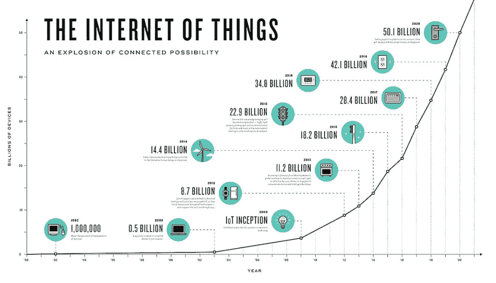
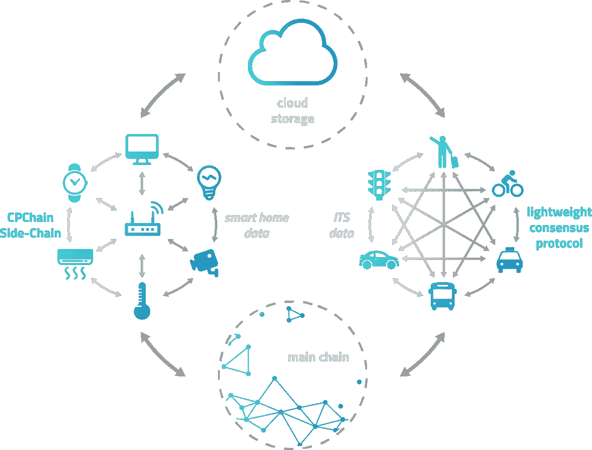
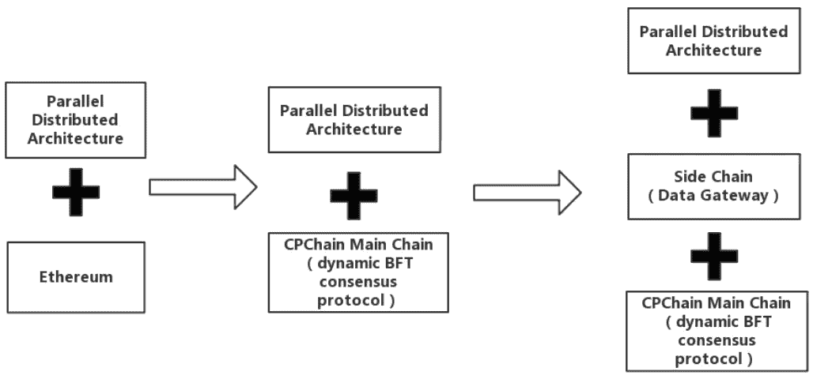
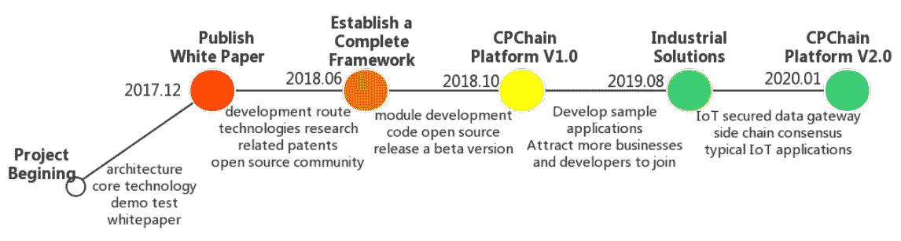
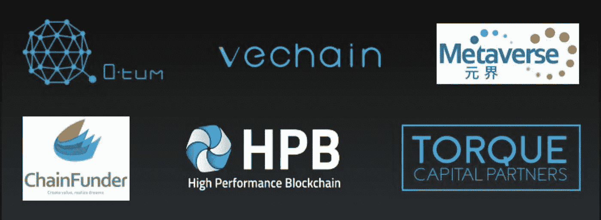

# VeChain、QTUM、HPB 和元宇宙与 CPChain 合作，在中国掀起物联网革命

> 原文：<https://medium.com/hackernoon/vechain-and-qtum-partner-with-cpchain-to-revolutionise-iot-in-china-519462c6aab>

物联网  预计将呈指数级增长。据预测，到 2020 年，全球联网设备数量将超过 500 亿台，麦肯锡全球研究院预测  :

> 如果政策制定者和企业做得对，到 2025 年，连接物理世界和数字世界每年可以产生高达 11.1 万亿美元的经济价值。

虽然正在取得进展，物联网设备现在已经成为我们生活中的一个常见特征，但围绕成本、数据和安全性的一些绊脚石正在阻止物联网的快速采用。

**成本:**当前物联网基础设施的集中化性质为设备的互操作性和互连制造了巨大障碍，大幅推高了所需设备和 IT 基础设施的成本。

**数据:**传统的物联网基础设施通常是根据特定的应用场景构建的，这导致了孤立的数据池，难以充分利用物联网数据的价值。

**安全性:**网络攻击和盗窃是非常真实的日常威胁，物联网系统经常遭到破坏。这突出了隐私和安全是需要解决的关键问题。

由于其分布式/分散式框架，区块链技术有可能显著降低设备互连的成本，创建新的商业模式以最大化数据的价值，同时还确保隐私和安全。

# 介绍物联网行业期待已久的杀手级技术 CPChain

利用区块链作为物联网的主干是一个明显的用例。速度、规模、降低的交易成本和安全性是区块链承诺的一些特征。然而，为了实现他们的承诺，该技术需要克服围绕数据存储和计算的高成本以及当前共识机制的低效率的可扩展性挑战。

一个令人兴奋的新玩家已经进入市场，声称他们可以做到这一点。CPChain 是一家总部位于中国的区块链企业，致力于应对上述挑战，其独特的区块链可以降低连接成本，保护数据并最大限度地发挥物联网数据的价值。根据他们的网站 [⁴](http://www.cpchain.io) :

> CPChain 是面向下一代物联网的新型分布式基础设施。CPChain 旨在结合分布式存储、加密计算和区块链技术，为物联网系统构建基础数据平台，提供从数据采集、存储、共享到应用的全流程解决方案。

# CPChain 是下一代区块链解决方案，将推动物联网的采用

CPChain 将解决物联网面临的传统和区块链特有的挑战。他们的重点是创建专用于物联网基础设施的数据和交易的可扩展性、安全性和实时传输。这被分解为三个步骤/技术，这些步骤/技术进入基于主链的集成生态系统。

**将部署并行分布式云存储架构**，解决大规模数据存储和共享的可扩展性问题。

**一个新的混合共识协议**将被实施，它能够在优化计算能力的同时进行大规模扩展

**侧链共识系统**专注于高级别的安全性，同时还支持实时、大容量并发交易

在解决交付无缝物联网基础设施的传统和区块链特定挑战时，CPChain 将能够交付许多关键应用，包括(但不限于)大数据、**智能交通**和**药品可追溯性**。

# 一个积极的路线图将使 CPChain 在 3 年内处于物联网部署的前沿

CPChain 已经完成了分布式云存储架构、共识协议和侧链开发的 R&D 阶段，并于最近完成了一次非常成功的融资，使他们能够开始全面的项目实施，具体如下:

测试链预计将于 2018 年第三季度上线，示例应用将于 2019 年夏季推出。到 2020 年初，CPChain 希望能够与众多商业合作伙伴一起开发出完全可行的功能性产品。

# 区块链行业领导者 QTUM、VeChain 和 HPB 正在支持这支优秀的团队取得成功

要在如此紧迫的时间内交付成果，需要优秀、可信的合作伙伴关系。与大多数竞争对手相比，CPChain 在这方面遥遥领先。他们已经与 QTUM [⁵](http://sl.vc/posts/4760) ，VeChain，高性能区块链 [⁶](http://new.gongxiangcj.com/posts/4512) 和元宇宙 [⁷](http://sl.vc/posts/4758) 建立了合作关系。此外，他们还获得了来自 torque capital partners 的投资。

# 由拥有坚实的商业和技术专业知识的优秀团队运营

此外，该团队拥有技术、运营和业务方面的专业知识，这通常是此类区块链项目未来成功的有力指标(尤其是在有如此强大的合作伙伴支持的情况下)。

**龙承年博士** [**⁹**](http://english.seiee.sjtu.edu.cn/english/detail/708_606.htm) 是**的联合创始人和首席科学家**。作为上海交通大学的教授，龙博士发表了 40 多部著作，并两次获得中国教育部的奖励。他在信息物理系统、移动物联网和 MIMO 无线系统的安全评估和控制方面拥有深厚的专业知识，并将领导该项目的技术要素。

**赵斌博士**，也是**的联合创始人**，拥有超过 12 年的物联网研发经验，其中包括在阿尔卡特朗讯物联网部门工作的 4 年经验。他拥有三项物联网专利，由于他与中国三大运营商在物联网平台上的合作以及他与政府和运营商的关系，他已经获得了上海汽车行业的一个试点项目。

*免责声明:本文不应被视为，也无意提供投资建议。在投资任何加密货币之前，请自行进行彻底的研究。*