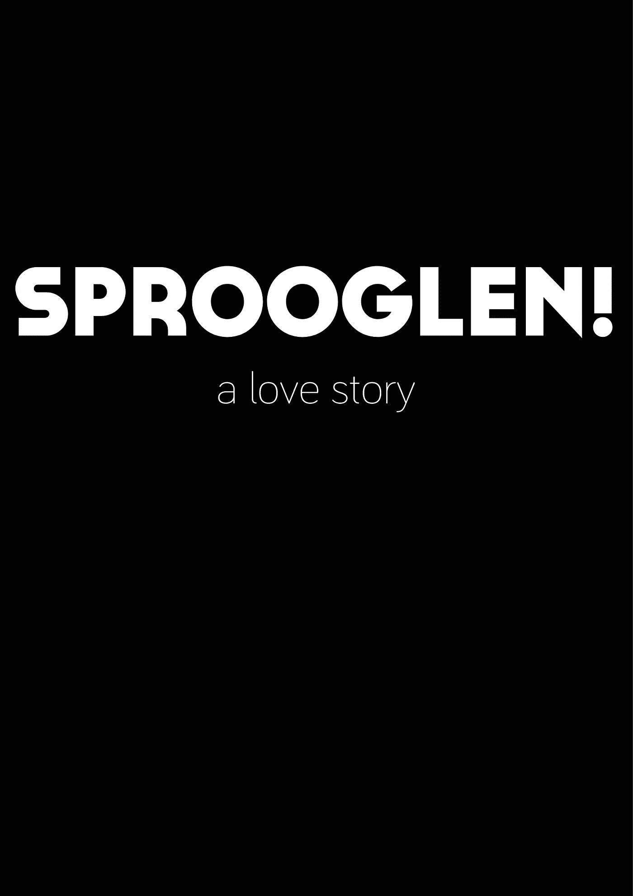

# Android 开发人员矢量插图基础——额外部分:使用文本

> 原文：<https://medium.com/hackernoon/vector-illustration-basics-for-android-developers-bonus-part-working-with-text-e2bff3cecbed>

## 让文字变得精彩！

《Android 开发人员矢量插图基础》前情提要

 [## Android 开发人员的矢量插图基础-第 1 部分:基本形状

### 比你想象的容易！

hackernoon.com](https://hackernoon.com/vector-illustration-basics-for-android-developers-part-1-primitive-shapes-5af2e03ad24a)  [## 面向 Android 开发人员的矢量插图基础—第 2 部分:笔画和路径

### 同样，比你想象的简单

hackernoon.com](https://hackernoon.com/vector-illustration-basics-for-android-developers-part-2-strokes-and-paths-b44118368ffa)  [## 面向 Android 开发人员的矢量插图基础知识第 3 部分:布尔运算

### 还是轻松！

hackernoon.com](https://hackernoon.com/vector-illustration-basics-for-android-developers-part-3-boolean-operations-8a0ced922030)  [## 面向 Android 开发人员的矢量插图基础知识—第 4 部分:z 排序

### 听起来很棒的名字，一点也不复杂

hackernoon.com](https://hackernoon.com/vector-illustration-basics-for-android-developers-part-4-z-ordering-6d1f0928e17)  [## 面向 Android 开发人员的矢量插图基础知识—第 5 部分:基本转换

### 基本但非常有用的操作

hackernoon.com](https://hackernoon.com/vector-illustration-basics-for-android-developers-part-5-basic-transformations-bfbe3400ad9) 

在我的“Android 开发人员矢量插图基础”系列的这个附加部分中，我将分享一些让你的文本脱颖而出的技巧。

这里有一个场景给你:一个朋友来找你，说“嘿，我听说你一直在读安东尼斯·察加里斯的矢量插图基础系列。多好的人啊。总之。我写了一部名为“Sprooglen:一个爱情故事”的音乐剧，讲述了三十年代中期柏林一名瑞典挤奶女工和一只袋鼠之间的禁忌之爱，我希望你为我创作海报。

即使你对这个情节很困惑(每个人都知道袋鼠对挤奶女工有根深蒂固的仇恨，尤其是斯堪的纳维亚人)，你还是同意了。

所以你启动 Gravit Designer，**选择文本工具**

*   在顶部工具栏上，是字母“T”

…点击画布，开始书写。你**根据画布的大小改变文本的大小**

*   选择文本，转到右侧面板的“外观”并更改大小

…你有了这个起点

这太糟糕了。让我们解决这个问题。

首先，为标题选择一种漂亮的字体，为副标题选择另一种字体。经过仔细考虑，我选择了卡萨内特作为标题，巴里奥尔之光作为副标题，这两种字体都是 http://atipofoundry.com/[设计的](http://atipofoundry.com/)

要在 Gravit Designer 中应用字体，请选择文本，然后在“外观”面板上，从下拉列表中选择要使用的字体。如果要导入字体，请进入**文件→导入→添加字体**

这是应用了字体的海报(我也将背景色设为黑色，文字设为白色)

好多了，但是…嘿！我能听到你们在教室后面！我知道你可以用微软的 Word 做这个。闭嘴。

我们来玩一个你在 Word 里玩不到的把戏。大概吧。

选择钢笔工具，并创建一个弧。点击画布上的一个点以放置第一个节点，然后完全水平移动(在移动指针时向下使用 Shift 键可以让您轻松完成此操作)点击另一个点，在释放鼠标按钮之前，拖动鼠标以创建弧。它应该看起来像这样

最酷的部分来了:选择文本工具，然后点击弧线。现在开始写吧，美妙的事情会发生的

是啊！现在，我们把废话去掉，写“Sprooglen！”相反。同样，让我们再次将卡萨内特应用到文本中！

这里你需要注意一些事情:如果文本的长度大于弧线的长度，那么文本将会以一些非常奇怪的方式环绕弧线。要处理这种情况，要么增大弧线的尺寸，要么缩小文本。

您还会注意到，当您单击沿着路径运行的文本时，一个橙色的小菱形会出现在文本的最左侧。使用该符号沿路径移动文本。

好了，现在删除多余的“Sprooglen！”并使弧线的描边宽度等于零，使描边消失，但保留弧线。

然后，将弯曲的“Sprooglen”移动到设计的顶部。如果到目前为止你已经按照这个系列做了练习，这对你来说应该是小菜一碟。

我们现在有了这个

哼。还不错。但你知道什么会很棒吗？“SPROOGLEN”中的那些“O”如果我们把它们稍微放大一点，让它们看起来像凸出的眼睛之类的，会看起来很神奇。

为此，我们需要我们的老朋友……的帮助

## 转换为路径

现在，所有的文本都只是字符。

当然，你可以做很多事情:改变他们的大小，大小，间距等。但是为了让您体验真正的灵活性，让我们将它们转换为路径。

将文本转换为路径意味着我们可以像操纵任何矢量对象一样操纵它，但这也意味着我们失去了以后改变字体的能力(因为在这一点上，文本不再是文本，对于图形程序来说变得无法与任何其他形状区分开来)。所以要确保你坚持使用选定的字体。

准备好了吗？选择文本，然后转到修改 **→** 路径 **→** 转换为原始路径。

现在你的文本是一个矢量形状，但是在字母成为单独的形状之前，你还有一步要做。现在，整个“Sprooglen！”word 是单一形状。所以保持选中状态，然后转到修改 **→** 路径→分割路径

现在每个字母都是一个形状，是时候开始研究这些“O”了。

双击每个“O ”,直到节点弹出。节点指定了向量形状中的重要点，在这些点上可以操作路径。您可以向任何形状添加节点，使其更加复杂，但这超出了本系列的范围。

这是“O”上节点的样子

选择每个“O”的最顶端的节点，并向上拖动，直到你有这样的东西

我觉得“眼睛”效果挺酷的！

你今天的作业是用天际线填满海报的底部。但是有一个转折！将字母转换为路径后，使用经过处理的字母创建天际线。让我们看看谁是最有创造力的学生。

## 还有一件事…

好了，在我永远退出这个系列之前，还有一件很酷的事情(一滴眼泪顺着我的脸颊流下)。我将向我的家乡拉纳卡致敬，同时向你展示如何在文本中放置图像。

创建一个新项目，写下你的短文(最好是)。现在应用你想要的字体，把它放大到你需要的大小。我使用临街浓缩 3D 作为我的字体，这就是我的

现在，将文本转换为路径，就像我之前展示的那样。不过，不需要像以前那样分开路径。

进入文件 **→** 导入→放置图像，导入您想要放置在文本中的图像。把它放在屏幕上的任何地方。

在屏幕的左侧，您应该会看到一个名为“层”的面板。它应该包含两个层，一个称为“复合形状”，这是转换后的文本，另一个将是您导入的图像文件的名称。

我们通过点击、按住并拖动图像层到文本(复合形状)层来完成这个技巧。

这是我得到的结果。当然，根据您选择并放入文本中的图像，您的图像会有所不同

女士们先生们，结束了。如果你总体上喜欢这篇文章和这个系列，一定要鼓掌，甚至在下面捐款。我正在根据这个系列创作一本华丽的书，内容有所扩展，现在已经可以以 3 美元的荒谬价格预购了。发布后，它会涨到正常价格 15 美元，所以趁热打铁吧。*非常*热。(以下是关于这本书和捐赠模式的更多信息)

# 神圣更新，蝙蝠侠！

*由于对这个系列压倒性的积极反应和各种读者的要求(谢谢你，你的消息让我高兴！)，我已经开始着手编写本系列的书籍版本，内容有所扩展，还有各种练习，可以让你快速高效地入门。*

这本书将于 3 月中旬发行，但你现在可以通过访问我的 BuyMeACoffee 页面(下面的链接)和**捐赠任何超过 3 美元**(显然包括 3 美元)**的金额来预订。捐赠 6 美元或 9 美元还可以让你在做练习时获得我的电子邮件支持！卡住了？给我发一封电子邮件，我会以极快的速度回复。**

发行后，这本书将回到 15 美元的正常价格，并永远保持这个价格(或者至少直到迈克尔·贝拍出一部好电影，这实际上是永远)，所以如果你喜欢这些文章，想要一个内容丰富、笑话更多的华丽版本，你知道该怎么做！(提示:单击下面的链接)

**重要提示:当你捐赠的时候，请给我留下你的电子邮件地址**，这样我就可以联系到你，并且在书出版后尽快寄给你！

 [## 给安东尼斯·查加利斯买杯咖啡——BuyMeACoffee.com

### 我写机器人，生活，宇宙和一切。

www.buymeacoffee.com](https://www.buymeacoffee.com/XozUExS)