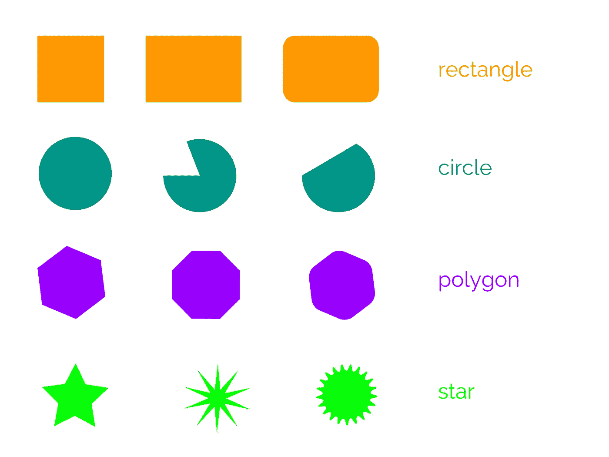
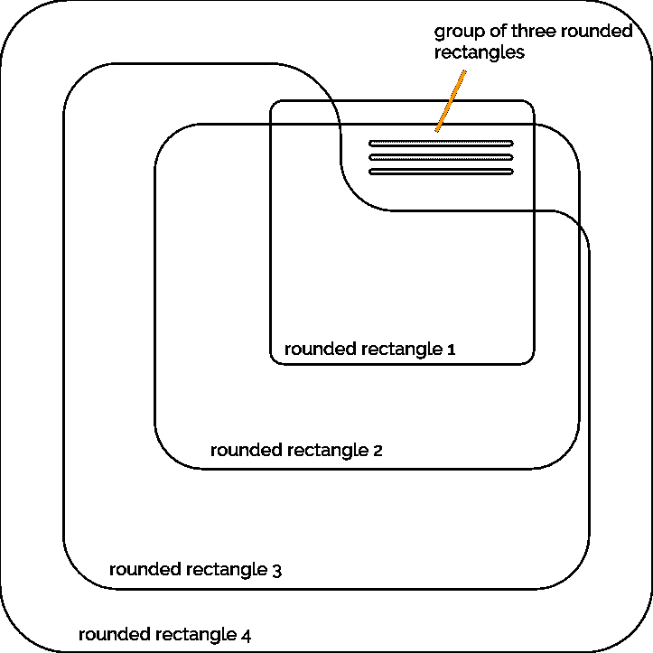

# Android 开发人员的矢量插图基础-第 1 部分:基本形状

> 原文：<https://medium.com/hackernoon/vector-illustration-basics-for-android-developers-part-1-primitive-shapes-5af2e03ad24a>

## 比你想象的容易！

***看这个五部曲系列的第二部《笔画与路径》，*** [***在这里！***](/@sebastian212000/vector-illustration-basics-for-android-developers-part-2-strokes-and-paths-b44118368ffa)

***读第三部分，“布尔运算”，这里有*** [***！***](/@sebastian212000/vector-illustration-basics-for-android-developers-part-3-boolean-operations-8a0ced922030)

***阅读第四部分，“z-排序”，*** [***此处！***](/@sebastian212000/vector-illustration-basics-for-android-developers-part-4-z-ordering-6d1f0928e17)

***阅读第 5 部分，“基本变换”，*** [***此处！*T38**](/@sebastian212000/vector-illustration-basics-for-android-developers-part-5-basic-transformations-bfbe3400ad9)

***阅读加分部分，*** [***在此！***](/@sebastian212000/vector-illustration-basics-for-android-developers-bonus-part-working-with-text-e2bff3cecbed)

## 介绍

相信我:即使你是一名开发人员(尤其是一名单独的应用程序开发人员),拥有基本的矢量插图技能也会非常有用。

作为一个基本规则，为了一致性，我总是建议对一个应用程序使用一个图标包。

但是如果你正在使用的图标包没有你真正需要的对象或概念的图标呢？如果你需要一个“皇冠”的图标呢？或者是“鳄梨”的图标？或者是“括约肌”的图标？

如果(或者更现实地说，*当*便秘鳄梨食用者皇家学会要求你开发他们的应用程序，那你就真的有麻烦了。

事实是，创建特定风格的基本矢量图标和插图比你想象的要容易得多。事实上，我相信通过掌握五个基本概念，你就能自己创造出大部分你需要的东西。

在这个由五部分组成的系列中，我将一次强调一个概念，并举例说明如何有效地使用这个概念。

这五个概念是:

1.  原始形状
2.  中风
3.  布尔运算符
4.  z 排序
5.  基本转换
6.  (奖金概念！)使用文本

对于这个系列，我将使用一个奇妙的矢量工具，叫做 [Gravit Designer](https://www.designer.io/) 。[</shape>](https://medium.com/u/f2de0daa7b3d#FFffff” />                    <span id=)

 [## 给安东尼斯·查加利斯买杯咖啡——BuyMeACoffee.com

### 我是一名 Android 开发人员和设计师，热爱漂亮的用户界面！

www.buymeacoffee.com](https://www.buymeacoffee.com/XozUExS)