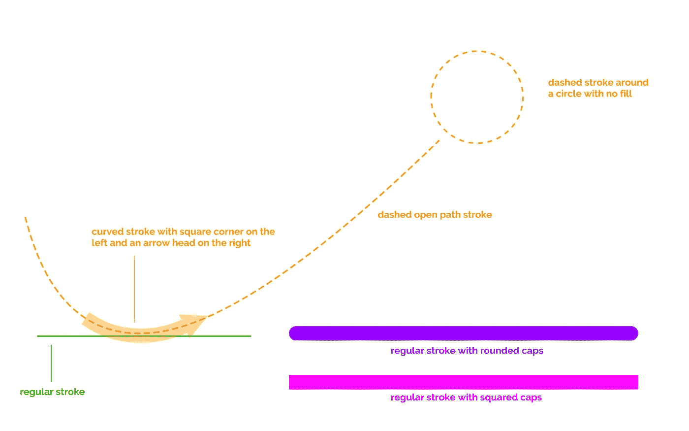
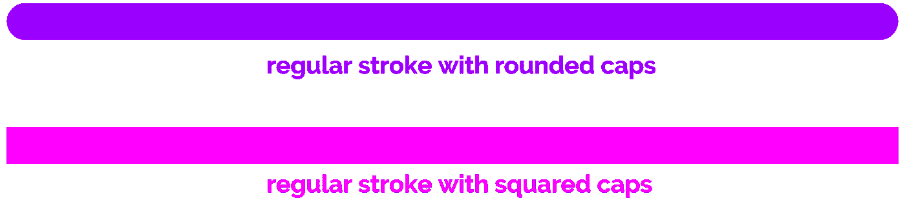
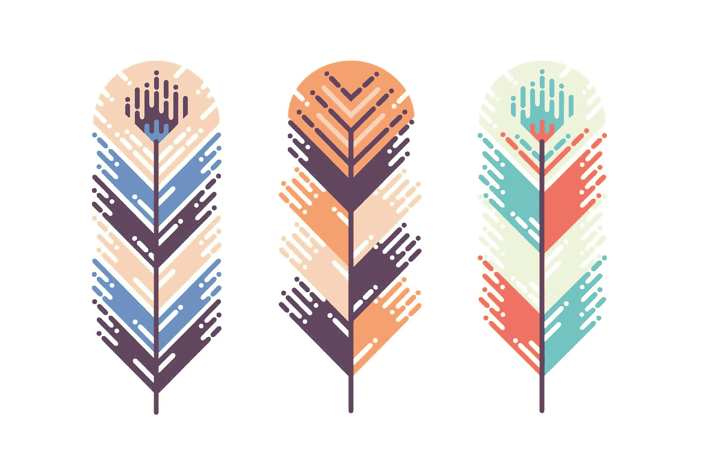
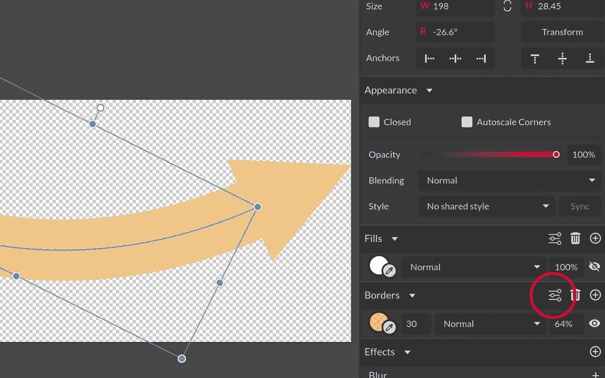
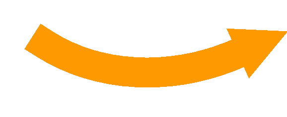

# 面向 Android 开发人员的矢量插图基础—第 2 部分:笔画和路径

> 原文：<https://medium.com/hackernoon/vector-illustration-basics-for-android-developers-part-2-strokes-and-paths-b44118368ffa>



## 同样，比你想象的简单

***注意:这是一个五部分系列的第 2 部分。按照正确的顺序阅读它们会是最佳的，所以这里的*** [***第一部分***](https://hackernoon.com/vector-illustration-basics-for-android-developers-part-1-primitive-shapes-5af2e03ad24a) ***是为那些错过了的人准备的。***

***下面是*** [***第三部分***](/@sebastian212000/vector-illustration-basics-for-android-developers-part-3-boolean-operations-8a0ced922030) ***给那些不在乎‘无臭’顺序的人！还有这里的*** [***第四部分！***](/@sebastian212000/vector-illustration-basics-for-android-developers-part-4-z-ordering-6d1f0928e17)*[***第五部分！***](/@sebastian212000/vector-illustration-basics-for-android-developers-part-5-basic-transformations-bfbe3400ad9)*[***奖金部分***](/@sebastian212000/vector-illustration-basics-for-android-developers-bonus-part-working-with-text-e2bff3cecbed) ***！*****

**描边是围绕形状的线，或者在开放路径的情况下，是沿着路径的线。**

> **一个关于笔画和路径区别的惊人解释贴在了本文的末尾**

**就像形状一样，笔画也有定义其外观的属性。当您创建一个可在 XML 中绘制的形状时，您可以定义一些笔画属性。例如，下面表示一个矩形，周围有一条橙色虚线，没有填充**

```
**<[shape](https://developer.android.com/guide/topics/resources/drawable-resource.html#shape-element)
    xmlns:android="http://schemas.android.com/apk/res/android"
    android:shape="rectangle">

    <[stroke](https://developer.android.com/guide/topics/resources/drawable-resource.html#stroke-element)
        android:width="2dp"
        android:color="#FB8C00"
        android:dashWidth="4dp"
        android:dashGap="1dp" />
</shape>**
```

**该笔划的属性包括**

*   **宽度**
*   **颜色**
*   **破折号宽度(破折号的长度)**
*   **破折号间距(破折号之间的间距应该有多大)**

**非常简单。**

**虽然 Android SDK 没有比这更进一步，但 Gravit Designer(和任何其他矢量插图程序)为我们提供了更深入的控制，以根据我们的愿望定制我们的笔画。**

## **大写字母**

**笔帽是笔画的末端。显然，封闭路径(如圆形和矩形)没有端点，但开放路径有。**

**让我们再次参考我们的标题图像**

****

**正如你所看到的，特别是在宽笔画的情况下，帽子的样式可以在外观上产生很大的差异。**

**例如，像下面这样的“液体风格”插图很大程度上依赖于圆形笔帽的笔画，给艺术以“滴落/移动”的感觉。**

****

**Illustration by [The Artifex Forge](https://creativemarket.com/TheArtifexForge/1458338-Liquid-Style-Brushes)**

**在 Gravit Designer 中改变线帽样式非常简单:在你画完一个笔画后，到右边的窗格，点击“边框”部分的“渐变”图标。我在下面突出显示了它**

****

**Area of interest surrounded by a red circle**

**在那里，你会发现，在其他事情中，设置结束(有益地称为**结束**)，你可以选择你想要的风格。**

## **笔画开始和结束时的形状**

**Gravit Designer 允许您将各种形状附加到笔划的起点和终点。在我们的标题示例插图中，您会注意到一个弯曲的橙色箭头。**

****

**箭头不是我手动创建的。事实上，这只是一个在右端添加了箭头的粗笔画，方法是像以前一样进入**边框**部分，单击“推子”图标，并从剪贴板图标旁边的下拉列表中选择笔画右端的箭头。您可以添加的其他形状包括圆形、子弹形、菱形、双箭头等。**

## **更多笔画属性**

**在边框部分，在点击“推子”图标后出现的弹出窗口中，您可能已经注意到您还可以调整虚线宽度和虚线间距。**

**最后，您可以在“边框”标题的正下方的边框部分调整笔画的颜色。轻按圆圈，从预设的颜色样本中选择您想要的颜色，或者只使用您自己的颜色。圆圈上还有一个吸管工具，可以让你从插图的其他部分选择颜色。**

## **很酷的东西。那么，我如何创建一个中风？**

**哦，是啊。完全忘记了。**

**要创建描边，只需绘制一个形状并移除填充(如果该形状没有描边预设，请转到**边框**部分并点击“+”图标来添加一个)。要移除填充，在**边框**部分的正上方，你会找到填充部分。点击垃圾桶图标，取出垃圾(呃，填充)**

**另一种创建笔划的方法是使用钢笔工具。钢笔工具是一个非常强大的工具，每个矢量图形软件都可以使用，但需要一些练习才能掌握它。**

**这并不难，但你最好看一个关于它的视频教程，因为文字无法充分解释它。嗯，他们*可以*，但是你会在*那个*讲座结束的时候头疼得要命。**

**你知道吗，这里有一个关于在 Gravit Designer 中使用钢笔工具的很棒的教程！**

**但是说实话，你不需要一个教程来练习一个糟糕的击球。只需选择钢笔工具(很容易找到:在屏幕顶部的工具栏上，它看起来像一支钢笔)并单击文档中的某个点。然后，单击文档中的另一点来连接节点。给你，你的练习击球！**

**为了获得更持久的描边体验，在放置第一个点后，单击画板中的另一个点，但不要松开鼠标按钮。相反，拖动鼠标来创建一个诱人的弧形笔画，并在满意时释放。不错！现在你有了一个可以练习的弧形泳姿。**

**(出于某种无法解释的原因，最后一段让我很恼火)**

## **今天的练习**

**花三十分钟创建一些笔划并改变它们的属性。第一个画出漂亮的、紫色的、虚线的、两端带箭头的弧形笔画并贴在下面评论中的人将赢得一本我的书[“天才灵长类动物的 Android 开发”](https://gumroad.com/l/sghW)！*那个*奖励怎么样？你在这篇文章里有你需要的一切。**

## **现在，一个惊人的解释[关于路径和笔画的区别](https://graphicdesign.stackexchange.com/questions/73311/what-is-the-difference-between-a-path-and-a-stroke)**

> ****路径是一组点**。它是一组定义形状的坐标。路径本身只是一组数字，一个数学定义，仅此而已。你在屏幕上看到的任何东西都是该路径的可视化表示。**
> 
> ****笔画是一种可视属性，您可以将其应用于路径**。笔画可以具有定义的宽度、颜色或许多其他属性。描边是附加在路径上的视觉效果。**
> 
> ****没有笔画可以有路径，没有路径不能有笔画**。**

**感谢写这篇文章的人，因为我很难解释其中的区别，但这个人/女孩解释得很完美。**

# **神圣更新，蝙蝠侠！**

***由于对这个系列的积极反应和各种读者的要求(谢谢你，你的留言让我开心！)，我已经开始着手编写本系列的书籍版本，内容有所扩展，还有各种练习，可以让你快速高效地入门。***

**这本书将于 3 月中旬发行，但你现在可以通过访问我的 BuyMeACoffee 页面(下面的链接)和**捐赠任何超过 3 美元的金额**(显然包括 3 美元)**来预订。**捐赠 6 美元或 9 美元还可以让你在练习时获得我的电子邮件支持！卡住了？给我发一封电子邮件，我会以极快的速度回复。**

****发行后，这本书将回到 15 美元的正常价格，并永远保持这一价格(或者至少直到迈克尔·贝拍出一部好电影，实际上是永远)，所以如果你喜欢这些文章，想要一个内容丰富、笑话更多的华丽版本，你知道该怎么做！(提示:单击下面的链接)****

****重要提示:当你捐款时，请给我留下你的电子邮件地址**,这样我就可以联系你，并在书发行后尽快寄给你！**

**[](https://www.buymeacoffee.com/XozUExS) [## 给安东尼斯·查加利斯买杯咖啡——BuyMeACoffee.com

### 我是一名 Android 开发人员和设计师，热爱漂亮的用户界面！

www.buymeacoffee.com](https://www.buymeacoffee.com/XozUExS)**