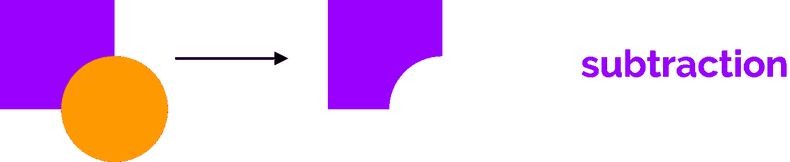

# 面向 Android 开发人员的矢量插图基础知识第 3 部分:布尔运算

> 原文：<https://medium.com/hackernoon/vector-illustration-basics-for-android-developers-part-3-boolean-operations-8a0ced922030>

## 还是轻松！

***本文是系列文章的第 3 部分。先阅读*** [***第一部分***](https://hackernoon.com/vector-illustration-basics-for-android-developers-part-1-primitive-shapes-5af2e03ad24a) ***和*** [***第二部分***](https://hackernoon.com/vector-illustration-basics-for-android-developers-part-2-strokes-and-paths-b44118368ffa) ***。而看完这一本，再看*** [***第四部分***](/@sebastian212000/vector-illustration-basics-for-android-developers-part-4-z-ordering-6d1f0928e17) ***。还有，*** [***第五部分***](/@sebastian212000/vector-illustration-basics-for-android-developers-part-5-basic-transformations-bfbe3400ad9) ***。还有，*** [***奖金部分。***](/@sebastian212000/vector-illustration-basics-for-android-developers-bonus-part-working-with-text-e2bff3cecbed) ***这是为了你自己好。是为了邻居。***

这是我刚刚创造的一个…东西

这是什么？难倒我了。不过，你大概能看出来，以前是圆的。但是等等！看起来上面缺了半星形的一块，下面缺了椭圆形的一块！

那是因为他们是。在我的矢量插图软件中，我用*从圆中减去*那些形状，这就是我剩下的。

减法是大多数矢量图形软件提供的四种主要布尔运算之一。让我们看看如何执行减法和其他三个操作。

## 减法

若要执行减法，请确保两个(或更多)形状重叠。然后通过按住“Shift”并点击它们来选择你想要执行布尔运算的所有形状。

在 Gravit Designer 中，您会在顶部工具栏上找到布尔运算下拉菜单。看起来是这样的:

点击图标，从下拉列表中选择**减去**。这将从底部形状中删除顶部形状与底部形状重叠的部分。

我还没有解释 z 排序，但这是你现在需要知道的:你第一个画的形状比你第二个画的形状低一级。在这种情况下，先绘制正方形，然后绘制圆，因此圆位于正方形的顶部。有一种方法可以改变这个顺序，但这是明天的教训。

## 交集

同样的事情。按住 *Shift* 并点击它们，多重选择重叠的形状。然后从布尔运算下拉菜单中选择**相交**。

这将保留对象的相交部分，并删除其他所有内容。

## 差异

多选重叠形状后，选择**差异。**

差异是交集的反义词。它将删除重叠的部分，保留不重叠的部分。

这就提出了一个问题:如果对两个不重叠的形状执行差运算，会发生什么情况？

2016 年，欧洲粒子物理研究所的研究人员试图做到这一点。结果是一个几乎不可容纳的黑洞，它威胁着地球的引力坍塌。谢天谢地，在彼得·希格斯(他当时正在厕所里用 Skype 发送指令)和一些 WD-40 的帮助下，他们避免了这场灾难。

小心点。

## 联盟

来吧伙计们。你知道这是干什么的。

没错。它将形状结合在一起。

虽然看起来不是这样，但是布尔运算是一种从简单形状创建复杂形状的好方法。你只需要认识到在哪些情况下应用它们是有益的。

毕竟，著名作家 HP Lovecraft 在他 1934 年的开创性的面向设计师的恐怖巨著《在因斯茅斯投下阴影》中说得很好

> …正如这个不幸的城镇的本性一样，隐藏在它那被诅咒的街道下的滑动的恐怖不是由一个单一的实体形成的，而是由一群看似平凡的野兽转变成非欧几里得形式的邪术亵渎而形成的。

## 今天的练习

使用两个圆和正确的布尔运算创建一个新月形状，并张贴在评论中。第一个这样做的人会赢得一本我的书《天才灵长类的机器人开发》。

明天见。

# 神圣更新，蝙蝠侠！

由于对这个系列的积极反应和各种读者的要求(谢谢你，你的留言让我开心！)，我已经开始着手编写本系列的书籍版本，内容有所扩展，还有各种练习，可以让你快速高效地入门。

这本书将于 3 月中旬发行，但你现在可以通过访问我的 BuyMeACoffee 页面(下面的链接)和**捐赠任何超过 3 美元**(显然包括 3 美元)**的金额来预订。**捐赠 6 美元或 9 美元还可以让你在做练习时获得我的电子邮件支持！卡住了？给我发一封电子邮件，我会以极快的速度回复。

发行后，这本书将回到 15 美元的正常价格，并永远保持这个价格(或者至少直到迈克尔·贝拍出一部好电影，这实际上是永远)，所以如果你喜欢这些文章，想要一个内容丰富、笑话更多的华丽版本，你知道该怎么做！(提示:单击下面的链接)

**重要提示:当你捐赠的时候，请给我留下你的电子邮件地址**，这样我就可以联系到你，并且在书出版后尽快寄给你！

 [## 给安东尼斯·查加利斯买杯咖啡——BuyMeACoffee.com

### 我是一名 Android 开发人员和设计师，热爱漂亮的用户界面！

www.buymeacoffee.com](https://www.buymeacoffee.com/XozUExS)