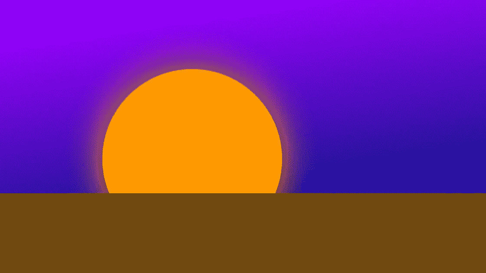
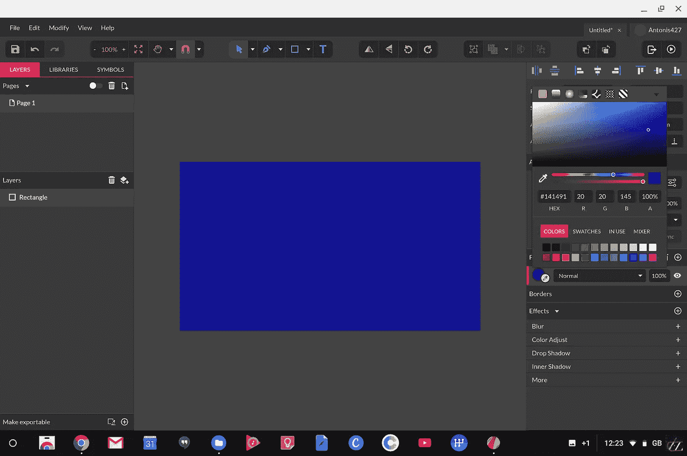
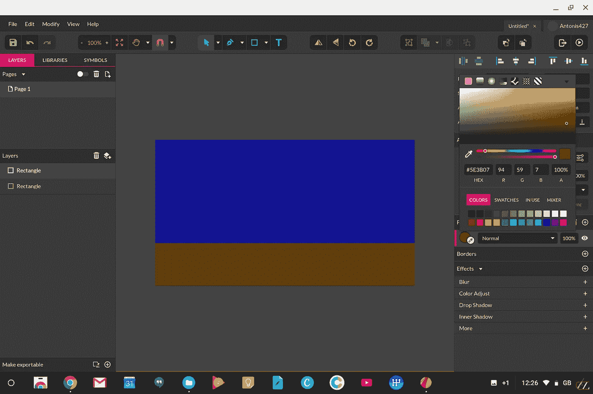
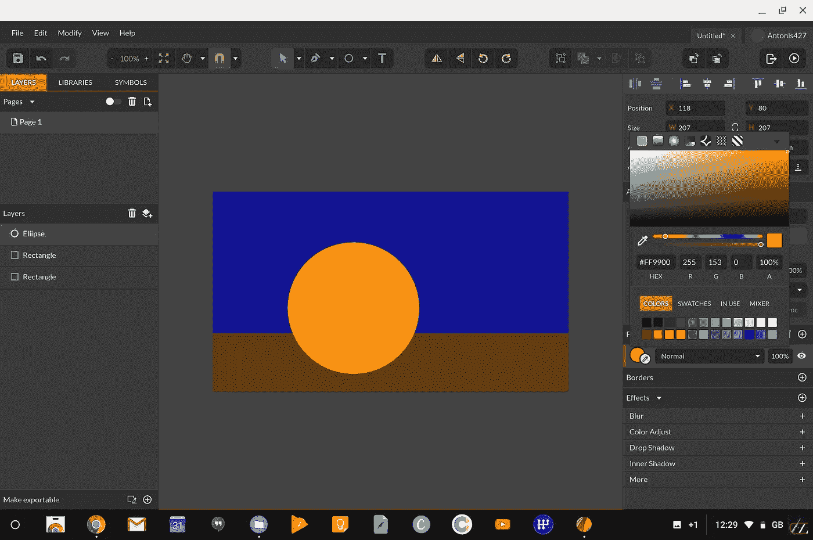
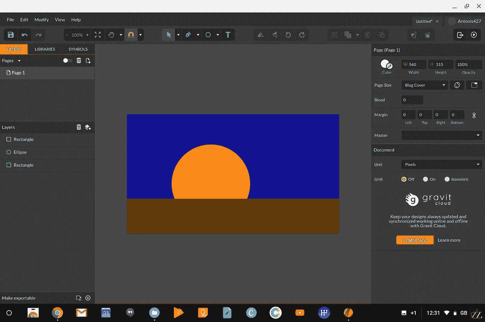
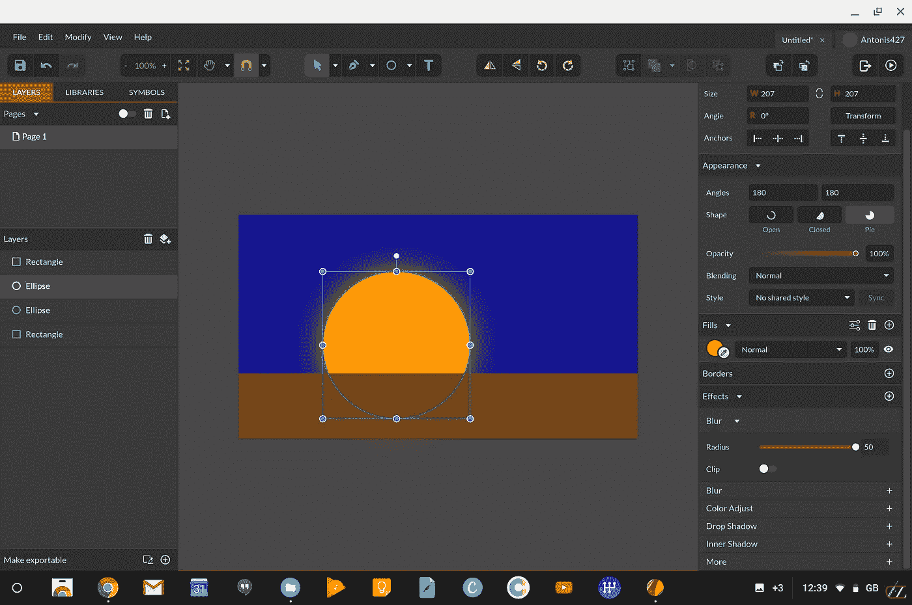

# 面向 Android 开发人员的矢量插图基础知识—第 4 部分:z 排序

> 原文：<https://medium.com/hackernoon/vector-illustration-basics-for-android-developers-part-4-z-ordering-6d1f0928e17>



## 听起来很棒的名字，一点也不复杂

这是五部分系列的第四部分。在这里阅读其他部分: [***第一部分***](https://hackernoon.com/vector-illustration-basics-for-android-developers-part-1-primitive-shapes-5af2e03ad24a)*[***第二部分***](https://hackernoon.com/vector-illustration-basics-for-android-developers-part-2-strokes-and-paths-b44118368ffa)*[***第三部分***](https://hackernoon.com/vector-illustration-basics-for-android-developers-part-3-boolean-operations-8a0ced922030)*[***第五部分***](/@sebastian212000/vector-illustration-basics-for-android-developers-part-5-basic-transformations-bfbe3400ad9)***

## **z 排序是一个非常容易掌握的概念，尤其是如果你是一个 Android 开发者。它描述了视图从后向前布局的方式。**

**您可能已经知道，在一个布局中，如果您将两个视图放在同一个二维(X-Y)空间中，在 XML 文件中声明的视图将位于底部，而在 XML 文件中声明的视图将位于前面(当然， **android:elevation** 属性可以改变这一点)。**

**所以，在这个布局中**

```
**<RelativeLayout …> <**TextView** android:layout_width="60dp" 
               android:layout_height="wrap_content"
               android:layout_centerInParent="true" 
               android:text="some text" /> <**ImageView** android:layout_width="100dp"
                android:layout_height="100dp"
                android:layout_centerInParent="true" 
                android:background="#ffffff" /></RelativeLayout>**
```

**纯白背景的 ImageView 会比 TextView 高(在它的前面),并且会覆盖它，使它对用户不可见。**

**简而言之，这就是 z 排序。**

**同样的事情也发生在矢量图形软件中。当您绘制一个形状，然后在同一个二维空间中绘制另一个形状时，第二个形状将被绘制在第一个形状上，使其部分或完全不可见，这取决于位置、填充(或缺少填充)和 alpha(透明度)值。**

## **操纵项目在 z 轴上的位置**

**1894 年后创建的所有矢量图形软件都允许您更改项目在 z 轴上的位置。**

**在 Gravit Designer 中，这可以通过选择要移动的对象，然后转到“修改”→“排列”,并选择以下选项之一来完成**

*   ****置于最前面**:无论对象位于 z 轴层次中的哪个位置，都将其置于所有其他对象的前面**
*   ****前移**:这将使对象向前移动一步。假设所选的对象前面有三个对象。第一次单击会将其带到第一个形状的前面，第二次单击会将其带到第二个形状的前面，第三次单击会将其带到第三个形状的前面。**
*   ****后退**:将对象后退一步。**
*   ****置于最后面**:将对象置于所有其他对象的最后面。**

## **练习**

**让我们快速创建一个简单的部分日落场景来看看这是怎么回事。**

**首先，让我们在 landscape 中创建新项目(在 Gravit 的打开对话框中选择 New design → Blog cover)。**

**然后，创建一个大的深蓝色矩形，占据整个画布表面。为此，从顶部工具栏上的形状下拉列表中选择一个矩形形状。画矩形。**

**在屏幕的右边，你会看到一个叫做“填充”的面板。点击“填充”标题正下方的圆圈，选择一种蓝色。你的整个画布现在应该是蓝色的。如果不是，请在评论中让我知道你做错了什么。**

****

**现在创建另一个矩形，它占据了整个画布，但只有其高度的三分之一。将它的颜色设为棕色，并将其底部与画布底部对齐，就像这样**

****

**这个矩形代表了我们的地面和地平线，正如必然会发生的那样，它被放置在天空的前面。**

**差不多了，现在让我们画出我们的太阳。从形状下拉列表中选择“椭圆”,按住 Shift 绘制一个正圆，绘制一个橙色的圆**

****

**哎呀。太阳坐在地面的前面。这是不对的。太疯狂了。**

**要解决这个问题，选择圆，然后转到修改→排列→向后移动**

****

**成功！**

**这是一个非常简单的例子，但是它很好地说明了如何利用 z 排序。在这种情况下，您不必以某种方式切割圆并将其底部与地面形状的顶部对齐，您只需将它发送到它的后面和天空形状的前面。想猜猜如果你再按一次“后退”会发生什么吗？**

**好了，下课。*或者是？***

**这是最后一个与今天课程无关的提示。**

**选择太阳，通过 Ctrl+C 和 Ctrl+V 复制它。这将在第一个太阳所在的位置创建另一个太阳。现在，选择太阳，在右边的面板中进入效果部分。点击模糊行上的“+”号，然后将半径调到最大。这应该给你一个很好的发光效果！**

****

**Neato.**

# **神圣更新，蝙蝠侠！**

**由于对这个系列的压倒性的积极反应和各种读者的要求(谢谢，你的消息让我高兴！)，我已经开始着手编写本系列的书籍版本，内容有所扩展，还有各种练习，可以让你快速高效地入门。**

**这本书将于 3 月中旬发行，但你现在可以通过访问我的 BuyMeACoffee 页面(下面的链接)和**捐赠任何超过 3** (显然包括 3 美元)**的金额来预订。**捐赠 6 美元或 9 美元还可以让你在练习时获得我的电子邮件支持！卡住了？给我发一封电子邮件，我会以极快的速度回复。**

**发行后，这本书将回到 15 美元的正常价格，并永远保持这个价格(或者至少直到迈克尔·贝拍出一部好电影，实际上是永远)，所以如果你喜欢这些文章，想要一个内容丰富、笑话更多的华丽版本，你知道该怎么做！(提示:单击下面的链接)**

****重要提示:当你捐款时，请给我留下你的电子邮件地址**，这样我就可以联系你，并在书发行后尽快寄给你！**

**[](https://www.buymeacoffee.com/XozUExS) [## 给安东尼斯·查加利斯买杯咖啡——BuyMeACoffee.com

### 我是一名 Android 开发人员和设计师，热爱漂亮的用户界面！

www.buymeacoffee.com](https://www.buymeacoffee.com/XozUExS)**