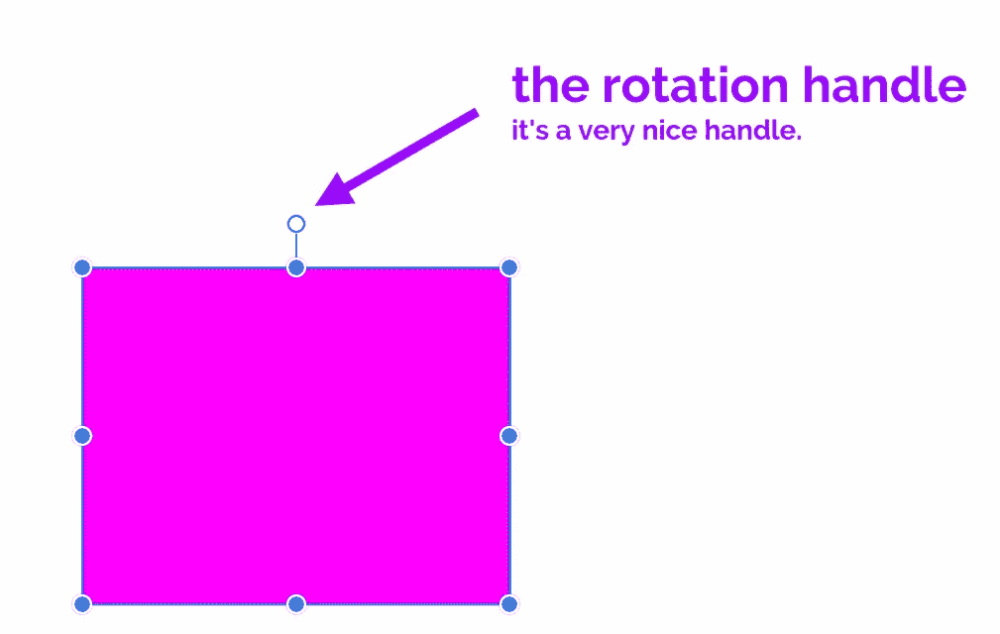
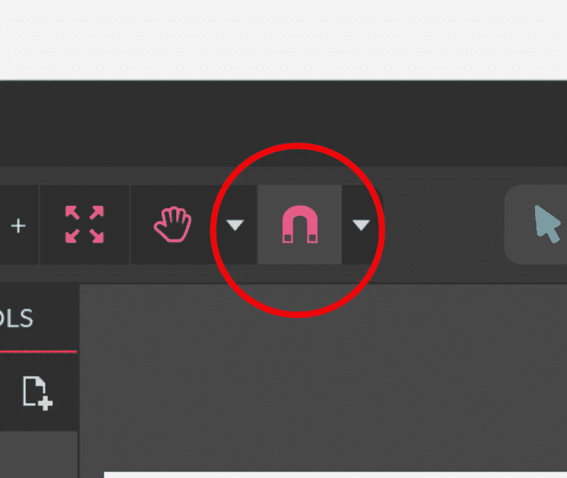
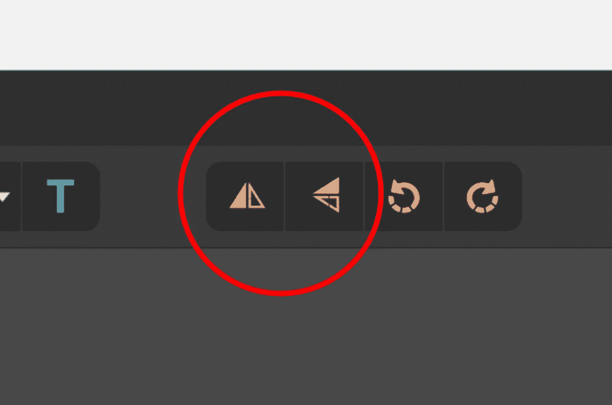
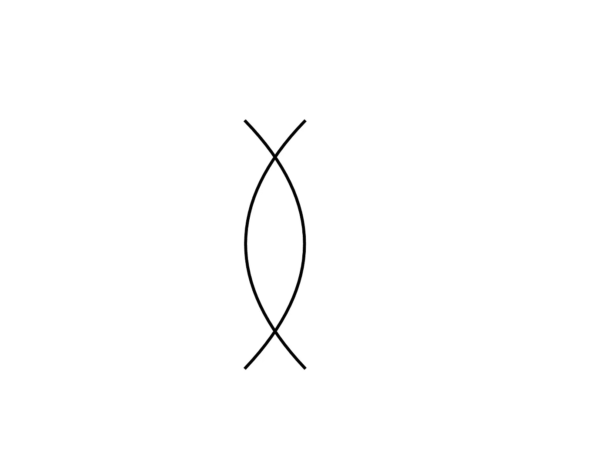
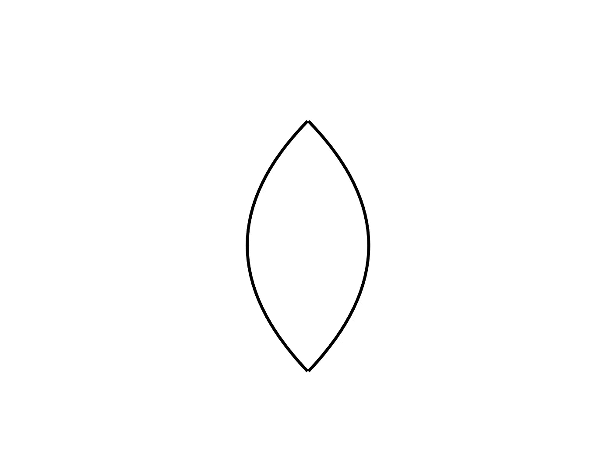
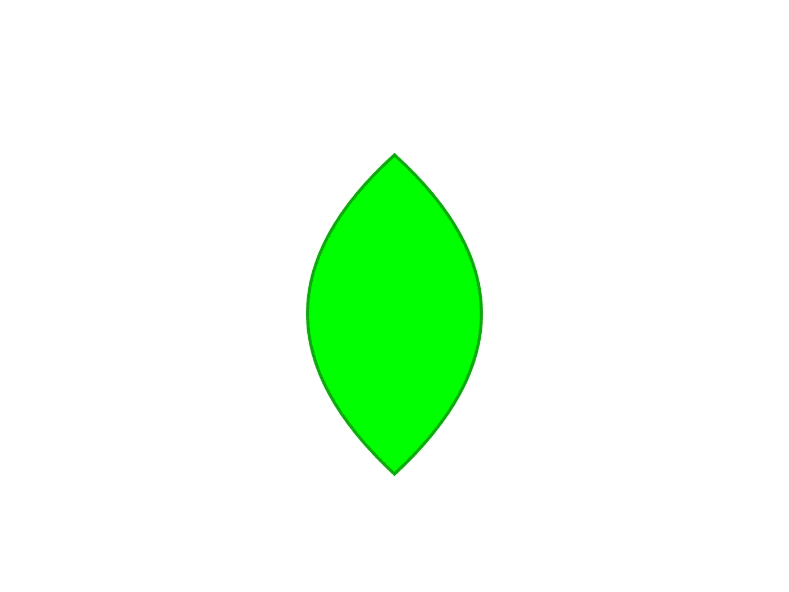

# 面向 Android 开发人员的矢量插图基础知识—第 5 部分:基本转换

> 原文：<https://medium.com/hackernoon/vector-illustration-basics-for-android-developers-part-5-basic-transformations-bfbe3400ad9>

## 基本但非常有用的操作

**前情提要“Android 开发人员矢量插图基础知识”**

 [## Android 开发人员的矢量插图基础-第 1 部分:基本形状

### 比你想象的容易！

hackernoon.com](https://hackernoon.com/vector-illustration-basics-for-android-developers-part-1-primitive-shapes-5af2e03ad24a)  [## 面向 Android 开发人员的矢量插图基础—第 2 部分:笔画和路径

### 同样，比你想象的简单

hackernoon.com](https://hackernoon.com/vector-illustration-basics-for-android-developers-part-2-strokes-and-paths-b44118368ffa)  [## 面向 Android 开发人员的矢量插图基础知识第 3 部分:布尔运算

### 还是轻松！

hackernoon.com](https://hackernoon.com/vector-illustration-basics-for-android-developers-part-3-boolean-operations-8a0ced922030)  [## 面向 Android 开发人员的矢量插图基础知识—第 4 部分:z 排序

### 听起来很棒的名字，一点也不复杂

hackernoon.com](https://hackernoon.com/vector-illustration-basics-for-android-developers-part-4-z-ordering-6d1f0928e17)  [## Android 开发人员的矢量插图基础——附加部分:使用文本

### 让文字变得精彩！

medium.com](/@sebastian212000/vector-illustration-basics-for-android-developers-bonus-part-working-with-text-e2bff3cecbed) 

在您阅读本文的其余部分之前，我希望您做一件事:进入您的矢量图形软件并启用捕捉。它通常用磁铁形状的图标来表示。在 Gravit Designer 中，它看起来像这样

抢购非常，*非常*有用。它将元素与网格对齐，并在您相对移动对象时显示参考线。相信我，这是个巨大的帮助。

启用捕捉？让我们继续前进。

## 旋转

这是一个简单的方法:要旋转一个形状，抓住它的旋转手柄并进入城镇。不是*字面上的*进城，比喻性的进城。

我给你画了一张图，确保你能找到把手。

点击手柄，拖动鼠标。这将旋转形状。

## 垂直和水平翻转

当你试图创造对称的形状时，翻转很有帮助。它可以让你创建半个形状，然后翻转它，将它与另一半连接在一起，瞧！尽可能对称。

为了演示这一点，我将使用翻转来创建一个叶子。我将用钢笔工具创建一个弯曲的笔画。为此，只需用钢笔工具在画布上单击一个点。然后，在它的正下方适当的距离单击(按住 Shift 会使这个操作更容易，因为它会捕捉角度),但不要释放鼠标按钮。相反，拖动它来创建一条这样的曲线

然后释放它。

接下来，单击形状以选择它，使用 Ctrl+C 和 Ctrl + V 复制并粘贴它，然后水平翻转它(这将翻转原始或副本，取决于您选择的内容，这无关紧要)。翻转工具看起来像这样

在你使用左边的工具水平翻转曲线后，你应该得到类似这样的东西

现在拖动右边的形状，使其与未翻转的副本边对边。请注意，一旦形状边对边，就会出现一条浅蓝色的线。这是一种捕捉功能，可帮助您看到两条曲线已经连在一起。

现在你有一个基本的叶子形状

仅仅使用钢笔工具尝试做一些像这样对称的东西几乎是不可能的。

## 合并

让我们继续前进。这仍然不是一个统一的对象。为了能够把它作为一个整体来处理(用一个完整的笔触和填充),你还需要做一件事。

选择两个形状，然后选择修改→合并。

现在，您有了一个统一的形状，可以作为一个对象进行填充和操作。

改变填充颜色为浅绿色，也许笔画颜色为更深的绿色，你的基本叶子就做好了！

## 内部粘贴

哦，这是我的最爱！

你想用高光赋予叶子更多的个性吗？如果你选择了“不”,你有毛病吗？如果你选择“是”，你妈妈会为你骄傲的。

选择整片叶子，复制并粘贴，然后向右移动。现在从副本中删除笔画，方法是选择它，在边框部分输入 0(零)作为笔画大小。

为副本的填充选择一个较浅的绿色。这是你现在应该有的

现在，移动副本，像这样盖住原件

显然，这看起来很可怕。现在是精彩的部分。

## 好的部分

首先选择原图，进入修改→转换为路径。然后对(更改的)副本做同样的操作。这将真正把每片叶子转换成一个完整的形状。

到目前为止，您可以单独访问每片叶子的翻转和非翻转部分。你现在将失去对单个部分的访问，并获得每片叶子的单一路径，但这将允许我们执行一个很酷的技巧。

选择副本，然后按 Ctrl-C 和 Ctrl-X(即复制和剪切)。然后，选择原稿，然后转到编辑→ **粘贴到所选内容中。**

这将把副本**粘贴到原件**内。另一种表述方式是说原件会被*剪切*副本，即。副本唯一可见的部分是在原件边界内的部分。

很整洁，是吧？我还删除了原文中的边框，这只是为了清晰起见。

练习这个技巧并牢记在心，因为它会让你在工作中创造细节。第一次做的时候有点复杂，但是经过一些练习，它会很快成为你的第二天性。

## 我们的节目到此结束！

或者是？我已经决定写一个额外的，关于文字工作的最后部分，将在本周末发表。在那之前，继续练习！

## 今天的作业

试着创作一幅演讲者的插图。我指的是设备，不是会说话的人。把它贴在评论里，我会尽快回复你的评论。如果你卡住了，让我知道！

# 神圣更新，蝙蝠侠！

由于对这个系列的积极反应和各种读者的要求(谢谢你，你的留言让我开心！)，我已经开始着手编写本系列的书籍版本，内容有所扩展，还有各种练习，可以让你快速高效地入门。

这本书将于 3 月中旬发行，但你现在可以通过访问我的 BuyMeACoffee 页面(下面的链接)并**捐赠任何超过 3** (显然包括 3 美元)**的金额来预订。**捐赠 6 美元或 9 美元还可以让你在练习时获得我的电子邮件支持！卡住了？给我发一封电子邮件，我会以极快的速度回复。

**发行后，这本书将回到 15 美元**的正常价格，并永远保持这个价格(或者至少直到迈克尔·贝拍出一部好电影，实际上是永远)，所以如果你喜欢这些文章，想要一个内容丰富、笑话更多的华丽版本，你知道该怎么做！(提示:单击下面的链接)

**重要提示:当你捐款时，请给我留下你的电子邮件地址**，这样我就可以联系你，并在书发行后尽快寄给你！

 [## 给安东尼斯·查加利斯买杯咖啡——BuyMeACoffee.com

### 我是一名 Android 开发人员和设计师，热爱漂亮的用户界面！

www.buymeacoffee.com](https://www.buymeacoffee.com/XozUExS)